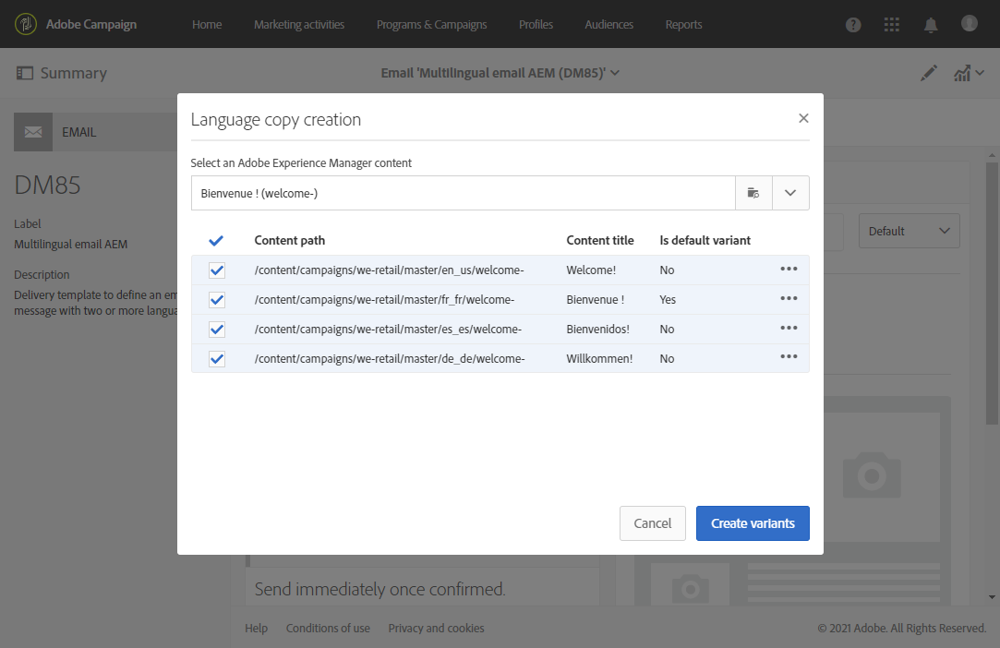

# Een meertalige e-mail maken met de integratie van Adobe Experience Manager {#creating-multilingual-email-aem}

Met dit document leert u hoe u een meertalige e-mail kunt maken met Adobe Experience Manager-inhoud en -taalkopieën.

De voorwaarden zijn:

* Toegang tot een AEM die voor de integratie wordt gevormd.
* Toegang tot een Adobe Campaign-instantie die is geconfigureerd voor integratie.
* Een Adobe Campaign-sjabloon voor meertalige e-mail die is geconfigureerd voor het ontvangen van AEM inhoud.

## Nieuwe e-mailinhoud maken in Adobe Experience Manager {#creating-email-content-aem}

1. Selecteer op de Adobe Experience Manager-homepage de optie **[!UICONTROL Site]**.

   

1. Selecteer in welke map u de pagina wilt maken en klik op **[!UICONTROL Create]** dan **[!UICONTROL Page]**. Hier maken we onze pagina in de map en_us, onze standaardtaal.

   

1. Selecteer de **[!UICONTROL Adobe Campaign Email (ACS)]** sjabloon.

1. Vul de eigenschappen van uw e-mail in en klik **[!UICONTROL Create]**.

   

1. Open uw nieuwe e-mailinhoud en pas deze indien nodig aan. Raadpleeg [deze pagina](../../integrating/using/creating-email-experience-manager.md#editing-email-aem) voor meer informatie.

   

1. Van de **[!UICONTROL Workflow]** selecteert u de **[!UICONTROL Approve for Adobe Campaign]** validatieworkflow. U kunt geen e-mail verzenden in Adobe Campaign als er inhoud wordt gebruikt die niet is goedgekeurd.

   

1. Klikken **[!UICONTROL Complete]** dan **[!UICONTROL Newsletter review]** van de **[!UICONTROL Complete work item]** venster.

1. Klikken **[!UICONTROL Complete]** dan **[!UICONTROL Newsletter approval]**. Zodra de parameters voor inhoud en verzending zijn gedefinieerd, kunt u doorgaan met het goedkeuren, voorbereiden en verzenden van de e-mail in Adobe Campaign Standard.

   

## Taalkopieën maken {#creating-language-copies}

Nadat u uw e-mailinhoud hebt ontworpen, moet u nu uw taalkopieën maken die gesynchroniseerd worden met Adobe Campaign Standard als varianten.

1. Selecteer de eerder gemaakte pagina en klik op **[!UICONTROL Create]** dan **[!UICONTROL Language Copy]**.

   

1. Selecteer de eerder gemaakte e-mailinhoud die in de gekozen talen wordt vertaald en klik vervolgens op **[!UICONTROL Next]**.

   

1. In de **[!UICONTROL Target language(s)]** keuzelijst, selecteer in welke taal uw inhoud wordt vertaald en klik vervolgens op **[!UICONTROL Next]**.

   

1. Klik op **[!UICONTROL Create]**.

Uw taalexemplaren worden nu gecreeerd, kunt u uw inhoud nu uitgeven afhankelijk van de gekozen taal.

>[!CAUTION]
>
>Elke taalkopie moet worden goedgekeurd via de **[!UICONTROL Approve for Adobe Campaign]** validatieworkflow. U kunt geen e-mail verzenden in Adobe Campaign als er inhoud wordt gebruikt die niet is goedgekeurd.

## Meertalige inhoud maken in Adobe Campaign Standard {#multilingual-acs}

1. Klik op de startpagina van Adobe Campaign Standard op **[!UICONTROL Create an email]**.

   

1. Selecteer uw Adobe Campaign-sjabloon voor meertalige e-mail die is geconfigureerd om Adobe Experience Manager-inhoud te ontvangen. Raadpleeg dit voor meer informatie over het maken van een sjabloon die is gekoppeld aan uw Adobe Experience Manager-exemplaar [page](../../integrating/using/configure-experience-manager.md#config-acs).

   >[!NOTE]
   >
   >In dit geval moet u de ingebouwde sjabloon dupliceren **[!UICONTROL Multilingual email (mailMultiLang)]** om uw meertalige e-mail te kunnen verzenden.

   

1. Vul de **[!UICONTROL Properties]** en **[!UICONTROL Audience]** van uw e-mail en klik op **[!UICONTROL Create]**.

1. In de **[!UICONTROL Edit properties]**, controleer of uw Adobe Experience Manager-account correct is ingesteld in het dialoogvenster **[!UICONTROL Content]** vervolgkeuzelijst.

   

1. Klik op **[!UICONTROL Language copy creation]**.

   

1. Selecteer eerder gemaakte Adobe Experience Manager-inhoud en klik op **[!UICONTROL Confirm]**. De Adobe Experience Manager-inhoud die hier wordt weergegeven, is alleen geldig en kan op de inhoud ervan worden gefilterd **[!UICONTROL Label]** en **[!UICONTROL Path]**.

   >[!NOTE]
   >
   >De gekozen taalkopie wordt ingesteld als standaard. U kunt deze later wijzigen in het dialoogvenster **[!UICONTROL Content variant]** blokkeren.

   

1. Klikken **[!UICONTROL Create variants]** om uw meertalige inhoud te koppelen. Adobe Campaign Standard zal dan automatisch de andere taalexemplaren aan deze inhoud verbinden. De gemaakte varianten hebben dezelfde label- en codetaal als die welke in Adobe Experience Manager is gekozen.

   

1. Klik op de knop **[!UICONTROL Content variant]** blok om uw standaardvariant indien nodig te veranderen en klik **[!UICONTROL Confirm]**.

   

1. Als uw inhoud of varianten in Adobe Experience Manager worden bijgewerkt, kunt u deze in Adobe Campaign Standard rechtstreeks synchroniseren met de **[!UICONTROL Refresh AEM contents]** knop.

1. Uw e-mail kan nu worden verzonden. Raadpleeg voor meer informatie hierover [page](../../sending/using/get-started-sending-messages.md).

   >[!NOTE]
   >
   >U kunt geen e-mail verzenden in Adobe Campaign als er AEM inhoud wordt gebruikt die niet is goedgekeurd.

Uw publiek ontvangt uw e-mail afhankelijk van **[!UICONTROL Preferred languages]** in hun **[!UICONTROL Profiles]**. Als u meer wilt weten over het bewerken van profielen en voorkeurstalen, raadpleegt u deze [page](../../audiences/using/editing-profiles.md).
