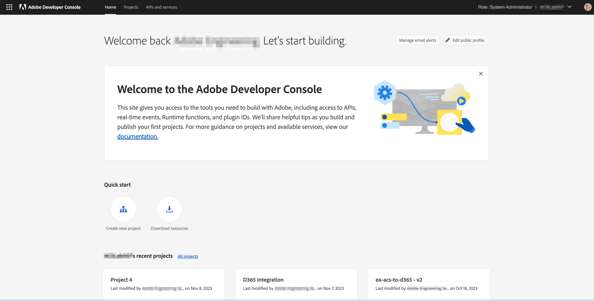

# Adobe Campaign Standard en Adobe I/O Configuration for the Microsoft Dynamics 365 integration

Dit artikel zal verklaren hoe te om Adobe Campaign Standard en Adobe I/O te vormen om de integratietoepassing toegang tot de gegevens te geven.

## Adobe Campaign Standard configureren {#campaign-standard}

### Profielextensies

Schakel &quot;profielextensies&quot; in Adobe Campaign Standard in.   Dit is nodig om aangepaste velden in de profielbron te synchroniseren vanuit Microsoft Dynamics 365.   De volgende stappen moeten worden uitgevoerd:

1. Ga naar Instellingen -> Beheer -> Ontwikkeling -> Publiceren.
1. Klik op Publicatie voorbereiden om een publicatie voor te bereiden.
1. Nadat de voorbereiding is voltooid, schakelt u de optie &quot;Create the Profiles &amp; Services Ext API&quot; in en klikt u op &quot;Publish&quot;.

## Adobe I/O configureren {#adobe-io}

Met Adobe I/O kunt u API-toegang tot Adobe Campaign Standard en andere Adobe-producten inschakelen.   Dit artikel zal in detail hoe te om Adobe I/O te vormen om de integratie van Adobe Campaign Standard met de Dynamica 365 van Microsoft toegang te geven om de gegevens te synchroniseren.

### Overzicht

Alvorens de pre-integratieopstelling in dit artikel uit te voeren, wordt verondersteld dat u reeds provisioned bent en beheerdertoegang tot de instantie van de Campaign Standard van uw organisatie hebt.  Als dit niet is gebeurd, moet u contact opnemen met de klantenservice van Adobe om de levering van de campagne te voltooien.

>[!CAUTION]
>
>De hieronder beschreven stappen moeten door een beheerder worden uitgevoerd.

### Configuratie

U zult een nieuw project van Adobe IO moeten creëren en het voor de integratie vormen.

#### Een nieuw project maken

Hiervoor volgt u de onderstaande procedure:

1. Navigeren naar [Adobe IO-console](https://console.adobe.io/home#) en selecteer uw organisatie-id voor Adobe in het keuzemenu rechtsboven in het scherm.

1. Klik vervolgens op **[!UICONTROL Create new project]** krachtens **[!UICONTROL Quick Start]**.

   

1. Onder **[!UICONTROL Get started with your new project]**, klikt u op **[!UICONTROL Add API]**.

   

1. Selecteer de Adobe Campaign API (u moet mogelijk naar de onderkant schuiven) en klik op **[!UICONTROL Next]**.

   

1. Op het volgende scherm kunt u uw eigen openbare sleutel uploaden of Adobe IO de sleutel laten genereren voor u. Deze instructies volgen de laatste optie. Als u besluit Adobe IO te laten het zeer belangrijke paar produceren, klik op optie 1; Klik vervolgens op de knop **[!UICONTROL Generate keypair]** knop.

   

1. In het volgende scherm wordt u gevraagd een naam te geven en de downloadlocatie van het zip-bestand met sleutelpaar te selecteren.

Nadat u het bestand hebt gedownload, kunt u het uitpakken om de openbare en persoonlijke sleutels weer te geven. Adobe IO heeft reeds de openbare sleutel op uw Adobe IO project toegepast. U moet uw persoonlijke sleutel voor later behouden; de persoonlijke sleutel wordt gebruikt tijdens de installatie vóór de integratie van het integratieprogramma.

1. Klikken **[!UICONTROL Next]** blijven

   

1. In het volgende scherm selecteert u productprofielen die u aan dit project wilt koppelen. Selecteer het productprofiel in de titel: De huurder-id van uw campagneexemplaar - [!UICONTROL Administrators]

   Voorbeeld: Campaign Standard - uw campagne-huurderID - Beheerders

1. Klik op **[!UICONTROL Save configured API]**.

   

1. Op het volgende scherm zult u de details van uw nieuw Adobe IO project zien. Klikken **[!UICONTROL Add to Project]** links boven in het scherm en selecteert u **API** in de vervolgkeuzelijst.

   

1. In het volgende scherm moet u de API voor I/O-gebeurtenissen selecteren en vervolgens op **[!UICONTROL Next]**.

1. Klik op het volgende scherm op **[!UICONTROL Save the configured API]**.  U wordt teruggebracht naar het scherm met projectdetails.

1. Klik nu op **[!UICONTROL Add to Project]** links boven in het scherm en selecteert u **API** in de vervolgkeuzelijst, zoals u eerder deed.

1. In het volgende scherm moet u de API voor I/O-beheer selecteren en op **[!UICONTROL Next]**.

1. Klik op het volgende scherm op **[!UICONTROL Save the configured API]**.

Installatie vóór integratie in campagne is nu voltooid.

**Verwante onderwerpen**

* [Adobe IO configureren voor integratie met Microsoft Dynamics 365](../../integrating/using/d365-acs-configure-adobe-io.md) is de volgende stap bij het opzetten van de integratie
* [Het overzicht van de toepassing van de Zelfbediening van de integratie](../../integrating/using/d365-acs-self-service-app-quick-start-guide.md) bevat de volledige lijst met stappen om de integratie op gang te brengen.

* [Adobe IO - Integratie van serviceaccount](https://www.adobe.io/authentication/auth-methods.html#!AdobeDocs/adobeio-auth/master/AuthenticationOverview/ServiceAccountIntegration.md)
* [Campaign Standard - API Access Setup](../../api/using/setting-up-api-access.md)
* [Campaign Standard - Integratie met Dynamics 365](../../integrating/using/d365-acs-configure-d365.md)
