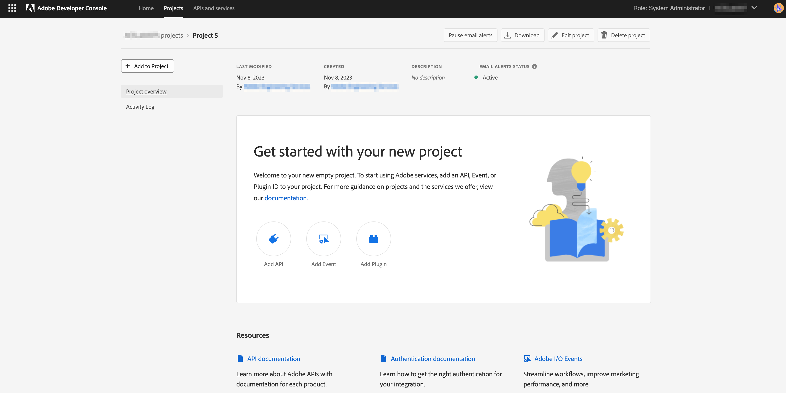

# Adobe Campaign Standard en Adobe Developer Configuration for the Microsoft Dynamics 365 integration

In dit artikel wordt uitgelegd hoe u Adobe Campaign Standard en Adobe I/O configureert om de integratietoepassing toegang te geven tot de gegevens.

## Adobe Campaign Standard configureren {#campaign-standard}

### Profielextensies

Schakel &quot;profielextensies&quot; in Adobe Campaign Standard in.   Dit is nodig om aangepaste velden in de profielbron te synchroniseren vanuit Microsoft Dynamics 365.   De volgende stappen moeten worden uitgevoerd:

1. Ga naar Instellingen -> Beheer -> Ontwikkeling -> Publiceren.
1. Klik op Publicatie voorbereiden om een publicatie voor te bereiden.
1. Nadat de voorbereiding is voltooid, schakelt u de optie &quot;Create the Profiles &amp; Services Ext API&quot; in en klikt u op &quot;Publish&quot;.

## Adobe I/O configureren {#adobe-io}

Met Adobe I/O kunt u API-toegang tot Adobe Campaign Standard en andere Adobe-producten inschakelen.   In dit artikel wordt beschreven hoe u Adobe I/O kunt configureren om de Adobe Campaign Standard-integratie met Microsoft Dynamics 365 toegang te geven om de gegevens te synchroniseren.

### Overzicht

Voordat u de pre-integratie-instelling in dit artikel uitvoert, wordt aangenomen dat u al bent ingericht en beheerderstoegang hebt tot de Campaign Standard-instantie van uw organisatie.  Als dit niet is gebeurd, moet u contact opnemen met de klantenservice van Adobe om de levering van campagnes te voltooien.

>[!CAUTION]
>
>De hieronder beschreven stappen moeten door een beheerder worden uitgevoerd.

### Configuratie

U zult een nieuw project van Adobe Developer moeten creëren en het voor de integratie vormen.

#### Een nieuw project maken

Hiervoor volgt u de onderstaande procedure:

1. Navigeer aan [&#x200B; Adobe Developer Console &#x200B;](https://console.adobe.io/home#) en selecteer uw identiteitskaart van de Organisatie van Adobe van het drop-down menu bij het hoogste recht van het scherm.

1. Klik vervolgens op **[!UICONTROL Create new project]** onder **[!UICONTROL Quick Start]** .

   

1. Klik onder **[!UICONTROL Get started with your new project]** op **[!UICONTROL Add API]** .

   

1. Selecteer de Adobe Campaign en klik op **[!UICONTROL Next]** .

   

1. Op het volgende scherm kunt u het verificatietype kiezen. U kunt kiezen voor OAuth Server-to-Server of Service Account (JWT). Merk op dat de geloofsbrieven van de Rekening van de Dienst (JWT) niet meer voor nieuwe projecten worden geadviseerd en voor de nieuwere geloofsbrieven van Server-aan-Server verouderd zijn. De instructies die in deze handleiding worden gegeven, zijn alleen van toepassing op OAuth Server-to-Server-verificatie.

   

1. In het volgende scherm selecteert u productprofielen die u aan dit project wilt koppelen. Selecteer het productprofiel dat in de titel bevat: De huurder-id van uw campagneexemplaar - [!UICONTROL Administrators]

   Voorbeeld: Campaign Standard - uw campagne-huurderID - Beheerders

1. Klik op **[!UICONTROL Save configured API]**.

   

1. Op het volgende scherm ziet u de details van uw nieuwe Adobe Developer-project. Klik **[!UICONTROL Add to Project]** bij top-left van het scherm en selecteer **API** van de daling neer.

   

1. In het volgende scherm moet u de API voor I/O-gebeurtenissen selecteren en vervolgens op **[!UICONTROL Next]** klikken.

1. Klik op het volgende scherm op **[!UICONTROL Save the configured API]** .  U wordt teruggebracht naar het scherm met projectdetails.

1. Klik nu **[!UICONTROL Add to Project]** bij top-left van het scherm en selecteer **API** van de daling neer, zoals u eerder deed.

1. In het volgende scherm moet u de API voor I/O-beheer selecteren en op **[!UICONTROL Next]** klikken.

1. Klik op het volgende scherm op **[!UICONTROL Save the configured API]** .

Installatie vóór integratie in campagne is nu voltooid.

**Verwante Onderwerpen**

* [&#x200B; vorm Adobe Developer voor Microsoft Dynamics 365 integratie &#x200B;](../../integrating/using/d365-acs-configure-adobe-io.md) is de volgende stap in vestiging de integratie
* [&#x200B; het overzicht van de Toepassing van de Zelfbediening van de Integratie &#x200B;](../../integrating/using/d365-acs-self-service-app-quick-start-guide.md) bevat de volledige lijst van stappen om de integratie in werking te stellen te krijgen.
* [&#x200B; Adobe Developer - de Integratie van de Rekening van de Dienst &#x200B;](https://developer.adobe.com/developer-console/docs/guides/#!AdobeDocs/adobeio-auth/master/AuthenticationOverview/ServiceAccountIntegration.md)
* [Campaign Standard - API Access Setup](../../api/using/setting-up-api-access.md)
* [Campaign Standard - Integratie met Dynamics 365](../../integrating/using/d365-acs-configure-d365.md)
* [&#x200B; Migreer geloofsbrieven van JWT aan OAuth server-aan-Server &#x200B;](../../integrating/using/d365-acs-self-service-app-migrate-credentials.md) bevat de stappen om geloofsbrieven van JWT aan OAuth Server-aan-Server te migreren.
