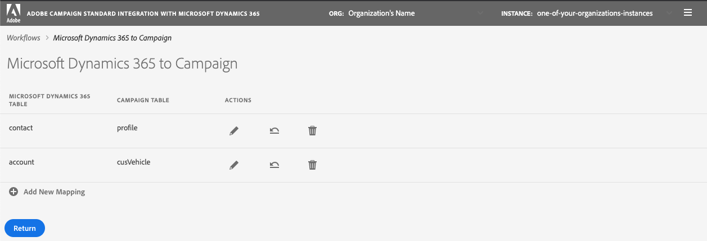

# Gegevens synchroniseren

U kunt tabellen synchroniseren van Microsoft Dynamics 365 naar Campagne en Campagne marketing metriek aan de Dynamica 365 van Microsoft. De synchronisatie wordt uitgevoerd door drie specifieke technische werkschema&#39;s: **[!UICONTROL Microsoft Dynamics 365 to Campaign]**, **[!UICONTROL Campaign to Microsoft Dynamics 365]**, **[!UICONTROL Opt-In/Out]**. Zie deze sectie voor [Meer informatie](../../integrating/using/d365-acs-self-service-app-workflows.md).

>[!IMPORTANT]
>U moet de functie **[!UICONTROL Microsoft Dynamics 365 to Campaign]** om rekening te houden met uw wijzigingen. [Meer informatie](../../integrating/using/d365-acs-self-service-app-workflows.md)

## Tabellen van Microsoft Dynamics 365 toewijzen aan Campagne

De **[!UICONTROL Microsoft Dynamics 365 to Campaign]** De pagina bevat een lijst met entiteiten in Microsoft Dynamics 365 en de aangepaste bronnen in Adobe Campaign waarmee deze worden gesynchroniseerd. U kunt nieuwe toewijzingen toevoegen, bestaande toewijzingen bewerken of verwijderen.

Hier volgt een beschrijving van elk van de kolommen in deze tabel:

* **[!UICONTROL MICROSOFT DYNAMICS 365 TABLE]**: in deze kolom wordt aangegeven welke entiteit in Microsoft Dynamics 365 de gegevensbron voor de toewijzing zal zijn.

* **[!UICONTROL CAMPAIGN TABLE]**: Deze kolom identificeert welke bron in Adobe Campaign de bestemming van gegevens voor de afbeelding zal zijn.

* **[!UICONTROL ACTIONS]**: hieronder worden mogelijke acties vermeld :

   * Klik op de knop **[!UICONTROL Edit]** pictogram om deze toewijzing te bewerken.

   * Gebruik de  **[!UICONTROL Delete]** pictogram om een tabeltoewijzing te verwijderen.

   * Klik op de knop **[!UICONTROL Replay Data]** om alle gegevens in de tabel Microsoft Dynamics 365 opnieuw te synchroniseren. Normaal gesproken synchroniseert de integratietoepassing alleen de gegevens in Microsoft Dynamics 365 die onlangs zijn gewijzigd.  Nochtans, in sommige gevallen (bijvoorbeeld, hebt u een verandering aangebracht of een fout gemaakt) zou u alle gegevens kunnen willen opnieuw worden gesynchroniseerd.  In deze gevallen klikt u op deze knop en de volgende keer dat u het dialoogvenster **[!UICONTROL Microsoft Dynamics 365 to Campaign]** synchroniseren.

      Als u op de knop **[!UICONTROL Replay Data]** en de controles zijn voltooid, wordt het pictogram uitgeschakeld: het wijst erop dat de gegevens voor dit paar van de lijstafbeelding met de volgende uitvoering van opnieuw zullen worden gesynchroniseerd **[!UICONTROL Microsoft Dynamics 365 to Campaign]** workflow.

      U kunt niet selecteren om de gegevens opnieuw af te spelen wanneer het volgende waar is:

      * Als er 2.000.000 (of meer) punten in Achterlog metrisch verbonden aan zijn **[!UICONTROL Microsoft Dynamics 365 to Campaign]** workflow (weergegeven in het dialoogvenster **[!UICONTROL Workflows]** pagina)
      * Als er 2.000.000 of meer verslagen in de Lijst van de Dynamica 365 van Microsoft zijn

      Het aantal records dat opnieuw moet worden gesynchroniseerd, varieert. Als u een groot aantal records hebt, kan het enige tijd duren om het synchronisatieproces te voltooien. Zie de **[!UICONTROL Backlog]** metrisch in de **[!UICONTROL Workflows]** pagina als de integratietoepassing werkt om het synchronisatieproces te voltooien.

      >[!IMPORTANT]
      >
      > U wordt ten zeerste aangeraden de integratieworkflow te stoppen wanneer u wijzigingen publiceert in Adobe Campaign Standard of Microsoft Dynamics 365. Toepasselijke wijzigingen zijn onder meer: updates van bronnen/entiteiten (en de bijbehorende velden), koppelingen, kolommen met id, enz. die momenteel door de integratie worden gebruikt.

## Nieuwe toewijzing maken {#add-a-new-mapping}

Voer de volgende stappen uit om een nieuwe toewijzing te maken:

1. in de **[!UICONTROL Microsoft Dynamics 365 to Campaign]** pagina, klikt u op de knop **[!UICONTROL Add New Mapping]** knop.

1. Gebruik de vervolgkeuzelijsten om Microsoft Dynamics 365 te selecteren en de lijsten van de Campagne aan kaart te brengen.
De meeste andere invoer op de pagina is afhankelijk van de tabellen die u kiest.

   

   >[!NOTE]
   >U kunt niet elke tabel meerdere keren toewijzen. Daarom zult u opmerken dat de dropdown selecties geen lijsten zullen omvatten die reeds in kaart zijn gebracht.

1. Klikken **[!UICONTROL OK]** ter bevestiging: de toepassing zal een korte tijd nodig hebben om in gebiedsinformatie te lezen verbonden aan de geselecteerde lijsten.

U kunt dan met de toewijzingsconfiguratie te werk gaan. [Meer informatie](#new-mapping-settings)

>[!IMPORTANT]
>
>U kunt de tabellen op deze pagina alleen kiezen wanneer u de toewijzing voor het eerst toevoegt. Zorg ervoor dat u de juiste tabellen hebt geselecteerd voordat u op de knop **[!UICONTROL Save]** knop: als de tabel eenmaal is opgeslagen, worden de tabelselectievelden weergegeven **alleen-lezen**.

### Een bestaande toewijzing bewerken

Als u een bestaande afbeelding bewerkt, ziet u dat de tabelselecties niet bewerkbaar zijn.

Dit gebeurt door ontwerp, omdat de invoer verderop op op de pagina is gebaseerd op de velden die aan deze tabellen zijn gekoppeld. Als u de tabellen wijzigt, worden alle velden die aan deze tabellen zijn gekoppeld, ongeldig.  Als u de tabel waarnaar u wilt toewijzen wilt wijzigen, gaat u terug naar de vorige pagina, verwijdert u de toewijzing die u wilt wijzigen en voegt u een nieuwe toewijzing toe.

### Een afzonderlijke tabeltoewijzing configureren {#new-mapping-settings}

In deze sectie zult u leren hoe te vormen een **enkel** toewijzing van één Microsoft Dynamics 365-tabel aan één Adobe Campaign-tabel.

U kunt de volgende instellingen definiëren:

* **[!UICONTROL Tables]**: In deze sectie wordt de naam van de tabel Microsoft Dynamics 365 en de tabel Campagne weergegeven waaraan de tabel wordt toegewezen.
* **[!UICONTROL Field Mappings]**: meer informatie in [deze sectie](#field-mappings)
* **[!UICONTROL Field Replacements]**: meer informatie in [deze sectie](#field-replacements)
* **[!UICONTROL Filters]**: meer informatie in [deze sectie](#filters)
* **[!UICONTROL Advanced Settings]**: meer informatie in [deze sectie](#advanced-settings)

### Veldtoewijzingen {#field-mappings}

#### Primaire toetsen

Wanneer u een nieuwe Microsoft Dynamics 365 toevoegt aan de tabeltoewijzing Campagne, moet u het veld Id identificeren.

De primaire sleutel Microsoft Dynamics 365 is alleen-lezen omdat de toepassing deze detecteert.

Voor Campagne, moet u selecteren welk gebied de unieke sleutel zal zijn. Het moet als a worden gevormd [Aangepaste bron CRM-id](../../developing/using/uc-calling-resource-id-key.md) en mogen geen duplicaten bevatten.

>[!NOTE]
>
>U kunt het veld Id alleen in de tabel kiezen als u **[!UICONTROL Add New Mapping]**. Als u op de knop Bewerken klikt om een bestaande tabeltoewijzing te bewerken, is het veld Id alleen-lezen.

De primaire toetsen zijn altijd de eerste veldnamen die worden vermeld in het dialoogvenster **[!UICONTROL Field Mappings]** sectie. Ter herinnering wordt het volgende pictogram rechts weergegeven om u eraan te herinneren dat dit de primaire toetsen zijn.

#### Andere veldtoewijzingen toevoegen

De **[!UICONTROL Field Mappings]** kunt u andere veldtoewijzingen toevoegen dan de primaire toetsen. Als u een nieuwe toewijzing van een veld wilt toevoegen van Microsoft Dynamics 365 naar Adobe Campaign, klikt u op de knop **[!UICONTROL Add new field mapping]** knop.

Selecteer de velden Microsoft Dynamics 365 en Campagne in de lijsten:

Deze lijsten bevatten de veldnamen die zijn gekoppeld aan de tabellen Microsoft Dynamics 365 en Campagne die u boven aan de pagina hebt geselecteerd.

De **[!UICONTROL Apply updates]** Met switch kunt u bepalen of updates voor dit veld worden doorgegeven van Microsoft Dynamics 365 naar Campaign:
* Als het wordt ingeschakeld , worden updates van de waarde(n) in Microsoft Dynamics 365 doorgegeven aan Adobe Campaign wanneer de updates plaatsvinden.

* Als u hebt uitgeschakeld De waarde wordt doorgegeven wanneer gegevens voor het eerst worden geladen (of opnieuw worden afgespeeld), maar incrementele updates van het veld in Microsoft Dynamics 365 worden niet doorgegeven.

>[!NOTE]
>
>Klik op de knop **[!UICONTROL Apply updates]** kolomkop die moet worden bijgewerkt **alles** van de schakelaars aan of uit.

Als u veldwaarden selecteert, wordt het gegevenstype weergegeven onder de vervolgkeuzemenu&#39;s.   Dit is iets waarmee u rekening moet houden wanneer u waarden van het ene veld naar het andere toewijst.

>[!NOTE]
>
> U kunt niet meerdere Microsoft Dynamics 365-velden toewijzen aan één Campagneveld.

### Veldvervangingen {#field-replacements}

Gebruik de **[!UICONTROL Add New Field Replacement]** om een nieuwe veldvervanging te definiëren.

Met veldvervangingen kunt u het volgende identificeren:

* een veldnaam Microsoft Dynamics 365 (die hierboven is toegevoegd in de sectie veldtoewijzingen),
* een bestaande waarde (die bestaat in Microsoft Dynamics 365), en
* een nieuwe waarde om naar Adobe Campaign te schrijven

Er wordt een vervolgkeuzelijst weergegeven voor picklist, opsomming en Booleaanse waarden. Een tekstvak wordt gebruikt voor andere tekenreeks- en numerieke typen.

### Filters {#filters}

Gebruik de **[!UICONTROL Add New Filter]** knoop om te selecteren welke Dynamica 365 van Microsoft verslagen aan Campagne zullen worden verspreid. U kunt elk veld kiezen dat is gekoppeld aan een record om aan filters toe te voegen (de veldnaam hoeft niet aan de veldtoewijzingen te worden toegevoegd).

U geeft een filter op door de volgende informatie in te vullen:

* Microsoft Dynamics 365, veldnaam
* een vergelijkingswaarde, en
* een waarde (uit Microsoft Dynamics 365) Als de veldnaam, vergelijking en waarde voor een bepaalde record de waarde true oplevert, wordt de record doorgegeven aan Adobe Campaign.

U kunt kiezen hoe deze filters worden geëvalueerd door het invoerlabel in te stellen **[!UICONTROL Choose the filter comparison operator]**.  Als u **en**, moeten alle filters waar zijn om een verslag aan Campaign te worden verspreid. Als u **of**, wordt de record doorgegeven als een van deze waarden true oplevert.

De optie **[!UICONTROL Do you want to delete records in Adobe Campaign Standard that will be filtered out from Microsoft Dynamics 365?]** Hiermee bepaalt u of records die zijn uitgefilterd, uit Campagne moeten worden verwijderd. Als u **Nee** dan blijven de gegevens in Adobe Campaign bewaard. Selecteren **Ja** om ze te laten verwijderen door de integratielogica.

>[!NOTE]
>
> Als er geen filters worden toegevoegd, worden alle gewijzigde records doorgegeven aan Adobe Campaign.

### Geavanceerde instellingen {#advanced-settings}

U kunt de volgende aanvullende opties instellen wanneer u een toewijzing configureert:

* Stel de **[!UICONTROL Apply deletes in Microsoft Dynamics 365 to Campaign?]** optie voor **Ja**, als u verwijderingen die voorkomen in Microsoft Dynamics 365 wilt doorgeven aan het corresponderende veld in Adobe Campaign (op basis van de veldnaamtoewijzing). Selecteren **Nee** schrappingen in Microsoft Dynamics 365 negeren.

* Stel de **[!UICONTROL Use technical values in Microsoft Dynamics 365 picklists?]** optie voor **Nee** als u aan Campaign wilt verspreiden de vertoningswaarde verbonden aan Microsoft Dynamics 365 picklist. Selecteren **Ja** om de technische waarde te verspreiden.

## Campagne-marketinggebeurtenissen synchroniseren met Microsoft Dynamics 365

De **[!UICONTROL Campaign to Microsoft Dynamics 365]** kunt u identificeren welke e-mailmarketinggebeurtenissen van Adobe Campaign aan Microsoft Dynamics 365 worden toegewezen.

De vier metriek die u kunt controleren zijn: **Verzenden**, **Klikken**, **Openen**, en **Bounces**.

Selecteren **Ja** om te bevestigen dat u gebeurtenissen van dat type aan de Dynamica 365 van Microsoft wilt stromen.

Klikken [hier](../../integrating/using/d365-acs-self-service-app-workflows.md) voor meer informatie over deze e-mailgebeurtenisstromen.

## Workflow voor in- en uitschakelen {#opt-in-out-wf}

De **In-/uitschakelen** Met de workflow kunt u de stroom van de gegevens voor in- en uitschakelen tussen Microsoft Dynamics 365 en Adobe Campaign identificeren. Hierbij wordt ervan uitgegaan dat de gegevens zijn gekoppeld aan de Microsoft Dynamics 365-entiteit &quot;contact&quot; en het &quot;profiel&quot; van de Adobe Campaign-resource.

Meer informatie over Afmelden in [deze sectie](../../integrating/using/d365-acs-notices-and-recommendations.md#opt-out).

Houd er rekening mee dat u op &quot;Opslaan&quot; moet klikken om uw selecties op te slaan. Vergeet ook niet dat u het dialoogvenster **Campagne voor Microsoft Dynamics 365** en klik vervolgens op Afspelen voor de integratie om uw wijzigingen op te nemen.

### Richting voor in- en uitsynchroniseren

Hieronder vindt u een lijst met beschikbare opties voor het synchroniseren van gegevens:

* **[!UICONTROL Disabled]**: Als deze optie is geselecteerd, wordt er geen informatie over in- en uitschakelen verplaatst tussen Adobe Campaign en Microsoft Dynamics 365.

* **[!UICONTROL Unidirectional (Microsoft Dynamics 365 to Campaign)]**: deze optie wordt gebruikt om de optie voor in- en uitschakelen van Microsoft Dynamics 365 naar alleen Adobe Campaign te sturen. De integratietoepassing zal u niet de stroom in dit scherm laten vormen; in plaats daarvan, klik **[!UICONTROL Save button]** en navigeer naar de **[!UICONTROL Microsoft Dynamics 365 to Campaign]** workflow. In deze workflow kunt u de toewijzing van contactpersonen/profieltabellen bewerken om te bepalen hoe u wilt dat uw velden voor in- en uitschakelen worden toegewezen.

* **[!UICONTROL Unidirectional (Campaign to Microsoft Dynamics 365)]**: met deze optie wordt het **Toewijzingen** sectie. Met deze invoer kunt u bepalen in welke Adobe Campaign-velden gegevens worden toegewezen aan welke velden in Microsoft Dynamics 365. Dit betekent dat als u een waarde in de Dynamica 365 van Microsoft manueel bijwerkt dan zijn waarde door de waarde van Adobe Campaign zou worden beschreven als het gebeurt om te veranderen.

* **[!UICONTROL Bidirectional]**: met deze optie wordt het **Toewijzingen** sectie. Met deze paren wordt aangegeven welke velden in Microsoft Dynamics 365 en Adobe Campaign aan elkaar worden toegewezen. [Meer informatie](../../integrating/using/d365-acs-notices-and-recommendations.md).

### Toewijzingen

Deze sectie is alleen van toepassing wanneer het veld voor de richting van de synchronisatie-optie in- en uitschakeling is ingesteld op **[!UICONTROL Unidirectional (Campaign to Microsoft Dynamics 365)]** of **[!UICONTROL Bidirectional]**. U kunt opgeven welke velden in Microsoft Dynamics 365 worden toegewezen aan wat er in Adobe Campaign wordt ingevoerd.

De Microsoft Dynamics 365-veldnamen bevatten alle namen van het type. **boolean**.

De Adobe Campaign-veldnamen zijn een vaste set waarden die specifiek zijn voor opt-in/out. De Adobe Campaign-veldnamen zijn een vaste set waarden die specifiek zijn voor opt-in/out. **De reeks waarden in deze lijst kan niet worden gewijzigd**.
