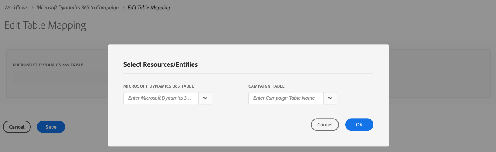
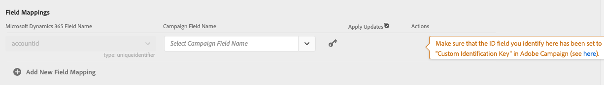

# Gegevens synchroniseren

U kunt tabellen synchroniseren van Microsoft Dynamics 365 naar Campagne- en Campagne-marketinggegevens naar Microsoft Dynamics 365. De synchronisatie wordt uitgevoerd via drie toegewijde technische workflows: **[!UICONTROL Microsoft Dynamics 365 to Campaign]**, **[!UICONTROL Campaign to Microsoft Dynamics 365]**, **[!UICONTROL Opt-In/Out]** . Verwijs naar deze sectie aan [&#x200B; meer &#x200B;](../../integrating/using/d365-acs-self-service-app-workflows.md) leren.

>[!IMPORTANT]
>U moet de **[!UICONTROL Microsoft Dynamics 365 to Campaign]** -workflow stoppen/starten om rekening te houden met uw wijzigingen. [Meer informatie](../../integrating/using/d365-acs-self-service-app-workflows.md)
>

## Tabellen van Microsoft Dynamics 365 toewijzen aan Campagne

De pagina **[!UICONTROL Microsoft Dynamics 365 to Campaign]** bevat een lijst met entiteiten in Microsoft Dynamics 365 en de aangepaste bronnen in Adobe Campaign waarmee deze worden gesynchroniseerd. U kunt nieuwe toewijzingen toevoegen, bestaande toewijzingen bewerken of verwijderen.

Hier volgt een beschrijving van elk van de kolommen in deze tabel:

* **[!UICONTROL MICROSOFT DYNAMICS 365 TABLE]**: in deze kolom wordt aangegeven welke entiteit in Microsoft Dynamics 365 de gegevensbron voor de toewijzing zal zijn.

* **[!UICONTROL CAMPAIGN TABLE]**: in deze kolom wordt aangegeven welke bron in Adobe Campaign de bestemming van de gegevens voor de toewijzing is.

* **[!UICONTROL ACTIONS]**: mogelijke acties worden hieronder weergegeven:

   * Klik op het pictogram **[!UICONTROL Edit]** om deze toewijzing te bewerken.

   * Gebruik het pictogram **[!UICONTROL Delete]** om een tabeltoewijzing te verwijderen.

   * Klik op het pictogram **[!UICONTROL Replay Data]** om alle gegevens in de Microsoft Dynamics 365-tabel opnieuw te synchroniseren. Normaal gesproken synchroniseert de integratietoepassing alleen de gegevens in Microsoft Dynamics 365 die onlangs zijn gewijzigd.  Nochtans, in sommige gevallen (bijvoorbeeld, hebt u een verandering aangebracht of een fout gemaakt) zou u alle gegevens kunnen willen opnieuw worden gesynchroniseerd.  In deze gevallen klikt u op deze knop en de volgende keer dat u de **[!UICONTROL Microsoft Dynamics 365 to Campaign]** -workflow stopt/start, worden de gegevens gesynchroniseerd.

     Als u op de knop **[!UICONTROL Replay Data]** klikt en de controles succesvol zijn, wordt het pictogram uitgeschakeld: het geeft aan dat de gegevens voor dit tabeltoewijzingspaar opnieuw worden gesynchroniseerd met de volgende uitvoering van de **[!UICONTROL Microsoft Dynamics 365 to Campaign]** -workflow.

     U kunt niet selecteren om de gegevens opnieuw af te spelen wanneer het volgende waar is:

      * Als er 2.000.000 (of meer) items in de Backlog-metrische gegevens staan die zijn gekoppeld aan de **[!UICONTROL Microsoft Dynamics 365 to Campaign]** -workflow (weergegeven op de **[!UICONTROL Workflows]** -pagina)
      * Als er 2.000.000 of meer verslagen in Microsoft Dynamics 365 Lijst zijn

     Het aantal records dat opnieuw moet worden gesynchroniseerd, varieert. Als u een groot aantal records hebt, kan het enige tijd duren om het synchronisatieproces te voltooien. Raadpleeg de metrische waarde **[!UICONTROL Backlog]** op de pagina **[!UICONTROL Workflows]** wanneer de integratietoepassing werkt om het synchronisatieproces te voltooien.

     >[!IMPORTANT]
     >
     > U wordt ten zeerste aangeraden de integratieworkflow te stoppen wanneer u wijzigingen in Adobe Campaign Standard of Microsoft Dynamics 365 publiceert. Toepasselijke wijzigingen zijn onder andere: updates van bronnen/entiteiten (en de bijbehorende velden), koppelingen, kolommen met id&#39;s enz. die momenteel door de integratie worden gebruikt.
     >

## Nieuwe toewijzing maken {#add-a-new-mapping}

Voer de volgende stappen uit om een nieuwe toewijzing te maken:

1. op de pagina **[!UICONTROL Microsoft Dynamics 365 to Campaign]** klikt u op de knop **[!UICONTROL Add New Mapping]** .

1. Gebruik de vervolgkeuzelijsten om Microsoft Dynamics 365 te selecteren en de tabellen van de Campagne om in kaart te brengen.
De meeste andere invoer op de pagina is afhankelijk van de tabellen die u kiest.

   

   >[!NOTE]
   >U kunt niet elke tabel meerdere keren toewijzen. Daarom zult u opmerken dat de dropdown selecties geen lijsten zullen omvatten die reeds in kaart zijn gebracht.

1. Klik op **[!UICONTROL OK]** om te bevestigen: de toepassing heeft een ogenblik nodig om de veldgegevens van de geselecteerde tabellen te lezen.

U kunt dan met de toewijzingsconfiguratie te werk gaan. [Meer informatie](#new-mapping-settings)

>[!IMPORTANT]
>
>U kunt de tabellen op deze pagina alleen kiezen wanneer u de toewijzing eerst toevoegt. Zorg ervoor dat u de correcte lijsten alvorens de **[!UICONTROL Save]** knoop hebt geselecteerd te klikken: zodra bewaard, zullen de gebieden van de lijstselectie **read-only** zijn.

### Een bestaande toewijzing bewerken

Als u een bestaande afbeelding bewerkt, ziet u dat de tabelselecties niet bewerkbaar zijn.

Dit gebeurt door ontwerp, omdat de invoer verderop op op de pagina is gebaseerd op de velden die aan deze tabellen zijn gekoppeld. Als u de tabellen wijzigt, worden alle aan deze tabellen gekoppelde velden ongeldig.  Als u de tabel waarnaar u wilt toewijzen wilt wijzigen, gaat u terug naar de vorige pagina, verwijdert u de toewijzing die u wilt wijzigen en voegt u een nieuwe toewijzing toe.

### Een afzonderlijke tabeltoewijzing configureren {#new-mapping-settings}

In deze sectie zult u leren hoe te om a **enige** afbeelding van één Microsoft Dynamics 365 lijst aan één lijst van Adobe Campaign te vormen.

U kunt de volgende instellingen definiëren:

* **[!UICONTROL Tables]**: in deze sectie worden de naam van de Microsoft Dynamics 365-tabel en de Campagne-tabel weergegeven waaraan de tabel wordt toegewezen.
* **[!UICONTROL Field Mappings]**: leer meer in [&#x200B; deze sectie &#x200B;](#field-mappings)
* **[!UICONTROL Field Replacements]**: leer meer in [&#x200B; deze sectie &#x200B;](#field-replacements)
* **[!UICONTROL Filters]**: leer meer in [&#x200B; deze sectie &#x200B;](#filters)
* **[!UICONTROL Advanced Settings]**: leer meer in [&#x200B; deze sectie &#x200B;](#advanced-settings)

### Veldtoewijzingen {#field-mappings}

#### Primaire toetsen

Wanneer u een nieuwe Microsoft Dynamics 365 aan de lijstafbeelding van de Campagne toevoegt, moet u het gebied van identiteitskaart identificeren.

De primaire Microsoft Dynamics 365-sleutel is alleen-lezen omdat de toepassing deze detecteert.

Voor Campagne, moet u selecteren welk gebied de unieke sleutel zal zijn. Het moet als a [&#x200B; worden gevormd identiteitskaart van CRM douanemiddel &#x200B;](../../developing/using/uc-calling-resource-id-key.md) en moet geen duplicaten hebben.

>[!NOTE]
>
>U kunt alleen het veld Id in de tabel kiezen als u **[!UICONTROL Add New Mapping]** hebt geselecteerd. Als u op de knop Bewerken klikt om een bestaande tabeltoewijzing te bewerken, is het veld Id alleen-lezen.

De primaire toetsen zijn altijd de eerste veldnamen die in de sectie **[!UICONTROL Field Mappings]** worden vermeld. Ter herinnering wordt het volgende pictogram rechts weergegeven om u eraan te herinneren dat dit de primaire toetsen zijn.

#### Andere veldtoewijzingen toevoegen

In de sectie **[!UICONTROL Field Mappings]** kunt u andere veldtoewijzingen toevoegen dan de primaire toetsen. Als u een nieuwe toewijzing van een veld van Microsoft Dynamics 365 naar Adobe Campaign wilt toevoegen, klikt u op de knop **[!UICONTROL Add new field mapping]** .

Selecteer de velden Microsoft Dynamics 365 en Campagne in de lijsten:

Deze lijsten bevatten de veldnamen die zijn gekoppeld aan de Microsoft Dynamics 365- en Campagnetabellen die u boven aan de pagina hebt geselecteerd.

Met de schakeloptie **[!UICONTROL Apply updates]** kunt u bepalen of updates voor dit veld worden doorgegeven van Microsoft Dynamics 365 naar Campagne:
* Als deze optie is ingeschakeld  , worden updates van de waarde(n) in Microsoft Dynamics 365 doorgegeven aan Adobe Campaign wanneer de updates plaatsvinden.

* Als u  uitschakelt, wordt de waarde doorgegeven wanneer gegevens voor het eerst worden geladen (of opnieuw worden afgespeeld), maar worden incrementele updates van het veld in Microsoft Dynamics 365 niet doorgegeven.

>[!NOTE]
>
>Klik op de **[!UICONTROL Apply updates]** kolomrubriek om **alle** van de schakelaars aan of weg bij te werken.
>

Als u veldwaarden selecteert, wordt het gegevenstype weergegeven onder de vervolgkeuzemenu&#39;s.   Dit is iets waarmee u rekening moet houden wanneer u waarden van het ene veld naar het andere toewijst.

>[!NOTE]
>
> U kunt niet meerdere Microsoft Dynamics 365-velden toewijzen aan één Campagneveld.

### Veldvervangingen {#field-replacements}

Gebruik de knop **[!UICONTROL Add New Field Replacement]** om een nieuwe veldvervanging te definiëren.

Met veldvervangingen kunt u het volgende identificeren:

* een Microsoft Dynamics 365-veldnaam (die hierboven is toegevoegd in de sectie veldtoewijzingen),
* een bestaande waarde (die bestaat in Microsoft Dynamics 365), en
* een nieuwe waarde om naar Adobe Campaign te schrijven

Er wordt een vervolgkeuzelijst weergegeven voor picklist, opsomming en Booleaanse waarden. Een tekstvak wordt gebruikt voor andere tekenreeks- en numerieke typen.

### Filters {#filters}

Gebruik de knop **[!UICONTROL Add New Filter]** om te selecteren welke Microsoft Dynamics 365-records aan Campagne worden doorgegeven. U kunt elk veld kiezen dat is gekoppeld aan een record om aan filters toe te voegen (de veldnaam hoeft niet aan de veldtoewijzingen te worden toegevoegd).

U geeft een filter op door de volgende informatie in te vullen:

* Microsoft Dynamics 365-veldnaam
* een vergelijkingswaarde, en
* een waarde (uit Microsoft Dynamics 365)
Als de veldnaam, vergelijking en waarde voor een bepaalde record de waarde true oplevert, wordt de record doorgegeven aan Adobe Campaign.

U kunt kiezen hoe deze filters worden geëvalueerd door de invoer met het label **[!UICONTROL Choose the filter comparison operator]** in te stellen.  Als u **en** kiest, moeten alle filters waar voor een verslag zijn om aan Campagne worden verspreid. Als u **of** kiest, zal het verslag worden verspreid als om het even welk van hen aan waar evalueert.

Met de optie **[!UICONTROL Do you want to delete records in Adobe Campaign Standard that will be filtered out from Microsoft Dynamics 365?]** bepaalt u of records die zijn uitgefilterd, uit Campagne moeten worden verwijderd. Als u **Nr** selecteert dan zullen de verslagen in Adobe Campaign blijven. Selecteer **ja** om hen te hebben die door de integratielogica worden geschrapt.

>[!NOTE]
>
> Als er geen filters worden toegevoegd, worden alle gewijzigde records doorgegeven aan Adobe Campaign.
>

### Geavanceerde instellingen {#advanced-settings}

U kunt de volgende aanvullende opties instellen wanneer u een toewijzing configureert:

* Plaats de **[!UICONTROL Apply deletes in Microsoft Dynamics 365 to Campaign?]** optie aan **ja**, als u schrappingen wilt verspreiden die in Microsoft Dynamics 365 aan het overeenkomstige gebied in Adobe Campaign (die op de afbeelding van de gebiedsnaam wordt gebaseerd) voorkomen. Selecteer **Nr** om schrappingen in Microsoft Dynamics 365 te negeren.

* Plaats de **[!UICONTROL Use technical values in Microsoft Dynamics 365 picklists?]** optie aan **Nr** als u aan Campagne wilt verspreiden de vertoningswaarde verbonden aan Microsoft Dynamics 365 picklist. Selecteer **ja** om de technische waarde te verspreiden.

## Campagne-marketinggebeurtenissen synchroniseren naar Microsoft Dynamics 365

Op de pagina **[!UICONTROL Campaign to Microsoft Dynamics 365]** kunt u zien welke e-mailmarketinggebeurtenissen van Adobe Campaign naar Microsoft Dynamics 365 worden toegewezen.

De vier metriek die u kunt controleren zijn: **verzendt**, **klikt**, **opent**, en **Stuiteringen**.

Selecteer **ja** om te bevestigen dat u gebeurtenissen van dat type aan Microsoft Dynamics 365 wilt stromen.

Klik [&#x200B; hier &#x200B;](../../integrating/using/d365-acs-self-service-app-workflows.md) voor meer informatie over deze e-mailgebeurtenisstromen.

## Workflow voor in- en uitschakelen {#opt-in-out-wf}

Het **open-binnen/uit** werkschema staat u toe om de stroom van de opt in/uit informatie tussen Microsoft Dynamics 365 en Adobe Campaign te identificeren. Hierbij wordt ervan uitgegaan dat de gegevens zijn gekoppeld aan de &quot;contact&quot; van de Microsoft Dynamics 365-entiteit en het &quot;profiel&quot; van de Adobe Campaign-resource.

Leer meer over uit:schakelen beheer in [&#x200B; deze sectie &#x200B;](../../integrating/using/d365-acs-notices-and-recommendations.md#opt-out).

Houd er rekening mee dat u op Opslaan moet klikken om uw selecties op te slaan. Herinner ook dat u de **Campagne aan Microsoft Dynamics 365** werkschema moet tegenhouden en dan spel voor de integratie klikken om uw veranderingen op te nemen.

### Richting voor in- en uitsynchroniseren

Hieronder vindt u een lijst met beschikbare opties voor het synchroniseren van gegevens:

* **[!UICONTROL Disabled]**: als deze optie is geselecteerd, wordt er geen informatie over in- en uitschakelen verplaatst tussen Adobe Campaign en Microsoft Dynamics 365.

* **[!UICONTROL Unidirectional (Microsoft Dynamics 365 to Campaign)]**: deze optie wordt alleen gebruikt om de optie voor in- en uitschakelen van Microsoft Dynamics 365 naar Adobe Campaign te sturen. Met de integratietoepassing kunt u de flow in dit scherm niet configureren. Klik in plaats daarvan op **[!UICONTROL Save button]** en navigeer naar de **[!UICONTROL Microsoft Dynamics 365 to Campaign]** -workflow. In deze workflow kunt u de toewijzing van contactpersonen/profieltabellen bewerken om te bepalen hoe u wilt dat uw velden voor in- en uitschakelen worden toegewezen.

* **[!UICONTROL Unidirectional (Campaign to Microsoft Dynamics 365)]**: deze optie zal zichtbaar de **Mappings** sectie maken. Met deze invoer kunt u definiëren welke Adobe Campaign-velden gegevens toewijzen aan welke velden in Microsoft Dynamics 365. Dit betekent dat als u een waarde in Microsoft Dynamics 365 handmatig bijwerkt, de waarde ervan wordt overschreven door de Adobe Campaign-waarde als deze verandert.

* **[!UICONTROL Bidirectional]**: deze optie zal zichtbaar de **Mappings** sectie maken. Met deze paren wordt aangegeven welke velden in Microsoft Dynamics 365 en Adobe Campaign aan elkaar worden toegewezen. [Meer informatie](../../integrating/using/d365-acs-notices-and-recommendations.md).

### Toewijzingen

Deze sectie is alleen van toepassing wanneer het richtingsveld voor de synchronisatie-in/uitrichting is ingesteld op **[!UICONTROL Unidirectional (Campaign to Microsoft Dynamics 365)]** of **[!UICONTROL Bidirectional]** . U kunt opgeven welke velden in Microsoft Dynamics 365 worden toegewezen aan welke invoer in Adobe Campaign.

Microsoft Dynamics 365 gebiedsnamen omvatten alle die van type **boolean** zijn.

De Adobe Campaign-veldnamen zijn een vaste set waarden die specifiek zijn voor opt-in/out. De Adobe Campaign-veldnamen zijn een vaste set waarden die specifiek zijn voor opt-in/out. **de reeks waarden in deze lijst kan niet worden veranderd**.
