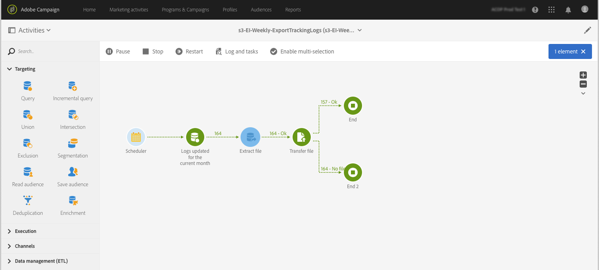

# Gegevens exporteren van Campaign naar Adobe Experience Platform {#sources}

Als u Campaign Standard-gegevens wilt exporteren naar Adobe Real-time Customer Data Platform (RTCDP), moet u eerst een workflow in Campaign Standard maken om de gegevens die u wilt delen naar uw Amazon Storage Service (S3) of Azure Blob-opslaglocatie te exporteren.

Nadat de workflow is geconfigureerd en de gegevens naar de opslaglocatie zijn verzonden, moet u de opslaglocatie van uw S3- of Azure-blob als een verbinding maken **Bron** in Adobe Experience Platform.

>[!NOTE]
>
>Houd er rekening mee dat we alleen het exporteren van door campagne gegenereerde gegevens aanbevelen (bijvoorbeeld verzenden, openen, klikken enz.) naar Adobe Experience Platform. Gegevens die van een bron van derden (zoals uw CRM) worden ontvangen, moeten rechtstreeks in Adobe Experience Platform worden geïmporteerd.

## Een exportworkflow maken in Campaign Standard

Om gegevens van Campaign Standard naar uw opslagplaats van S3 of Azure Blob uit te voeren, moet u een werkschema bouwen om de gegevens te richten u wilt uitvoeren en het verzenden naar uw opslagplaats.

Hiervoor kunt u toevoegen en configureren:

* A **[!UICONTROL Extract file]** activiteit om de gerichte gegevens in een Csv- dossier te halen. Raadpleeg voor meer informatie over het configureren van deze activiteit [deze sectie](../../automating/using/extract-file.md).

  

* A **[!UICONTROL Transfer file]** activiteit om het CSV-bestand naar uw opslaglocatie over te brengen. Raadpleeg voor meer informatie over het configureren van deze activiteit [deze sectie](../../automating/using/transfer-file.md).

  

In de onderstaande workflow worden logbestanden regelmatig uitgepakt in een CSV-bestand en wordt het bestand vervolgens overgebracht naar een opslaglocatie.

Voorbeelden van werkstromen voor gegevensbeheer zijn beschikbaar in het gedeelte [werkstromen gebruiken hoofdletters](../../automating/using/about-workflow-use-cases.md#management) sectie.

Verwante onderwerpen:

* [Gegevensbeheeractiviteiten](../../automating/using/about-data-management-activities.md)
* [Informatie over gegevens importeren en exporteren](../../automating/using/about-data-import-and-export.md)

## De opslaglocatie aansluiten als bron

De belangrijkste stappen om uw opslaglocatie van Amazon Storage Service (S3) of Azure Blob als een **Bron** in Adobe Experience Platform worden hieronder vermeld. Gedetailleerde informatie over elk van deze stappen is beschikbaar in het dialoogvenster [Documentatie van bronconnectors](https://experienceleague.adobe.com/docs/experience-platform/sources/home.html?lang=nl).

1. In Adobe Experience Platform **[!UICONTROL Sources]** een verbinding maken met uw opslaglocatie:

   * [Een Amazon S3-bronverbinding maken](https://experienceleague.adobe.com/docs/experience-platform/sources/ui-tutorials/create/cloud-storage/s3.html?lang=nl-NL)
   * [Azure Blob-connector](https://experienceleague.adobe.com/docs/experience-platform/sources/connectors/cloud-storage/blob.html?lang=nl-NL)

   >[!NOTE]
   >
   >De opslaglocatie kan Amazon S3, SFTP met wachtwoord, SFTP met SSH-sleutel of Azure Blob-verbindingen zijn. De voorkeursmethode voor het verzenden van gegevens naar Adobe Campaign is Amazon S3 of Azure Blob:

   

1. Configureer een gegevensstroom voor een batchverbinding voor cloudopslag. Een dataflow is een geplande taak die gegevens van de opslagplaats aan een dataset van Adobe Experience Platform terugwint en opneemt. Met deze stappen kunt u de gegevensinvoer vanaf uw opslaglocatie configureren, inclusief gegevensselectie en de toewijzing van de CSV-velden aan een XDM-schema.

   Gedetailleerde informatie is beschikbaar in [deze pagina](https://experienceleague.adobe.com/docs/experience-platform/sources/ui-tutorials/dataflow/cloud-storage.html?lang=nl-NL).

   

1. Nadat de Bron is gevormd, zal Adobe Experience Platform het dossier van de opslagplaats invoeren die u verstrekte.

   Deze bewerking kan volgens uw behoeften worden gepland. We raden u aan de exportbewerking tot zes keer per dag uit te voeren, afhankelijk van de belasting die al op het exemplaar aanwezig is.
