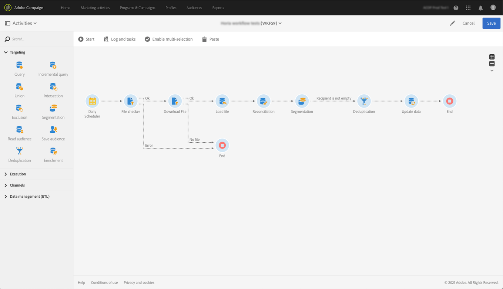

# Adobe Experience Platform-doelgroepen opnemen in Campaign {#destinations}

Als u een Adobe Experience Platform-publiek wilt opnemen in de campagne en deze wilt gebruiken in uw workflows, moet u eerst Adobe Campaign als een Adobe Experience Platform verbinden **Doel** en configureer deze met het segment dat u wilt exporteren.

Zodra de Bestemming is gevormd, zullen de gegevens naar uw opslagplaats worden uitgevoerd, en u zult een specifieke werkschema in Campaign Standard moeten bouwen om het in te voeren.

## Adobe Campaign verbinden als doel

In het Adobe Experience-platform configureert u een verbinding met Adobe Campaign door een opslaglocatie voor de geëxporteerde segmenten te selecteren. Met deze stappen kunt u ook de segmenten selecteren die u wilt exporteren en aanvullende XDM-velden opgeven die u wilt opnemen.

Raadpleeg voor meer informatie de [Doelen](https://experienceleague.adobe.com/docs/experience-platform/destinations/catalog/email-marketing/adobe-campaign.html).

Nadat de Bestemming is gevormd, leidt Adobe Experience Platform tot een lusje-afgebakend .txt of .csv- dossier in de opslagplaats die u verstrekte. Deze bewerking is gepland en wordt één keer per 24 uur uitgevoerd.

U kunt nu een Campaign Standard-workflow configureren om het segment in te voeren in Campagne.

## Een importworkflow maken in Campaign Standard

Zodra Campaign Standard is gevormd als Bestemming, moet u een specifieke werkschema bouwen om het dossier in te voeren dat door Adobe Experience Platform is uitgevoerd.

Om dit te doen, moet u toevoegen en vormen a **[!UICONTROL Transfer file]** activiteit. Voor meer op hoe te om deze activiteit te vormen, verwijs naar [deze sectie](../../automating/using/transfer-file.md).

Vervolgens kunt u uw workflow naar wens samenstellen (werk de database bij met behulp van de segmentgegevens, verzend een levering tussen kanalen naar het segment, enz.)

In de onderstaande workflow wordt het bestand bijvoorbeeld dagelijks vanaf de opslaglocatie gedownload en vervolgens wordt de Campagne-database bijgewerkt met de segmentgegevens.

Voorbeelden van werkstromen voor gegevensbeheer zijn beschikbaar in het gedeelte [werkstromen gebruiken hoofdletters](../../automating/using/about-workflow-use-cases.md#management) sectie.

Verwante onderwerpen:

* [Data-managementactiviteiten](../../automating/using/about-data-management-activities.md)
* [Informatie over gegevens importeren en exporteren](../../automating/using/about-data-import-and-export.md)
