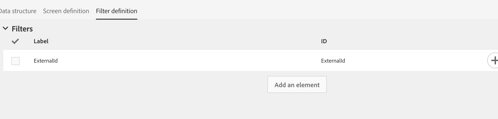

# Aangepaste bronnen voor campagne toewijzen en eigen entiteiten voor dynamiek 365

Leer hoe u aangepaste bronnen en aangepaste entiteiten in kaart brengt in de context van de integratie tussen Adobe Campaign Standard en Microsoft Dynamics 365.

## Vereisten

De nieuwe versie van de integratie [van de Norm van de Campagne van de Dynamica 365-Adobe van](../../integrating/using/working-with-campaign-standard-and-microsoft-dynamics-365.md) Microsoft verleent steun voor douaneentiteiten.  Dit staat voor douaneentiteiten in Dynamiek 365 toe om over aan overeenkomstige douanemiddelen in Campagne worden herhaald.

Zodra herhaald, kunnen de nieuwe gegevens in de douanemiddelen voor verscheidene doeleinden, met inbegrip van segmentatie en verpersoonlijking worden gebruikt.

>[!CAUTION]
>
>Als om het even welk dossier van de Bron douane van de Campagne persoonlijke informatie bevat, toepasselijk op het gebruik van een klant van Campagne, zou zulk verslag aan een overeenkomstig het profielverslag van de Campagne (of direct of door een andere douanemiddel) moeten worden verbonden zodat een privacy verwante schrapping in het profielverslag het verbonden douanemiddelverslag met persoonlijke informatie kan ook schrappen; de koppelings- en verwijderingsopties tussen de entiteiten moeten zo zijn geconfigureerd dat deze trapsgewijze verwijdering van de gekoppelde records mogelijk is. Persoonlijke gegevens moeten niet worden ingevoerd in een aangepaste bron die niet aan het profiel is gekoppeld.

Een uitgebreider overzicht van de aangepaste bronnen voor campagnes vindt u [op deze koppeling](../../developing/using/key-steps-to-add-a-resource.md).

Als u de integratie voor aangepaste entiteiten wilt instellen, kunt u zich wenden tot [adobe-support@unifisoftware.com](mailto:adobe-support@unifisoftware.com) .  Unifi zal de namen van de lijsten van de douaneentiteit in beide systemen, evenals de gewenste attributenafbeeldingen vereisen.  Unifi zal dan de overeenkomstige banen en dienstregelingen creëren.

Een voorbeeld van het gebruik van de steun van de douaneentiteit kan in de sectie [van het Geval van het](../../integrating/using/map-campaign-custom-resources-and-dynamics-365-custom-entities.md#UC)Gebruik worden gezien.

>[!CAUTION]
>
>* Aangepaste bronnen die vóór de versie van Campagne Standard 19.4 zijn gepubliceerd, **moeten opnieuw worden gepubliceerd** om met de integratie te kunnen worden gebruikt.
>* Het creëren van en het wijzigen van de Standaard douanemiddelen van de Campagne zijn gevoelige verrichtingen die door deskundige slechts gebruikers moeten worden uitgevoerd.

## Hoofdletters gebruiken

### Beginstaat

De klant heeft een voertuig van de douaneentiteit vooraf bepaald in Dynamica 365 en een overeenkomstige douane middelvoertuig vooraf bepaald in de Norm van de Campagne.  De Klant heeft Unifi aangepaste eenheidstoewijzingsgegevens verstrekt en Unifi heeft de taken en schema&#39;s voor de aangepaste voertuigbron in Unifi ingesteld.

|   | Microsoft Dynamics 365 | Adobe Campagne Standard | Notities |
|---|---|---|---|
| Entiteit op hoofdniveau | Contact | Profiel | Standaard, out-of-the-box entiteiten |
| Gekoppelde entiteit | Voertuig - nieuwe aangepaste entiteit | Voertuig - nieuwe aangepaste bron | Nieuwe aangepaste entiteiten |
| Type koppeling | Ouderlijk verband met contact met N:1 | Vergelijkbaar met Dynamics 365 - zie de sectie Campagne hieronder voor meer informatie |   |

### Configuratie in dynamiek 365

De douaneentiteiten van deze klant in Dynamiek 365 kunnen in het Dashboard van de Verkoop worden bekeken door op de drop-down naast Dynamiek 365 te klikken.  De aangepaste entiteiten van deze klant zijn gegroepeerd onder **[!UICONTROL Extensions]**.

U kunt de gegevens van het voertuig bekijken door op de **[!UICONTROL vehicle]** aangepaste entiteit te klikken.  Zie de onderstaande lijst met voertuigen.

De relatie van de **[!UICONTROL vehicle]** entiteit met de **[!UICONTROL Contact]** entiteit is hieronder te zien. **[!UICONTROL Parental]** is gekozen voor de **[!UICONTROL Type of Behavior]**.

### Configuratie in de standaard Campagne

In Campagne, kunnen de douanemiddelen van de klant worden bekeken door **[!UICONTROL Adobe Campaign]** in de hogere linkerhoek te klikken, dan selecterend **[!UICONTROL Client data]**.

### Aangepaste bronnen en aangepaste entiteiten toewijzen

De **[!UICONTROL vehicle]** douanemiddel zou eerder door de klant moeten zijn vooraf bepaald en zou in de gegevens van de Cliënt moeten tonen; maar we zullen de stappen doorlopen om deze **[!UICONTROL vehicle]** aangepaste bron hieronder te maken .

Klik op **[!UICONTROL Adobe Campaign]** in de linkerbovenhoek en klik op **[!UICONTROL Administration > Development > Custom Resources]**.

1. Klik op **[!UICONTROL Custom Resources]**.
1. Klik op de **[!UICONTROL Create]** knop.  Hiermee wordt een pop-upvenster geopend.
1. Selecteer **[!UICONTROL Create a new resource]** en typ **[!UICONTROL Vehicle]** als label en id.
1. Klik op **[!UICONTROL Create]**.

De campagne zal dan gegevensstructuren en verbindingspagina tonen.  U ziet dat er verschillende velden zijn toegevoegd.

* ID van het voertuig is de unieke identificatiecode voor de **[!UICONTROL Vehicle]** entiteit; de integratie werkt alleen als de id ervan exact **[!UICONTROL externalId]** is, zoals hieronder wordt weergegeven.
* Bijbehorend profiel is de id van het profiel waaraan de voertuigregistratie is gekoppeld; als deze koppeling bestaat, wordt deze gekoppeld aan het **[!UICONTROL externalId]** veld van de tabel Profiel.
* VIN en voertuignaam zijn velden waarin informatie over het voertuig wordt vastgelegd.

>[!CAUTION]
>
>Elke douanebron moet een uniek gebied met identiteitskaart van externalId (precies) hebben.  Dit gebied zal aan het gebied van identiteitskaart van het douanemiddel in Dynamiek 365 (zie hieronder) in kaart brengen.

### De identificatietoetsen definiëren

De volgende stap bestaat uit het definiëren van de identificatietoetsen.  Maak eerst de identificatietoetsen, zoals hieronder wordt weergegeven.

Selecteer het **[!UICONTROL externalId]** veld in het scherm Sleuteldefinitie.

>[!CAUTION]
>
>Elke aangepaste bron moet een identificatiesleutel hebben met een pad van &quot;externalId&quot; (exact).

### Het filter definiëren

De volgende stap is het specificeren van de filterdefinitie.

Klik onder **[!UICONTROL Filter Definition]** op **[!UICONTROL Add an element]**.\
Geef het label en de id de naam **[!UICONTROL ExternalId]**.
Klik op **[!UICONTROL Add]**.

Klik nu op Bewerken op het zojuist toegevoegde filterelement en configureer het filter voor de onderstaande afbeelding.  Als u **[!UICONTROL externalId]** in het **[!UICONTROL Parameters]** veld invoert en op het plusteken klikt, **[!UICONTROL externalId_parameter]** wordt het veld weergegeven.  Selecteer dit als de parameter.

### De koppeling definiëren

Vervolgens wordt de koppeling van de aangepaste bron opgegeven.  In dit geval hebben we ervoor gekozen een koppeling tot stand te brengen van de aangepaste entiteit (bron) naar de profielentiteit (doel) met behulp van een **[!UICONTROL Vehicles]** **[!UICONTROL 1 cardinality simple link]**.

(../assets/DefineTheLink.png)

1. Kies de verwijderoptie in het **[!UICONTROL Link definitions]** scherm: **[!UICONTROL Deleting the target record implies deleting records referenced by the link]**. Deze optie is zo gekozen dat wanneer een profiel wordt verwijderd, alle **[!UICONTROL Vehicle]** records die aan dat profiel zijn gekoppeld, ook worden verwijderd.
1. In **[!UICONTROL Join Definitions]** selecteert u **[!UICONTROL Define specific join conditions]**.
1. Klik vervolgens **[!UICONTROL Add an element]**.

Voor de bij definitie aansluiten, gaan wij hieronder de waarden in.

Merk op dat de **[!UICONTROL @externalId]** ingang het externalId gebied van de profiellijst is en de **[!UICONTROL ProfileExternalId]** ingang identiteitskaart van het overeenkomstige gebied in het middel van de autodouane is.  Wanneer de waarde externalId van een profielrecord wordt ingevoerd in het **[!UICONTROL ProfileExternalId]** veld van een voertuigrecord, worden de twee records aan elkaar gekoppeld.

Wijzigingen bevestigen en de aangepaste entiteit opslaan.

### Publiceren en controleren op updates

De laatste stap bestaat uit het publiceren van de aangepaste bron.

1. Klik **[!UICONTROL Adobe Campaign]** in de linkerbovenhoek op **[!UICONTROL Administration > Development > Publishing]**.
1. De standaardoptie behouden: **[!UICONTROL Determine modifications since the last publication]**.
1. Klik **[!UICONTROL Prepare Publication]** en wacht tot het is voltooid.

Klik vervolgens **[!UICONTROL Publish]** en wacht tot de bewerking is voltooid.

### Unifi ingress-schema

Ervan uitgaande dat de klant de aangepaste voertuigentiteit reeds heeft ingevuld in Dynamics 365 en dat Unifi hun aangepaste entiteitstaken en -schema’s voor voertuigen heeft opgezet met, moet de klant het ingangsschema voor de voertuigentiteit kunnen afschoppen.

Na voltooiing van de ingangsbaan, kunnen de voertuiggegevens nu in de onlangs bevolkte **[!UICONTROL Vehicle]** douanemiddel in Campaign worden gezien.

**Verwante onderwerpen**

* Werken met Adobe Campaign Standard - Microsoft Dynamics 365
* Belangrijke stappen voor het toevoegen van een aangepaste bron in de campagne
