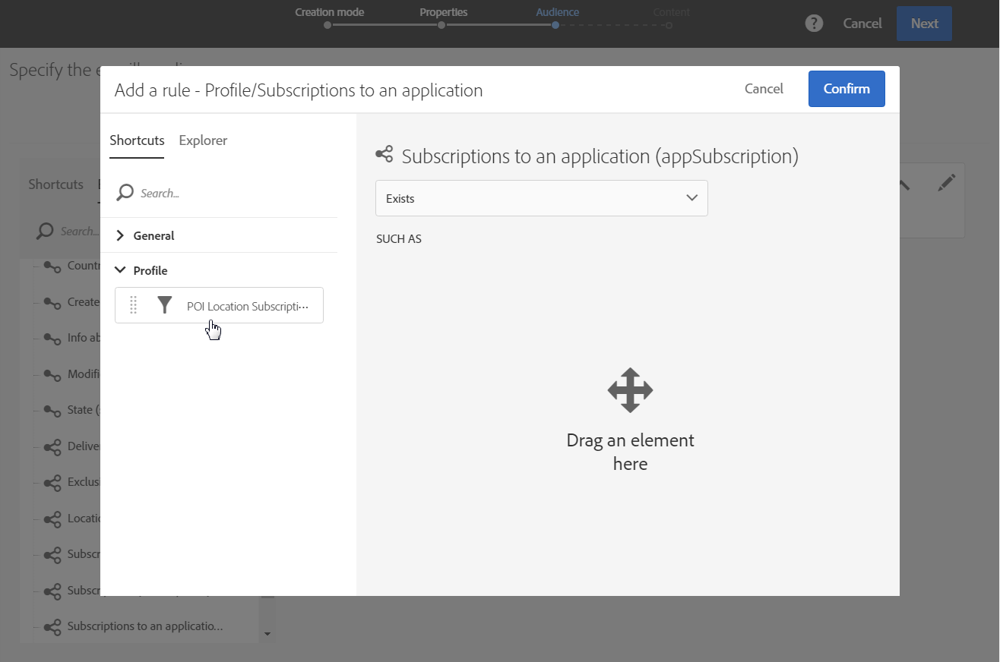

# Campagneberichten aanpassen met gegevens van het Punt{#personalizing-campaign-messages-with-point-of-interest-data}

In Adobe Campagne kunt u de gegevens van de Punten van Interesse gebruiken die van de abonnees van uw mobiele toepassing worden verzameld om hen gepersonaliseerde marketing berichten, zoals een e-mail te verzenden.

U kunt alleen reageren op Point of Interest-gegevens met standaardleveringen. [Transactieberichten](../../channels/using/about-transactional-messaging.md) kunnen geen locatiegegevens gebruiken.

De vroegste reactie is ongeveer 10 minuten.

In dit geval besluit u een e-mail te sturen naar alle abonnees die uw winkel in Boston in de afgelopen twee weken hebben bezocht.

1. Maak een e-mailmarketingactiviteit.
1. Wanneer u het publiek van de levering definieert, sleept u het **[!UICONTROL Subscriptions to an application]** element naar de werkruimte.

   

   Het beheren van het publiek wordt gedetailleerd beschreven in de sectie [Het publiek](../../audiences/using/creating-audiences.md) definiëren.

1. Sleep het **[!UICONTROL Add a rule - Profile/Subscriptions to an application]** element in het **[!UICONTROL POI Location Subscription]** venster naar de werkruimte.

   

1. Voer in het **[!UICONTROL Add a rule - POI Location Subscription]** venster het label in van het Point of Interest dat u wilt gebruiken.

   

1. Selecteer in het **[!UICONTROL Filter type]** veld **[!UICONTROL Relative]**.
1. Schakel de **[!UICONTROL Preceding days]** optie in en typ **[!UICONTROL 15]** het desbetreffende veld.
1. Bepaal het aantal tijden de gebruiker het Punt van Interesse moet hebben bezocht.
1. Klik **[!UICONTROL Confirm]** om uw publiek op te slaan.

   

1. Voeg inhoud toe aan uw e-mail.

   

1. Bevestig dat u de activiteit maakt om het dashboard van de e-mail weer te geven.
1. Verzend uw bericht.

De e-mail met de korting van 10% wordt verzonden naar abonnees die:

* In de afgelopen twee weken heeft u minstens één keer een bezoek gebracht aan uw winkel in Boston.
* Houd uw mobiele toepassing tijdens het bezoek minstens één keer op de voorgrond.

**Verwante onderwerpen:**

* [Een e-mail maken](../../channels/using/creating-an-email.md)
* [Inhoud definiëren](../../designing/using/personalization.md#example-email-personalization)
* [Berichten verzenden](../../sending/using/confirming-the-send.md)

