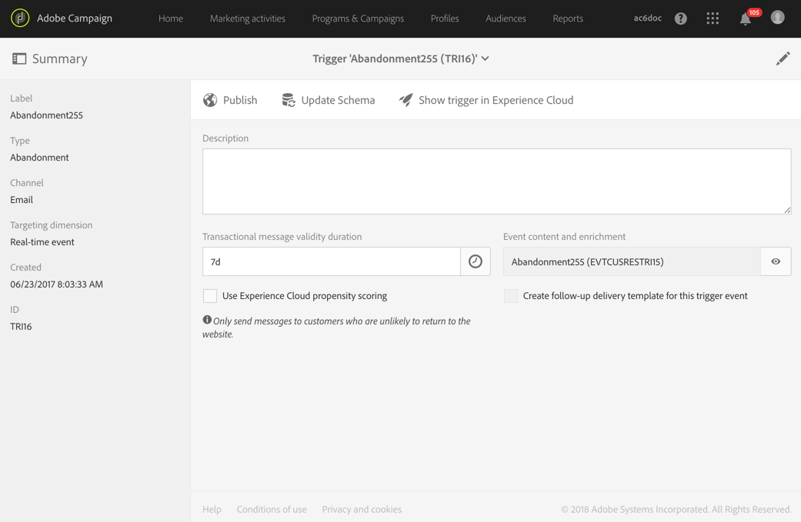
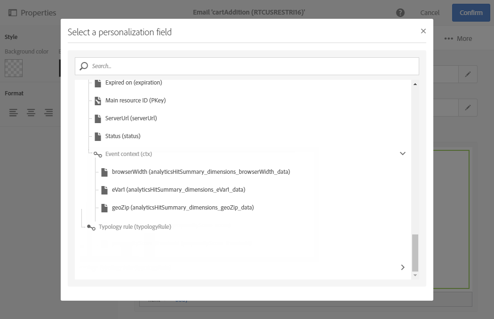

# Triggers gebruiken in Campaign{#using-triggers-in-campaign}

## Een gekoppelde trigger in Campaign maken {#creating-a-mapped-trigger-in-campaign}

Definieer eerst de gedragingen die u in Adobe Experience Cloud (**[!UICONTROL Triggers]**-kernservice) wilt bewaken. Kijk voor meer informatie in de [documentatie van Adobe Experience Cloud](https://docs.adobe.com/content/help/nl-NL/core-services/interface/activation/triggers.html). Let op dat u bij het definiëren van de trigger aliassen moet inschakelen. Voor elk gedrag (bladeren/verlaten van formulieren, toevoegen/verwijderen van producten, vervallen sessie, enz.) moet een nieuwe trigger worden toegevoegd in Adobe Experience Cloud.

Maak nu een triggergebeurtenis in Adobe Campaign op basis van een bestaande Adobe Experience Cloud-trigger.

Bekijk deze [video](https://helpx.adobe.com/marketing-cloud/how-to/email-marketing.html#step-two) om meer inzicht te krijgen in het instellen van triggers in Adobe Campaign.

Voer daartoe de volgende stappen uit:

1. Klik in de linkerbovenhoek op het logo **[!UICONTROL Adobe Campaign]** en selecteer **[!UICONTROL Marketing plans]** > **[!UICONTROL Transactional messages]** > **[!UICONTROL Experience Cloud Triggers]**.

   

1. Klik op de knop **[!UICONTROL Create]**. De geopende creation wizard toont een lijst met alle triggers die in Adobe Experience Cloud zijn gedefinieerd. In de kolom **[!UICONTROL Fired by Analytics]** ziet u het aantal gebeurtenissen dat door de Adobe Experience Cloud-trigger naar Campaign is verzonden. Dit is het toewijzen van triggers die in de Experience Cloud-interface zijn gemaakt.

   

1. Selecteer de Adobe Experience Cloud-trigger die u wilt gebruiken en klik op **[!UICONTROL Next]**.
1. Configureer de algemene eigenschappen van de trigger. In deze stap van de wizard specificeert u ook het kanaal en de te gebruiken doeldimensie voor de trigger (zie [Doeldimensies en bronnen](../../automating/using/query.md#targeting-dimensions-and-resources)). Bevestig vervolgens het maken van de trigger.
1. Klik op de knop rechts van het veld **[!UICONTROL Event content and enrichment]** om de content van de payload te bekijken. In dit scherm kunt u ook de gebeurtenisdata verrijken met profieldata die zijn opgeslagen in de Adobe Campaign-database. De verrijking wordt op dezelfde manier uitgevoerd als voor een standaard transactiebericht.

   

1. Definieer in het veld **[!UICONTROL Transactional message validity duration]** de duur van de geldigheid van het bericht nadat de gebeurtenis door Analytics is verzonden. Het bericht wordt niet meer verzonden als er een duur van 2 dagen is gedefinieerd en die duur is verstreken. Als u verscheidene berichten in de wachtstand zet, zorgt dit ervoor dat die berichten niet worden verzonden als ze na een bepaalde periode worden hervat.

   

1. U kunt nu de triggers publiceren. Raadpleeg [Een trigger publiceren in Campagne](../../integrating/using/using-triggers-in-campaign.md#publishing-trigger-in-campaign) voor meer informatie hierover.

## Een trigger publiceren in Campagne {#publishing-trigger-in-campaign}

Nadat u een triggergebeurtenis in Adobe Campaign hebt gemaakt op basis van een bestaande Adobe Experience Cloud-trigger, moet u deze nu publiceren.

1. Klik vanaf de eerder gemaakte trigger op de knop **[!UICONTROL Publish]** om de triggergebeurtenis te publiceren.

   

1. U kunt de voortgang van de triggerpublicatie controleren onder **[!UICONTROL Publication]**.

   

1. Wanneer de publicatie wordt gedaan, zal het volgende bericht onder **[!UICONTROL Publication]** verschijnen.

   

1. Als u het triggerschema wilt wijzigen, zelfs nadat u de triggergebeurtenis hebt gepubliceerd, klikt u op de knop **[!UICONTROL Update schema]** om de laatste wijzigingen op te halen.

   Houd er rekening mee dat door deze actie de publicatie van uw trigger en transactiebericht ongedaan wordt gemaakt. Deze moeten hierna opnieuw worden gepubliceerd.

   

1. Klik op de knop **[!UICONTROL Show Trigger in Experience Cloud]** om de triggerdefinitie in Adobe Experience Cloud weer te geven.

Na het publiceren van de gebeurtenis wordt er automatisch een transactiesjabloon gemaakt die aan de nieuwe gebeurtenis is gekoppeld. Wijzig en publiceer vervolgens de zojuist gemaakte sjabloon. Raadpleeg de sectie [De sjabloon bewerken](../../start/using/marketing-activity-templates.md) voor meer informatie.

## De sjabloon van het transactiebericht bewerken {#editing-the-transactional-message-template}

Na het maken en publiceren van de triggergebeurtenis, wordt de bijbehorende transactiesjabloon automatisch gemaakt. Raadpleeg de sectie [Een toegewezen trigger maken in Campaign](#creating-a-mapped-trigger-in-campaign) voor meer informatie.

Als u wilt dat de gebeurtenis het verzenden van een transactiemelding activeert, moet u de sjabloon personaliseren, en dan testen en publiceren. Deze stappen zijn hetzelfde als voor een standaard transactiebericht. Voor meer op dit, verwijs naar [het Uitgeven van een transactiebericht](../../channels/using/editing-transactional-message.md) sectie.

>[!NOTE]
>
>De publicatie van de triggergebeurtenis wordt automatisch ongedaan gemaakt als de publicatie van de sjabloon ongedaan wordt gemaakt.

Tijdens het bewerken van de content kunt u op basis van de informatie die door de Analytics-trigger wordt verzonden een personalisatieveld toevoegen. Als de gebeurtenisdata worden verrijkt met Adobe Campaign-profieldata, kan het bericht op basis van deze data gepersonaliseerd worden. Selecteer **[!UICONTROL Transactional event]** > **[!UICONTROL Event context]** en een veld als u het bericht wilt personaliseren.

## De rapporten openen {#accessing-the-reports}

Als u het speciale triggerrapport in Adobe Campaign wilt weergeven, opent u de eerder gemaakte triggergebeurtenis en klikt u op **[!UICONTROL Show trigger report]**.

Het rapport toont het aantal verwerkte gebeurtenissen in vergelijking met het aantal gebeurtenissen dat door Analytics is verzonden. Er wordt ook een lijst met alle recente triggers weergegeven.

