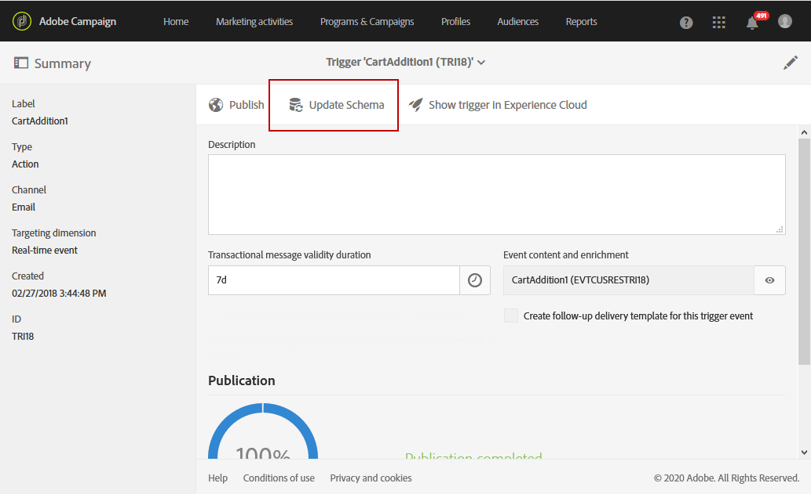

# Triggers gebruiken in campagne{#using-triggers-in-campaign}

## Een toegewezen trigger maken in Campagne {#creating-a-mapped-trigger-in-campaign}

Zorg ervoor dat u de gedragingen definieert die u vooraf wilt controleren in Adobe Experience Cloud ( **[!UICONTROL Triggers]** kernservice). Raadpleeg de documentatie [van](https://marketing.adobe.com/resources/help/en_US/mcloud/triggers.html)Adobe Experience Cloud voor meer informatie. Wanneer u de trigger definieert, moet u de aliassen inschakelen. Voor elk gedrag (bladeren/verlaten van formulieren, toevoegen/verwijderen van producten, verlopen sessie, enz.) moet een nieuwe trigger worden toegevoegd in Adobe Experience Cloud.

U moet nu een triggergebeurtenis maken in Adobe Campaign op basis van een bestaande Adobe Experience Cloud-trigger.

U kunt deze [video](https://helpx.adobe.com/marketing-cloud/how-to/email-marketing.html#step-two) bekijken om u te helpen begrijpen hoe triggers worden ingesteld in Adobe Campaign.

De stappen om dit in werking te stellen zijn:

1. Klik in de linkerbovenhoek op het **[!UICONTROL Adobe Campaign]** logo en selecteer **[!UICONTROL Marketing plans]** > **[!UICONTROL Transactional messages]** > **[!UICONTROL Experience Cloud Triggers]**.

   

1. Klik op de **[!UICONTROL Create]** knop. De aanmaakwizard die wordt geopend, geeft een lijst weer van alle triggers die zijn gedefinieerd in Adobe Experience Cloud. In de **[!UICONTROL Fired by Analytics]** kolom wordt het aantal gebeurtenissen weergegeven dat door de Adobe Experience Cloud-trigger naar Campagne wordt verzonden. Dit is het in kaart brengen van trekkers die in de interface van de Wolk van de Ervaring worden gecreeerd.

   

1. Selecteer de Adobe Experience Cloud-trigger die u wilt gebruiken en klik op **[!UICONTROL Next]**.
1. Configureer de algemene eigenschappen van de trigger. Bij deze stap van de tovenaar, specificeer ook het kanaal en de het richten dimensie voor de trekker (zie het [richten dimensies en middelen](../../automating/using/query.md#targeting-dimensions-and-resources)) te gebruiken. Bevestig vervolgens het maken van de trigger.
1. Klik op de knop rechts van het **[!UICONTROL Event content and enrichment]** veld om de inhoud van de lading weer te geven. In dit scherm kunt u ook gebeurtenisgegevens verrijken met profielgegevens die zijn opgeslagen in de Adobe Campaign-database. De verrijking wordt op dezelfde manier uitgevoerd als voor een standaard transactiebericht.

   

1. Definieer in het **[!UICONTROL Transactional message validity duration]** veld de duur gedurende welke het bericht geldig blijft nadat de gebeurtenis door Analytics is verzonden. Als een duur van 2 dagen wordt bepaald, zal het bericht niet meer worden verzonden nadat die duur is overgegaan. Als u verscheidene berichten op greep zet, zorgt dit ervoor dat die berichten niet zullen worden verzonden als u hen na een bepaalde periode hervat.

   

1. Als er in Analytics een &#39;propensity scoring&#39; is gedefinieerd (zie de [Experience Cloud-documentatie](https://marketing.adobe.com/resources/help/en_US/insight/client/c_visitor_propensity.html)), kunt u ervoor kiezen het bericht niet te verzenden als de klant in de nabije toekomst waarschijnlijk terug zal keren naar de website. De inhoud van de score en de drempel is beschikbaar in de inhoud van de lading zodat u die waarden kunt gebruiken om het bericht aan te passen. Schakel het selectievakje onder aan het scherm in als u deze optie wilt gebruiken. De cliënten met een grote waarschijnlijkheid om in de nabije toekomst terug naar de plaats te komen zullen geen bericht ontvangen.
1. Klik op de **[!UICONTROL Publish]** knop om de triggergebeurtenis te publiceren.
1. Als u een wijziging in het triggerschema moet aanbrengen zelfs nadat u de triggergebeurtenis hebt gepubliceerd, klikt u op de **[!UICONTROL Update schema]** knop om de laatste wijzigingen op te halen.

   Houd er rekening mee dat door deze actie de publicatie van uw trigger- en transactiebericht ongedaan wordt gemaakt. Hierna moet u de berichten opnieuw publiceren.

   

Met de **[!UICONTROL Show Trigger in Experience Cloud]** knop kunt u de triggerdefinitie weergeven in Adobe Experience Cloud.

Nadat de gebeurtenis is gepubliceerd, wordt automatisch een transactiesjabloon gemaakt dat aan de nieuwe gebeurtenis is gekoppeld. Vervolgens moet u de zojuist gemaakte sjabloon wijzigen en publiceren. Raadpleeg de sectie [De sjabloon](../../start/using/marketing-activity-templates.md) bewerken voor meer informatie.

## De transactiemalplaatje van het bericht uitgeven {#editing-the-transactional-message-template}

Nadat u de triggergebeurtenis hebt gemaakt en gepubliceerd, wordt de bijbehorende transactiesjabloon automatisch gemaakt. Raadpleeg voor meer informatie de sectie [Een toegewezen trigger maken in de sectie Campagne](#creating-a-mapped-trigger-in-campaign) .

Als u wilt dat de gebeurtenis het verzenden van een transactiemelding activeert, moet u de sjabloon aanpassen, vervolgens testen en publiceren. Deze stappen zijn het zelfde als voor een standaardtransactiebericht. Raadpleeg voor meer informatie de sectie [Transactiesjabloon](../../channels/using/event-transactional-messages.md#personalizing-a-transactional-message) .

>[!NOTE]
>
>Als u de publicatie van de sjabloon ongedaan maakt, wordt de publicatie van de triggergebeurtenis automatisch ongedaan gemaakt.

Wanneer u inhoud bewerkt, kunt u een aanpassingsveld toevoegen op basis van de informatie die door de trigger Analytics wordt verzonden. Als u de gebeurtenisgegevens verrijkt met Adobe Campagne-profielgegevens, kunt u het bericht personaliseren op basis van deze gegevens. Als u uw bericht wilt aanpassen, selecteert u **[!UICONTROL Transactional event]** > **[!UICONTROL Event context]** en selecteert u een veld.

## De rapporten openen {#accessing-the-reports}

Als u het toegewezen triggerrapport wilt weergeven in Adobe Campaign, opent u de triggergebeurtenis die u eerder hebt gemaakt en klikt u op **[!UICONTROL Show trigger report]**.

Het rapport toont het aantal verwerkte gebeurtenissen in vergelijking met het aantal gebeurtenissen dat door Analytics wordt verzonden. Er wordt ook een lijst weergegeven met alle recente triggers.

