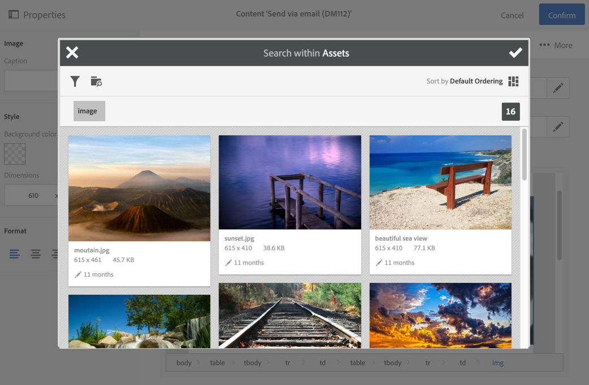

# Werken met Campaign en de Assets-kernservice{#working-with-campaign-and-assets-core-service}

Als u de kernservice of middelen op aanvraag integreert (afhankelijk van de configuratie van uw Adobe Experience Cloud-omgeving) met Adobe Campaign, kunt u alle middelen gebruiken die in Adobe Experience Cloud worden gedeeld op uw Adobe Campaign-e-mails en -landingspagina&#39;s.

Bronnen die door Adobe Experience Cloud worden gedeeld, kunnen in uw e-mails en landingspagina&#39;s worden gebruikt.

1. Wanneer u de inhoud van een e-mail- of landingspagina bewerkt, gaat u naar een afbeeldingsblok en selecteert u deze vervolgens **[!UICONTROL Image shared from Adobe Experience Cloud]** via het contextmenu.

   

1. Selecteer in het selectievenster dat wordt geopend een afbeelding en bevestig deze vervolgens.

   

De afbeelding wordt vervolgens ingevoegd. De levering kan nu naar wens worden gepersonaliseerd en verzonden.

**Verwante onderwerpen:**

* [Middelen en delen](https://docs.adobe.com/content/help/en/core-services/interface/assets/experience-cloud-assets.html)
* [Inhoudseditor](../../designing/using/personalization.md#example-email-personalization)

