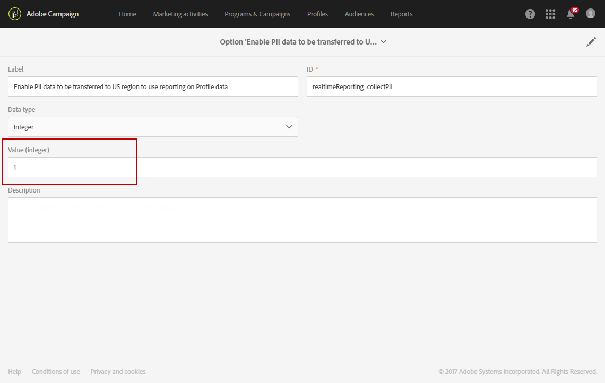

# Dynamische rapporten{#about-dynamic-reports}

>[!NOTE]
>
>Alleen gebruikers met beheerrechten of met organisatorische eenheden die op **Alles** zijn ingesteld, kunnen een nieuw rapport maken of opslaan. For more on this, refer to this [section](../../administration/using/users-management.md).

De dynamische Rapportering verstrekt volledig klantgerichte en real-time rapporten. Het voegt toegang tot profielgegevens toe, toelatend demografische analyse door profieldimensies zoals geslacht, stad en leeftijd naast functionele e-mailcampagnegegevens zoals opent en klikt. Met de belemmering-en-dalingsinterface, kunt u gegevens onderzoeken, bepalen hoe uw e-mailcampagnes tegen uw belangrijkste klantensegmenten werden uitgevoerd en hun effect op ontvangers meten.

Dankzij het slepen en neerzetten en aanpasbare visualisaties kunt u met de functie voor dynamische rapporten dimensies, metriek en tijdbereik in elke combinatie combineren met onbeperkte onderverdelingen en vergelijkingen.

**Verwante onderwerpen:**

* [Rapportlijst](../../reporting/using/defining-the-report-period.md)
* [Organisatorische eenheden](../../administration/using/organizational-units.md)
* [Video over dynamische rapporten](https://docs.adobe.com/content/help/en/campaign-learn/campaign-standard-tutorials/reporting/creating-a-dynamic-report.html)

## Dynamische rapporten openen {#accessing-dynamic-reports}

Rapporten zijn toegankelijk:

* Selecteer op de startpagina het **[!UICONTROL Reports]** tabblad in de bovenste balk of op de **[!UICONTROL Reports]** kaart om rapporten te openen voor alle leveringen.

   

* In elk programma, campagne, en bericht, van de knoop van **Rapporten** door **Dynamische Rapporten** te klikken om de rapporten slechts te bekijken specifiek voor de levering.

   

Bepaalde rapporten kunnen niet direct na een levering beschikbaar zijn, afhankelijk van de tijd die het kost om informatie te verzamelen en te verwerken.

Dynamische rapporten worden in twee categorieën onderverdeeld:

* **Sjablonen**, die kunnen worden gewijzigd door ze te kopiëren met de optie **Opslaan als** (**Project > Opslaan als..**) in de sjabloon.
* **Aangepaste rapporten** (weergegeven in blauw) die u rechtstreeks kunt maken door op de knop Nieuw project **** maken op de startpagina **Rapporten** te klikken.

>[!NOTE]
>
>De gegevens worden gefilterd afhankelijk van uw organisatorische eenheden.

## Dynamische gebruiksovereenkomst voor rapportage {#dynamic-reporting-usage-agreement}

Het doel van de dynamische rapportgebruiksovereenkomst is als pop-uptoestemming voor gegevensverwerking te werken. Standaard is de overeenkomst alleen zichtbaar en kan deze alleen worden geaccepteerd of geweigerd door gebruikers met beheerrechten.

Er zijn drie opties beschikbaar:

* **[!UICONTROL Ask me later]**: Als u later **op** Vragen klikt, wordt het venster 24 uur niet meer weergegeven. Totdat u de overeenkomst accepteert of afwijst, worden de profielafmetingen niet weergegeven in uw rapporten en worden de persoonlijke identificatiegegevens van uw klanten niet verzameld of verzonden.
* **[!UICONTROL Accept]**: Door deze overeenkomst te accepteren, machtigt u Adobe Campaign om de persoonlijke identiteitsgegevens van uw klanten te verzamelen en deze over te brengen naar het rapportage- of datacenter.
* **[!UICONTROL Decline]**: Als u de overeenkomst afwijst, worden de profielafmetingen niet weergegeven in uw rapporten en worden de persoonlijke identificatiegegevens van uw klanten niet verzameld of verzonden. Let erop dat in dit geval externalID nog steeds wordt verzameld en gebruikt om eindgebruikers te identificeren.

In de onderstaande tabel ziet u wat er gebeurt als u deze overeenkomst accepteert, afhankelijk van uw regio.

|  | Dynamische rapportage | Microsoft Dynamics 365-connector |
|---|---|---|
| Amerika en APAC (Azië-Stille Oceaan) | **Functie beschikbaar**.  Alle informatie over alle out-of-the-box (d.w.z. stad, land/regio, staat, geslacht en segmenten op basis van leeftijd) en aangepaste profielen die naar het Amerikaanse rapportagecentrum wordt doorgestuurd. Raadpleeg deze [pagina voor meer informatie over profielafmetingen](../../reporting/using/list-of-components-.md) | **Functie beschikbaar**.  Alle velden voor out-of-the-box en aangepaste profielen en gebeurtenisvelden voor Adobe Campagne Standard worden verwerkt in het Amerikaanse datacenter. |
| EMEA (Europa, Midden-Oosten en Afrika) | **Functie beschikbaar**.  Alle informatie over alle out-of-the-box (d.w.z. stad, land/regio, staat, geslacht en segmenten op basis van leeftijd) en aangepaste profielen die naar het EMEA-rapportagecentrum wordt doorgestuurd. Raadpleeg deze [pagina voor meer informatie over profielafmetingen](../../reporting/using/list-of-components-.md) | **Functie beschikbaar.**  Alle velden voor out-of-the-box en aangepaste profielen en Adobe Campagne Standard-gebeurtenisvelden die worden verwerkt in het EMEA-datacenter.  **[!UICONTROL Control data]** die Adobe I/O-registratiegegevens en id&#39;s van gebeurtenissen voor eindgebruikers van de klant bevat die in het Amerikaanse datacenter worden verzonden en opgeslagen. |

In de onderstaande tabel ziet u wat er gebeurt als deze overeenkomst wordt geweigerd, afhankelijk van uw regio. Merk op dat zelfs als u deze overeenkomst afwijst, het melden van leveringen en de integratie van de Dynamica 365 van Microsoft nog beschikbaar zal zijn.

| Regio | Dynamische rapportage | Microsoft Dynamics 365-connector |
|---|---|---|
| Amerika en APAC (Azië-Stille Oceaan) | **Functie beschikbaar**.   Geen informatie over out-of-the-box &amp; aangepaste profielen die naar het rapportcentrum van de V.S. wordt geduwd met uitzondering van ExternalID. | **Functie beschikbaar**.  Er worden geen buiten-de-box of aangepaste profielvelden verzonden naar het Amerikaanse datacenter, met uitzondering van de externe id en de ontvanger-id.  Alle Adobe Campaign Standard-gebeurtenisvelden die in het Amerikaanse datacenter worden verwerkt, met uitzondering van de ID van de spiegelpagina.  Voor meer informatie over de integratie van de Dynamiek 365 van Microsoft, verwijs naar deze [pagina](https://helpx.adobe.com/campaign/kb/acs-ms-dynamics.html). |
| EMEA (Europa, Midden-Oosten en Afrika) | **Functie beschikbaar**.  Geen informatie over out-of-the-box en aangepaste profielen doorgegeven aan het EMEA-rapportagecentrum, met uitzondering van ExternalID. | **Functie beschikbaar.** Er worden  geen velden met een out-of-the-box- of aangepast profiel naar het EMEA-datacenter verzonden, met uitzondering van de externe id en de ontvanger-id.  Alle Adobe Campaign Standard-gebeurtenisvelden die in het EMEA-datacenter zijn verwerkt, met uitzondering van de ID van de mirrorpagina.   **[!UICONTROL Control data]** die Adobe I/O-registratiegegevens en id&#39;s van gebeurtenissen voor eindgebruikers van de klant bevat die in het Amerikaanse datacenter worden verzonden en opgeslagen. Voor meer informatie over de integratie van de Dynamiek 365 van Microsoft, verwijs naar deze [pagina](https://helpx.adobe.com/campaign/kb/acs-ms-dynamics.html). |

Deze optie is niet definitief. U kunt deze altijd wijzigen door **[!UICONTROL Enable PII data to be transferred to US region to use reporting on Profile data]** in **[!UICONTROL Administration]** > **[!UICONTROL Application Settings]** > **[!UICONTROL Options]** te selecteren.

De waarde kan op elk gewenst moment worden gewijzigd. De waarde 1 komt overeen met **[!UICONTROL Ask me later]**, 2 **[!UICONTROL Decline]** en 3 **[!UICONTROL Accept]**.

