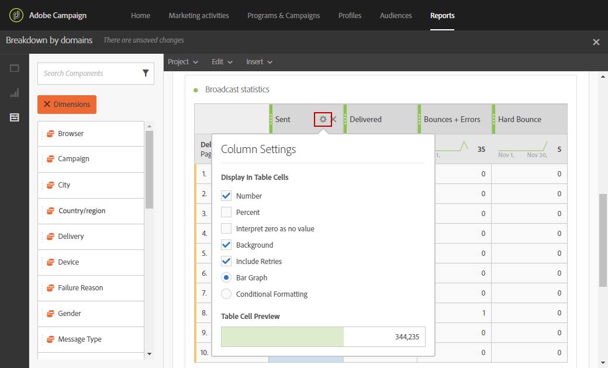

# Deelvensters toevoegen{#adding-panels}

## Een leeg venster toevoegen {#adding-a-blank-panel}

Om uw rapport te beginnen, kunt u een reeks panelen aan een uit doos of douanerapport toevoegen. Elk deelvenster bevat verschillende gegevenssets en bestaat uit vrije-vormtabellen en visualisaties.

In dit deelvenster kunt u uw rapporten naar wens samenstellen. U kunt zoveel deelvensters toevoegen als u wilt in uw rapporten om uw gegevens met verschillende tijdsperiodes te filteren.

1. Klik op het pictogram **Deelvensters**. U kunt ook een deelvenster toevoegen door op het tabblad **Invoegen te klikken en** Nieuw leeg deelvenster **te selecteren.**

   

1. Sleep het **Lege deelvenster** naar het dashboard.

   

U kunt nu een vrije-vormlijst aan uw paneel toevoegen beginnen richtend gegevens.

## Een vrije-vormlijst {#adding-a-freeform-table} toevoegen

Met de tabellen voor vrije vorm kunt u een tabel maken voor het analyseren van uw gegevens met behulp van de verschillende waarden en afmetingen die beschikbaar zijn in de tabel **Component**.

Elke lijst en visualisatie is resizable en kan worden bewogen om uw rapport beter aan te passen.

1. Klik op het pictogram **Deelvensters**.

   

1. Sleep het item **Freeform** naar het dashboard.

   U kunt een lijst ook toevoegen door **Tussenvoegsel** tabel te klikken en **Nieuwe Freeform** te selecteren of door **een vrije vormlijst** in een leeg paneel toe te voegen.

   

1. Het segment **[!UICONTROL Exclude proof]** is standaard al geselecteerd. Indien nodig, kunt u het veranderen door één van **[!UICONTROL Segments]** van het **[!UICONTROL Components]** lusje in de hoogste bar te slepen.

   

1. Sleep items van het tabblad **Componenten** naar de kolommen en rijen om uw tabel te maken.

   

1. Klik op het pictogram **Instellingen** om te wijzigen hoe de gegevens in uw kolommen worden weergegeven.

   

   De **[!UICONTROL Column settings]** bestaat uit:

   * **[!UICONTROL Number]**: Hiermee kunt u samenvattingsnummers in de kolom tonen of verbergen.
   * **[!UICONTROL Percent]**: Hiermee kunt u het percentage in de kolom tonen of verbergen.
   * **[!UICONTROL Interpret zero as no value]**: Hiermee kunt u tonen of verbergen wanneer de waarde gelijk is aan nul.
   * **[!UICONTROL Background]**: Hiermee kunt u de horizontale voortgangsbalk in cellen weergeven of verbergen.
   * **[!UICONTROL Include retries]**: Hiermee kunt u opnieuw proberen opnemen in het resultaat. Dit is alleen beschikbaar voor **[!UICONTROL Sent]** en **[!UICONTROL Bounces + Errors]**.

1. Selecteer een of meerdere rijen en klik op het pictogram **Visualiseren**. Er wordt een visualisatie toegevoegd die de geselecteerde rijen weerspiegelt.

   

U kunt nu zo veel componenten toevoegen als u nodig hebt en ook visualisaties toevoegen om grafische representaties van uw gegevens te geven.
