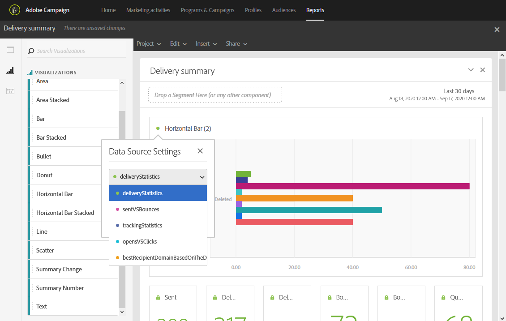

# Visualisaties toevoegen{#adding-visualizations}

Op het tabblad **Visualisatie** kunt u visualisatie-items, zoals gebied, donut en grafiek, slepen en neerzetten. Visualisaties geven u grafische voorstellingen van uw gegevens.

1. Sleep op het **[!UICONTROL Visualizations]** tabblad een visualisatie-item in een deelvenster.

   

1. Nadat het toevoegen van een visualisatie aan uw paneel, ontdekt de Dynamische rapporten automatisch de gegevens in uw vrije vormlijst. Selecteer de instellingen voor uw visualisatie.
1. Als u meer dan één vrije lijst hebt, kies de beschikbare gegevensbron om in uw grafiek in het venster van de Montages **van de** Gegevensbron toe te voegen. Dit venster is ook beschikbaar als u op de gekleurde stip naast de titel voor visualisatie klikt.

   

1. Klik op de knop **[!UICONTROL Visualization]** Instellingen om het grafiektype of de weergave ervan rechtstreeks te wijzigen, zoals:

   * **Percentage**: Hiermee geeft u de waarden weer als een percentage.
   * **Y-as anker op nul**: Hiermee wordt de y-as naar nul geforceerd, zelfs als de waarden boven nul liggen.
   * **Legenda zichtbaar**: Hiermee kunt u de legenda verbergen.
   * **Normalisatie**: Hiermee past u waarden aan.
   * **Dual-as** weergeven: Hiermee voegt u een andere as aan de grafiek toe.
   * **Max. aantal items** beperken: Hiermee beperkt u het aantal weergegeven grafieken.
   * **Drempel**: Hiermee kunt u een drempelwaarde instellen voor de grafiek. Het wordt weergegeven als een zwarte stippellijn.

   

Dankzij deze visualisatie hebt u een duidelijker beeld van uw gegevens in uw rapporten.
