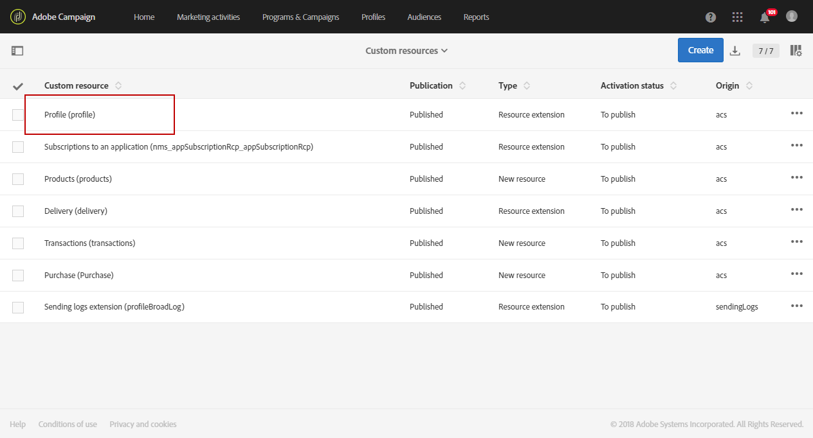

# Een aangepaste profieldimensie maken{#creating-a-custom-profile-dimension}

Rapporten kunnen ook worden gemaakt en beheerd op basis van aangepaste profielgegevens die zijn gemaakt tijdens de uitbreiding van de aangepaste profielbron.

In dit voorbeeld willen we het aangepaste profielveld **Loyalty-programma** &#39;s maken die in drie niveaus worden verdeeld: goud, zilver en brons. Dit aangepaste profiel wordt vervolgens uitgebreid zodat het kan worden gebruikt als een aangepaste profieldimensie in dynamische rapporten.

* [Stap 1: Een nieuw profielveld maken](#step-1--create-a-new-profile-field)
* [Stap 2: De verzendende logboeken uitbreiden met het profielveld](#step-2--extend-the-sending-logs-with-the-profile-field)
* [Stap 3: Een levering maken voor ontvangers die zijn ingeschreven voor het loyaliteitsprogramma](#step-3--create-a-delivery-targeting-recipients-enrolled-in-the-loyalty-program)
* [Stap 4: Maak een dynamisch rapport om ontvangers met de dimensie van het aangepaste profiel te filteren](#step-4--create-a-dynamic-report-to-filter-recipients-with-the-custom-profile-dimension)

## Stap 1: Een nieuw profielveld maken {#step-1--create-a-new-profile-field}

We moeten eerst het nieuwe profielveld **Loyalty-programma** maken dat het loyaliteitsniveau aan onze ontvangers zal toewijzen: goud, zilver of brons.

>[!NOTE]
>
>De middelen van de douane kunnen slechts door een beheerder worden beheerd.

Dit doet u als volgt:

1. Selecteer in het menu Geavanceerd **[!UICONTROL Administration]** > **[!UICONTROL Development]** > **[!UICONTROL Custom resources]** vervolgens de **[!UICONTROL Profile (profile)]** aangepaste bron.

   

1. Klik op het **[!UICONTROL Data structure]** tabblad in de **[!UICONTROL Fields]** categorie op de **[!UICONTROL Add field]** knop.

   

1. Ga het **[!UICONTROL Label]**, **[!UICONTROL ID]** en selecteer het douanemiddel in **[!UICONTROL Type]**. Hier hebben we gekozen **[!UICONTROL Text]** omdat ontvangers de keuze zullen hebben tussen goud, zilver en brons.

   

1. Klik op het  pictogram om het veld te definiëren.

   

1. Hier, moeten wij de geoorloofde waarden specificeren door elke waarde te controleren **[!UICONTROL Specify a list of authorized valued]** en tot stand te brengen door te klikken **[!UICONTROL Create element]**.

   

1. Voer de tekst in **[!UICONTROL Label]** en **[!UICONTROL Value]** klik op **[!UICONTROL Add]**. In dit voorbeeld moeten we de waarde goud, zilver en brons creëren. Click **[!UICONTROL Confirm]** when done.

   

1. Selecteer het tabblad **[!UICONTROL Screen definition]**. Schakel in de **[!UICONTROL Detail screen configuration]** vervolgkeuzelijst de **[!UICONTROL Add personalized fields]** sectie in om een nieuwe sectie in ons profiel te maken.

   

1. Klik op de **[!UICONTROL Add an element]** knop om de nieuwe sectie te maken. Selecteer de **[!UICONTROL Type]**: **[!UICONTROL Input field]**, **[!UICONTROL Value]** of **[!UICONTROL List]**, dan het gebied in deze nieuwe sectie toe te voegen.

   

1. U kunt ook een titel aan uw sectie in het veld toevoegen **[!UICONTROL Customize the title of the section where the fields will be displayed]**.

   Klik **[!UICONTROL Save]** wanneer de configuratie wordt gedaan.

   

1. Kies in het geavanceerde menu **[!UICONTROL Administration]** > **[!UICONTROL Development]** > **[!UICONTROL Publication]** om uw aangepaste bron te publiceren.
1. Klik **[!UICONTROL Prepare publication]** vervolgens op de **[!UICONTROL Publish]** knop wanneer de voorbereiding is voltooid.

   

Uw nieuwe profielveld kan nu worden gebruikt en geselecteerd door uw ontvangers.

## Stap 2: De verzendende logboeken uitbreiden met het profielveld {#step-2--extend-the-sending-logs-with-the-profile-field}

Nu uw profielgebied wordt gecreeerd, moeten wij de verzendende logboeken met ons profielgebied uitbreiden om de bijbehorende dimensie van het douaneprofiel in dynamische rapporten tot stand te brengen.

Voordat u het logbestand uitbreidt met ons profielveld, controleert u of het PII-venster is geaccepteerd voor toegang tot het **[!UICONTROL Sending logs extension]** tabblad. Raadpleeg [deze pagina](../../reporting/using/about-dynamic-reports.md#dynamic-reporting-usage-agreement) voor meer informatie.

>[!NOTE]
>
>De logboeken kunnen slechts met profielgebieden door beheerder worden uitgebreid.

1. Selecteer in het menu Geavanceerd **[!UICONTROL Administration]** > **[!UICONTROL Development]** > **[!UICONTROL Custom resources]** vervolgens de **[!UICONTROL Profile (profile)]** aangepaste bron.
1. Open de **[!UICONTROL Sending logs extension]** vervolgkeuzelijst.
1. Klik op de knop **[!UICONTROL Create element]**.

   

1. Select your previously created field and click **[!UICONTROL Confirm]**.
1. Schakel deze optie in **[!UICONTROL Add this field in Dynamic reporting as a new dimension]** om uw aangepaste profielafmetingen te maken.

   

   Deze optie is alleen beschikbaar als het PII-venster is geaccepteerd. Raadpleeg [deze pagina](../../reporting/using/about-dynamic-reports.md#dynamic-reporting-usage-agreement) voor meer informatie.

1. Klik **[!UICONTROL Add]** dan sparen uw douanemiddel.
1. Omdat de aangepaste bron is gewijzigd, moeten we deze publiceren om de nieuwe wijzigingen te implementeren.

   Kies in het geavanceerde menu **[!UICONTROL Administration]** > **[!UICONTROL Development]** > **[!UICONTROL Publication]** om uw aangepaste bron te publiceren.

1. Klik **[!UICONTROL Prepare publication]** vervolgens op de **[!UICONTROL Publish]** knop wanneer de voorbereiding is voltooid.

   

Uw aangepaste profiel is nu beschikbaar als een aangepaste profieldimensie in uw rapporten.

Nu uw veld is gemaakt en het verzenden van logboeken is uitgebreid met dit profielveld, kunt u zich richten op ontvangers in leveringen.

## Stap 3: Een levering maken voor ontvangers die zijn ingeschreven voor het loyaliteitsprogramma {#step-3--create-a-delivery-targeting-recipients-enrolled-in-the-loyalty-program}

Nadat u het profielveld hebt gepubliceerd, kunt u de levering starten. In dit voorbeeld, willen wij elke ontvanger richten die in het loyaliteitsprogramma wordt ingeschreven.

1. Klik op het tabblad **[!UICONTROL Marketing activities]** op **[!UICONTROL Create]** en selecteer **[!UICONTROL Email]**.
1. Kies een optie en voer de eigenschappen van uw e-mail in. **[!UICONTROL Email type]**
1. Om ontvanger te richten die in het loyaliteitsprogramma wordt ingeschreven, sleep en laat vallen de **[!UICONTROL Profiles (attributes)]** activiteit.
1. Selecteer het eerder gemaakte veld in de **[!UICONTROL Field]** vervolgkeuzelijst.

   

1. Selecteer uw **[!UICONTROL Filter conditions]**. Hier willen we ontvangers aanspreken die deel uitmaken van een van de drie niveaus van het loyaliteitsprogramma.

   

1. Klik **[!UICONTROL Confirm]** dan wanneer klaar het filtreren, klik **[!UICONTROL Next]**.
1. Definieer de inhoud van het bericht, de naam van de afzender en het onderwerp en personaliseer deze. For more information on email creation refer to this [page](../../designing/using/designing-content-in-adobe-campaign.md).

   Then, click **[!UICONTROL Create]**.

1. Als u klaar bent, kunt u een voorbeeld van uw bericht bekijken en uw bericht verzenden. Raadpleeg deze [pagina](../../sending/using/preparing-the-send.md)voor meer informatie over het voorbereiden en verzenden van uw bericht.

Zodra uw e-mail correct naar de geselecteerde ontvangers wordt verzonden, kunt u beginnen uw gegevens te filteren en het succes van uw levering met rapporten te volgen.

## Stap 4: Maak een dynamisch rapport om ontvangers met de dimensie van het aangepaste profiel te filteren {#step-4--create-a-dynamic-report-to-filter-recipients-with-the-custom-profile-dimension}

Nadat u de levering hebt verzonden, kunt u rapporten afbreken met behulp van de aangepaste profieldimensie in de **[!UICONTROL Profile]** tabel.

1. Selecteer op het **[!UICONTROL Reports]** tabblad een rapport uit de doos of klik op de **[!UICONTROL Create]** knop om een rapport helemaal opnieuw te beginnen.

   

1. Klik in de **[!UICONTROL Dimensions]** categorie **[!UICONTROL Profile]** en sleep de aangepaste dimensie van het **Loyalty-programma** -profiel naar de vrije-vormtabel.

   

1. Sleep de gegevens **[!UICONTROL Processed/Sent]** en **[!UICONTROL Open]** metriek om te beginnen met filteren van de gegevens.

   

1. Sleep indien nodig een visualisatie naar de werkruimte.

   

**Verwant onderwerp:**

* [Gegevens van aangepaste profielen gebruiken om inzichtelijke rapporten te maken](https://helpx.adobe.com/campaign/kb/simplify-campaign-management.html#Reportandshareinsightswithallstakeholders)
