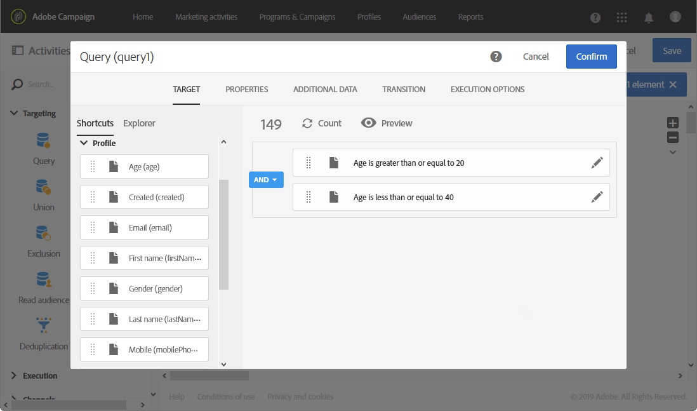

# Een rapport maken op basis van workflowsegmenten{#creating-a-report-workflow-segment}

Nadat u een workflow hebt gemaakt en uw populatie hebt gefilterd in verschillende doelgroepen, kunt u de efficiëntie van uw marketingcampagnes meten op basis van segmenten die zijn gedefinieerd in deze doelworkflow.
Om deze segmenten in uw rapporten te richten:

* [Stap 1: Profielen bijwerken, aangepaste bron met segmenten](#step-1--update-profiles-custom-resource-segments)
* [Stap 2: Een workflow met segmenten maken](#step-2--create-a-workflow-segments)
* [Stap 3: Een dynamisch rapport maken om segmenten te filteren](#step-3--create-a-dynamic-report-filter-segments)

>[!CAUTION]
>De dynamische gebruiksovereenkomst voor rapportage moet worden geaccepteerd om te beginnen met het verzamelen van deze gegevens.
>Raadpleeg deze [pagina](../../reporting/using/about-dynamic-reports.md#dynamic-reporting-usage-agreement)voor meer informatie over deze overeenkomst.

## Stap 1: Profielen bijwerken, aangepaste bron met segmenten{#step-1--update-profiles-custom-resource-segments}

Alvorens op uw segmentcode te melden, moet u uw **[!UICONTROL Profiles]** douanemiddel voor uw segmentcodes bijwerken die moeten worden opgeslagen.

1. Selecteer in het geavanceerde menu via het Adobe Campagne-logo **[!UICONTROL Administration]** > **[!UICONTROL Development]** > **[!UICONTROL Custom resources]** en selecteer vervolgens de **[!UICONTROL Profile (profile)]** bron.
1. In het **[!UICONTROL Sending logs extension]** menu van het **[!UICONTROL Data structure]** lusje, controleer **[!UICONTROL Add segment code]** om opslag van uw segmentcodes toe te staan van het richten van werkschema&#39;s en het te verzenden naar dynamische rapportering.

   Het **[!UICONTROL Segment code]** zal dan in de **[!UICONTROL Profile]** afmetingssectie van uw rapport beschikbaar zijn.

   

1. Sla uw aangepaste bron op.

1. U moet nu uw aangepaste bron publiceren.
Selecteer in het menu Geavanceerd **[!UICONTROL Administration]** > **[!UICONTROL Development]** > **[!UICONTROL Publishing]**.

   

1. Klik **[!UICONTROL Prepare publication]** vervolgens op de **[!UICONTROL Publish]** knop wanneer de voorbereiding is voltooid. Raadpleeg deze [pagina](../../developing/using/updating-the-database-structure.md)voor meer informatie over aangepaste bronnen.

U kunt nu uw workflow maken met segmentcodes.

Merk op dat de segmentcodes zullen worden verzameld zodra u de segmentcode in **[!UICONTROL Sending logs extension]** toelaat.

## Stap 2: Een workflow met segmenten maken {#step-2--create-a-workflow-segments}

>[!NOTE]
>Als de invoerovergang van de e-maillevering leeg is, wordt de segmentcode van de vorige overgang standaard toegevoegd.

Eerst moet u een workflow maken met verschillende doelgroepen. Hier, willen wij een e-mail verzenden die afhankelijk van de leeftijd van ons publiek zal worden gepersonaliseerd: één levering voor profielen van 20 tot 30 jaar oud en een andere voor profielen van 30 tot 40 jaar oud.

1. Maak uw workflow. Raadpleeg deze [pagina](../../automating/using/building-a-workflow.md)voor meer informatie over het maken van uw workflow.

1. Voeg een **[!UICONTROL Query]** activiteit toe door deze vanuit het palet te slepen en neer te zetten in de werkruimte.

1. Doelprofielen van 20 tot 40 jaar oud om ze later in meer doelgroepen te segmenteren.

   

1. Voeg een **[!UICONTROL Segmentation]** activiteit toe om uw vraagresultaten in twee gerichte populaties te verdelen. Raadpleeg deze [pagina](../../automating/using/segmentation.md)voor meer informatie over segmentatie.

1. Dubbelklik op de **[!UICONTROL Segmentation]** activiteit om deze te configureren. Bewerk het eerste segment door op **[!UICONTROL Edit properties]** te klikken.

   

1. Zoekprofielen tussen 20 en 30 jaar en klik **[!UICONTROL Confirm]** als u klaar bent.

   

1. Klik **[!UICONTROL Add an element]** om uw tweede segment te maken en het te configureren zoals in de bovenstaande stappen wordt beschreven voor de doelprofielen tussen 30 en 40 jaar.

1. Bewerk de gegevens **[!UICONTROL Segment code]** voor elke populatie die via dynamische rapportage worden doorgegeven.

   >[!NOTE]
   >Deze stap is verplicht of anders kunt u niet begrijpen over welke segmenten moet worden gerapporteerd.

   

1. Sleep een **[!UICONTROL Email delivery]** activiteit na de segmenten.

   

1. Pas uw leveringen aan, afhankelijk van de verschillende doelgroepen. Raadpleeg deze [pagina](../../designing/using/designing-content-in-adobe-campaign.md)voor meer informatie over het maken van e-mail.

1. Sla de workflow op.

1. Klik **[!UICONTROL Start]** wanneer uw werkstroom klaar is.

U kunt tot uw rapporten nu toegang hebben om uw segmentcodes te volgen.

## Stap 3: Een dynamisch rapport maken om segmenten te filteren {#step-3--create-a-dynamic-report-filter-segments}

Nadat u leveringen met uw workflow hebt verzonden, kunt u rapporten splitsen aan de hand van uw segmentcodes uit uw workflow.

1. Selecteer op het **[!UICONTROL Reports]** tabblad een rapport uit de doos of klik op de **[!UICONTROL Create new project]** knop om een rapport helemaal opnieuw te beginnen.

   
1. Sleep de **[!UICONTROL Delivery]** dimensie naar de vrije-vormtabel.

   

1. Sleep verschillende metriek naar de tabel, zoals de metriek **[!UICONTROL Open]** **[!UICONTROL Click]** en de metriek, om te beginnen met het filteren van de gegevens.
1. Klik in de **[!UICONTROL Dimensions]** categorie op de **[!UICONTROL Profile]** dimensie en sleep de **[!UICONTROL Segment code]** dimensie op de levering van de workflow om het succes van de e-maillevering te meten, afhankelijk van de doelpopulaties.

   

1. Sleep indien nodig een visualisatie naar de werkruimte.

   
