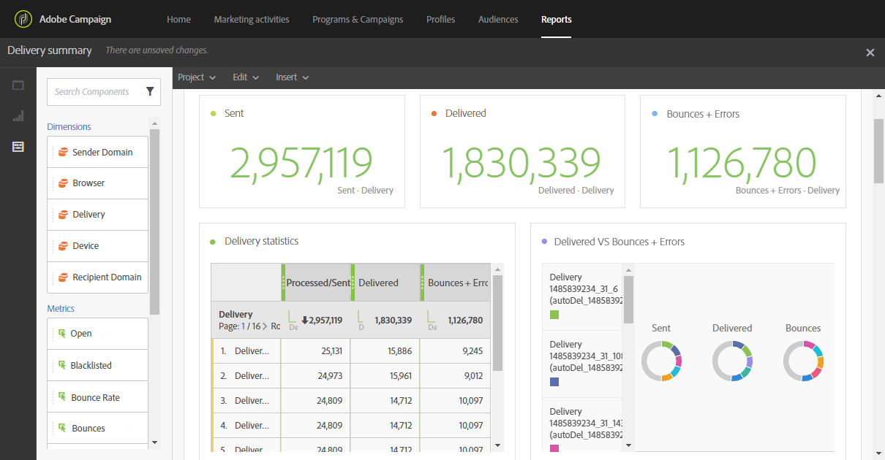

# Leveringsoverzicht{#delivery-summary}

Het **[!UICONTROL Delivery summary]** rapport bevat de belangrijkste informatie met betrekking tot een e-mail of meerdere e-mails.

Elke tabel wordt aangegeven met een overzichtsnummer en een overzicht van de diagrammen. U kunt wijzigen hoe de details worden weergegeven in de respectievelijke visualisatie-instellingen.

De tabel met **leveringsstatistieken** bevat de gegevens die beschikbaar zijn voor verzonden e-mails, zoals:

* **[!UICONTROL Processed/sent]**: Het totale aantal verzendt voor de levering.
* **[!UICONTROL Delivered]**: Het aantal berichten dat is verzonden in verhouding tot het totale aantal verzonden berichten. Er wordt rekening gehouden met de geconstateerde fouten. Er wordt echter geen rekening gehouden met klachten (spamverklaringen) en wegberichten zoals &quot;out of office&quot;.
* **[!UICONTROL Bounces + Errors]**: Het aantal totale fouten dat tijdens levering en automatische terugkeerverwerking met betrekking tot het totale aantal verzonden berichten wordt gecumuleerd.

De **Open en kliks** lijst, bevat de beschikbare gegevens voor ontvankelijke activiteit voor elke levering, zoals:

* **Klik**: Het aantal keren dat op een inhoud is geklikt in een levering.
* **Openen**: Het aantal keren dat een bericht in een levering werd geopend.
* **Uniek wordt geopend**: Het aantal ontvangers dat de levering heeft geopend.
* **Unieke klikken**: Het aantal ontvangers dat op een inhoud in een levering heeft geklikt.

De **lijst van de Verdeling** van het Domein toont de status van leveringen volgens het domein van de ontvanger.
