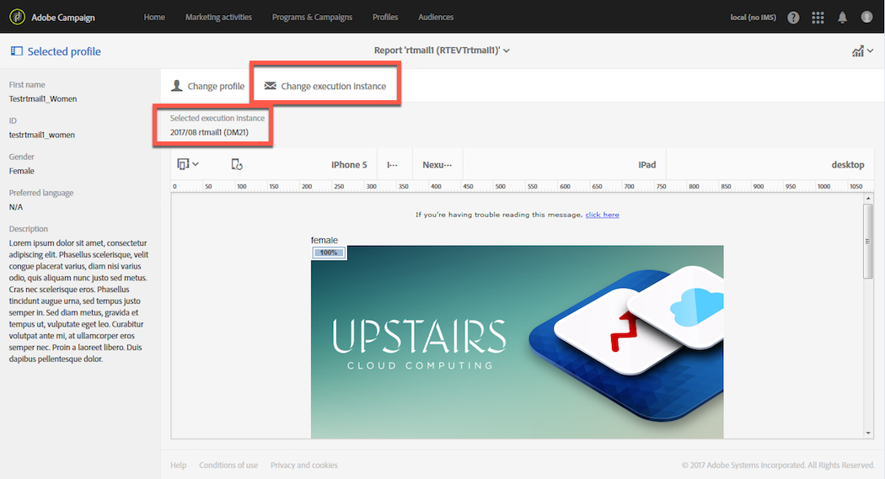

# Hot clicks{#hot-clicks}

Dit rapport kan van de **[!UICONTROL Reports]** knoop in elk levering of transactiebericht worden betreden.

De inhoud van het bericht (HTML en/of tekst) wordt weergegeven met het percentage klikken op elke koppeling.

Als u dynamische inhoud hebt gemaakt voor levering, kunt u de percentages bekijken voor elke voorwaarde die u hebt gedefinieerd. Zie [Dynamische inhoud](../../designing/using/personalization.md#defining-dynamic-content-in-an-email)definiëren voor meer informatie over het invoegen van voorwaardelijke inhoud in een levering.

Stel dat u een levering hebt gemaakt met de volgende voorwaarden:

* Het verband op het belangrijkste beeld is verschillend als de ontvanger een man of een vrouw is.
* Je hebt ook een link toegevoegd naar een speciale aanbieding die alleen zichtbaar is voor ontvangers ouder dan 25 jaar.

Wanneer uw bericht is verzonden, selecteert u **[!UICONTROL Reports]** > in het **[!UICONTROL Hot clicks]** leveringsdashboard.

Standaard is er geen profiel geselecteerd. Alleen klikken voor ontvangers waarvan het geslacht onbekend is en voor ontvangers die jonger zijn dan 25 jaar of waarvan de leeftijd onbekend is, worden weergegeven.

Als u klikt voor vrouwen, klikt u op de **[!UICONTROL Change profile]** knop en selecteert u een vrouwelijk testprofiel. Als u klikken voor mannen wilt weergeven, gaat u op dezelfde manier te werk en selecteert u een mannelijk testprofiel.

Klik op de **[!UICONTROL Change profile]** knop en selecteer een testprofiel waarvan de geboortedatum overeenkomt met deze voorwaarde om de muisklikken voor ontvangers ouder dan 25 jaar weer te geven.

Zie [Testprofielen](../../audiences/using/managing-test-profiles.md)voor meer informatie over testprofielen.

>[!NOTE]
>
>Het aantal klikken op een specifieke verbinding is een percentage van het totale kliks voor alle voorwaardelijke inhoud in een levering. Als u dynamische inhoud hebt gedefinieerd, is het mogelijk dat het totaal van de percentages die voor een specifiek testprofiel worden weergegeven, niet gelijk is aan 100.

Op dezelfde manier kunt u voor terugkerende leveringen en transactieberichten het testprofiel selecteren dat overeenkomt met de dynamische inhoud die u wilt weergeven, maar u kunt ook de klikpercentages weergeven volgens de geselecteerde uitvoeringslevering.

Een uitvoering is een niet-activeerbaar en niet-functioneel technisch bericht dat in de volgende gevallen wordt gecreëerd:

* Telkens wanneer een terugkerende levering wordt uitgevoerd of bijgewerkt.

   Als de workflow die deze levering beheert eenmaal per maand wordt uitgevoerd, is er bijvoorbeeld één levering per maand. Bovendien wordt telkens wanneer de inhoud van de levering wordt bijgewerkt, een extra levering voor de uitvoering gemaakt.

   Zie [E-maillevering](../../automating/using/email-delivery.md)voor meer informatie over terugkerende e-mailleveringen.

* Door gebrek eens per maand voor transactionele berichten, en telkens als een transactiebericht wordt uitgegeven en opnieuw gepubliceerd.

   Voor meer op transactionele berichten, zie [Begonnen het worden met transactioneel overseinen](../../channels/using/getting-started-with-transactional-msg.md).

>[!NOTE]
>
>Omdat de id&#39;s van de bijgehouden URL&#39;s voor elke uitvoering verschillend zijn, kunnen de &#39;hot click&#39;-gegevens niet worden geaggregeerd voor alle uitgevoerde leveringen van een bepaald bericht. Deze kan slechts voor één uitvoeringslevering tegelijk worden weergegeven.

Wanneer uw bericht is verzonden, selecteert u **[!UICONTROL Reports]** > in het **[!UICONTROL Hot clicks]** leveringsdashboard.

Standaard is de laatste levering van de uitvoering geselecteerd. Klik op de **[!UICONTROL Change execution delivery]** knop om een andere knop te selecteren.

Alleen de klikpercentages voor de geselecteerde uitvoering van de levering worden weergegeven.
