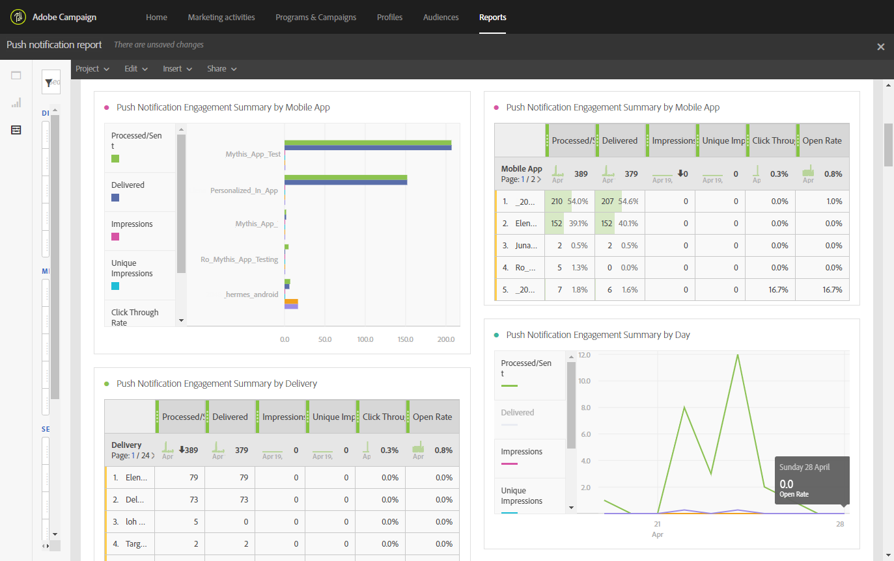
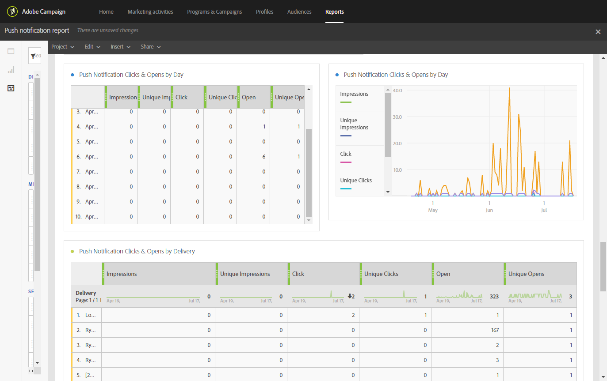

# Pushmeldingsrapport{#push-notification-report}

>[!CAUTION]
>
>Houd er rekening mee dat u de **[!UICONTROL Message type]** metriek naar de tabellen moet slepen om de gegevens te splitsen op basis van de leveringstypen, in dit geval de levering van pushberichten.

Het **Push-meldingsrapport** bevat informatie over de marketingprestaties van pushberichten in Adobe Campaign. Dit out-of-the-box rapport helpt u te begrijpen hoe de gebruikers met dupberichten, mobiele toepassingen en leveranties in wisselwerking staan.

Voor het implementeren van push-tracking is enige configuratie vereist in de mobiele toepassing. Raadpleeg deze [pagina](../../administration/using/push-tracking.md) voor de gedetailleerde stappen.

Elke tabel wordt aangegeven met een overzichtsnummer en een overzicht van de diagrammen. U kunt wijzigen hoe de details worden weergegeven in de respectievelijke visualisatie-instellingen.

De eerste **overzicht** van de Berichtenverbinding van de lijstPush is verdeeld in drie categorieën: per dag, per mobiele app en per levering. Het bevat de beschikbare gegevens voor ontvankelijke reactiviteit aan de levering:

* **[!UICONTROL Processed/sent]**: Het totale aantal verzonden pushberichten.
* **[!UICONTROL Delivered]**: Aantal verzonden pushmeldingen in verhouding tot het totale aantal verzonden pushmeldingen.
* **[!UICONTROL Impressions]**: Het aantal keren dat een pushmelding aan het apparaat is afgeleverd en ongewijzigd is gelaten in het meldingscentrum. In de meeste gevallen zou het aantal indrukkingen gelijk moeten zijn aan het geleverde getal. Dit zorgt ervoor dat het apparaat het bericht kreeg en die informatie terug naar de server terugbracht.
* **[!UICONTROL Unique impressions]**: Aantal indrukken door ontvanger.
* **[!UICONTROL Click through rate]**: Percentage gebruikers die interactie hadden met de pushmelding.
* **[!UICONTROL Open rate]**: Percentage geopende pushmeldingen.

De tweede tabel **Push-melding Klikt en wordt geopend** , is opgedeeld in drie categorieën: per dag, per mobiele app en per levering. Het bevat de beschikbare gegevens voor ontvankelijk gedrag per levering:

* **[!UICONTROL Impressions]**: Totaal aantal pushmeldingen gezien door ontvangers.
* **[!UICONTROL Unique impressions]**: Aantal indrukken door ontvanger.
* **[!UICONTROL Click]**: Het aantal keren dat een pushmelding aan het apparaat is afgeleverd en door de gebruiker is geklikt. De gebruiker wilde het bericht bekijken, dat dan zal worden bewogen om Open het volgen te duwen, of het sluiten.
* **[!UICONTROL Unique clicks]**: Aantal keren dat een unieke gebruiker communiceert met de pushmelding, bijvoorbeeld wanneer hij op de melding of knop klikt.
* **[!UICONTROL Open]**: Het totale aantal pushberichten dat aan het apparaat is geleverd en waarop gebruikers hebben geklikt om de app te openen. Dit is gelijkaardig aan de Duw klikt behalve zal een Duw Open niet teweeggebracht worden als het bericht werd verworpen.
* **[!UICONTROL Unique Opens]**: Aantal ontvangers dat de levering heeft geopend.

