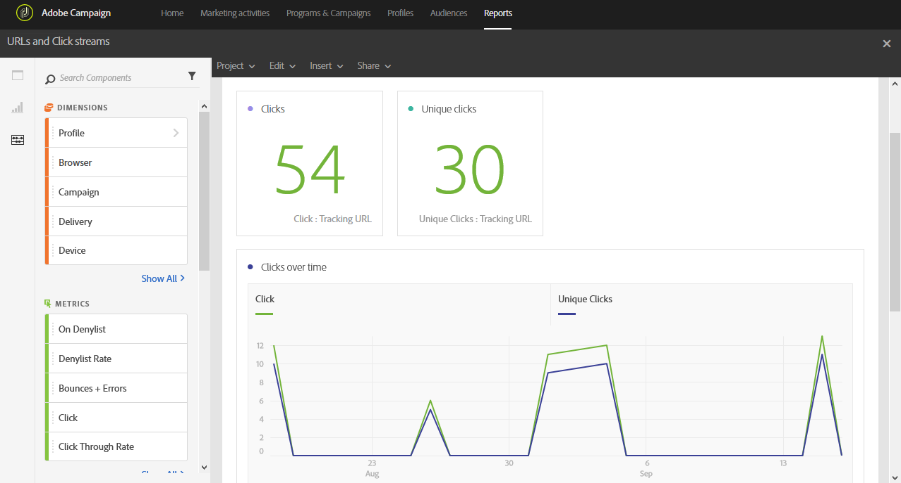

# URL&#39;s en klik op streams{#urls-and-click-streams}

De **URLs en klik stromen** toont URLs die het meest tijdens een levering werden geklikt, of verscheidene leveringen als zij met een campagne of een programma worden verbonden.

Elke tabel wordt aangegeven met een overzichtsnummer en een overzicht van de diagrammen. U kunt wijzigen hoe de details worden weergegeven in de respectievelijke visualisatie-instellingen.

De **Meest bezochte lijst van verbindingen** bevat de beschikbare gegevens voor ontvankelijk gedrag per levering, zoals:

* **Klik**: Het aantal keren dat op inhoud is geklikt in een levering.
* **Unieke klikken**: Het aantal ontvangers dat op inhoud in een levering klikte.

