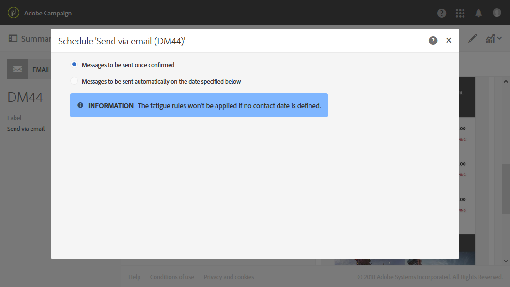

# Informatie over berichten plannen{#about-scheduling-messages}

>[!CAUTION]
>
>Wanneer u wijzigingen aanbrengt in het leveringsschema, moet u de levering opnieuw voorbereiden door op de knop **Voorbereiden** te klikken voordat u op **Bevestigen** klikt.

In het berichtendashboard kunt u met het **[!UICONTROL Schedule]** blok bepalen wanneer berichten (e-mail, SMS of pushberichten) worden verzonden.

Met de **[!UICONTROL Schedule]** eigenschappen kunt u verzendopties instellen voor e-mailberichten, SMS-berichten of pushberichten:

* **[!UICONTROL Messages to be sent once confirmed]**: berichten worden verzonden zodra het verzenden wordt bevestigd. Zie De verzending [bevestigen](../../sending/using/confirming-the-send.md).

   

* **[!UICONTROL Messages to be sent automatically on the date specified below]**: de berichten zullen op een recentere datum en een tijd worden verzonden. Geef de **contactdatum** op in het veld **Beginnen met verzenden vanuit** .

   U kunt het verzenden voorbereiden en bevestigen, maar de berichten zullen slechts worden verzonden beginnend de geselecteerde datum en de tijd. Het voorbereiden van en het bevestigen van verzenden worden voorgesteld in het [Voorbereiden van verzenden](../../sending/using/preparing-the-send.md) en het [Bevestigen van de send](../../sending/using/confirming-the-send.md) secties.

   De **[!UICONTROL Time zone of the contact date]** drop-down lijst staat u toe om de tijdzone te wijzigen die voor de verzendende tijd zal worden in aanmerking genomen. Als u bijvoorbeeld 09:00 AM in het **[!UICONTROL Start sending from]** veld invoert en Brussel, Kopenhagen, Madrid, Parijs (GMT+1) selecteert in de **[!UICONTROL Time zone of the contact date]** vervolgkeuzelijst, ontvangen alle ontvangers het bericht om 9:00 uur Parijs. Daarom zal een ontvanger in Moskou (GMT+3) het bericht om 11:00 uur Moskouse tijd ontvangen.

   Als u het verzenden handmatig wilt bevestigen, schakelt u de **[!UICONTROL Request confirmation before sending messages]** optie in. Deze optie is standaard ingeschakeld.

   

>[!CAUTION]
>
>Bij het dupliceren van een levering worden alle planningsinstellingen verwijderd. Tenzij u een nieuwe contactdatum plant, zal de dubbele levering worden verzonden zodra het verzenden wordt bevestigd.

**Verwante onderwerpen**:

* [De verzendtijd optimaliseren](../../sending/using/optimizing-the-sending-time.md)
* [Het verzenden van berichten bij de tijdzone van de ontvanger](../../sending/using/sending-messages-at-the-recipient-s-time-zone.md)
* [De verzenddatum berekenen](../../sending/using/computing-the-sending-date.md)

