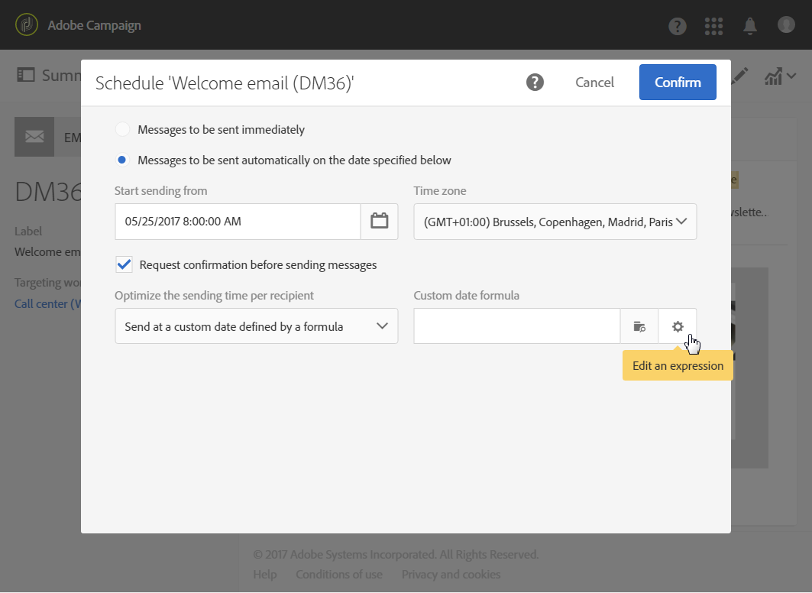

# De verzenddatum berekenen{#computing-the-sending-date}

U kunt een formule bepalen om het bericht naar elke ontvanger op een specifieke datum en een tijd te verzenden.

## Datumformule aanpassen {#customizing-date-formula}

U kunt bijvoorbeeld de functie voor tijdoptimalisatie tijdens het oploopproces gebruiken.

Wanneer e-mails met een nieuw platform worden verzonden, zijn internetproviders (ISP&#39;s) verdacht van IP-adressen die niet worden herkend. Als er plotseling grote hoeveelheden e-mails worden verzonden, markeren de ISP&#39;s deze vaak als spam.

Als u wilt voorkomen dat spam als spam wordt gemarkeerd, kunt u het verzonden volume geleidelijk verhogen door grote hoeveelheden e-mails over verschillende tijdstippen te verspreiden. Dit zou een vlotte ontwikkeling van de startfase moeten verzekeren en u toelaten om het algemene tarief van ongeldige adressen te verminderen.

U kunt bijvoorbeeld uw doelpubliek willekeurig segmenteren om uw levering in vijf batches te verzenden. U zult een eerste partij verzenden die 10% van uw doelpubliek op 1 juni om 10:00 AM vertegenwoordigt, een tweede partij 24 uur later met 15% van het publiek, etc.

U kunt dit plannen met behulp van een workflow.


1. Open de lijst met marketingactiviteiten en maak een nieuwe workflow. See [Creating a workflow](../../automating/using/building-a-workflow.md#creating-a-workflow).
1. Drag and drop a **Query** activity into your workflow and open it. Zie de sectie [Query](../../automating/using/query.md) .
1. Selecteer een publiek, bijvoorbeeld al uw Gold-klanten en klik **[!UICONTROL Confirm]** om de query op te slaan.
1. Drag and drop a **Segmentation** activity into your workflow and open it. Zie de sectie [Segmentatie](../../automating/using/segmentation.md) .
1. Definieer vijf segmenten. Voor elk segment:

   * Vul het **[!UICONTROL Segment code]** veld in: Voer handmatig de gewenste datum en tijd in voor het verzenden van het bericht.

      Bijvoorbeeld, wilt u de eerste partij op 1 Juni om 10:00 AM GMT+1 verzenden. Gebruik de volgende indeling: **YYYY-MM-DD hh:mm:ss+tz**.

      

      Als u de volgende batch de volgende dag wilt verzenden, voert u **2017-06-02 10:00:00+01** in voor het tweede segment.

      Voor de overige segmenten definieert u de volgende batches als volgt:

      * **2017-06-03 10:00:00+01**
      * **2017-06-04 10:00:00+01**
      * **2017-06-05 10:00:00+01**
   * Selecteer de **[!UICONTROL Limit the population of this segment]** optie.

      Selecteer op het **[!UICONTROL Limitation]** tabblad het gewenste percentage voor elk segment **[!UICONTROL Random sampling]** en voer het gewenste percentage in: 10 voor de eerste partij, 15 voor de tweede, enzovoort.

      


1. Wanneer alle segmenten zijn gedefinieerd, selecteert u deze **[!UICONTROL Generate all segments in the same transition]** en klikt u **[!UICONTROL Confirm]**.

   

1. Drag and drop an **Email delivery** activity into your workflow and open it. Zie de sectie [E-maillevering](../../automating/using/email-delivery.md) .
1. Klik op de **[!UICONTROL Schedule]** sectie in het e-maildashboard en selecteer **[!UICONTROL Messages to be sent automatically on the date specified below]**.
1. Definieer een contactdatum in het **[!UICONTROL Start sending from]** veld.
1. Kies in het vervolgkeuzemenu Optimalisatie tijd verzenden de optie **[!UICONTROL Send at a custom date defined by a formula]**.
1. Klik op de **[!UICONTROL Edit an expression]** knop van het **[!UICONTROL Custom date formula]** veld.

   

1. Maak de volgende expressie met de **[!UICONTROL ToDateTime]** functie en het **[!UICONTROL Segment code]** veld. U kunt ook rechtstreeks in de expressie typen, maar zorg dat u de juiste syntaxis en spelling gebruikt.

   ```
   ToDateTime([targetData/@segmentCode])
   ```

   De **[!UICONTROL ToDateTime]** functie transformeert de segmentcode van een tekstreeks naar een datum- en tijdwaarde.

   Bevestig de expressie om terug te keren naar het vorige scherm.

   

   In het **[!UICONTROL Schedule]** venster wordt de aangepaste datumformule als volgt weergegeven:

   ```
   ToDateTime([targetData/@segmentCode])
   ```

   

1. Bevestig het schema, sla uw levering op en voer de workflow uit.

De levering wordt gedurende vijf dagen geleidelijk aan alle beoogde ontvangers verzonden.

>[!NOTE]
>
>Zorg ervoor dat alle datums in de toekomst zijn wanneer u de verzending bevestigt. Anders wordt het bericht verzonden zodra het verzenden is bevestigd.

## Expressies gebruiken {#using-an-expression}

Verstuur tijdoptimalisering is ook nuttig voor campagnes die een vraagcentrum impliceren. U kunt ervoor zorgen dat niet alle berichten tezelfdertijd worden ontvangen. Dit laat uw organisatie toe om het aantal vraag volgens zijn capaciteit te verwerken.

U wilt bijvoorbeeld een e-mail verzenden waarin u uw klanten uitnodigt contact op te nemen met een callcenter om een promotieaanbieding te ontvangen. Om te vermijden overweldigend het vraagcentrum, besluit u om uw doelpubliek willekeurig te segmenteren om uw e-mail in vier partijen te verzenden.

U kunt dit plannen met behulp van een workflow.


1. Open de lijst met marketingactiviteiten en maak een nieuwe workflow. See [Creating a workflow](../../automating/using/building-a-workflow.md#creating-a-workflow).
1. Drag and drop a **Query** activity into your workflow and open it. Zie de sectie [Query](../../automating/using/query.md) .
1. Selecteer een publiek, bijvoorbeeld meer dan 35 profielen, en klik om de query **[!UICONTROL Confirm]** op te slaan.
1. Drag and drop a **Segmentation** activity into your workflow and open it. Zie de sectie [Segmentatie](../../automating/using/segmentation.md) .
1. Definieer vier segmenten. Voor elk segment:

   * Definieer de segmentcodes als volgt:

      * 08:00 - 10:00 **0**. Het bericht zal naar het eerste kwartaal van de doelpopulatie om 8:00 (contactdatum) worden verzonden.
      * 10:00 - 12:00 PM: **2**. Het bericht wordt om 10:00 uur naar het tweede kwartaal van de doelpopulatie gestuurd (contactdatum + 2 uur).
      * 14:00 - 16:00 **6**. Het vraagcentrum dat tussen 12:00 PM en 2:00 PM wordt gesloten, zal het bericht naar het derde kwartaal van de doelpopulatie worden verzonden om 2:00 PM (contactdatum + 6 uren).
      * 16:00 - 18:00 PM: **8**. Het bericht wordt verzonden naar het laatste kwartaal van de doelpopulatie om 16.00 uur (contactdatum + 8 uur).

      >[!NOTE]
      >
      >De contactdatum wordt later in de workflow gedefinieerd in de e-mailleveringsactiviteit.

   * Selecteer de **[!UICONTROL Limit the population of this segment]** optie.
   * Selecteer op het **[!UICONTROL Limitation]** tabblad het gewenste percentage voor elk segment **[!UICONTROL Random sampling]** en voer het gewenste percentage in: **25**.


1. Wanneer alle segmenten zijn gedefinieerd, selecteert u deze **[!UICONTROL Generate all segments in the same transition]** en klikt u **[!UICONTROL Confirm]**.

   

1. Drag and drop an **Email delivery** activity into your workflow and open it. Zie de sectie [E-maillevering](../../automating/using/email-delivery.md) .
1. Klik op de **[!UICONTROL Schedule]** sectie in het e-maildashboard.
1. Selecteer **[!UICONTROL Messages to be sent automatically on the date specified below]**.
1. Definieer een contactdatum in het **[!UICONTROL Start sending from]** veld.

   In dit voorbeeld selecteert u 25 mei om 8:00 uur.

1. Kies in het vervolgkeuzemenu voor tijdoptimalisatie verzenden de optie **[!UICONTROL Send at a custom date defined by a formula]** en klik op de **[!UICONTROL Edit an expression]** knop.

   

1. Stel in de **[!UICONTROL Expression editor]** code de datum en de segmentcodes in om de gegevens voor elke klant te berekenen.

   Selecteer in de lijst met functies de optie **[!UICONTROL AddHours]**.

   

   Selecteer in de beschikbare velden **[!UICONTROL Current delivery]** > **[!UICONTROL Delivery scheduling]** > **[!UICONTROL Contact date]**.

   

   Hierdoor kunt u de datum en tijd ophalen die in het **[!UICONTROL Start sending from]** veld zijn opgegeven.

   Selecteer in de lijst met functies de optie **[!UICONTROL ToInteger]**. Selecteer in de beschikbare velden **[!UICONTROL Additional data]** > **[!UICONTROL Segment code]**.

   

   Dit laat u toe om de aantallen terug te winnen die u in de segmentcodes specificeerde.

   U zou de volgende formule moeten krijgen:

   ```
   AddHours([currentDelivery/scheduling/@contactDate], ToInteger([targetData/@segmentCode]))
   ```

1. Bevestig dat u uw expressie wilt opslaan. Bevestig het schema, sla uw levering op en voer de workflow uit.

* Het eerste segment zal het bericht op de contactdatum (25 mei om 8:00 AM) ontvangen.
* Het tweede segment ontvangt het bericht twee uur later (25 mei om 10:00 uur).
* Het derde segment ontvangt het bericht zes uur later (25 mei om 23:00 uur).
* Het vierde segment ontvangt het bericht acht uur later (25 mei om 16.00 uur).

