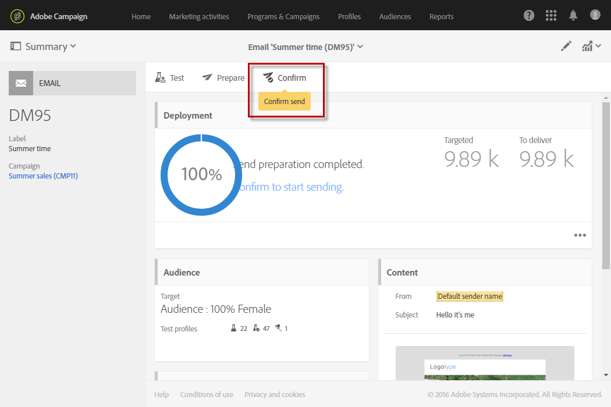

# De verzending bevestigen{#confirming-the-send}

Nadat u de berichten hebt voorbereid en de goedkeuringsstappen zijn uitgevoerd, kunt u de berichten verzenden. Raadpleeg [De verzending voorbereiden](../../sending/using/preparing-the-send.md) voor meer informatie over het voorbereiden van berichten.

Alleen gebruikers met de rol **[!UICONTROL Start deliveries]** kunnen verzending bevestigen. Raadpleeg de sectie [Lijst met rollen](../../administration/using/list-of-roles.md) voor meer informatie.

Gebruikers zonder deze rol krijgen het volgende bericht te zien:

Klik op de knop **[!UICONTROL Confirm send]** op de actiebalk van het bericht om de levering te verzenden.

U wordt gevraagd de verzending definitief af te ronden door op de knop **[!UICONTROL OK]** te klikken.

Het bericht wordt verzonden.

>[!NOTE]
>
>Als het bericht gepland is, wordt het verzonden wanneer de verzendtijd is bereikt. Raadpleeg [deze sectie](../../sending/using/about-scheduling-messages.md) voor meer informatie over het plannen van berichten.

Als u een terugkerende levering zonder aggregatieperiode gebruikt, kunt u om bevestiging vragen voordat de levering wordt verzonden. Open hiertoe het blok **[!UICONTROL Schedule]** van het leveringsdashboard en activeer de relevante optie.

Het blok **[!UICONTROL Deployment]** toont de voortgang van de verzending.

Zodra het bericht is verzonden naar de contacten, toont het vak **[!UICONTROL Deployment]** uw KPI-data (Key Performance Indicator), waaronder:

* Het aantal te leveren berichten
* Het aantal verzonden berichten
* Het percentage geleverde berichten
* Het percentage niet-bezorgbare berichten en fouten
* Het percentage geopende berichten
* Het percentage klikken in de berichten (voor e-mails)

   >[!NOTE]
   >
   >De waarden van **[!UICONTROL Open rate]** en **[!UICONTROL Click-through rate]** worden elk uur bijgewerkt.

Als het te lang duurt om de KPI’s bij te werken of als de resultaten van de verzendlogboeken er niet in worden meegeteld, klikt u op de knop **[!UICONTROL Compute stats]** in het venster **[!UICONTROL Deployment]**.

Het bericht kan worden bekeken in de geschiedenis van één van de klantprofielen die deel uitmaken van de doelgroep. Zie [Geïntegreerd klantprofiel](../../audiences/using/integrated-customer-profile.md).

Zodra een bericht is verzonden, kunt u het gedrag van de ontvangers volgen en het bericht controleren om het effect ervan te meten. Raadpleeg deze secties voor meer informatie hierover:

* [Berichten traceren](../../sending/using/tracking-messages.md)
* [Een levering controleren](../../sending/using/monitoring-a-delivery.md)

