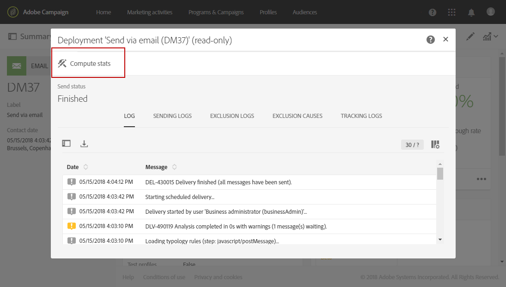

# De verzending bevestigen{#confirming-the-send}

Nadat u de berichten hebt voorbereid en de goedkeuringsstappen zijn uitgevoerd, kunt u de berichten verzenden. Raadpleeg [De verzending voorbereiden](../../sending/using/preparing-the-send.md) voor meer informatie over het voorbereiden van berichten.

Alleen gebruikers met de rol **[!UICONTROL Start deliveries]** kunnen het verzenden bevestigen. Raadpleeg de sectie [Lijst met rollen](../../administration/using/list-of-roles.md) voor meer informatie.

<!--Users without this role will see the following message: 

-->

## Het bericht {#sending-message} verzenden

Wanneer de voorbereiding is voltooid, volgt u de onderstaande stappen om uw bericht te verzenden.

1. Klik op de knop **[!UICONTROL Confirm send]** in de actiebalk van het bericht.

   

1. Voltooi het verzenden door de **[!UICONTROL OK]** knoop te klikken.

   

1. Wacht terwijl het bericht wordt verzonden. Het blok **[!UICONTROL Deployment]** toont de voortgang van de verzending.

>[!NOTE]
>
>Als het bericht gepland is, wordt het verzonden wanneer het verzenden van tijd wordt bereikt. Raadpleeg [deze sectie](../../sending/using/about-scheduling-messages.md) voor meer informatie over het plannen van berichten.

Als u een terugkerende levering zonder aggregatieperiode gebruikt, kunt u om bevestiging vragen voordat de levering wordt verzonden. Wanneer het vormen van uw bericht, open **[!UICONTROL Schedule]** blok van het leveringsdashboard en activeer de specifieke optie.

## Berichtindicatoren {#message-indicators}

Zodra het bericht is verzonden naar de contacten, toont het vak **[!UICONTROL Deployment]** uw KPI-data (Key Performance Indicator), waaronder:

* Het aantal te leveren berichten
* Het aantal verzonden berichten
* Het percentage geleverde berichten
* Het percentage niet-bezorgbare berichten en fouten
* Het percentage geopende berichten
* Het percentage klikken in de berichten (voor e-mails)

   >[!NOTE]
   >
   >De waarden van **[!UICONTROL Open rate]** en **[!UICONTROL Click-through rate]** worden elk uur bijgewerkt.

Als KPIs te lang duurt om bij te werken of niet op de resultaten van het verzenden logboeken wijst, klik **[!UICONTROL Compute stats]** knoop in **[!UICONTROL Deployment]** venster.

Het bericht kan worden weergegeven in de geschiedenis van een van de doelprofielen. Zie [Geïntegreerd klantprofiel](../../audiences/using/integrated-customer-profile.md).

Zodra een bericht wordt verzonden, kunt u het gedrag van zijn ontvangers volgen, en het controleren om zijn effect te meten. Raadpleeg deze secties voor meer informatie hierover:

* [Berichten traceren](../../sending/using/tracking-messages.md)
* [Een levering controleren](../../sending/using/monitoring-a-delivery.md)

### Rapportage over succes bij levering {#delivered-status-report}

>[!NOTE]
>
>Deze sectie is alleen van toepassing op e-mailkanalen.

In de **[!UICONTROL Summary]** mening van elke e-mail, begint **[!UICONTROL Delivered]** percentage bij 100% en gaat dan progressief door de levering [geldigheidsperiode](../../administration/using/configuring-email-channel.md#validity-period-parameters), aangezien de zachte en harde grenzen worden gemeld<!--from the Enhanced MTA to Campaign-->.

Inderdaad, tonen alle berichten als **[!UICONTROL Sent]** in [verzendend logboeken](../../sending/using/monitoring-a-delivery.md#sending-logs) zodra zij met succes van Campagne aan Verbeterde MTA (de Agent van de Overdracht van het Bericht) worden afgelost. Zij blijven in die status tenzij of tot een [bounce](../../sending/using/understanding-delivery-failures.md#delivery-failure-types-and-reasons) voor dat bericht wordt meegedeeld terug van Verbeterde MTA aan Campagne.

Wanneer hard-bouncing berichten van Verbeterde MTA worden gemeld, verandert hun status van **[!UICONTROL Sent]** in **[!UICONTROL Failed]** en **[!UICONTROL Delivered]** percentage dienovereenkomstig wordt verminderd.

Wanneer de soft-bouncing berichten terug van Verbeterde MTA worden gemeld, tonen zij nog als **[!UICONTROL Sent]** en **[!UICONTROL Delivered]** percentage wordt nog niet bijgewerkt. Zachte berichten worden dan [opnieuw geprobeerd](../../sending/using/understanding-delivery-failures.md#retries-after-a-delivery-temporary-failure) door de periode van de leveringsgeldigheid:

* Als een nieuwe poging voor het eind van de geldigheidsperiode succesvol is, blijft de berichtstatus zoals **[!UICONTROL Sent]** en **[!UICONTROL Delivered]** percentage blijft onveranderd.

* Anders verandert de status in **[!UICONTROL Failed]** en wordt het **[!UICONTROL Delivered]** percentage dienovereenkomstig verlaagd.

Daarom moet u tot het eind van de geldigheidsperiode wachten om het definitieve **[!UICONTROL Delivered]** percentage, en het definitieve aantal **[!UICONTROL Sent]** en **[!UICONTROL Failed]** berichten te zien.

### E-mailfeedbackservice (bèta) {#email-feedback-service}

Met de e-mailfeedbackservice (EFS) wordt de status van elke e-mail correct gerapporteerd, omdat feedback rechtstreeks wordt vastgelegd via de Enhanced MTA (Message Transfer Agent).

>[!IMPORTANT]
>
>De e-mailfeedbackservice is momenteel beschikbaar als bètafunctie.

Zodra de levering is begonnen, is er geen verandering in **[!UICONTROL Delivered]** percentage wanneer het bericht met succes van Campagne aan Verbeterde MTA wordt afgelost.

De leveringslogboeken tonen de status **[!UICONTROL Pending]** voor elk gericht adres.

Wanneer de berichtlevering aan de gerichte profielen in echt - tijd van Verbeterde MTA wordt gemeld, tonen de leveringslogboeken de status **[!UICONTROL Sent]** voor elk adres dat met succes het bericht ontving. Het percentage **[!UICONTROL Delivered]** wordt dienovereenkomstig verhoogd bij elke succesvolle levering.

Wanneer hard-bouncing berichten van Verbeterde MTA worden gemeld, verandert hun logboekstatus van **[!UICONTROL Pending]** in **[!UICONTROL Failed]** en **[!UICONTROL Bounces + errors]** percentage dienovereenkomstig wordt verhoogd.

Wanneer de zachte-stuiterende berichten van Verbeterde MTA worden gemeld, verandert hun logboekstatus ook van **[!UICONTROL Pending]** in **[!UICONTROL Failed]** en **[!UICONTROL Bounces + errors]** percentage dienovereenkomstig wordt verhoogd. Het percentage **[!UICONTROL Delivered]** blijft ongewijzigd. Zachte berichten worden dan opnieuw geprobeerd door de levering [geldigheidsperiode](../../administration/using/configuring-email-channel.md#validity-period-parameters):

* Als een nieuwe poging vóór het eind van de geldigheidsperiode succesvol is, verandert de berichtstatus in **[!UICONTROL Sent]** en **[!UICONTROL Delivered]** percentage wordt dienovereenkomstig verhoogd.

* Anders, blijft de status zoals **[!UICONTROL Failed]**. De percentages **[!UICONTROL Delivered]** en **[!UICONTROL Bounces + errors]** blijven ongewijzigd.

>[!NOTE]
>
>Zie [deze sectie](../../sending/using/understanding-delivery-failures.md#delivery-failure-types-and-reasons) voor meer informatie over harde en zachte grenzen.
>
>Zie [deze sectie](../../sending/using/understanding-delivery-failures.md#retries-after-a-delivery-temporary-failure) voor meer informatie over pogingen na een tijdelijke leveringsfout.

<!--Soft-bouncing messages increment an error counter. When the error counter reaches the limit threshold or when the validity period is over, the address goes into quarantine and the status remains as **[!UICONTROL Failed]**. For more on conditions for sending an address to quarantine, see [this section](../../help/sending/using/understanding-quarantine-management.md#conditions-for-sending-an-address-to-quarantine).-->

### Door EFS ingevoerde wijzigingen {#changes-introduced-by-efs}

De lijsten hieronder tonen de veranderingen in KPIs en het verzenden van logboekstatussen die door het vermogen EFS worden geïntroduceerd.

**Met e-mailfeedbackservice**

| Stap in het verzendende proces | KPI-overzicht | Status van logboeken verzenden |
|--- |--- |--- |
| Het bericht wordt met succes afgelost van Campagne aan Verbeterde MTA | <ul><li>**[!UICONTROL Delivered]** percentage begint bij 0%</li><li>**[!UICONTROL Bounces + errors]** percentage begint bij 0%</li></ul> | In behandeling |
| Fel-stuiterende berichten worden gemeld terug van Verbeterde MTA | <ul><li>Geen wijziging in **[!UICONTROL Delivered]** percentage</li><li>**[!UICONTROL Bounces + errors]** percentage dienovereenkomstig verhoogd</li></ul> | Mislukt |
| De zachte die berichten bewegen worden gemeld terug van Verbeterde MTA | <ul><li>Geen wijziging in **[!UICONTROL Delivered]** percentage</li><li>**[!UICONTROL Bounces + errors]** percentage dienovereenkomstig verhoogd</li></ul> | Mislukt |
| Opnieuw proberen van zachte berichten is geslaagd | <ul><li>**[!UICONTROL Delivered]** percentage dienovereenkomstig verhoogd</li><li>**[!UICONTROL Bounces + errors]** percentage wordt dienovereenkomstig verlaagd</li></ul> | Verzonden |
| Opnieuw proberen van zachte berichten mislukt | <ul><li> Geen wijziging in **[!UICONTROL Delivered]** percentage </li><li> Geen wijziging in **[!UICONTROL Bounces + errors]** percentage </li></ul> | Mislukt |

**Zonder e-mailfeedbackservice**

| Stap in het verzendende proces | KPI-overzicht | Status van logboeken verzenden |
|--- |--- |--- |
| Het bericht wordt met succes afgelost van Campagne aan Verbeterde MTA | <ul><li>**[!UICONTROL Delivered]** percentage begint bij 100%</li><li>**[!UICONTROL Bounces + errors]** percentage begint bij 0%</li></ul> | Verzonden |
| Fel-stuiterende berichten worden gemeld terug van Verbeterde MTA | <ul><li>**[!UICONTROL Delivered]** percentage wordt dienovereenkomstig verlaagd</li><li>**[!UICONTROL Bounces + errors]** percentage dienovereenkomstig verhoogd</li></ul> | Mislukt |
| De zachte die berichten bewegen worden gemeld terug van Verbeterde MTA | <ul><li>Geen wijziging in **[!UICONTROL Delivered]** percentage</li><li>Geen wijziging in **[!UICONTROL Bounces + errors]** percentage</li></ul> | Verzonden |
| Opnieuw proberen van zachte berichten is geslaagd | <ul><li>Geen wijziging in **[!UICONTROL Delivered]** percentage</li><li>Geen wijziging in **[!UICONTROL Bounces + errors]** percentage</li></ul> | Verzonden |
| Opnieuw proberen van zachte berichten mislukt | <ul><li>**[!UICONTROL Delivered]** percentage wordt dienovereenkomstig verlaagd</li><li>**[!UICONTROL Bounces + errors]** percentage dienovereenkomstig verhoogd</li></ul> | Mislukt |
