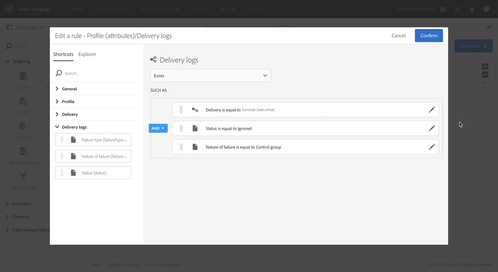

# Een controlegroep toevoegen {#adding-control-group}

U kunt controlegroepen gebruiken om het verzenden van berichten naar een gedeelte van uw doelgroep te vermijden, zodat u het effect van uw campagnes kunt meten.

Als u dit in Adobe Campaign wilt doen, maakt u een <b>controlegroep</b> tijdens het definiëren van de target van uw levering. Profielen worden willekeurig aan de controlegroep toegevoegd, gefilterd of niet, of gebaseerd op criteria.

Vervolgens kunt u de gedragingen van de doelgroep die het bericht heeft ontvangen, vergelijken met de gedragingen van contactpersonen die niet zijn getarget. Op basis van de verzendlogboeken kunt u in toekomstige campagnes ook een controlegroep targeten.

<!--The control group is built when the delivery is prepared.-->

## Overzicht {#overview}

De controlegroep kan willekeurig uit de hoofdtarget worden geëxtraheerd, en/of uit een specifieke populatie worden geselecteerd. Dit betekent dat u een controlegroep op twee manieren kunt definiëren:
* Een aantal profielen **extraheren** uit de hoofdtarget.
* Bepaalde profielen **uitsluiten** op basis van criteria die in een query zijn gedefinieerd.

Voor het definiëren van een controlegroep kunt u beide methoden gebruiken.

Alle profielen die deel uitmaken van de controlegroep bij de voorbereidingsstap voor levering worden uit de hoofdtarget verwijderd. Ze zullen het bericht niet meer ontvangen als het eenmaal is verzonden.

## Extraheren uit de targetpopulatie{#extraction-target-population}

Als u een controlegroep wilt definiëren, kunt u kiezen of u op willekeurige wijze of op basis van een sortering een percentage of een vast aantal profielen uit de targetpopulatie wilt extraheren.

### Targetextractie {#target-extraction}

Definieer eerst hoe de profielen uit de target worden geëxtraheerd: **willekeurig** of op basis van een **sortering**.

Selecteer onder de sectie **[!UICONTROL Target extraction]** een van de volgende opties:

* **[!UICONTROL Random sampling]**: bij het voorbereiden van de levering extraheert Adobe Campaign willekeurig een aantal profielen dat overeenkomt met het percentage of het maximumaantal dat u als [groottelimiet](#size-limit) gaat instellen.

   Als u in de sectie **[!UICONTROL Limits]** de drempelwaarde bijvoorbeeld instelt op 10, bestaat de controlegroep uit 10% die willekeurig wordt geselecteerd uit de targetpopulatie.<!--Change screenshot to match example)-->

   

* **[!UICONTROL Keep only the first records after sorting]**: met deze optie kunt u een limiet definiëren op basis van een of meer sorteervolgorden.

   Bijvoorbeeld:

   * Selecteer het veld **[!UICONTROL Age]** als sorteercriterium.
   * Definieer 100 als de drempel in de sectie **[!UICONTROL Limits]** (zie [Groottelimiet](#size-limit)).
   * Laat de optie **[!UICONTROL Descending sort]** ingeschakeld.

   Als gevolg hiervan zal de controlegroep bestaan uit de 100 oudste ontvangers.<!--Change screenshot to match example)-->

   

   Het kan interessant zijn om een controlegroep te definiëren met profielen die weinig of juist veel aankopen doen, en hun gedragingen met dat van de gecontacteerde ontvangers te vergelijken.

>[!NOTE]
>
>Selecteer **[!UICONTROL No extraction]** als u de optie **[!UICONTROL Target extraction]** niet wilt gebruiken.

<!---->

### Groottelimiet {#size-limit}

Of u nu **[!UICONTROL Random sampling]** of **[!UICONTROL Keep only the first records after sorting]** selecteert, u moet instellen hoe u het aantal profielen gaat beperken dat u uit de hoofdtarget extraheert. Voer een van de volgende handelingen uit:

* Selecteer **[!UICONTROL Size (as a % of the initial population)]** en vul het bijbehorende frame in.

   Als u bijvoorbeeld 10 instelt, zal Adobe Campaign afhankelijk van de hierboven geselecteerde optie het volgende doen:
   * Willekeurig 10% van de targetpopulatie extraheren.
   * Als u het veld **[!UICONTROL Age]** als sorteercriterium hebt geselecteerd, worden de 10% oudste profielen uit de targetpopulatie geëxtraheerd.

   >[!NOTE]
   >
   >Als u de optie **[!UICONTROL Descending sort]** uitschakelt, worden de 10% jongste profielen geëxtraheerd.

* Selecteer **[!UICONTROL Maximum size]** en vul het bijbehorende frame in.

   Als u bijvoorbeeld 100 instelt, zal Adobe Campaign het volgende doen:
   * Willekeurig 100 profielen uit de targetpopulatie extraheren.
   * Als u het veld **[!UICONTROL Age]** als sorteercriterium hebt geselecteerd, worden de 100 oudste profielen uit de targetpopulatie geëxtraheerd.

   >[!NOTE]
   >
   >Als u de optie **[!UICONTROL Descending sort]** uitschakelt, worden de 100 jongste profielen geëxtraheerd.

## Een bepaalde populatie uitsluiten {#excluding-specific-population}

U kunt een controlegroep ook definiëren door een specifieke populatie van de target uit te sluiten door middel van een query.

Dit doet u als volgt:

1. Klik in de sectie **[!UICONTROL Target exclusion]** op **[!UICONTROL Define target exclusion]**.

   

1. Definieer de uitsluitingscriteria met de [query-editor](../../automating/using/editing-queries.md). U kunt ook een eerder gemaakte [doelgroep](../../audiences/using/about-audiences.md) selecteren.

   

1. Klik op **[!UICONTROL Confirm]**.

De profielen die overeenkomen met het resultaat van de query, worden van de target uitgesloten.

<!--For more on using the query editor, see the [Editing queries](../../automating/using/editing-queries.md) section.-->

## Gebruiksscenario: een controlegroep instellen {#control-group-example}

Hieronder ziet u een voorbeeld van het definiëren van een controlegroep via beide methoden: profielen extraheren uit de hoofdtarget en een query gebruiken om een bepaalde populatie uit te sluiten.

1. Maak een workflow. De gedetailleerde stappen voor het maken van een workflow worden uitgelegd in de sectie [Een workflow maken](../../automating/using/building-a-workflow.md).
1. Sleep in **[!UICONTROL Activities]** > **[!UICONTROL Targeting]** een [Query](../../automating/using/query.md)-activiteit en zet deze neer. Dubbelklik op de activiteit en definieer de target. <!--For example, in **[!UICONTROL Shortcuts]**, drag and drop **[!UICONTROL Profile]**, select **[!UICONTROL Age]** with the operator **[!UICONTROL Greater than]** and type 25 in the **[!UICONTROL Value]** field.-->

1. Sleep in **[!UICONTROL Activities]** > **[!UICONTROL Channels]** een [E-maillevering](../../automating/using/email-delivery.md)-activiteit, zet deze neer na het hoofdtargetsegment en bewerk de activiteit.
1. Klik op het **[!UICONTROL Audience]**-blok in het leveringdashboard.

1. Selecteer het tabblad **[!UICONTROL Control group]**. 

   

1. Selecteer in de sectie **[!UICONTROL Target extraction]** de optie **[!UICONTROL Keep only the first records after sorting]**.
1. Sorteer op leeftijd en laat de sorteeroptie **[!UICONTROL Descending]** ingeschakeld.

   

1. Stel 100 in als de maximale grootte. De 100 oudste profielen in de target worden geëxtraheerd.

1. Definieer in de sectie **[!UICONTROL Target exclusion]** de profielen die van de target moeten worden uitgesloten op basis van de gewenste criteria die u instelt met de [query-editor](../../automating/using/editing-queries.md). Bijvoorbeeld: ‘Leeftijd is minder dan 20’.

   

   Profielen die jonger zijn dan 20 jaar, worden uitgesloten.

1. Start de [leveringsvoorbereiding](../../sending/using/preparing-the-send.md) en [bevestig de verzending](../../sending/using/confirming-the-send.md).

De profielen die zijn geëxtraheerd (de 100 oudste profielen) en de profielen die zijn gedefinieerd op basis van de query (profielen onder 20) worden uit de hoofdtarget verwijderd. Ze zullen het bericht niet ontvangen.

## De resultaten vergelijken {#delivery-logs}

Wat kunt u met de controlegroep doen nu uw levering hebt verzonden?

U kunt de **verzendingslogboeken** extraheren om de gedragingen van de controlegroep die het bericht niet heeft gekregen te vergelijken met de effectieve target. U kunt ook de leveringslogboeken gebruiken om een **andere targeting** te maken.

>[!IMPORTANT]
>
>U hebt de [beheerdersrol](../../administration/using/users-management.md#functional-administrators) nodig en moet deel uitmaken van de **[!UICONTROL All]** [organisatie-eenheid](../../administration/using/organizational-units.md) om verbinding te kunnen maken met Adobe Campaign. Als u de toegang voor een bepaalde gebruiker of groep gebruikers wilt beperken, koppel deze dan niet aan **[!UICONTROL All]**-eenheden voor toegang tot leveringslogboeken.

### De leveringslogboeken controleren {#checking-logs}

Als u wilt zien welke profielen uit de target zijn verwijderd nadat het bericht is verzonden, controleert u de **[!UICONTROL Delivery logs]**. Raadpleeg [deze sectie](../../sending/using/monitoring-a-delivery.md#delivery-logs) voor meer informatie over de leveringslogboeken en de toegang tot deze logboeken.

* Op het tabblad **[!UICONTROL Sending logs]** ziet u de geëxtraheerde en uitgesloten profielen. Deze hebben de status **[!UICONTROL Ignored]** en **[!UICONTROL Control group]** als de oorzaak van de mislukking.

   

* U kunt ook het tabblad **[!UICONTROL Exclusion causes]** bekijken om te zien hoeveel profielen niet zijn opgenomen in de levering.

   

### De logboeken van de controlegroep gebruiken {#using-logs}

Als de levering is verzonden, kunt u de leveringslogboeken gebruiken om te filteren op de profielen die het bericht niet hebben ontvangen. Volg de onderstaande stappen:

1. Maak een workflow. De gedetailleerde stappen voor het maken van een workflow worden uitgelegd in de sectie [Een workflow maken](../../automating/using/building-a-workflow.md).
1. Sleep in **[!UICONTROL Activities]** > **[!UICONTROL Targeting]** een [Query](../../automating/using/query.md)-activiteit en zet deze neer.
1. Stel op het tabblad **[!UICONTROL Properties]** in **[!UICONTROL Delivery logs]** als **[!UICONTROL Resource]** en **[!UICONTROL Profile]** als **[!UICONTROL Targeting dimension]**.

   

1. Klik op het tabblad **[!UICONTROL Target]** op **[!UICONTROL Delivery logs]**.
1. Sleep **[!UICONTROL Status]** en zet deze neer, en selecteer **[!UICONTROL Ignored]** als filtervoorwaarde.

   

1. Klik op **[!UICONTROL Confirm]**.

1. Sleep op het tabblad **[!UICONTROL Target]** de **[!UICONTROL Nature of failure]** en zet deze neer. Selecteer vervolgens **[!UICONTROL Control group]** als filtervoorwaarde.

   

1. Klik op **[!UICONTROL Confirm]**.

   

U kunt vervolgens bijvoorbeeld de logboekdata exporteren met een **Bestand extraheren**-activiteit gevolgd door een **Bestand overdragen**-activiteit. Hierdoor kunt u in uw eigen rapportagetool de resultaten van uw campagne bij de effectieve target analyseren in vergelijking met de controlegroep. Zie [deze sectie](../../automating/using/exporting-logs.md) voor meer informatie over het exporteren van logboeken.

### De controlegroep targeten {#targeting-control-group}

Als u een targeting wilt uitvoeren op basis van de profielen die het bericht niet hebben ontvangen, kunt u ook de leveringslogboeken gebruiken. Volg de onderstaande stappen:

1. Maak een workflow. De gedetailleerde stappen voor het maken van een workflow worden uitgelegd in de sectie [Een workflow maken](../../automating/using/building-a-workflow.md).
1. Sleep in **[!UICONTROL Activities]** > **[!UICONTROL Targeting]** een eerste [Query](../../automating/using/query.md)-activiteit en zet deze neer.
1. Controleer op het tabblad **[!UICONTROL Properties]** of de **[!UICONTROL Profile]**-bron is geselecteerd als de **[!UICONTROL Resource]** en **[!UICONTROL Targeting dimension]**.

   

1. Vouw op het tabblad **[!UICONTROL Target]** de **[!UICONTROL Delivery]** uit, sleep de **[!UICONTROL Delivery logs]** en zet deze neer.

   

1. Sleep in het venster **[!UICONTROL Add a rule]** de **[!UICONTROL Delivery]** en zet deze neer.

   

1. Selecteer de e-mail die u hebt verzonden als filtervoorwaarde. Klik op **[!UICONTROL Confirm]**.

   

1. Als u weer in het venster **[!UICONTROL Add a rule]** bent, sleept u de **[!UICONTROL Status]** en zet u deze neer. Selecteer vervolgens **[!UICONTROL Ignored]** als filtervoorwaarde. Klik op **[!UICONTROL Confirm]**.

   

1. Sleep **[!UICONTROL Nature of failure]** en zet deze neer, en selecteer **[!UICONTROL Control group]** als filtervoorwaarde. Klik op **[!UICONTROL Confirm]**.

   

1. Zorg ervoor dat alle voorwaarden zijn afgestemd op de booleaanse operator **AND**.

   

1. Klik op **[!UICONTROL Confirm]**.

U kunt nu de profielen targeten die uw eerste bericht niet hebben ontvangen omdat ze deel uitmaakten van de controlegroep, en hun een nieuwe e-mail sturen.

In dezelfde workflow kunt u ook een andere query maken om de profielen te targeten die de e-mail wel hebben ontvangen, en hun een ander bericht sturen.

