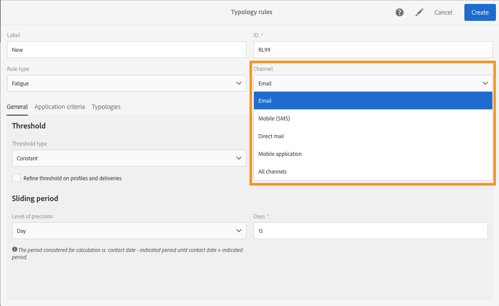
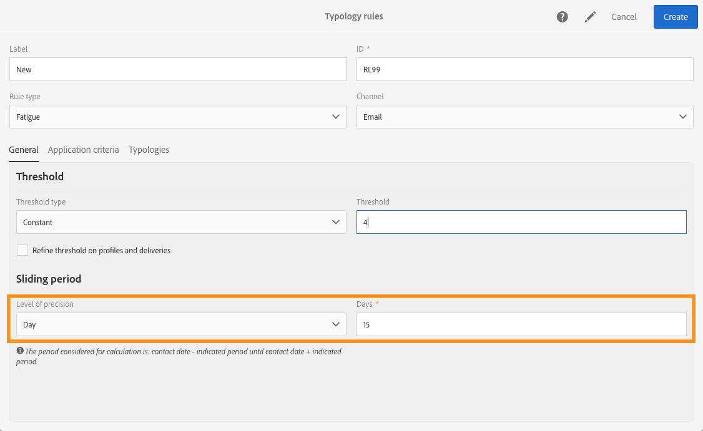

# Moeheidsregels{#fatigue-rules}

## Moeheidsregels{#about-fatigue-rules}

Met moeheidsregels kunnen marketeers algemene kanaaloverschrijdende bedrijfsregels instellen die automatisch overvraagde profielen uitsluiten van campagnes.

Als u moeheidsregels wilt toepassen, definieert u een maximumaantal berichten per profiel en selecteert u een periode waarop de regel van toepassing is. Tijdens de voorbereiding van de levering worden, indien van toepassing, profielen uitgesloten van de levering, afhankelijk van het aantal berichten dat al naar hen is verzonden.

>[!NOTE]
>
>Om moeheidsregels toe te passen, moet u een contactdatum voor uw levering bepalen. Als u ervoor kiest om berichten onmiddellijk te verzenden, wordt de moeheidsregel niet toegepast.

Verwante onderwerpen:

* [Voorbereiding](../../administration/using/configuring-email-channel.md#preparation)
* [Typologieën beheren](../../sending/using/managing-typologies.md)
* [Typologieregels](../../sending/using/managing-typology-rules.md)
* [De communicatiefrequentie optimaliseren om contactmoeheid te voorkomen](https://helpx.adobe.com/campaign/kb/simplify-campaign-management.html#Engageyourcustomersateverystep)

## Een moeheidsregel maken {#creating-a-fatigue-rule}

Voer de volgende stappen uit om een typologieregel **[!UICONTROL Fatigue]** te maken en te configureren:

1. Klik op het Adobe Campaign-logo in de linkerbovenhoek van de interface en selecteer **[!UICONTROL Administration]** > **[!UICONTROL Channels]** > **[!UICONTROL Typologies]** > **[!UICONTROL Typology rules]**.

   

1. Klik in de lijst met typologieregels op **[!UICONTROL Create]**.

   

1. Selecteer in het veld **[!UICONTROL Rule type]** de optie **[!UICONTROL Fatigue]**.

   

1. Selecteer in het veld **[!UICONTROL Channel]** op welk kanaal de regel van toepassing is. U kunt één kanaal (e-mail, sms, direct mail, mobiele applicatie) selecteren of **[!UICONTROL All channels]** selecteren. Zie [Het kanaal kiezen](#choosing-the-channel).

   

1. Definieer op het tabblad **[!UICONTROL General]** de methode voor het berekenen van het maximumaantal berichten per profiel. U kunt een constante of variabele drempelwaarde kiezen. U kunt de drempelwaarde voor profielen en leveringen ook verfijnen. Zie [De drempelwaarde definiëren](#defining-the-threshold) voor meer informatie.

   

1. Kies een **[!UICONTROL Sliding period]** waarop de typologieregel wordt toegepast. Zie [Een glijdende periode instellen](#setting-the-sliding-period) voor meer informatie.

   

   In dit voorbeeld (zie vorige schermafbeeldingen) kiezen we ervoor een maximumaantal van 4 berichten over een glijdende periode van 15 dagen te verzenden.

1. Op het tabblad **[!UICONTROL Application criteria]** kunt u kiezen om deze regel op alle leveringen toe te passen of de toepasselijkheid van de regel volgens het te verzenden bericht te beperken. De regel wordt alleen uitgevoerd als aan de toepassingsvoorwaarde wordt voldaan. U kunt de regel bijvoorbeeld alleen toepassen op berichten met een label dat begint met een bepaald woord of met een id die bepaalde letters bevat. Zie [De toepasselijkheid van een filterregel beperken](../../sending/using/filtering-rules.md#restricting-the-applicability-of-a-filtering-rule).

   

1. Selecteer het tabblad **[!UICONTROL Typologies]** en koppel uw typologieregel aan de typologie die voor uw leveringen wordt gebruikt. Zie [Typologieën beheren](../../sending/using/managing-typologies.md) en [Typologieregels](../../sending/using/managing-typology-rules.md).

   

   >[!NOTE]
   >
   >De typologie kan in de leveringssjabloon worden gedefinieerd, en wordt dan automatisch toegepast op alle leveringen die met deze sjabloon zijn gemaakt.

Tijdens de voorbereiding van de levering worden, indien van toepassing, profielen uitgesloten van de levering, afhankelijk van het aantal leveringen dat al naar hen is verzonden. U kunt de resultaten van de uitvoering van de moeheidsregel weergeven in de leveringslogboeken. Zie [De resultaten van moeheidsregels weergeven](#viewing-the-fatigue-results).

>[!IMPORTANT]
>
>Moeheidsregels werken alleen als u een contactdatum voor de levering definieert. Als u ervoor kiest om berichten onmiddellijk te verzenden, wordt de moeheidsregel niet toegepast.

## Het kanaal kiezen {#choosing-the-channel}

Moeheidsregels zijn beschikbaar voor verschillende kanalen. Het kanaal wordt gedefinieerd in het veld **[!UICONTROL Channel]** van de instellingen van de typologieregel. U kunt één kanaal selecteren of **[!UICONTROL All channels]** selecteren.

**Beschikbare kanalen**

De volgende kanalen zijn beschikbaar:

* Email
* Mobile (SMS)
* Direct mail
* Mobile application: met dit kanaal kunt u pushmeldingen verzenden naar profielen of naar app-abonnees. Als u ervoor kiest om meldingen naar profielen te verzenden, zijn deze compatibel met meerkanaals-moeheidsregels.

   >[!IMPORTANT]
   >
   >Moeheidsregels zijn niet compatibel met pushmeldingen die naar app-abonnees worden verzonden. Als u berichten naar app-abonnees verzendt, zijn de moeheidsregels niet van toepassing.

* All channels: met deze optie kunt u de regel op alle kanalen toepassen. U kunt bijvoorbeeld kiezen om maximaal drie berichten per maand te verzenden voor elk kanaal. Als u vorige week twee e-mails naar een profiel hebt verzonden en u vandaag probeert een pushmelding te verzenden, wordt hetzelfde profiel uitgesloten.

**Leveringstypen**

Moeheidsregels zijn compatibel met alle leveringstypen: eenmalige leveringen, terugkerende leveringen, workflowleveringen en transactionele berichten.

**Transactionele berichten** kunnen worden gebruikt om serviceberichten te verzenden die gericht zijn op een gebeurtenis (rtEvent) evenals marketingberichten (gericht op profielen), bijvoorbeeld een remarketingbericht. Moeheidsregels zijn alleen compatibel met marketingberichten (doelprofielen). Transactieberichten voor gebeurtenissen bevatten geen profielinformatie en zijn daarom niet compatibel met moeheidsregels (zelfs niet in geval van een verrijking met profielen). Met de ondersteuning van marketingberichten in transactionele berichten kunt u **een moeheidsregel toepassen op alle kanalen met inbegrip van transactionele marketingberichten**.

## De drempelwaarde definiëren {#defining-the-threshold}

Elke moeheidsregel definieert een drempelwaarde, dat wil zeggen het maximumaantal berichten dat over een bepaalde periode naar één profiel kan worden verzonden. Zodra deze drempelwaarde is bereikt, kunnen tot het einde van de in aanmerking genomen periode geen leveringen meer plaatsvinden. Met dit proces kunt u automatisch een profiel uitsluiten van een levering als een bericht de ingestelde drempelwaarde overschrijdt. Op deze manier voorkomt u dat een profiel te vaak wordt benaderd.

Drempelwaarden kunnen constant of variabel zijn. Dit betekent dat drempelwaarden voor een bepaalde periode kunnen variëren van het ene profiel tot het andere, of zelfs voor hetzelfde profiel.

**Een vaste drempelwaarde gebruiken**

De drempelwaarde is het hoogste aantal berichten dat gedurende de betreffende periode naar een profiel kan worden verzonden.

Standaard is de drempelwaarde een constante en u moet een maximumaantal berichten aangeven dat door de regel wordt toegestaan.

**Een variabele drempelwaarde gebruiken**

Als u een variabele drempelwaarde wilt definiëren, selecteert u de waarde **[!UICONTROL Depends on the recipient]** in het veld **[!UICONTROL Threshold type]**.

Vervolgens hebt u twee opties:

* Selecteer een profielveld: de drempelwaarde varieert voor elk profiel afhankelijk van het geselecteerde veld. Als u bijvoorbeeld de profielresource hebt uitgebreid met een veld voor communicatiefrequentie, klikt u op de knop rechts van het veld **[!UICONTROL Threshold computation formula]** en selecteert u het veld. Voor elk profiel krijgt de drempelwaarde de waarde van het veld voor communicatiefrequentie.

   

* Definieer een formule: klik op de tweede knop rechts van het veld **[!UICONTROL Threshold computation formula]** om een geavanceerde formule voor de berekening van de drempelwaarde te definiëren. U kunt bijvoorbeeld het aantal geautoriseerde berichten indexeren op basis van het segment waartoe het profiel behoort. Dit betekent dat een profiel dat tot het segment Web behoort, meer berichten kan ontvangen dan andere profielen. Een formule van het type **[!UICONTROL Iif (@origin='Web', 5, 3)]** autoriseert de levering van vijf berichten aan profielen van het segment Web en drie berichten voor andere segmenten.

   

**De drempelwaarde voor profielen en leveringen verfijnen**

Standaard worden alle berichten in aanmerking genomen voor de berekening van de drempelwaarde. Schakel het selectievakje **[!UICONTROL Refine Threshold on profiles and deliveries]** in om de profielen en leveringen te filteren die u wilt tellen wanneer u de levering voorbereidt.

In het volgende voorbeeld worden alleen mannelijke profielen geteld en worden alleen leveringen geteld met een label dat begint met **Newsletters**.

Het verfijnen van de drempelwaarde voor leveringen is anders dan het beperken van de toepasselijkheid van de gehele regel (tabblad **[!UICONTROL Application criteria]**):

* **[!UICONTROL Application criteria]**: u kiest om de regel al dan niet uit te voeren volgens specifieke criteria. Als uw toepassingsvoorwaarde bijvoorbeeld ‘Label starts with Newsletter’ is, is de regel alleen van toepassing op leveringen die aan deze voorwaarde voldoen. Als het label van de levering begint met ‘Promotion’, wordt de regel helemaal niet uitgevoerd.
* **[!UICONTROL Refine threshold on profiles and deliveries > Deliveries to count]**: alle leveringen die deze typologieregel gebruiken, zullen de regel uitvoeren, maar u beslist welke van de vroegere en de geplande leveringen u wilt tellen. Als uw beperking bijvoorbeeld ‘Label starts with Newsletter’ is, wordt de regel uitgevoerd, zelfs als het leveringslabel begint met ‘Promo’. Tijdens de geselecteerde glijdende periode wordt het aantal leveringen geteld waarvan het label begint met ‘Newsletter’.

## De glijdende periode instellen {#setting-the-sliding-period}

Moeheidsregels worden gedefinieerd in rollende perioden van n dagen. De periode wordt geconfigureerd in de sectie **[!UICONTROL Sliding period]**, bijvoorbeeld twee weken, zeven dagen of vijf uren.

Wanneer de regel wordt uitgevoerd, worden zowel vroegere leveringen als geplande leveringen in aanmerking genomen. Dit garandeert dat de drempelwaarde gedurende een bepaalde glijdende periode nooit wordt overschreden.

Als u bijvoorbeeld een periode van 48 uur definieert, zoekt het systeem 48 uur **voor de contactdatum** en 48 uur **na de contactdatum**. De geselecteerde periode wordt dus verdubbeld om de integratie van toekomstige leveringen en vroegere leveringen mogelijk te maken.

Als u de in aanmerking genomen leveringen wilt beperken tot een periode van twee weken, voert u **Day** en **7** of 1 week in de sectie **Sliding period** in. Bij de berekening wordt rekening gehouden met leveringen die zijn verzonden tot 7 dagen vóór en gepland tot 7 dagen na de leveringsdatum waarop de regel wordt toegepast.

## De resultaten van moeheidsregels weergeven {#viewing-the-fatigue-results}

Tijdens de voorbereiding van de levering worden, indien van toepassing, profielen uitgesloten van de levering, afhankelijk van het aantal leveringen dat al naar hen is verzonden. Klik op de knop in de rechterbenedenhoek van het blok **[!UICONTROL Deployment]** om de resultaten van de uitvoering van de moeheidsregel weer te geven.

Er zijn drie tabbladen beschikbaar waarin u de details kunt zien van de resultaten van de uitvoering van de moeheidsregel, inclusief de naam van de toegepaste regel:

* Leveringslogboeken:

   

* Uitsluitingslogboeken:

   

* Uitsluitingsoorzaken:

   

## Het overzichtsrapport voor moeheidsregels weergeven {#viewing-the-fatigue-rule-summary-report}

Adobe Campaign bevat een speciaal rapport over moeheidsregels om u te helpen begrijpen hoe deze regels op uw campagnes worden toegepast. Zo kunt u zien hoe uw campagnes elkaar beïnvloeden en kunt u de juiste aanpassingen aanbrengen.

U krijgt toegang tot het rapport **[!UICONTROL Fatigue rules summary]** via de knop **[!UICONTROL Reports]** in de rechterbovenhoek van elk programma, elke campagne en elk bericht.

In het linkergedeelte van het scherm kunt u de rapportdata filteren op de contactdatum van de leveringen. De geselecteerde periode begint standaard 15 dagen voor de huidige datum en eindigt 15 dagen na deze datum. U kunt ook filteren op een specifieke moeheidsregel.

In het cirkeldiagram wordt de volgende informatie over de geselecteerde periode weergegeven:

* **[!UICONTROL Total targeted]**: het totale doel vóór de voorbereiding van het bericht
* **[!UICONTROL Excluded]**: het totale aantal uitsluitingen als gevolg van de toepassing van de moeheidsregel
* **[!UICONTROL Other exclusions]**: het totale aantal uitsluitingen als gevolg van andere typologieregels
* **[!UICONTROL To deliver]**: het totale aantal berichten dat na de voorbereiding van het bericht moet worden verzonden (**[!UICONTROL To deliver]** = **[!UICONTROL Total targeted]** - **[!UICONTROL Excluded]** - **[!UICONTROL Other exclusions]**)

Rechts van het diagram ziet u het aantal uitsluitingen, uitgesplitst volgens moeheidsregel.

In de onderste tabel worden alle leveringen binnen de geselecteerde periode weergegeven. Voor elke levering ziet u de moeheidsregels die van toepassing waren en de overeenkomstige uitsluitingen. Leveringen zonder contactdatum worden ook in de tabel weergegeven.

* **[!UICONTROL 0]** betekent dat de moeheidsregel van toepassing was, maar dat er geen uitsluiting was.
* **[!UICONTROL -N]** betekent dat er N uitsluitingen hebben plaatsgevonden.
* Een leeg veld betekent dat de moeheidsregel niet van toepassing was.

>[!NOTE]
>
>De weergegeven data zijn niet contextafhankelijk voor het programma, het bericht of de campagne van waaruit u het rapport opent. Dit rapport bevat alle moeheidsregels en leveringen voor alle organisatorische eenheden. Zo krijgt u een algemeen overzicht van alle leveringen om te begrijpen hoe uw campagnes door anderen worden beïnvloed.

## Voorbeelden {#examples}

Er zijn veel mogelijkheden op het gebied van de implementatie van het beheer van moeheidsregels. Hier volgen enkele voorbeelden van wat u kunt doen:

* Een moeheidsregel maken met een **constante drempelwaarde** die van toepassing is op **alle kanalen**:

   Stel dat u een meerkanaals-regel maakt met een constante drempelwaarde van 3 over een glijdende periode van 7 dagen.

   Vorige week hebben uw premiumprofielen een promotionele e-mail en een transactionele remarketing-e-mail ontvangen. U hebt ook een sms gepland die volgende week wordt verzonden. Vandaag besluit u een pushmelding te verzenden voor al uw profielen. De premiumprofielen worden uitgesloten van de pushmelding van vandaag omdat het maximumaantal berichten over een periode van 2 weken al is bereikt.

   

* Een moeheidsregel maken met een **variabele drempelwaarde** op basis van een **profielveld**:

   U hebt de profielresource uitgebreid met een veld voor een communicatielimiet om een andere drempelwaarde voor elk profiel te definiëren. Definieer in uw moeheidsregel een variabele drempelwaarde op basis van dit veld en selecteer een glijdende periode van 2 dagen. Neem twee voorbeelden van profielen: John heeft een communicatielimiet van 1 en David heeft een drempelwaarde van 2. Beiden hebben gisteren al een e-mail met een nieuwsbrief ontvangen. U besluit ze vandaag nog een e-mail te sturen. Alleen David zal de e-mail ontvangen, omdat John van de doelgroep is uitgesloten.

   

* Een moeheidsregel maken met behulp van een **formule voor de berekening van drempelwaarden**:

   U wilt de drempelwaarde wijzigen op basis van de leeftijd van uw profielen. Als een profiel jonger is dan 40 jaar, wilt u een limiet van 4 definiëren en voor oudere profielen wilt u een limiet van 2 instellen. In plaats van deze drempelwaarde voor elk profiel met een uitgebreid veld te definiëren, kunt u rechtstreeks in de moeheidsregel een formule maken om de drempelwaarde op basis van de leeftijd van het profiel te berekenen. In ons voorbeeld zou de formule als volgt zijn: **[!UICONTROL Iif (@age<40, 4, 2)]**.

   

   >[!NOTE]
   >
   >Deze sectie bevat ook een stapsgewijs voorbeeld van een moeheidsregel met een formule voor de berekening van drempelwaarden.

* Een moeheidsregel maken die de **drempelwaarde voor profielen en leveringen verfijnt**:

   U hebt de profielresource uitgebreid met een veld Score en u hebt de resource van de leveringen ook uitgebreid met een veld Type. U wilt een constante drempelwaarde van 3 definiëren, maar u wilt alle leveringen van het type Alert of Black Friday en alle profielen met een score van meer dan 10 uitsluiten van de telling. Wanneer de regel wordt uitgevoerd, telt deze in de vroegere en geplande leveringen alle leveringen die niet van het type Alert of Black Friday zijn en die naar profielen met een score lager dan 10 zijn verzonden.

   

Hier vindt u een stapsgewijs voorbeeld van een moeheidsregel met een formule voor de berekening van drempelwaarden.

In dit gebruiksscenario willen wij een typologieregel tot stand brengen om de levering van meer dan 2 berichten per week aan premiumprofielen en 2 berichten per week aan standaardprofielen te verhinderen.

Om klanten en prospects te identificeren, hebben wij de profielresource uitgebreid met het veld **[!UICONTROL Status]**, dat 0 voor premiumprofielen en 1 voor standaardprofielen bevat.

Pas de volgende stappen toe om de regel te maken:

1. Maak een nieuwe typologieregel van het type **Fatigue**.
1. In de sectie **[!UICONTROL Threshold]** willen we een formule maken om de drempelwaarde te berekenen afhankelijk van elk profiel. Selecteer de waarde **[!UICONTROL Depends on the recipient]** in het veld **[!UICONTROL Threshold type]** en klik vervolgens op de tweede knop rechts van het veld **[!UICONTROL Threshold computation formula]**.

   

1. Dubbelklik in de sectie **[!UICONTROL List of functions]** op de functie **Iif** in het knooppunt **[!UICONTROL Others]**.

   

1. Selecteer vervolgens de **status** van het profiel in de sectie **[!UICONTROL Available fields]**.

   

1. Voer de gewenste waarden in om de volgende formule te maken: **Iif(@status=0,2,4)**

   

   Met deze formule kunt u de waarde 2 toewijzen als de status gelijk is aan 0 en de waarde 4 voor alle andere statussen.

1. Klik op **[!UICONTROL Confirm]** om de formule goed te keuren.
1. Geef de **[!UICONTROL Sliding period]** aan waarop de regel van toepassing is (in dit geval 7 dagen) om de in aanmerking genomen leveringen te beperken tot een periode van twee weken.

   

1. Koppel nu de regel die u zojuist hebt gemaakt aan een typologie om deze toe te passen op uw leveringen. Selecteer hiertoe het tabblad **[!UICONTROL Typologies]**, klik op **[!UICONTROL Create element]** en selecteer de typologie die voor uw leveringen wordt gebruikt.

   

1. Sla de regel op om het maken van de regel goed te keuren.

De regel wordt toegepast op alle leveringen die zijn gebaseerd op de typologie.
