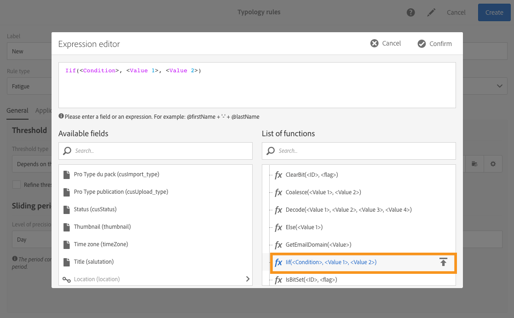

# Vermogensregels{#fatigue-rules}

## Informatie over vermoeidheidsregels {#about-fatigue-rules}

Met moeheidsregels kunnen marketers wereldwijde regels voor kanaaloverschrijdende bedrijven instellen die overgevraagde profielen automatisch van campagnes uitsluiten.

Als u vermoeidheidsregels wilt toepassen, definieert u een maximumaantal berichten per profiel en selecteert u een periode waarop de regel van toepassing is. Tijdens de voorbereiding van de levering worden, indien van toepassing, profielen uitgesloten van de levering, afhankelijk van het aantal berichten dat al naar hen is verzonden.

>[!NOTE]
>
>Om moeheidsregels toe te passen, moet u een contactdatum voor uw levering bepalen. Als u ervoor kiest om berichten onmiddellijk te verzenden, wordt de vermoeidheidsregel niet toegepast.

Verwante onderwerpen:

* [Voorbereiding](../../administration/using/configuring-email-channel.md#preparation)
* [Typologieën beheren](../../sending/using/about-typology-rules.md#managing-typologies)
* [Typologieregels](../../sending/using/about-typology-rules.md#typology-rules)
* [De communicatiefrequentie optimaliseren om vermoeidheid bij contact te voorkomen](https://helpx.adobe.com/campaign/kb/simplify-campaign-management.html#Engageyourcustomersateverystep)

## Een vermoeidheidsregel maken {#creating-a-fatigue-rule}

Voer de volgende stappen uit om een **[!UICONTROL Fatigue]** typologieregel te maken en te configureren:

1. Klik op het Adobe Campagne-logo in de linkerbovenhoek van de interface en selecteer **[!UICONTROL Administration]** > **[!UICONTROL Channels]** > **[!UICONTROL Typologies]** > **[!UICONTROL Typology rules]**.

   

1. Klik in de lijst met typologische regels op **[!UICONTROL Create]**.

   

1. Selecteer in het **[!UICONTROL Rule type]** veld **[!UICONTROL Fatigue]**.

   

1. Selecteer in het **[!UICONTROL Channel]** veld op welk kanaal de regel van toepassing is. U kunt één kanaal selecteren (e-mail, sms, direct mail, mobiele toepassing) of selecteren **[!UICONTROL All channels]**. Zie Het kanaal kiezen.

   

1. Definieer op het **[!UICONTROL General]** tabblad de methode voor het berekenen van het maximumaantal berichten per profiel. U kunt een constante of een variabele kiezen. U kunt de drempel voor profielen en leveringen ook verfijnen. Zie [De drempel](#defining-the-threshold)definiëren voor meer informatie.

   

1. Kies een methode **[!UICONTROL Sliding period]** waarop de typologieregel wordt toegepast. Zie [Schuifperiode](#setting-the-sliding-period)instellen voor meer informatie hierover.

   

   In dit voorbeeld (zie vorige schermafbeeldingen), verkiezen wij om een maximum aantal van 4 berichten over een glijdende periode van 15 dagen te verzenden.

1. Op het **[!UICONTROL Application criteria]** lusje, kunt u verkiezen om deze regel op alle leveringen toe te passen of de toepasselijkheid van de regel volgens het te verzenden bericht te beperken. De regel wordt alleen uitgevoerd als aan de toepassingsvoorwaarde is voldaan. U kunt de regel bijvoorbeeld alleen toepassen op berichten met een label dat begint met een bepaald woord of met een id die bepaalde letters bevat. Zie [De toepasbaarheid van een filterregel](../../sending/using/filtering-rules.md#restricting-the-applicability-of-a-filtering-rule)beperken.

   

1. Selecteer het **[!UICONTROL Typologies]** tabblad en koppel uw typologieregel aan de typologie die voor uw leveringen wordt gebruikt. Zie [Typologieën](../../sending/using/about-typology-rules.md#managing-typologies) en [Typologieregels](../../sending/using/about-typology-rules.md#typology-rules)beheren.

   

   >[!NOTE]
   >
   >De typologie kan in het leveringsmalplaatje worden bepaald, dat automatisch op alle leveringen wordt toegepast die gebruikend dit malplaatje worden gecreeerd.

Tijdens de voorbereiding van de levering worden, indien van toepassing, profielen uitgesloten van de levering, afhankelijk van het aantal reeds aan hen verzonden leveringen. U kunt de resultaten van de uitvoering van de vermoeidheidsregel weergeven in de leveringslogboeken. Zie De [resultaten](#viewing-the-fatigue-results)van de vermoeidheid weergeven.

>[!IMPORTANT]
>
>Om vermoeidheidsregels te laten werken, moet u een contactdatum voor de levering definiëren. Als u ervoor kiest om berichten onmiddellijk te verzenden, wordt de vermoeidheidsregel niet toegepast.

## Het kanaal kiezen {#choosing-the-channel}

Voor verschillende kanalen zijn er regels voor vermoeidheid beschikbaar. Het kanaal wordt bepaald op het **[!UICONTROL Channel]** gebied van de montages van de typologieregel. U kunt één kanaal selecteren of selecteren **[!UICONTROL All channels]**.

**Beschikbare kanalen**

De volgende kanalen zijn beschikbaar:

* E-mail
* Mobiel (SMS)
* Direct mail
* Mobiele toepassing: met dit kanaal kunt u pushmeldingen verzenden naar profielen of naar app-abonnees. Als u ervoor kiest om meldingen naar profielen te verzenden, zijn deze compatibel met de regels voor meerkanaalsmoeheid.

   >[!IMPORTANT]
   >
   >Moeilijkheidsregels zijn niet compatibel met pushberichten die naar app-abonnees worden verzonden. Als u berichten naar app-abonnees verzendt, zijn de regels voor vermoeidheid niet van toepassing.

* Alle kanalen: met deze optie kunt u de regel op alle kanalen toepassen. U kunt bijvoorbeeld maximaal 3 berichten per maand verzenden voor elk kanaal. Als u vorige week twee e-mails naar een profiel hebt verzonden en u vandaag probeert een pushmelding te verzenden, wordt hetzelfde profiel uitgesloten.

**Leveringstypen**

De regels van de vermoeidheid zijn compatibel met alle leveringstypes: eenmalige leveringen, terugkerende leveringen, workflowleveringen en transactieberichten.

**Transactioneel overseinen** kan worden gebruikt om de dienstberichten te verzenden richtend op een gebeurtenis (rtEvent) evenals marketing berichten (richtend profielen), bijvoorbeeld een remarketing bericht. Moeilijkheidsregels zijn alleen compatibel met marketingberichten (richtingsprofielen). Transactieberichten van gebeurtenissen bevatten geen profielinformatie en zijn daarom niet compatibel met vermoeidheidsregels (zelfs niet in geval van een verrijking met profielen). Met de steun van marketing berichten in transactioneel overseinen, kunt u een vermoeidheidsregel **toepassen op alle kanalen met inbegrip van marketing transactionele berichten**.

## De drempelwaarde definiëren {#defining-the-threshold}

Elke vermoeiingsregel definieert een drempel, dat wil zeggen het maximumaantal berichten dat over een bepaalde periode naar één profiel kan worden verzonden. Zodra deze drempel is bereikt, kunnen tot het einde van de beoordelingsperiode geen leveringen meer plaatsvinden. Met dit proces kunt u automatisch een profiel uitsluiten van een levering als een bericht de ingestelde drempelwaarde overschrijdt. Op deze manier voorkomt u overmatige opvraging.

Drempelwaarden kunnen constant of variabel zijn. Dit betekent dat drempelwaarden voor een bepaalde periode kunnen variëren van het ene profiel tot het andere, of zelfs voor hetzelfde profiel.

**Een drempelwaarde voor probleemoplossing gebruiken**

De drempel is het hoogste aantal berichten dat gedurende de betrokken periode naar een profiel kan worden verzonden.

Door gebrek, is de drempel constant en u moet op een maximumaantal berichten wijzen die door de regel worden toegelaten.

**Een variabele drempelwaarde gebruiken**

Als u een drempelwaarde voor een variabele wilt definiëren, selecteert u de **[!UICONTROL Depends on the recipient]** waarde in het **[!UICONTROL Threshold type]** veld.

Vervolgens hebt u twee opties:

* Selecteer een profielveld: de drempel varieert voor elk profiel afhankelijk van het geselecteerde veld. Als u bijvoorbeeld de profielbron hebt uitgebreid met een veld &#39;Communicatiefrequentie&#39;, klikt u op de knop rechts van het **[!UICONTROL Threshold computation formula]** veld en selecteert u het veld. Voor elk profiel heeft de drempelwaarde de waarde van het veld &quot;Communicatiefrequentie&quot;.

   

* een formule definiëren: Klik op de tweede knop rechts van het **[!UICONTROL Threshold computation formula]** veld om een geavanceerde drempelberekeningsformule te definiëren. U kunt bijvoorbeeld het aantal geoorloofde berichten indexeren op basis van het segment waartoe het profiel behoort. Dit betekent dat een profiel dat tot het segment van het &quot;Web&quot;behoort meer berichten dan andere profielen kan ontvangen. Een **[!UICONTROL Iif (@origin='Web', 5, 3)]** typeformule machtigt de levering van 5 berichten aan profielen van het segment van het Web en 3 voor andere segmenten.

   

**De drempelwaarde voor profielen en leveringen verfijnen**

Standaard worden alle berichten in aanmerking genomen voor de berekening van de drempelwaarde. Schakel het **[!UICONTROL Refine Threshold on profiles and deliveries]** selectievakje in om de profielen en leveringen te filteren die u wilt tellen wanneer u de levering voorbereidt.

In het volgende voorbeeld worden alleen mannelijke profielen geteld en worden alleen leveringen geteld met een label dat begint met **Newsletters** .

Het verfijnen van de drempel voor leveringen is anders dan het beperken van de toepasbaarheid van de gehele regel ( **[!UICONTROL Application criteria]** tab):

* **[!UICONTROL Application criteria]**: u kiest om de regel uit te voeren of niet volgens specifieke criteria. Als uw toepassingsvoorwaarde bijvoorbeeld &#39;Label begint met nieuwsbrief&#39; is, is de regel alleen van toepassing op leveringen die aan deze voorwaarde voldoen. Als het label van de levering begint met &#39;Promotie&#39;, wordt de regel helemaal niet uitgevoerd.
* **[!UICONTROL Refine threshold on profiles and deliveries > Deliveries to count]**: alle leveringen die deze typologieregel gebruiken, zullen de regel uitvoeren, maar u beslist, onder het verleden en de geplande leveringen, welke degenen u wilt tellen. Als uw beperking bijvoorbeeld &#39;Label begint met nieuwsbrief&#39; is, wordt de regel uitgevoerd, zelfs als het leveringslabel begint met &#39;Promo&#39;. Tijdens de geselecteerde schuifperiode wordt het aantal leveringen geteld waarvan het label begint met &#39;Newsletter&#39;.

## De schuifperiode instellen {#setting-the-sliding-period}

De vermoeidheidsregels worden gedefinieerd in de rolperioden van de dag. De periode wordt gevormd in de **[!UICONTROL Sliding period]** sectie, bijvoorbeeld 2 weken, 7 dagen of 5 uren.

Wanneer de regel wordt uitgevoerd, worden zowel vroegere leveringen als geplande leveringen in aanmerking genomen. Dit garandeert dat de drempelwaarde gedurende een bepaalde verschuivingstermijn nooit wordt overschreden.

Als u bijvoorbeeld een periode van 48 uur definieert, kijkt het systeem 48 uur **voor de contactdatum** en 48 uur **na de contactdatum**. De geselecteerde periode wordt dus verdubbeld om de integratie van toekomstige leveringen en eerdere leveringen mogelijk te maken.

Als u de in aanmerking genomen leveringen wilt beperken tot een periode van twee weken, voert u **Dag** en **7** of 1 week in de sectie **Schuifperiode** in. Bij de berekening wordt rekening gehouden met leveringen die tot 7 dagen vóór de leveringsdatum zijn verzonden en die tot 7 dagen na de leveringsdatum waarop de regel wordt toegepast, zijn gepland.

## De resultaten van vermoeidheid weergeven {#viewing-the-fatigue-results}

Tijdens de voorbereiding van de levering worden, indien van toepassing, profielen uitgesloten van de levering, afhankelijk van het aantal reeds aan hen verzonden leveringen. Klik op de knop in de rechterbenedenhoek van het **[!UICONTROL Deployment]** blok om de resultaten van de uitvoering van de vermoeidheidsregel weer te geven.

Er zijn drie tabbladen beschikbaar waarin u de details kunt zien van de resultaten van de vermoeidheidsuitvoering, inclusief de naam van de toegepaste regel:

* Leveringslogboeken:

   

* Uitsluitingslogboeken:

   

* Uitsluiting veroorzaakt:

   

## Samenvattingsrapport voor de vermoeidheidsregel weergeven {#viewing-the-fatigue-rule-summary-report}

Adobe Campaign beschikt over een speciaal rapport over vermoeidheidsregels om u te helpen begrijpen hoe deze regels op uw campagnes worden toegepast. Zo kunt u leren hoe uw campagnes elkaar beïnvloeden en de juiste aanpassingen aanbrengen.

Het **[!UICONTROL Fatigue rules summary]** rapport kan van de **[!UICONTROL Reports]** knoop, in de hoogste juiste hoek van elk programma, campagne, en bericht worden betreden.

In het linkergedeelte van het scherm kunt u de rapportgegevens filteren op de contactdatum van de leveringen. De geselecteerde periode begint standaard 15 dagen voor de huidige datum en eindigt 15 dagen na deze datum. U kunt ook filteren op een specifieke vermoeidheidsregel.

In het cirkeldiagram wordt de volgende informatie over de geselecteerde periode weergegeven:

* **[!UICONTROL Total targeted]**: het totale doel vóór de voorbereiding van berichten
* **[!UICONTROL Excluded]**: het totale aantal uitsluitingen als gevolg van toepassing van de vermoeidheidsregel
* **[!UICONTROL Other exclusions]**: het totale aantal uitsluitingen ten gevolge van andere typologische regels
* **[!UICONTROL To deliver]**: het totale aantal berichten dat na de voorbereiding van het bericht moet worden verzonden ( **[!UICONTROL To deliver]** = **[!UICONTROL Total targeted]** - **[!UICONTROL Excluded]** - **[!UICONTROL Other exclusions]** )

Rechts van het diagram ziet u het aantal uitsluitingen, uitgesplitst naar vermoeidheidsregel.

In de onderste tabel worden alle leveringen binnen de geselecteerde periode weergegeven. Voor elke levering, kunt u de vermoeidheidsregels zien die van toepassing waren en de overeenkomstige uitsluitingen. Leveringen zonder contactdatum worden ook in de tabel weergegeven.

* **[!UICONTROL 0]** betekent dat de vermoeidheidsregel van toepassing was, maar er was geen uitsluiting.
* **[!UICONTROL -N]** betekent dat er geen uitsluitingen hebben plaatsgevonden.
* een leeg veld betekent dat de vermoeidheidsregel niet van toepassing was.

>[!NOTE]
>
>De weergegeven gegevens zijn niet contextueel voor het programma, het bericht of de campagne waaruit u het rapport opent. Dit rapport bevat alle vermoeidheidsregels en -leveringen voor alle organisatorische eenheden. Zo krijgt u een algemeen overzicht van alle leveringen om te begrijpen hoe uw campagnes door anderen worden beïnvloed.

## Voorbeelden {#examples}

Er zijn veel mogelijkheden op het gebied van de uitvoering van vermoeidheidsbeheer. Hier volgen enkele voorbeelden van wat u kunt doen:

* Maak een vermoeidheidsregel met een **constante drempelwaarde** die van toepassing is op **alle kanalen**:

   Laten we zeggen dat u een multikanaalregel maakt met een constante drempelwaarde van 3 over een glijperiode van 7 dagen.

   Vorige week ontvingen je premieprofielen een e-mail voor speciale acties en een e-mail voor het opnieuw aanbieden van transacties. Je hebt ook een SMS gepland die volgende week wordt verzonden. Vandaag besluit u een pushmelding te verzenden voor al uw profielen. De premieprofielen worden uitgesloten van de push van vandaag omdat het maximumaantal berichten over een periode van twee weken al is bereikt.

   

* Maak een vermoeidheidsregel met een **variabele drempelwaarde** op basis van een **profielveld**:

   U hebt de profielbron uitgebreid met een veld Communicatielimiet om een andere drempel voor elk profiel te definiëren. Definieer in uw vermoeidheidsregel een variabele drempelwaarde op basis van dit veld en selecteer een verschuivende periode van 2 dagen. Neem twee voorbeelden van profielen: John heeft een communicatielimiet van 1 en David heeft een drempel van 2. Beide hebben gisteren al een nieuwsbrief ontvangen. Je besluit ze vandaag nog een e-mail te sturen. Alleen David zal het ontvangen, omdat John van het doel is uitgesloten.

   

* Maak een vermoeidheidsregel met behulp van een **formule** voor drempelberekening:

   U wilt de drempelwaarde wijzigen op basis van de leeftijd van uw profielen. Als een profiel kleiner is dan 40, wilt u een limiet van 4 definiëren en een limiet van 2 voor oudere profielen. In plaats van deze drempel voor elk profiel met een uitgebreid veld te definiëren, kunt u rechtstreeks in de vermoeidheidsregel een formule maken om de drempel op basis van de leeftijd van het profiel te berekenen. In ons voorbeeld zou de formule zijn **[!UICONTROL Iif (@age<40, 4, 2)]**.

   

   >[!NOTE]
   >
   >Deze sectie bevat ook een stapsgewijs voorbeeld van een vermoeidheidsregel met een formule voor drempelberekening.

* Maak een vermoeidheidsregel die de drempel **voor profielen en leveringen** verfijnt:

   U hebt de profielbron uitgebreid met een veld Score en u hebt de bron van de leveringen ook uitgebreid met een veld Type. U wilt een constante drempelwaarde van 3 definiëren, maar u wilt alle leveringen van het type &#39;Waarschuwing&#39; of &#39;Zwarte vrijdag&#39; en alle profielen met een score van meer dan 10 uitsluiten van de telling. Wanneer de regel wordt uitgevoerd, telt deze tussen de afgelopen en geplande leveringen alle leveringen die niet van het type &#39;Waarschuwing&#39; of &#39;Zwarte vrijdag&#39; zijn en die naar profielen met een score kleiner dan 10 zijn verzonden.

   

Hier volgt een stapsgewijs voorbeeld van een vermoeidheidsregel met behulp van een formule voor drempelberekening.

In dit geval, willen wij een typologieregel tot stand brengen om de levering van meer dan 2 berichten per week aan premieprofielen en 2 berichten per week aan standaardprofielen te verhinderen.

Om klanten en vooruitzichten te identificeren, hebben wij het profielmiddel met het **[!UICONTROL Status]** gebied uitgebreid, dat 0 voor premieprofielen en 1 voor standaardprofielen bevat.

Pas de volgende stappen toe om de regel te maken:

1. Maak een nieuwe typologieregel voor **vermoeidheid** .
1. In de **[!UICONTROL Threshold]** sectie willen we een formule maken om de drempel te berekenen afhankelijk van elk profiel. Selecteer de **[!UICONTROL Depends on the recipient]** waarde in het **[!UICONTROL Threshold type]** veld en klik op het pictogram op de tweede knop rechts van het **[!UICONTROL Threshold computation formula]** veld.

   

1. Dubbelklik in de **[!UICONTROL List of functions]** sectie op de functie **Iif** in het **[!UICONTROL Others]** knooppunt.

   

1. Selecteer vervolgens de **status** van het profiel in de **[!UICONTROL Available fields]** sectie.

   

1. Voer de gewenste waarden in om de volgende formule te maken: **IF(@status=0,2,4)**

   

   Met deze formule kunt u de waarde 2 toewijzen als de status gelijk is aan 0 en de waarde 4 voor alle andere statussen.

1. Klik **[!UICONTROL Confirm]** om de formule goed te keuren.
1. Geef aan **[!UICONTROL Sliding period]** op welke regel van toepassing is: in dit geval 7 dagen om de in aanmerking genomen leveringen te beperken tot een periode van twee weken.

   

1. Koppel nu de regel die u zojuist hebt gemaakt aan een typologie om deze toe te passen op uw leveringen. Selecteer hiertoe het **[!UICONTROL Typologies]** tabblad, klik **[!UICONTROL Create element]** en selecteer de typologie die voor uw leveringen wordt gebruikt.

   

1. Sla de regel op om het maken goed te keuren.

De regel wordt toegepast op alle leveringen op basis van de typologie.
