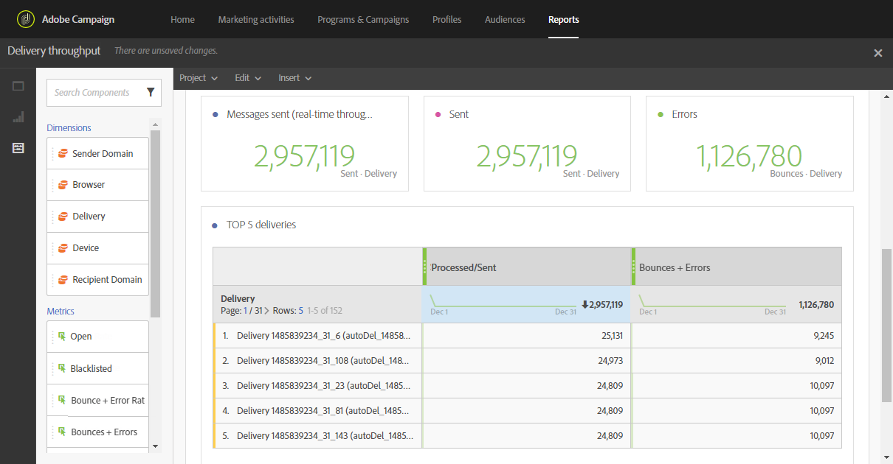

# Leverbaarheid controleren{#monitor-deliverability}

Hieronder vindt u nadere informatie over het **[!UICONTROL Delivery throughput]** rapport en de verschillende monitoringinstrumenten die Adobe Campaign biedt. Hier volgen enkele aanvullende richtlijnen voor het controleren van de leverbaarheid:
* Controleer regelmatig de leveringsproductie voor het gehele platform om te verifiëren of het met de originele opstelling verenigbaar is.
* Controleer of het opnieuw proberen correct is ingesteld (30 minuten voor herbestellingsperiode en meer dan 20 pogingen) in leveringssjablonen.
* Verifieer regelmatig dat de stuiterende brievenbus toegankelijk is en dat de rekening niet op het punt staat te verlopen.
* Controleer elke leveringsproductie om ervoor te zorgen dat het met de geldigheid van de leveringsinhoud (b.v. &#39;Flash-verkoop&#39; moet in minuten worden geleverd, niet in dagen).
* Wanneer het gebruiken van golven, verifieer dat elke golf genoeg tijd heeft om te beëindigen alvorens volgende wordt teweeggebracht.
* Controleer of het aantal fouten en nieuwe quarantines consistent zijn met andere leveringen.
* Raadpleeg zorgvuldig de leveringslogboeken in detail om het soort fouten te controleren die worden benadrukt (lijsten van afgewezen personen, DNS kwesties, anti-spamregels, enz.).

## Leveringsdoorvoer {#delivery-throughput}

Dit verslag bevat informatie over de leveringstijd van het gehele platform gedurende een bepaalde periode om de snelheid te meten waarop de berichten worden geleverd.

Voor meer op dit, zie de [productie](../../reporting/using/delivery-throughput.md)van de Levering.

U kunt de weergegeven waarden configureren door de tijdschaal te wijzigen.

Andere rapporten zijn beschikbaar, zoals **[!UICONTROL Delivery summary]** of **[!UICONTROL Non-deliverables and bounces]**. Zie [Dynamische rapporten](../../reporting/using/about-dynamic-reports.md)voor meer informatie hierover.

## Leveringen controleren{#monitoring-deliveries}

Het berichtdashboard geeft u toegang tot de leveringslogboeken: **[!UICONTROL Sending logs]**, **[!UICONTROL Exclusion logs]**, **[!UICONTROL Exclusion causes]**, **[!UICONTROL Tracking logs]** en **[!UICONTROL Tracked URLs]**. Zij tonen de details van de verzending, welk doel is uitgesloten en waarom, evenals de tracking-informatie zoals aantal geopend en aantal klikken.

Zie [Levering](../../sending/using/monitoring-a-delivery.md)controleren voor meer informatie.

## Ontvangen van waarschuwingen {#receiving-alerts}

The **[!UICONTROL Delivery alerting]** feature is an alert management system that enables a group of users to automatically receive notifications containing information on the execution of their deliveries.

Zie Waarschuwingen [ontvangen wanneer fouten optreden](../../sending/using/receiving-alerts-when-failures-happen.md)voor meer informatie hierover.

## Spam {#signal-spam}

Spam van het signaal is de Franse dienst die anonymized terugkoppel meldt voor Franse ISPs (Orange, SFR).

Deze dienst staat u toe om de reputatie van Franse ISPs te volgen en de activiteitenevolutie van klanten te volgen.

Spam van het signaal verstrekt ook directe klachten dat het eind - gebruikers door een specifieke interface registreren. Die klachten worden dan in quarantaine geplaatst van het e-mailadresgegevensbestand.

## 250ok {#solution-250ok}

250ok is een controleoplossing die IP en domeinlijsten van afgewezen personen, evenals reputatie-indicatoren verstrekt.

De verstrekte informatie is real-time, wat een pro-actieve bijstand mogelijk maakt. 250ok is een aanvullende oplossing voor de interne instrumenten voor de Adobe-leverbaar.
