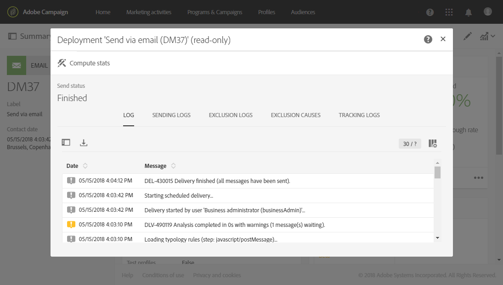

# Toezicht op levering{#monitoring-a-delivery}

Er zijn verschillende manieren om een levering te controleren en de impact ervan te meten:

* **Berichtenlogbestanden**: Deze logboeken kunnen direct van het berichtdashboard worden betreden. Zij tonen de details van het verzenden, die doel is uitgesloten en waarom, evenals de het volgen informatie zoals opent en klikt.

   Klik op het pictogram rechtsonder in het **[!UICONTROL Deployment]** blok om de berichtenlogboeken weer te geven.

   Verschillende tabbladen bevatten informatie (indien aanwezig) over de tabbladen **[!UICONTROL Sending logs]**, **[!UICONTROL Exclusion logs]**, **[!UICONTROL Exclusion causes]** en **[!UICONTROL Tracking logs]** **[!UICONTROL Tracked URLs]**. Zie [Leveringslogboeken](#delivery-logs).

   

   Het logboek bevat alle berichten met betrekking tot de levering en de proefdrukken. Met specifieke pictogrammen kunt u fouten of waarschuwingen identificeren. Zie [Berichten](../../sending/using/previewing-messages.md)goedkeuren voor meer informatie hierover.

   U kunt het logboek exporteren door op de **[!UICONTROL Export list]** knop te klikken.

   

* **Afleveringswaarschuwingen**: Adobe Campaign biedt een e-mailwaarschuwingssysteem dat meldingen verzendt om gebruikers op de hoogte te stellen van belangrijke systeemactiviteiten, zodat u de successen of mislukkingen van de levering kunt bijhouden.
* **Rapporten**: Van het berichtdashboard, kunt u tot verscheidene rapporten voor dit specifieke bericht toegang hebben. U hebt ook een **[!UICONTROL Reports]** menu dat u toestaat om tot een volledige lijst van ingebouwde of douanerapporten toegang te hebben die u kunt gebruiken om specifieke metriek met betrekking tot uw bericht of campagne te schetsen.
* Een beheerder kan logbestanden ook exporteren in een afzonderlijk bestand dat kan worden verwerkt in uw eigen rapportage- of BI-gereedschappen. Zie Logboeken [exporteren voor meer informatie](../../automating/using/exporting-logs.md).

**Verwante onderwerpen:**

* [Waarschuwingen ontvangen wanneer fouten optreden](../../sending/using/receiving-alerts-when-failures-happen.md)
* [Rapporten](../../reporting/using/about-dynamic-reports.md)

## Leveringslogboeken {#delivery-logs}

### Logboeken verzenden {#sending-logs}

Op het **[!UICONTROL Sending logs]** tabblad vindt u een geschiedenis van elk exemplaar van deze levering. De lijst met verzonden berichten en hun status wordt hier opgeslagen. Het staat u toe om de leveringsstatus voor elke ontvanger te bekijken.

Voor elk profiel met een **[!UICONTROL Sent]** status, toont de **[!UICONTROL Date]** kolom wanneer het bericht werd verzonden.

Klik op het potloodpictogram rechts van de desbetreffende rij om de details van een specifiek verzendingslogboek te openen.

Alle verzendende logboekdetails zijn read-only. U kunt ook een voorvertoning van de spiegelpagina zien.

>[!NOTE]
>
>Om de spiegelpagina die in het gebruikersinterface van de Campagne teruggeeft te tonen, moet de spiegelpaginaserver URL veilig zijn. In dat geval gebruikt u https:// in plaats van http:// om deze URL in te stellen bij het [configureren van uw merk](../../administration/using/branding.md#configuring-and-using-brands).

### Uitsluitingslogboeken {#exclusion-logs}

Het **[!UICONTROL Exclusion logs]** lusje maakt een lijst van alle berichten die van het verzonden doel zijn uitgesloten en specificeert de reden voor de verzendmislukking.

### Uitsluiting veroorzaakt {#exclusion-causes}

Het **[!UICONTROL Exclusion causes]** lusje toont het volume (in aantal berichten) van berichten die van het doel werden uitgesloten verzendt.

