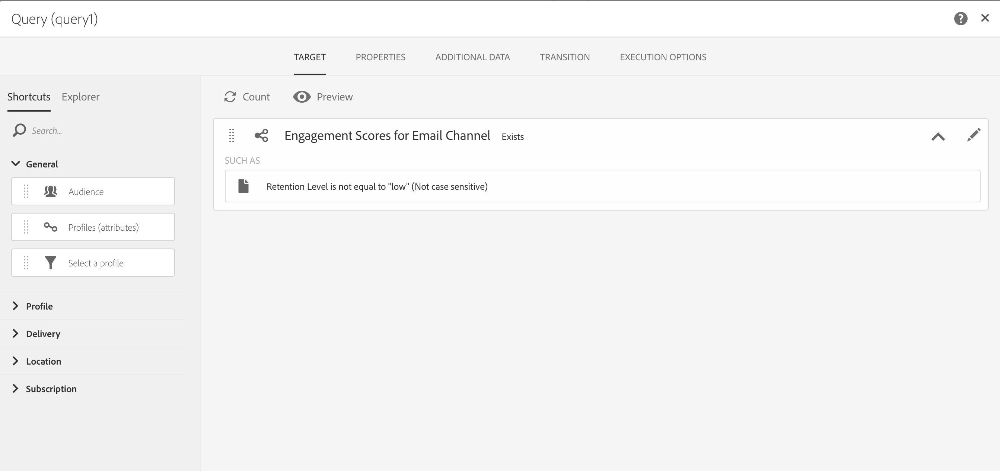

# Ontwerp en levering optimaliseren met e-mails met AI-mogelijkheden{#journey-ai}

## Aan de slag met e-mails van AI{#journey-ai-ovv}

Met behulp van Campagne kunt u het ontwerp en de levering van klantritten optimaliseren om de voorkeur van elk individu voor de service te voorspellen. Adobe Campaign wordt aangedreven door Journey AI en kan de open tarieven, optimale verzendtijden en waarschijnlijke kosten analyseren en voorspellen op basis van historische betrokkenheidsmaatstaven.

**Modellen voor machinaal leren**

Adobe Campaign Standard biedt twee nieuwe modellen voor het leren van machines: **Voorspelende optimalisatie** van de Verzendtijd en **Voorspellende Scoring** van de Betrokkenheid. Deze twee modellen worden samen verwezen naar Journey AI, een klasse van machine het leren modellen die specifiek voor het ontwerpen en het leveren van betere klantenreizen zijn.

* **Voorspelend tijdoptimalisatie** verzenden: Voorspelende verzendtijdoptimalisatievoorspellingen. Dit is de beste verzendtijd voor elk ontvangend profiel voor e-mail die wordt geopend of geklikt. Voor elk ontvankelijk profiel, wijzen de scores op het beste verzendtijd voor elke weekdag en welke weekdag het beste is om voor beste resultaten te verzenden.

* **Predictieve betrokkenheidsscore**: De voorspellende betrokkenheidsscore voorspelt de waarschijnlijkheid dat een ontvanger een bericht in dienst neemt en de waarschijnlijkheid dat hij of zij zich afmeldt (afmeldt) binnen de volgende 7 dagen na de volgende e-mail verzendt. De waarschijnlijkheden worden verder in emmers onderverdeeld op basis van het specifieke risico van terugtrekking, middelgroot of laag. Op deze manier geeft het model ook de risicopreffende positie van de klanten om te begrijpen waar de positie van een bepaalde klant ten opzichte van anderen ligt.

>[!NOTE]
> **Vereisten **
>
>Deze mogelijkheid is niet beschikbaar buiten de verpakking als onderdeel van het product. Voor de implementatie moet Adobe Consulting worden ingeschakeld. Neem contact op met uw Adobe-vertegenwoordiger voor meer informatie.
>
>Afzonderlijk, vereiste de eigenschap het gebruik van een Azure opslag die door de klant moet worden verstrekt.

## Optimalisatie van verzendtijd{#predictive-send-time}

### Klikken en openen optimaliseren{#about-predictive-send-time}

Voorspelende verzendtijdoptimalisatievoorspellingen. Dit is de beste verzendtijd voor elk ontvangend profiel voor e-mail die wordt geopend en geklikt. Voor elk ontvankelijk profiel, wijzen de scores op het beste verzendtijd voor elke weekdag en welke weekdag het beste is om voor beste resultaten te verzenden.

Binnen het Predictive Send Time Optimization model, zijn er twee submodellen:
* De voorspelbare verzendtijd voor open is de beste tijd een mededeling naar de klant moet worden verzonden om te maximaliseren opent
* De voorspelbare verzendtijd voor klikken is de beste tijd een mededeling naar de klant moet worden verzonden om kliks te maximaliseren

**Modelinvoer**: Leveringslogboeken, logbestanden bijhouden en profielkenmerken (niet-PII)

**Modeluitvoer**: Beste tijd om een bericht te verzenden (voor opent en klikt)


Uitvoerdetails

* Bereken de beste tijd van de dag om een e-mail voor de volgende 7 dagen te verzenden met intervallen van 1 uur (bijvoorbeeld: 9:00, 10:00, 11:00)
* Het model geeft de beste tijd aan binnen de komende 7 dagen om de e-mail te verzenden
* Elke optimale tijd wordt tweemaal berekend: één keer om de open snelheid te maximaliseren en één keer om de klikfrequentie te maximaliseren
* Er worden 16 velden gegeven (14 voor de weekdagen en 2 voor de hele week):
   * beste tijd om een e-mail te verzenden om te optimaliseren klikt voor maandag - waarden tussen 0 en 23
   * De beste tijd voor het verzenden van een e-mail voor optimalisatie wordt geopend voor maandag - waarden tussen 0 en 23
   * beste tijd om een e-mail te verzenden om te optimaliseren klikt voor Dinsdag - waarden tussen 0 en 23
   * ...
   * beste tijd om een e-mail te verzenden om kliks voor zondag - waarden tussen 0 en 23 te optimaliseren
   * beste tijd om een e-mail te verzenden om te optimaliseren opent voor Zondag - waarden tussen 0 en 23
   * ...
   * De beste dag voor het verzenden van een e-mail voor optimalisatie wordt geopend voor de hele week - van maandag tot en met zondag
   * beste tijd om een e-mail te verzenden om te optimaliseren opent voor de hele week - waarden tussen 0 en 23

>[!NOTE]
>
>Deze voorspellende mogelijkheden zijn alleen van toepassing op e-mailleveringen.
>
>Het model heeft minstens één maand aan gegevens nodig om significante resultaten te produceren.


### Profielscores openen{#access-predictive-send-time-scores}

Als de leermogelijkheden van de machine eenmaal zijn geïmplementeerd in Campagne, verrijkt u de profielgegevens met nieuwe tabbladen met de beste open scores en sneltoetsscores. De metriek worden berekend door Journey AI en zij worden gebracht in Campaign gebruikend technische werkschema&#39;s.

Om tot die metriek toegang te hebben, moet u:

1. Open een profiel en klik op de knop Bewerken.

1. Klik op het tabblad Tijdscore **verzenden door te klikken** of Tijdscore **verzenden op open** tabblad.

De profielscores geven standaard de beste tijd van de dag voor elke dag van de week en de beste algemene tijd in de week.


### Berichten verzenden op het beste moment{#use-predictive-send-time}

De e-mails kunnen alleen worden verzonden op het optimale tijdstip per profiel als de levering is gepland met de optie **[!UICONTROL Send at a custom date defined by a formula]**.
Leer hoe u de verzenddatum berekent [in deze sectie](../../sending/using/computing-the-sending-date.md).

De formule moet worden gevuld met het specifieke beste tijdstip van de specifieke dag waarop de levering zal plaatsvinden.


Voorbeeld van formule:

```
AddHours([currentDelivery/scheduling/@contactDate], 
[cusSendTimeScoreByClickprofile_link/@EMAIL_BEST_TIME_TO_CLICK_WEDNESDAY])
```


>[!NOTE]
>
>Het gegevensmodel kan afhankelijk van uw implementatie verschillend zijn.


## Predictieve betrokkenheidsscoring {#predictive-scoring}

Met voorspellende betrokkenheidsscoring kunt u:

* **Selecteer een publiek**: door de vraagactiviteit te gebruiken, kunt u het publiek selecteren om met een specifiek bericht in dienst te nemen
* **Een publiek** uitsluiten: door de vraagactiviteit te gebruiken, kunt u het publiek verwijderen om af te melden
* **Persoonlijk maken**: personaliseer bericht gebaseerd op niveau van betrokkenheid (zeer betrokken gebruikers krijgen een andere boodschap dan niet-betrokken gebruikers)

Dit model gebruikt meerdere scores om aan te geven:

* **Open Engagement Score / klik op Engagement Score**: deze waarde komt overeen met de waarschijnlijkheid dat een abonnee een bepaald bericht zal ontvangen (openen of klikken). Waarden kunnen variëren van 0,0 tot 1,0.
* **Abonnementswaarschijnlijkheid**: deze waarde komt overeen met de kans dat de ontvanger zich afmeldt bij het e-mailkanaal op basis van één e-mailbericht dat is geopend. Waarden kunnen variëren van 0,0 tot 1,0.
* **Retentieniveau**:  met deze waarde worden de gebruikers op drie niveaus gerangschikt : laag, gemiddeld en hoog. Het is zeer waarschijnlijk dat ze bij het merk blijven en de lage waarde zal waarschijnlijk opzeggen.
* **Percentage retentie**: profielrang in termen van unsubscription waarschijnlijkheid. Waarden kunnen variëren van 0,0 tot 1,0. Bijvoorbeeld, als de rangorde van het behoudpercentage 0.953 is, is deze ontvanger waarschijnlijker om bij merk te blijven en minder waarschijnlijk om dan 95.3% van alle ontvangers af te melden.

>[!NOTE]
>
>Deze voorspellende mogelijkheden zijn alleen van toepassing op e-mailleveringen.
>
>Het model heeft minstens één maand aan gegevens nodig om significante resultaten te produceren.


**Modelinvoer**: Leveringslogboeken, logbestanden bijhouden en specifieke profielkenmerken

**Modeluitvoer**: Een profielkenmerk dat de score en categorie van het profiel beschrijft


### De betrokkenheidsscore gebruiken voor het e-mailkanaal

Om tot die metriek toegang te hebben, moet u:

1. Open een profiel en klik op de knop Bewerken.

1. Klik op het tabblad **Betrokkenheid voor e-mailkanaal** .

Door een vraagactiviteit in een werkschema te gebruiken, kunt u de score gebruiken om uw publiek te optimaliseren.

Met bijvoorbeeld de criteria voor het **Retentieniveau** :




