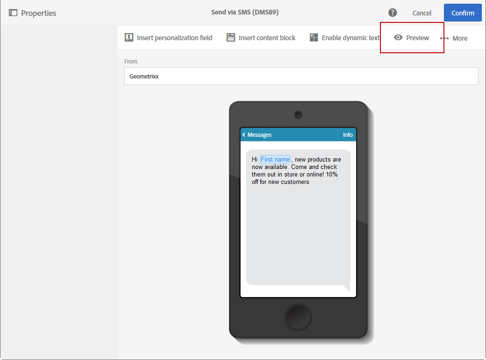
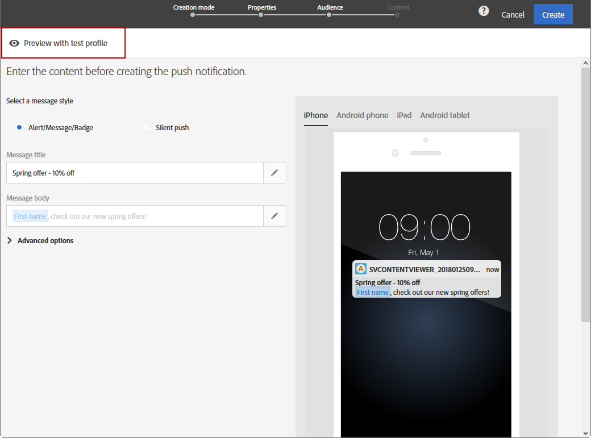

# Leveringen vooraf bekijken {#previewing-messages}

## E-mailberichten voorvertonen {#previewing-emails}

Met Campagnestandaard kunt u berichten voorvertonen voordat ze worden verzonden, zodat u kunt controleren of de berichten op maat zijn en hoe de ontvangers ze zullen zien.

De voorproef van berichten wordt uitgevoerd gebruikend de profielen **van de** Test die u aan het doel van het bericht toevoegt.

Voor **e-mailberichten** kunt u met de standaard Campagne berichten voorvertonen met behulp van de beoogde profielen in plaats van testprofielen. Op deze manier kunt u een exacte weergave krijgen van het bericht dat een specifiek profiel ontvangt. Zie E-mailberichten [testen met doelprofielen](../../sending/using/testing-messages-using-target.md)voor meer informatie.

Voer de volgende stappen uit om een bericht weer te geven met testprofielen:

1. Klik in [E-mailontwerper](../../designing/using/designing-content-in-adobe-campaign.md)op de **[!UICONTROL Preview]** knop.

   

   Een desktopweergave en een responsieve mobiele weergave van uw e-mailbericht worden naast elkaar weergegeven.

1. Tijdens elke voorvertoning wordt een automatische controle op anti-spam uitgevoerd. Klik op de **[!UICONTROL Anti-spam analysis]** knop voor meer informatie over de waarschuwing.

   

1. Selecteer de **[!UICONTROL Change profile]** knoop om het testprofiel te kiezen u de verpersoonlijkingselementen wilt testen.

   

1. Als u de **[!UICONTROL Preview]** modus wilt afsluiten, klikt u op de **[!UICONTROL Edit]** knop linksboven in het scherm.

   

**Verwante onderwerpen**

* [Testprofielen beheren](../../audiences/using/managing-test-profiles.md)
* [E-mailberichten testen met doelprofielen](../../sending/using/testing-messages-using-target.md)
* [Proefdrukken verzenden](../../sending/using/sending-proofs.md)

## SMS-berichten voorvertonen {#previewing-sms}

Voor **SMS** -berichten kunt u met de campagnestandaard berichten voorvertonen met testprofielen. Op deze manier kunt u een exacte weergave krijgen van het bericht dat een specifiek profiel ontvangt. Zie [Testprofielen](../../audiences/using/managing-test-profiles.md)beheren voor meer informatie.

Voer de volgende stappen uit om een SMS-bericht weer te geven met testprofielen:

1. Zodra je het SMS-bericht hebt ingevuld en je publiek hebt geselecteerd, kun je je levering aanpassen. **[!UICONTROL Properties]** Zie de [sectie](../../channels/using/personalizing-sms-messages.md)voor meer informatie.

   

1. Nadat u de inhoud hebt aangepast, klikt u **[!UICONTROL Create]** om het **[!UICONTROL Summary]** venster te openen.

1. Klik in het **[!UICONTROL Summary]** venster **[!UICONTROL Content]** om een voorvertoning van uw levering weer te geven.

   

1. Klik op **[!UICONTROL Preview]** de werkbalk.

   

1. Klik **[!UICONTROL Change profile]** om uw testprofiel te selecteren dan **[!UICONTROL Confirm]**.

   

U kunt nu de exacte weergave van uw bericht bekijken, afhankelijk van de geselecteerde testprofielen.

**Verwante onderwerpen**

* [Informatie over SMS-berichten](../../channels/using/about-sms-messages.md)
* [Een SMS-bericht maken](../../channels/using/creating-an-sms-message.md)
* [SMS-berichten aanpassen](../../channels/using/personalizing-sms-messages.md)

## Voorvertoning van pushmeldingen weergeven {#previewing-push}

Voor **pushmeldingen** kunt u met de campagnestandaard berichten voorvertonen met testprofielen. Op deze manier kunt u een exacte weergave krijgen van het bericht dat een specifiek profiel ontvangt. Zie [Testprofielen](../../audiences/using/managing-test-profiles.md)beheren voor meer informatie.

Voer de volgende stappen uit om een voorbeeld van een pushmelding weer te geven met testprofielen:

1. Nadat u de gegevens **[!UICONTROL Properties]** van uw pushmelding hebt ingevuld en uw publiek hebt geselecteerd, kunt u de levering aanpassen. Zie Een pushmelding [aanpassen voor meer informatie](../../channels/using/customizing-a-push-notification.md).

1. Nadat u de inhoud hebt aangepast, kunt u de rendering van uw pushmeldingen rechtstreeks controleren, afhankelijk van de apparaten en het besturingssysteem in het voorvertoningsvenster.

   

1. Klik op **[!UICONTROL Preview with test profile]** Testen om een voorbeeld van uw pushmelding weer te geven met testprofielen.

   

1. Selecteer vervolgens uw testprofiel **[!UICONTROL Confirm]**.

U kunt nu de exacte weergave van uw bericht bekijken, afhankelijk van de geselecteerde testprofielen.

**Verwante onderwerpen**

* [Pushmeldingen](../../channels/using/about-push-notifications.md)
* [Een pushmelding voorbereiden en verzenden](../../channels/using/preparing-and-sending-a-push-notification.md)
* [Een pushmelding aanpassen](../../channels/using/customizing-a-push-notification.md)

## In-app-berichten voorvertonen {#previewing-in-app}

Voor **In-app** kunt u met de campagnestandaard berichten voorvertonen met testprofielen. Op deze manier kunt u een exacte weergave krijgen van het bericht dat een specifiek profiel ontvangt. Zie [Testprofielen](../../audiences/using/managing-test-profiles.md)beheren voor meer informatie.

Voer de volgende stappen uit om een voorvertoning van een bericht in de app weer te geven met testprofielen:

1. Nadat u het bericht **[!UICONTROL Properties]** van uw In-App-bericht hebt ingevuld, hebt u uw publiek geselecteerd en uw **[!UICONTROL Triggers]** weergave ingesteld, kunt u de levering aanpassen. Raadpleeg [Een bericht](../../channels/using/customizing-an-in-app-message.md)in de app aanpassen voor meer informatie.

1. Nadat u de inhoud hebt aangepast, kunt u de rendering van uw In-App-bericht rechtstreeks controleren, afhankelijk van de apparaten en het besturingssysteem in het voorvertoningsvenster.

   

1. Als u een voorbeeld van uw bericht in de app wilt weergeven met testprofielen, klikt u op **[!UICONTROL Preview]**.

   

1. Selecteer vervolgens uw testprofiel **[!UICONTROL Confirm]**.

U kunt nu de exacte weergave van uw bericht bekijken, afhankelijk van de geselecteerde testprofielen.

**Verwante onderwerpen**

* [Info over In-App-berichten](../../channels/using/about-in-app-messaging.md)
* [Een bericht in de app voorbereiden en verzenden](../../channels/using/preparing-and-sending-an-in-app-message.md)
* [Een bericht in de app aanpassen](../../channels/using/customizing-an-in-app-message.md)