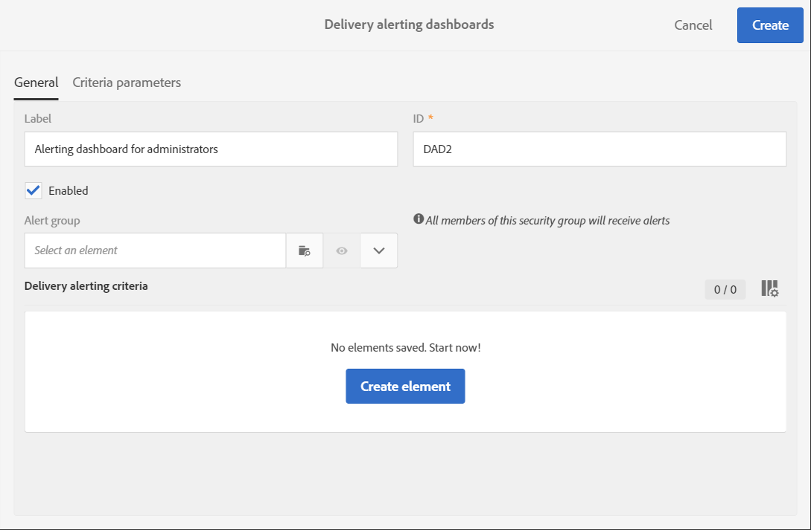

# Waarschuwingen ontvangen wanneer fouten optreden{#receiving-alerts-when-failures-happen}

## Informatie over leveringswaarschuwingen {#about-delivery-alerting}

De **functie voor leveringswaarschuwingen** is een systeem voor waarschuwingsbeheer waarmee een groep gebruikers automatisch meldingen kan ontvangen die informatie bevatten over de uitvoering van hun leveringen.

De verzonden meldingen bevatten een rapport dat standaard is gebaseerd op de volgende criteria:

* Mislukte leveringen
* Leveringen met mislukte voorbereiding
* Levert met een slechte soft bounce foutenverhouding
* Levert met een slechte harde stuitfoutenverhouding
* Leveringen waarvan de status in behandeling langer is dan normaal
* Levert met een lage doorvoer
* Leveringen in uitvoering

De ontvangers van de waarschuwingen kunnen toezicht houden op de leveringen die door Adobe Campaign worden verwerkt en passende maatregelen nemen wanneer er problemen zijn bij de uitvoering ervan.

Deze waarschuwingsmeldingen kunnen worden aangepast op basis van specifieke waarschuwingscriteria die via een dashboard in de Adobe Campaign-interface zijn gedefinieerd.

>[!NOTE]
>
>De waarschuwingsberichten worden alleen via e-mail verzonden.

De verzonden meldingen bevatten:

* Een **[!UICONTROL Summary]** weergave van het aantal leveringen dat voldoet aan de criteria die u hebt gedefinieerd en het label/de kleur dat u voor elk criterium hebt gekozen.
* Een **[!UICONTROL Details]** sectie met alle leveringscriteria die voor het corresponderende dashboard zijn gedefinieerd en alle leveringen voor elk criterium.

## Waarschuwingsdashboards voor levering {#delivery-alerting-dashboards}

### Informatie over waarschuwingsdashboards voor levering {#about-delivery-alerting-dashboards}

Als u de ontvangers van de meldingen wilt beheren, de waarschuwingscriteria wilt definiëren en de geschiedenis van de waarschuwingen wilt openen, moet u dashboards gebruiken.

>[!NOTE]
>
>Om tot de dashboards en de alarmerende criteria toegang te hebben en te vormen, moet u beleidsrechten hebben of in de de veiligheidsgroep van de supervisors **van de** Levering verschijnen. Standaardgebruikers hebben geen toegang tot de dashboards in de Adobe Campaign-interface. Ze kunnen alleen de waarschuwingsmeldingen ontvangen. Zie [Typen gebruikers](../../administration/using/users-management.md) en [Beveiligingsgroepen](../../administration/using/managing-groups-and-users.md#about-security-groups)voor meer informatie over gebruikers en beveiliging in Adobe Campaign.

Via de Adobe Campaign-interface kunt u:

* Maak en beheer waarschuwingsdashboards voor levering. Zie [Een waarschuwingsdashboard](#creating-a-delivery-alerting-dashboard)voor levering maken.
* Definieer en beheer de waarschuwingscriteria voor levering voor elk dashboard. U kunt bijvoorbeeld waarschuwingen maken op basis van leveringen met mislukte voorbereiding of leveringen met alleen een lage doorvoer. Zie [Informatie over waarschuwingscriteria](#about-alerting-criteria).
* Wijzig de criteria parameters voor elk dashboard. Zie [Criteria parameters](#criteria-parameters).
* Definieer een groep ontvangers voor elk dashboard.

   U wilt de gebruikers met beheerdersrechten bijvoorbeeld alleen op de hoogte stellen van de mislukte leveringen. Nochtans, wilt u de marketing gebruikers om informatie over de leveringen met een zachte stuiterende slechte foutenverhouding te ontvangen. Daarom moet u twee verschillende dashboards tot stand brengen en de criteria bepalen die u voor elke groep ontvangers wilt.

* Open de geschiedenis van alle verzonden waarschuwingen voor elk dashboard.

   Wanneer u een dashboard selecteert, wordt standaard de laatste waarschuwing voor dit dashboard weergegeven. Alle verzonden waarschuwingen worden links op het scherm weergegeven. Klik op een item in de **[!UICONTROL History]** lijst om de bijbehorende waarschuwingen te openen.

### Een waarschuwingsdashboard voor levering maken {#creating-a-delivery-alerting-dashboard}

Als u meldingen op basis van specifieke criteria wilt verzenden naar verschillende groepen gebruikers, moet u verschillende dashboards gebruiken. Een nieuw dashboard maken:

1. Ga naar **[!UICONTROL Administration]** > **[!UICONTROL Channels]** > **[!UICONTROL Delivery alerting]**.
1. Selecteer **[!UICONTROL Delivery alerting dashboards]** en klik op **[!UICONTROL Create]**.
1. Schakel het **[!UICONTROL Enabled]** selectievakje in om het huidige dashboard te activeren.

   Als deze optie is uitgeschakeld, worden meldingen die aan dit dashboard zijn gekoppeld, niet meer verzonden. Deze optie is standaard uitgeschakeld.

   

1. Selecteer in de **[!UICONTROL Alert group]** vervolgkeuzelijst de groep ontvangers die u wilt waarschuwen. Zie [Een beveiligingsgroep maken en gebruikers](../../administration/using/managing-groups-and-users.md#creating-a-security-group-and-assigning-users)toewijzen om een groep te wijzigen of te maken.
1. Klik in de **[!UICONTROL Delivery alerting criteria]** sectie **[!UICONTROL Create element]** om criteria toe te voegen. Zie [Informatie over waarschuwingscriteria](#about-alerting-criteria).
1. Selecteer de **[!UICONTROL Edit properties]** knop. Definieer op het **[!UICONTROL Criteria parameters]** tabblad hoe de criteria worden toegepast. Zie [Criteria parameters](#criteria-parameters).
1. Klik **[!UICONTROL Create]** om het dashboard op te slaan.

Telkens wanneer een levering voldoet aan de criteria die u in dit dashboard hebt gedefinieerd, wordt een waarschuwingsbericht verzonden naar de opgegeven groep gebruikers.

## Beoordelingscriteria voor aflevering {#delivery-alerting-criteria}

### Waarschuwingscriteria {#about-alerting-criteria}

Ga naar **[!UICONTROL Administration]** > **[!UICONTROL Channels]** > **[!UICONTROL Delivery alerting]** en selecteer **[!UICONTROL Delivery alerting criteria]**.

De volgende criteria kunnen worden gebruikt in de waarschuwingsdashboards voor levering:

* **[!UICONTROL Deliveries failed]**: Elke levering gepland binnen een bepaald bereik, met een onjuiste status.
* **[!UICONTROL Deliveries with preparation failed]**: Elke levering die binnen een bepaald bereik is gewijzigd en waarvoor de voorbereidingsstap (berekening van het doel en genereren van de inhoud) is mislukt. Voor meer op dit, zie het [Voorbereiden verzendt](../../sending/using/preparing-the-send.md).
* **[!UICONTROL Delivery with bad error ratio for soft bounces]**: Elke levering die binnen een bepaald bereik wordt gepland, met ten minste een status **[!UICONTROL In progress]**, met een soft bounce error ratio groter dan een bepaald percentage.
* **[!UICONTROL Delivery with bad error ratio for hard bounces]**: Elke levering die binnen een bepaald bereik wordt gepland, met een status ten minste **[!UICONTROL In progress]**, met een harde stuiterfout-verhouding groter dan een bepaald percentage.
* **[!UICONTROL Deliveries with long start pending]**: Om het even welke levering die binnen een bepaalde waaier, met een **[!UICONTROL Start pending]** status voor langer dan een bepaalde duur wordt gepland, **[!UICONTROL Start pending]** status die betekent dat de berichten nog niet met door het systeem in rekening zijn gebracht.
* **[!UICONTROL Deliveries with low throughput]**: Om het even welke levering begon langer dan een bepaalde duur, met minder dan een bepaald percentage verwerkte berichten, met een productie minder dan een bepaalde waarde.
* **[!UICONTROL Deliveries in progress]**: Elke levering gepland binnen een bepaald bereik, met de **[!UICONTROL In progress]** status.

>[!NOTE]
>
>Alle parameters die op bovenstaande criteria worden toegepast, hebben standaardwaarden. Deze waarden kunnen worden gewijzigd op het **[!UICONTROL Criteria parameters]** tabblad van de waarschuwingsdashboards voor levering. Zie [Criteria parameters](#criteria-parameters).

U kunt elk item in de **[!UICONTROL Delivery alerting criteria]** lijst selecteren om toegang te krijgen tot de details.

Voor elk criterium kunt u de volgende instellingen definiëren:

* **[!UICONTROL Indicators to add in alerts]**, dat wil zeggen de kolommen die in de **[!UICONTROL Details]** rubriek van de aanmelding zullen worden opgenomen voor de leveringen die aan het geselecteerde criterium voldoen.

   

* **[!UICONTROL Alert type]**, dat wil zeggen het label en de kleur die naast het leveringscriterium in de samenvatting van de kennisgeving zullen worden weergegeven.

   

* **[!UICONTROL Criteria frequency]**: Indien voor één levering aan een criterium wordt voldaan, wordt dit herhaald in elke kennisgeving die binnen de monitoringperiode wordt verzonden. Anders wordt één waarschuwing per dag (bij het eerste exemplaar) per waarschuwingscriterium voor één levering verzonden.

   Deze optie is standaard ingesteld op één keer per dag voor alle criteria.

**Verwante onderwerpen:**

* [Logboeken verzenden](../../sending/using/monitoring-a-delivery.md#sending-logs)
* [Waarschuwingsfrequentie](#alerting-frequency)
* [Pictogrammen en statussen voor marketingactiviteiten](../../start/using/marketing-activities.md#marketing-activity-icons-and-statuses)

### Een leveringswaarschuwingscriterium maken {#creating-a-delivery-alerting-criterion}

U kunt nieuwe waarschuwingscriteria voor levering maken die beter aansluiten bij uw behoeften.

U kunt bijvoorbeeld een nieuw criterium maken waarmee u een melding kunt verzenden waarin alle leveringen met een **[!UICONTROL Finished]** status worden vermeld.

Hiervoor moet u eerst de **leveringsbron** uitbreiden en een nieuw filter toevoegen waarmee u alleen de leveringen met een **[!UICONTROL Finished]** status kunt selecteren.

1. Ga naar **Adobe Campaign** > **Beheer** > **Ontwikkeling** > **Aangepaste bronnen** en klik **[!UICONTROL Create]**.
1. Selecteer **[!UICONTROL Extend an existing resource]**, selecteer de **[!UICONTROL Delivery]** bron in de vervolgkeuzelijst en klik **[!UICONTROL Create]** om deze te bewerken.

   

   Zie [De bron](../../developing/using/creating-or-extending-the-resource.md)definiëren voor meer informatie over het uitbreiden van een bestaande bron.

1. Ga in de **[!UICONTROL Delivery]** bron naar het **[!UICONTROL Filter definition]** tabblad en klik **[!UICONTROL Add an element]** om een filter te maken.

   

1. Bewerk de nieuwe filterdefinitie: in het **[!UICONTROL Filter definition]** venster sleept u het **[!UICONTROL Status]** item naar de werkruimte en selecteert u **[!UICONTROL Finished]** als filtervoorwaarde.

   

   Zie [Filters](../../developing/using/configuring-filter-definition.md)definiëren voor meer informatie over het maken en bewerken van aangepaste filters.

1. Sla uw wijzigingen op en publiceer uw bronnen. Voor meer op dit, zie het [Publiceren van een douanemiddel](../../developing/using/updating-the-database-structure.md#publishing-a-custom-resource).

   Het filter wordt gemaakt en kan nu worden geselecteerd in een nieuw leveringswaarschuwingscriterium.

1. Ga naar **[!UICONTROL Administration]** > **[!UICONTROL Channels]** > **[!UICONTROL Delivery alerting]**, selecteer **[!UICONTROL Delivery alerting criteria]** en klik **[!UICONTROL Create]**.
1. Selecteer in de **[!UICONTROL Delivery filter applied by this criterion]** vervolgkeuzelijst het filter dat u zojuist hebt gemaakt.

   

   U kunt de instellingen van uw criterium op dezelfde manier definiëren als voor de standaardcriteria. Zie [Informatie over waarschuwingscriteria](#about-alerting-criteria).

Als deze criteria eenmaal zijn gemaakt, kunnen ze worden toegevoegd aan een waarschuwingsdashboard voor levering en aan andere criteria. Zie [Informatie over waarschuwingsdashboards voor levering](#about-delivery-alerting-dashboards).

**Verwant onderwerp:**

[Een bron toevoegen of uitbreiden](../../developing/using/key-steps-to-add-a-resource.md)

## Waarschuwing bij aflevering {#delivery-alerting-parameters}

### Criteria {#criteria-parameters}

Op het **[!UICONTROL Criteria parameters]** tabblad van een [leveringswaarschuwingsdashboard](#creating-a-delivery-alerting-dashboard)kunt u de instellingen definiëren die van toepassing zijn op de criteria die in dit dashboard zijn geselecteerd.

* **[!UICONTROL Delivery target minimum size]**: Bijvoorbeeld, als u 100 op dit gebied ingaat, wordt een bericht verzonden slechts voor leveringen met een doel gelijk aan of groter dan 100 ontvangers. Deze parameter geldt voor alle criteria.
* **[!UICONTROL Monitoring period before and after the contact date (in hours)]**: Aantal uren voor en na de huidige tijd. Alleen de leveringen met een contactdatum in dit tijdsbereik worden in aanmerking genomen. Deze parameter geldt voor alle criteria. De standaardwaarde voor dit veld is 24 uur.

   Zie [Informatie over de planning](../../sending/using/about-scheduling-messages.md)voor meer informatie over de contactdatum.

* **[!UICONTROL Maximum ratio of soft bounce errors]**: Er wordt een melding verzonden voor alle leveringen met een soft bounce error ratio die groter is dan de opgegeven waarde. De standaardwaarde voor dit veld is 0,05 (5%).

   Voor meer op zachte stuitfouten, zie de kwalificatie [van de](../../sending/using/understanding-delivery-failures.md#bounce-mail-qualification) post van de Stuitage en [Lijst van de types](../../sending/using/understanding-delivery-failures.md#delivery-failure-types-and-reasons)van leveringsmislukking.

* **[!UICONTROL Maximum ratio of hard bounce errors]**: Er wordt een melding verzonden voor alle leveringen met een harde stuitfoutenverhouding die groter is dan de opgegeven waarde. De standaardwaarde voor dit veld is 0,05 (5%).

   Voor meer op harde stuitfouten, zie de kwalificatie [van de](../../sending/using/understanding-delivery-failures.md#bounce-mail-qualification) post van de Stuitage en [Lijst van de types](../../sending/using/understanding-delivery-failures.md#delivery-failure-types-and-reasons)van leveringsmislukking.

* **[!UICONTROL Minimum time threshold for delivery in 'Start pending' status (in minutes)]**: Voor alle leveringen met een **[!UICONTROL Start pending]** **[!UICONTROL Start pending]** status die langer duurt dan de in dit veld opgegeven duur, wordt een kennisgeving verzonden, wat betekent dat het systeem nog geen rekening heeft gehouden met de berichten.
* **[!UICONTROL Minimum time required for the computation of the throughput (in minutes)]**: Alleen leveringen die voor meer dan de opgegeven duur zijn begonnen (met **[!UICONTROL In progress]** status) worden in aanmerking genomen voor het **[!UICONTROL Deliveries with low throughput]** criterium.
* **[!UICONTROL Maximum percentage of processed messages for the computation of the throughput]**: Voor het **[!UICONTROL Deliveries with low throughput]** criterium wordt alleen rekening gehouden met leveringen met een percentage verwerkte berichten dat lager is dan het opgegeven percentage.
* **[!UICONTROL Minimum expected throughput (in sent messages per hour)]**: Voor het **[!UICONTROL Deliveries with low throughput]** criterium wordt alleen rekening gehouden met leveringen met een lagere doorvoer dan de opgegeven waarde.
* **[!UICONTROL Minimum processed ratio required for 'Deliveries in progress' criterion]**: Alleen leveringen met een percentage verwerkte berichten dat hoger is dan het opgegeven percentage, worden in aanmerking genomen.

### Waarschuwingsfrequentie {#alerting-frequency}

Met de **[!UICONTROL Frequency of delivery alerting]** optie kunt u de vertraging tussen twee waarschuwingsberichten definiëren. De standaardwaarde is 10 minuten.

U kunt deze instelling wijzigen via het menu **[!UICONTROL Administration]** > **[!UICONTROL Application settings]** > **[!UICONTROL Options]** .

>[!NOTE]
>
>Deze optie is van toepassing op alle dashboards die in Adobe Campaign worden gedefinieerd. U kunt geen specifieke frequentie instellen voor elk dashboard.

## Redenen voor aflevering {#delivery-alerting-reasons}

Met de functie **Leveringswaarschuwingen** worden alle betrokken Adobe Campaign-gebruikers automatisch via e-mail en het dashboard op de hoogte gehouden van de uitvoeringsstatus van de levering.

Wanneer u nu een bericht ontvangt voor een waarschuwing over de levering, kunt u enkele tips weergeven over wat u kunt doen.

Eerst en vooral, controleer het lusje van het **Logboek** van de levering om alle informatie met betrekking tot de levering en de proefdrukken te bekijken. Met de rode en gele pictogrammen kunt u fouten of waarschuwingen herkennen. Het rode pictogram geeft een kritieke fout aan die voorkomt dat de levering wordt gestart.

Selecteer het **[!UICONTROL Sending logs]** tabblad om de geschiedenis van elk exemplaar van een levering weer te geven. Het bevat de lijst met verzonden berichten en hun status. Daar kunt u de leveringsstatus voor elke ontvanger ( **[!UICONTROL Sent]**, **[!UICONTROL Pending]**, **[!UICONTROL Failed]**, enz.) controleren. Zie Logboeken [verzenden voor meer informatie](../../sending/using/monitoring-a-delivery.md#sending-logs).

Hier volgen enkele mogelijke redenen om waarschuwingsberichten te ontvangen op basis van de criteria waaraan een levering voldoet.

* **[!UICONTROL Deliveries failed]**: Dit criterium brengt u op de hoogte van alle leveringen met een onjuiste status. Dit kan te wijten zijn aan:

   * Een probleem met de leveringsserver (MTA, de Agent van de Overdracht van het Bericht)
   * Een time-out voor de verbinding tussen de Adobe Campaign-leveringsserver en de ontvangende server
   * Een probleem met betrekking tot de leverbaarheid
   * Een onjuiste workflow
   Als de levering met een werkschema in werking wordt gesteld, controleer of die werkschema correct was begonnen. Zie Een workflow uitvoeren voor meer informatie. Anders kunt u contact opnemen met uw Adobe Campaign-beheerder om het probleem op te lossen.

* **[!UICONTROL Deliveries with preparation failed]**: Er kan een fout optreden tijdens de voorbereiding van de levering in de volgende gevallen:

   * Er ontbreekt een onderwerp in de levering.
   * Er is een onjuiste syntaxis op de verpersoonlijkingsgebieden.
   * Het doel ontbreekt.
   * De levering overschrijdt de groottelimiet.
   Voor meer op dit, zie het [Voorbereiden verzendt](../../sending/using/preparing-the-send.md). Deze fouten worden echter meestal waargenomen tijdens de analyse van berichten. Zie [Regels](../../sending/using/control-rules.md)voor besturing.

* De mogelijke oorzaken voor een **[!UICONTROL Delivery with bad error ratio for soft bounces]** alarm kunnen zijn:

   * De server van de ontvanger is neer.
   * De brievenbus van de ontvanger is volledig.
   Voor meer informatie, controleer de **[!UICONTROL Exclusion logs]** en **[!UICONTROL Exclusion causes]** lusjes van de leveringslogboeken. Zie [Uitsluitingslogboeken](../../sending/using/monitoring-a-delivery.md#exclusion-logs).

   De mogelijke oorzaken voor een **[!UICONTROL Delivery with bad error ratio for hard bounces]** alarm kunnen zijn:

   * De ontvanger staat op de bloklijst, wat betekent dat hij niet langer contact met hem wil opnemen.
   * Het e-mailadres van de ontvanger bestaat niet.
   * Het domein van de ontvanger bestaat niet.
   * De server van de ontvanger blokkeert de levering.
   Volg onderstaande aanbevolen procedures om zachte en harde stuiterfouten te voorkomen:

   * Bouw het filtreren typologieregels om één deel van het berichtdoel tijdens de leveringsanalyse, zoals in quarantaine gehouden ontvangers uit te sluiten. Zie [Een filterregel](../../sending/using/filtering-rules.md)maken.
   * Werk regelmatig uw klantengegevensbestand bij om goede processen van het quarantainebeheer te handhaven. Zie [Informatie over quarantines](../../sending/using/understanding-quarantine-management.md#about-quarantines).
   * Over het algemeen kunt u de prestaties het beste verbeteren. Raadpleeg de gedetailleerde documentatie over de [leverbaarheid](../../sending/using/about-deliverability.md) van Adobe Campaign en neem contact op met uw Adobe Campaign-beheerder voor hulp.

* **[!UICONTROL Deliveries with long start pending]**: Gewoonlijk betekent dit dat er een probleem op het niveau van MTA (de Agent van de Overdracht van het Bericht) is. Het uitvoeringsproces wacht op de beschikbaarheid van sommige bronnen. De MTA is mogelijk niet gestart.

   **[!UICONTROL Deliveries with low throughput]**: Nogmaals, dit is een kwestie van leverbaarheid die betekent dat de MTA te langzaam is.

   Neem contact op met uw Adobe Campaign-beheerder voor meer informatie over deze problemen.

**Verwante onderwerpen:**

* [Leveringsfouten begrijpen](../../sending/using/understanding-delivery-failures.md)
* [Werken met quarantainebeheer](../../sending/using/understanding-quarantine-management.md)
* [Over opt-in en opt-out in campagne](../../audiences/using/about-opt-in-and-opt-out-in-campaign.md)

