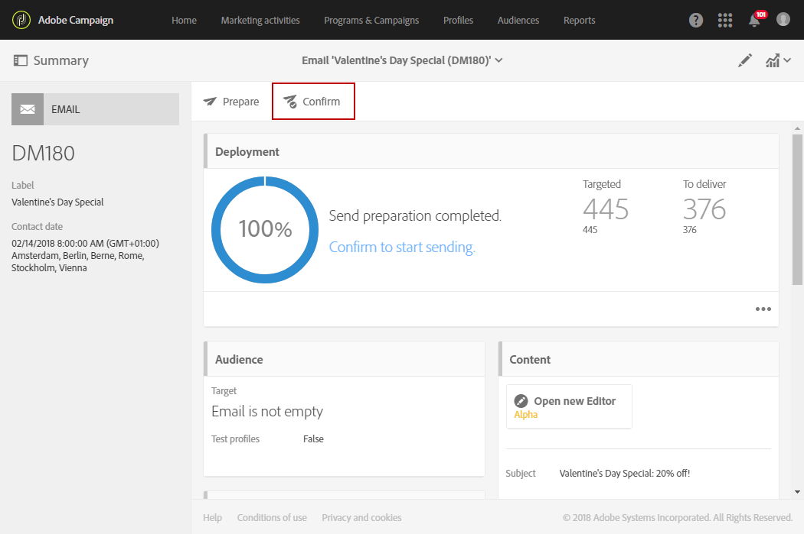

# Het verzenden van berichten bij de tijdzone van de ontvanger{#sending-messages-at-the-recipient-s-time-zone}

Wanneer het leiden van een campagne waarin de datum en de tijd belangrijk zijn, kunt u een levering plannen die de lokale tijd van elke ontvanger rekening houdt: ze ontvangen e-mail-, SMS- of pushberichten op het geplande tijdstip in hun eigen tijdzone.

>[!NOTE]
>
>Om deze functionaliteit te gebruiken, zorg ervoor dat alle profielen die door uw levering worden bedoeld een tijdzone hebben die in de **[!UICONTROL Address]** sectie van hun eigenschappen wordt gespecificeerd. Raadpleeg deze [sectie](../../audiences/using/editing-profiles.md)voor meer informatie over het benaderen van profieleigenschappen.

Om een levering bij de tijdzone van de ontvanger te verzenden, kunt u de **[!UICONTROL Scheduler]** activiteit in een werkschema ook gebruiken. Raadpleeg deze [pagina](../../automating/using/scheduler.md)voor meer informatie.

In het volgende voorbeeld willen we een promotiecode sturen die alleen geldig is op Valentijnsdag aan alle klanten over de hele wereld. Om voldoende tijd te verstrekken om het tijdens de dag te gebruiken, moeten alle klanten uw bericht op 14 Februari om 8:00 AM afhankelijk van hun tijdzones ontvangen.

1. Start op het **[!UICONTROL Marketing activities]** tabblad de levering, in ons geval een e-mail. Raadpleeg deze [sectie](../../channels/using/creating-an-email.md)voor meer informatie over het maken van de aflevering.
1. Nadat u de Valentijnsdag-e-mail hebt ontworpen, klikt u **[!UICONTROL Create]** om het dashboard voor levering te openen. Raadpleeg deze [pagina](../../designing/using/personalization.md#example-email-personalization)voor meer informatie over ontwerpen via e-mail.

   

1. Selecteer het **[!UICONTROL Schedule]** blok in het leveringsdashboard.

   

1. Selecteer de hieronder opgegeven **[!UICONTROL Messages to be sent automatically on the date]** optie. Stel vervolgens in het **[!UICONTROL Start sending from]** veld de contactdatum in, in ons geval op 14 februari om 8.00 uur, zodat elke ontvanger het op Valentijnsdag ontvangt.

   

1. Selecteer in het **[!UICONTROL Time zone of the contact date]** veld in welke tijdzone uw levering standaard moet worden verzonden.

   Als een profiel als **[!UICONTROL Time zone]** wordt verlaten **[!UICONTROL Default]**, zullen de ontvangers de levering afhankelijk van de gekozen tijdzone hier ontvangen.

1. Kies in het **[!UICONTROL Optimize the sending time per recipient]** keuzemenu de optie **[!UICONTROL Send at the recipient's time zone]**. Hierdoor kunnen ontvangers de dag-e-mail van Valentine ontvangen op 14 februari, afhankelijk van hun tijdzone.

   

1. Na bevestiging van uw leveringsschema, klik de **[!UICONTROL Prepare]** knoop dan **[!UICONTROL Confirm]** uw levering.

   Bevestig de verzending ten minste 24 uur van tevoren. Anders, afhankelijk van hun plaats, zouden sommige ontvangers de levering vóór de daadwerkelijke de daggebeurtenis van Valentine kunnen ontvangen.

   

Geen kwestie waar zij worden gevestigd, zullen alle ontvangers het bericht op 14 Februari om 8:00 hun lokale tijd ontvangen.
