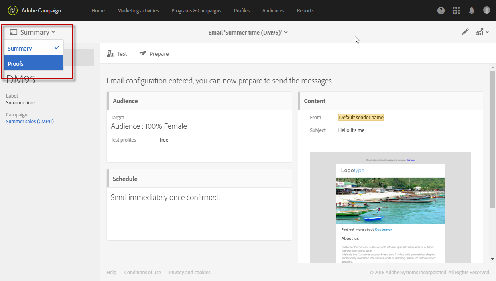

# Proefdrukken verzenden {#sending-proofs}

Een bewijs is een specifiek bericht dat u toestaat om een bericht te testen alvorens het naar het belangrijkste doel te verzenden.

Ontvangers van het bewijs zijn belast met de goedkeuring van het bericht (inhoud en vorm). Deze worden gedefinieerd in de **testprofielen**. Zie [Testprofielen](../../audiences/using/managing-test-profiles.md)beheren voor meer informatie.

Als u een proefdruk wilt verzenden, moeten de testprofielen worden opgenomen in het publiek van uw bericht.

In een bericht:

1. Klik op de **[!UICONTROL Send a test]** knop.

   

1. Selecteer het type proefdruk dat u wilt gebruiken:

   * **[!UICONTROL Email rendering]**: Selecteer deze optie om de manier te testen waarop uw bericht wordt ontvangen volgens de beoogde inboxes. Zie [E-mailrendering](../../sending/using/email-rendering.md)voor meer informatie.
   * **[!UICONTROL Proof]**: Selecteer deze optie om het bericht te testen voordat u het naar het hoofddoel verzendt. De ontvangers van de bewijzen zijn verantwoordelijk voor de goedkeuring van de levering, door zowel de inhoud als de vorm ervan te controleren.
   * **[!UICONTROL Proof + Email rendering]**: met deze optie worden de twee vorige opties gecombineerd .
   

1. Bevestig uw keuze.

   De proefdrukken worden naar de testprofielen verzonden.

   

1. U kunt uw proefdrukken bekijken in de **[!UICONTROL Proofs]** vervolgkeuzelijst.

   

1. Selecteer een proefdruk om het overzicht te openen. Als u voor een e-mail de optie voor het renderen **via** e-mail hebt geselecteerd als proefdruktype, wordt het **[!UICONTROL Access email rendering]** pictogram rechts van het proefdruklabel weergegeven. Zie [E-mailrendering](../../sending/using/email-rendering.md).

   

Afhankelijk van de opmerkingen van de personen die de proefafdruk ontvangen, wordt u mogelijk gevraagd de inhoud van de aflevering te wijzigen. Nadat de wijzigingen zijn uitgevoerd, moet u de e-mailvoorbereiding opnieuw starten en vervolgens een proefdruk opnieuw verzenden. Elke nieuwe proefdruk kan met de **[!UICONTROL Show proofs]** knoop worden betreden.

U moet zoveel proefdrukken verzenden als nodig zijn totdat u de inhoud van de levering hebt voltooid. Zodra dit wordt gedaan, kunt u de levering naar het belangrijkste doel verzenden en de goedkeuringscyclus sluiten.

**Verwant onderwerp:**

[Een test verzenden, een e-mailvideo](https://docs.adobe.com/content/help/en/campaign-learn/campaign-standard-tutorials/getting-started/sending-test-preparing-sending-email.html) voorbereiden en verzenden
