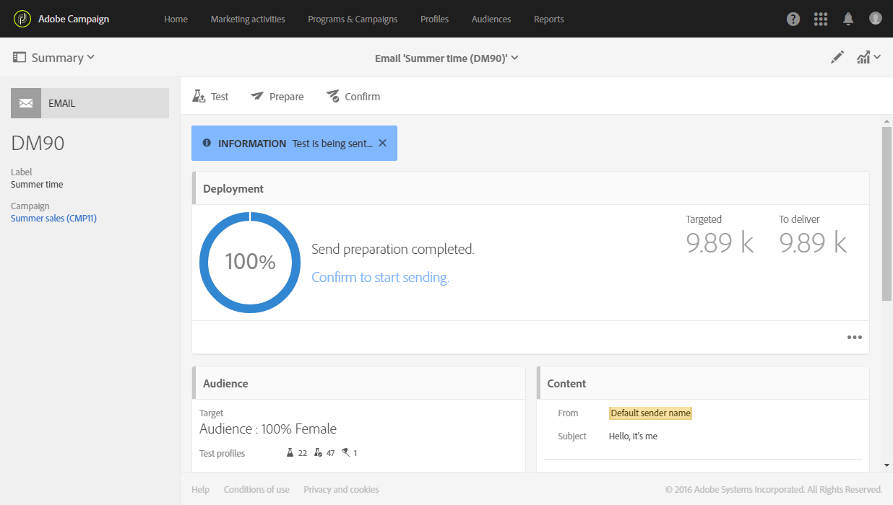

# Proeven verzenden {#sending-proofs}

## Proeven {#about-proofs}

Een proef is een specifiek bericht dat u toestaat om een bericht te testen voordat het naar het hoofddoel wordt verzonden. Ontvangers van de proef zijn verantwoordelijk voor de goedkeuring van het bericht (content en vorm).

Er zijn twee soorten ontvangers van proeven:

* Met **testprofielen** kunt u aanvullende ontvangers die niet aan de gedefinieerde targetingcriteria voldoen, doelgericht benaderen.

   Ze kunnen worden toegevoegd aan de doelgroep van een bericht om frauduleus gebruik van de database met ontvangers op te sporen of om ervoor te zorgen dat de e-mails in de inboxen aankomen. Zie [Testprofielen beheren](../../audiences/using/managing-test-profiles.md) voor meer informatie.

   >[!NOTE]
   >
   >Als u een proef wilt verzenden, moeten de testprofielen worden opgenomen in de doelgroep van uw bericht.

* Met **vervangingsprofielen** kunt u uzelf opgeven in de plaats van een van de doelprofielen en een exacte weergave krijgen van het bericht dat het profiel ontvangt. Zie [E-mailberichten testen met doelprofielen](../../sending/using/testing-messages-using-target.md) voor meer informatie.

   >[!NOTE]
   >
   >Deze functie is alleen beschikbaar voor het e-mailkanaal.

## Een proef verzenden {#sending-a-proof}

Voer de volgende stappen uit om proeven te verzenden:

1. Controleer of de ontvangers voor proeven zijn geconfigureerd:
   * De **testprofielen** moeten in de doelgroep van uw bericht zijn opgenomen.
   * **Vervangingsprofielen** moeten worden toegevoegd zodra het bericht is voorbereid (zie [deze sectie](../../sending/using/testing-messages-using-target.md)).

1. Klik op de knop **[!UICONTROL Send a test]**.

   

1. Selecteer het type proef dat u wilt gebruiken:

   * **[!UICONTROL Email rendering]**: Selecteer deze optie om de manier te testen waarop uw bericht wordt ontvangen volgens de beoogde inboxen. Zie [E-mailweergave](../../sending/using/email-rendering.md) voor meer informatie.
   * **[!UICONTROL Proof]**: Selecteer deze optie om het bericht te testen voordat u het naar het hoofddoel verzendt. De ontvangers van de proef zijn verantwoordelijk voor de goedkeuring van de levering, door zowel de content als de vorm ervan te controleren.
   * **[!UICONTROL Proof + Email rendering]**: Deze optie combineert de twee vorige opties.

   

   >[!NOTE]
   >
   >E-mailweergave is alleen beschikbaar met testprofielen. Als er geen testprofielen aan het bericht zijn toegevoegd, is alleen de optie **[!UICONTROL Proof]** beschikbaar voor selectie.

1. Bevestig uw keuze.

   De proeven worden verzonden naar de ontvangers die zijn geconfigureerd.

   

1. U kunt uw proeven bekijken in de vervolgkeuzelijst **[!UICONTROL Proofs]**.

   

1. Selecteer een proef om het overzicht ervan te openen. Als u voor een e-mail de optie **Email rendering** hebt geselecteerd als proeftype, wordt het pictogram **[!UICONTROL Access email rendering]** rechts van het proeflabel weergegeven. Zie [E-mailweergave](../../sending/using/email-rendering.md).

   

Afhankelijk van de opmerkingen van de personen die de proef ontvangen, wordt u mogelijk gevraagd de content van de levering te wijzigen. Nadat de wijzigingen zijn uitgevoerd, moet u de e-mailvoorbereiding opnieuw starten en vervolgens een nieuwe proef verzenden. U krijgt toegang tot elke nieuwe proef met de knop **[!UICONTROL Show proofs]**.

U moet zoveel proeven verzenden als nodig zijn totdat u de content van de levering hebt voltooid. Als dit is gebeurd, kunt u de levering naar het hoofddoel verzenden en de goedkeuringscyclus sluiten.

## De onderwerpregel van proeven configureren {#configuring-proofs-subject-line}

Wanneer een proef wordt verzonden, wordt de onderwerpregel ervan standaard geconfigureerd met het voorvoegsel **‘Proof’** gevolgd door het nummer van de proef.

Voer de volgende stappen uit om de standaardonderwerpregel te wijzigen die u wilt gebruiken:

1. Klik op de knop **[!UICONTROL Open properties]** in het berichtdashboard.
1. Definieer in de sectie **[!UICONTROL Advanced parameters]** het voorvoegsel dat u standaard wilt gebruiken in de onderwerpregel.

Als u het nummer van de proef wilt verbergen, activeert u de optie **[!UICONTROL Hide proof prefix counter]**.

>[!NOTE]
>
>Laat het veld **[!UICONTROL Subject line prefix]** leeg als u het volledige voorvoegsel van de proef wilt verbergen. 

1. Klik op **[!UICONTROL Confirm]**. De instellingen worden standaard toegepast op alle proeven die voor het geselecteerde bericht worden verzonden.

**Verwant onderwerp:**

* Video over het [verzenden van een test en het voorbereiden en verzenden van een e-mail](https://docs.adobe.com/content/help/en/campaign-learn/campaign-standard-tutorials/getting-started/sending-test-preparing-sending-email.html)
* [E-mailberichten testen aan de hand van doelprofielen](../../sending/using/testing-messages-using-target.md)
* [Testprofielen beheren](../../audiences/using/managing-test-profiles.md)
* [Berichten voorvertonen](../../sending/using/previewing-messages.md)
* [E-mailkanaal configureren](../../administration/using/configuring-email-channel.md)
