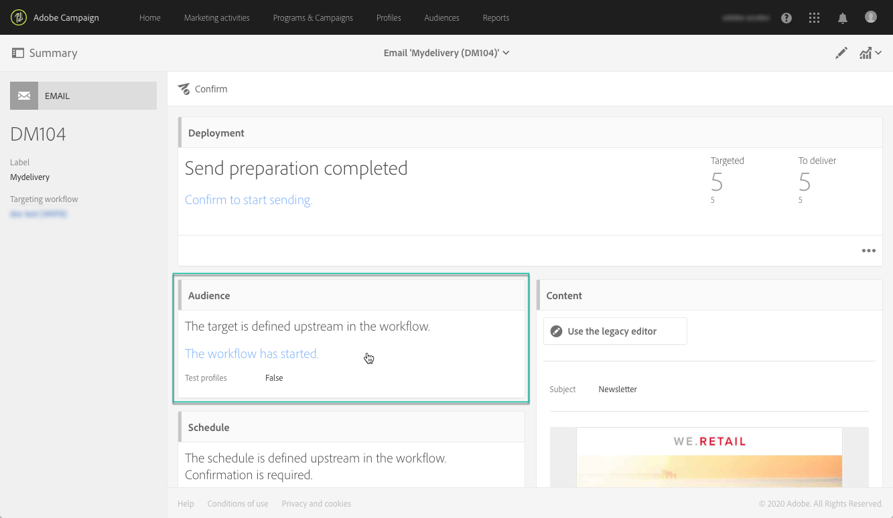
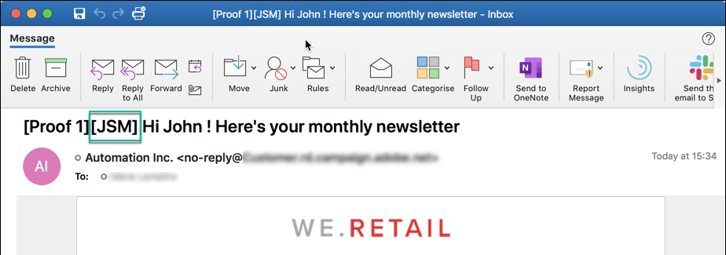
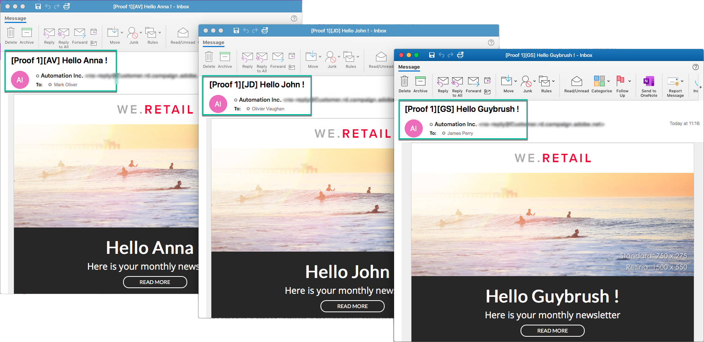

# E-mailberichten testen met behulp van doelprofielen {#testing-message-profiles}

## Overzicht {#overview}

Naast [testprofielen](../../audiences/using/managing-test-profiles.md) kunt u een e-mailbericht testen door uzelf in de positie van een van de beoogde profielen te plaatsen. Op deze manier kunt u een exacte weergave krijgen van het bericht dat het profiel ontvangt (aangepaste velden, dynamische en persoonlijke gegevens, inclusief aanvullende gegevens van workflows...).

>[!NOTE]
>
> Deze functie is alleen beschikbaar bij e-mailberichten.

De belangrijkste stappen zijn:

1. Configureer uw bericht en start vervolgens de fase **Preparation**.
1. **Selecteer een of meerdere** profielen onder de profielen die het bericht als doel heeft.
1. Koppel aan elk profiel een **vervangend adres** waarnaar proefdrukken worden verzonden.
1. (optioneel) Voor elk profiel definieert u een **voorvoegsel** om toe te voegen aan de onderwerpregel van de proefdruk.
1. **Een** voorvertoning weergeven van de e-mailontwerper hoe het bericht voor de profielen wordt weergegeven.
1. Verzend de proefdrukken.

>[!IMPORTANT]
>
>Met deze functie kunt u persoonlijke profielgegevens naar externe e-mailadressen verzenden. Houd er rekening mee dat door het uitvoeren van privacyaanvragen (GDPR en CCPA) in Campaign Standard deze aanvraag NIET extern wordt uitgevoerd.

 [Ontdek deze functie in video](#video)

## Profielen en vervangingsadressen selecteren {#selecting-profiles}

Als u doelprofielen wilt gebruiken voor tests, moet u deze eerst selecteren en vervolgens de vervangende adressen definiëren waarop de proefdrukken worden uitgevoerd. Hiervoor kunt u [specifieke profielen selecteren](#selecting-individual-profiles) onder de doelprofielen of [importprofielen uit een bestaand publiek](#importing-from-audience).

>[!NOTE]
>
>U kunt maximaal 100 profielen selecteren om te testen.

### Afzonderlijke profielen selecteren {#selecting-individual-profiles}

1. Controleer in het berichtdashboard of het bericht is voorbereid en klik vervolgens op het blok **[!UICONTROL Audience]**.

   

1. Klik op het tabblad **[!UICONTROL Profile substitutions]** op de knop **[!UICONTROL Create element]** om de profielen te selecteren die u wilt gebruiken voor testen.

   

1. Klik op de knop Profielselectie om de lijst weer te geven met profielen die het bericht als doel heeft.

   

1. Selecteer het profiel dat u voor de test wilt gebruiken en voer in het veld **[!UICONTROL Address]** het gewenste vervangende adres in en klik op **[!UICONTROL Confirm]**. Alle proefdrukken voor het profiel worden naar dit e-mailadres verzonden en niet naar het adres dat in de database voor dit profiel is gedefinieerd.

   Als u een specifiek voorvoegsel wilt toevoegen aan de onderwerpregel van de proefdrukken, vult u het veld **[!UICONTROL Subject line prefix]** in.

   >[!NOTE]
   >
   >Het voorvoegsel van de onderwerpregel kan maximaal 500 tekens bevatten.

   

   Het voorvoegsel wordt als volgt weergegeven:

   

1. Het profiel wordt aan de lijst toegevoegd met het bijbehorende vervangende adres en voorvoegsel. Herhaal bovenstaande stappen voor alle profielen die u voor het testen wilt gebruiken, en klik dan **[!UICONTROL Confirm]**.

   

   Als u een proef naar veelvoudige substitutieadressen voor een zelfde profiel wilt verzenden, moet u dit profiel zo vele tijden toevoegen zoals vereist.

   In het onderstaande voorbeeld wordt de proefdruk op basis van het profiel John Smith verzonden naar twee verschillende vervangende adressen:

   

1. Wanneer alle profielen en vervangingsadressen zijn gedefinieerd, kunt u een proefdruk verzenden om het bericht te testen. Klik hiertoe op de knop **[!UICONTROL Test]** en selecteer het type test dat u wilt uitvoeren.

   Als er geen testprofiel aan het doel van het bericht is toegevoegd, zijn de opties **[!UICONTROL Email rendering]** en **[!UICONTROL Proof + Email rendering]** niet beschikbaar.  Raadpleeg [deze sectie](../../sending/using/sending-proofs.md) voor meer informatie over het verzenden van proefdrukken.

   

>[!IMPORTANT]
>
>Als u een wijziging aanbrengt in uw bericht, moet u de voorbereiding van het bericht opnieuw starten. Anders worden de wijzigingen niet doorgevoerd in de proefdruk.

### Profielen importeren uit een publiek {#importing-from-audience}

Met Campaign Standard kunt u een publiek met profielen importeren dat u kunt gebruiken voor tests. Zo kunt u bijvoorbeeld een hele reeks berichten voor verschillende profielen naar een uniek e-mailadres verzenden.

Bovendien als uw publiek reeds met de adres en prefixkolommen wordt gevormd, zult u deze informatie in **[!UICONTROL Profile substitutions]** tabel kunnen invoeren. Een voorbeeld van publieksimporteren met substitutieadressen wordt gedetailleerd in [deze sectie](#use-case).

>[!NOTE]
>
>Wanneer het invoeren van een publiek, slechts worden de profielen die aan het berichtdoel beantwoorden geselecteerd en aan **[!UICONTROL Profile substitutions]** tabel toegevoegd.

Voer de volgende stappen uit om profielen te importeren die u wilt gebruiken voor tests vanuit een publiek:

1. Controleer in het berichtdashboard of de berichtvoorbereiding is gelukt en klik op het blok **[!UICONTROL Audience]**.

   

1. Klik op het tabblad **[!UICONTROL Profile substitutions]** op **[!UICONTROL Import from an audience]**.

   

1. Selecteer het publiek dat u wilt gebruiken en voer vervolgens het vervangende adres en het voorvoegsel in dat u wilt gebruiken voor de proefdrukken die naar het publiek worden verzonden.

   >[!NOTE]
   >
   >Het voorvoegsel van de onderwerpregel kan maximaal 500 tekens bevatten.

   

   Als de te gebruiken substitutieadressen en/of voorvoegsels reeds in uw publiek zijn bepaald, selecteer **[!UICONTROL From Audience]** optie, dan specificeer de kolom om deze informatie terug te winnen.

   

1. Klik op de knop **[!UICONTROL Import]**. De profielen van het publiek die aan het berichtdoel beantwoorden worden toegevoegd aan **[!UICONTROL Profile substitution]** tabel, evenals de bijbehorende vervangingsadressen en voorvoegsels.

>[!NOTE]
>
>Als u hetzelfde publiek nogmaals importeert met verschillende vervangende adressen en/of voorvoegsels, worden de profielen toegevoegd aan de lijst, naast de profielen die u eerder hebt geïmporteerd.

## Een voorbeeld van het bericht weergeven met de doelprofielen

>[!NOTE]
>
>Voorvertoning is alleen beschikbaar bij E-mailontwerper.

Als u berichten wilt voorvertonen met behulp van doelprofielen, moet u deze profielen toevoegen aan de lijst **[!UICONTROL Profile substitution]** (zie [Profielen en vervangende adressen definiëren](#selecting-profiles)).

Als u verpersoonlijkingsgebieden in het bericht wilt gebruiken, moeten zij **vóór** worden toegevoegd om de berichtvoorbereiding te lanceren. Anders wordt hiermee in de voorvertoning geen rekening gehouden. Dientengevolge, zorg ervoor u de berichtvoorbereiding opnieuw begint als om het even welke verandering in de verpersoonlijkingsgebieden wordt aangebracht.

Voer de volgende stappen uit om berichten voor te vertonen met behulp van profielvervanging:

1. Klik in het berichtendashboard op de momentopname van de inhoud om het bericht te openen in E-mailontwerper.

   

1. Selecteer de tab **[!UICONTROL Preview]** en klik vervolgens op **[!UICONTROL Change profile]**.

   

1. Klik op het tabblad **[!UICONTROL Profile Substitution]** om de vervangende profielen weer te geven die voor testen zijn toegevoegd.

   Selecteer de profielen die u voor voorvertoning wilt gebruiken en klik op **[!UICONTROL Select]**.

   

1. Er wordt een voorbeeld van het bericht weergegeven. Gebruik de pijlen om tussen de geselecteerde profielen te navigeren.

   

## Gebruiksscenario {#use-case}

In dit geval willen we een gepersonaliseerde e-mailnieuwsbrief sturen naar een set specifieke profielen. Voordat u de nieuwsbrief verzendt, wilt u deze met een aantal van de beoogde profielen bekijken en proefdrukken verzenden naar interne e-mailadressen die in een extern bestand zijn gedefinieerd.

De belangrijkste stappen voor dit gebruik zijn als volgt:

1. Maak het publiek dat u wilt gebruiken voor testen.
1. Een workflow maken om profielen als doel in te stellen en de nieuwsbrief te verzenden.
1. Configureer de vervangende profielen van het bericht.
1. Geef een voorvertoning van het bericht weer met behulp van de beoogde profielen.
1. Verzend proeven.

### Stap 1: Het publiek maken dat moet worden gebruikt voor tests

1. Bereid het bestand voor om te importeren en het publiek te maken. In ons geval moet het het vervangende adres bevatten dat voor de proefdruk moet worden gebruikt, en een voorvoegsel dat aan de onderwerpregel van de proefdruk moet worden toegevoegd.

   In dit voorbeeld ontvangt het e-mailadres &quot;oliver.vaughan@internal.com&quot; een bewijs van het bericht voor het profiel met het e-mailadres &quot;john.doe@mail.com&quot;. Het voorvoegsel &#39;JD&#39; wordt toegevoegd aan de onderwerpregel van de proefdruk.

   

1. Bouw het werkschema om een publiek van het dossier tot stand te brengen. Hiervoor voegt u de volgende activiteiten toe en configureert u deze:

   * **[!UICONTROL Load file]** activiteit: Hiermee importeert u het CSV-bestand (raadpleeg  [deze sectie](../../automating/using/load-file.md) voor meer informatie over deze activiteit).
   * **[!UICONTROL Reconciliation]** activiteit: Koppelt informatie uit het bestand aan informatie uit de database. In dit voorbeeld gebruiken we het e-mailadres van het profiel als verzoeningsveld (voor meer informatie over deze activiteit verwijst u naar [deze sectie](../../automating/using/reconciliation.md)).
   * **[!UICONTROL Save audience]** activiteit: Hiermee maakt u een publiek op basis van het geïmporteerde bestand (raadpleeg  [deze sectie](../../automating/using/save-audience.md) voor meer informatie over deze activiteit).

   

1. Voer de workflow uit en ga naar het tabblad **[!UICONTROL Audiences]** om te controleren of het publiek met de gewenste informatie is gemaakt.

   In dit voorbeeld bestaat het publiek uit drie profielen. Elk van deze is gekoppeld aan een vervangend e-mailadres dat de proefdruk ontvangt, met een voorvoegsel voor gebruik op de onderwerpregel van de proefdruk.

   

### Stap 2: Een workflow maken om profielen als doel in te stellen en de nieuwsbrief te verzenden

1. Voeg **[!UICONTROL Query]** en **[!UICONTROL Email delivery]** activiteiten toe, dan vormen hen volgens uw behoeften (zie [Vraag](../../automating/using/query.md) en [E-maillevering](../../automating/using/email-delivery.md) secties).

   

1. Voer de workflow uit en controleer of het bericht is voorbereid.

### Stap 3: Het tabblad Profielvervanging van het bericht configureren

1. Open de **[!UICONTROL Email delivery]** activiteit. Klik in het berichtdashboard op het blok **[!UICONTROL Audience]**.

   

1. Selecteer de tab **[!UICONTROL Profile substitutions]** en klik vervolgens op **[!UICONTROL Import from an audience]**.

   

1. Selecteer in het veld **[!UICONTROL Audience]** het publiek dat u in het bestand hebt gemaakt.

   

1. Definieer het vervangende adres en het voorvoegsel van de onderwerpregel die u wilt gebruiken wanneer u de proefdrukken verzendt.

   Om dit te doen, selecteer **[!UICONTROL From audience]** optie, dan de kolom van het publiek dat de informatie bevat.

   

1. Klik op de knop **[!UICONTROL Import]**. Profielen van het publiek worden aan de lijst toegevoegd met de bijbehorende vervangende adressen en voorvoegsels van onderwerpregel.

   

   >[!NOTE]
   >
   >In ons geval zijn alle profielen van het publiek het doelprofiel van de activiteit **[!UICONTROL Query]**. Als een van deze profielen geen deel uitmaakte van het berichtdoel, zou het niet aan de lijst worden toegevoegd.

### Stap 4: Een voorbeeld van het bericht weergeven met de doelprofielen

1. Klik in het berichtendashboard op de momentopname van de inhoud om het bericht te openen in E-mailontwerper.

   

1. Selecteer de tab **[!UICONTROL Preview]** en klik vervolgens op **[!UICONTROL Change profile]**.

   

1. Klik op het tabblad **[!UICONTROL Profile Substitution]** om de eerder toegevoegde vervangingsprofielen weer te geven.

   Selecteer de profielen die u voor voorvertoning wilt gebruiken en klik op **[!UICONTROL Select]**.

   

1. Er wordt een voorbeeld van het bericht weergegeven. Gebruik de pijlen om tussen de geselecteerde profielen te navigeren.

   

### Stap 5: Proefdrukken verzenden

1. Klik in het berichtdashboard op de knop **[!UICONTROL Test]** en bevestig vervolgens.

   

1. De proefdrukken worden verzonden volgens wat op **[!UICONTROL Profile substitutions]** tabel is gevormd.

   

## Video over zelfstudie {#video}

In deze video ziet u hoe u e-mailberichten kunt testen met behulp van Profielvervanging.

>[!VIDEO](https://video.tv.adobe.com/v/32368?quality=12)

Er zijn [hier](https://experienceleague.adobe.com/docs/campaign-standard-learn/tutorials/overview.html?lang=nl) extra Campaign Standard hoe kan ik-video&#39;s beschikbaar.
