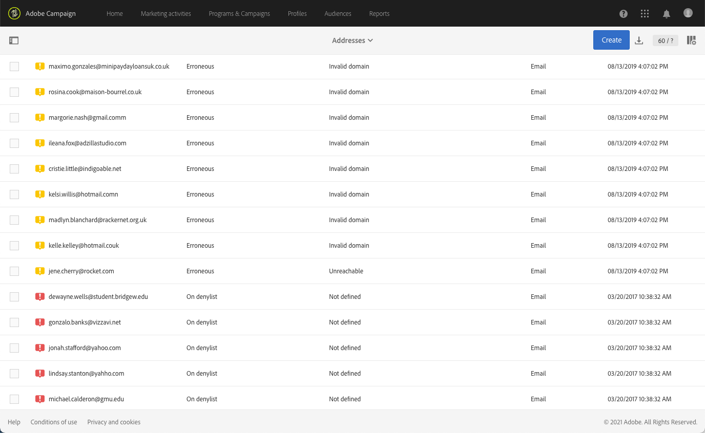
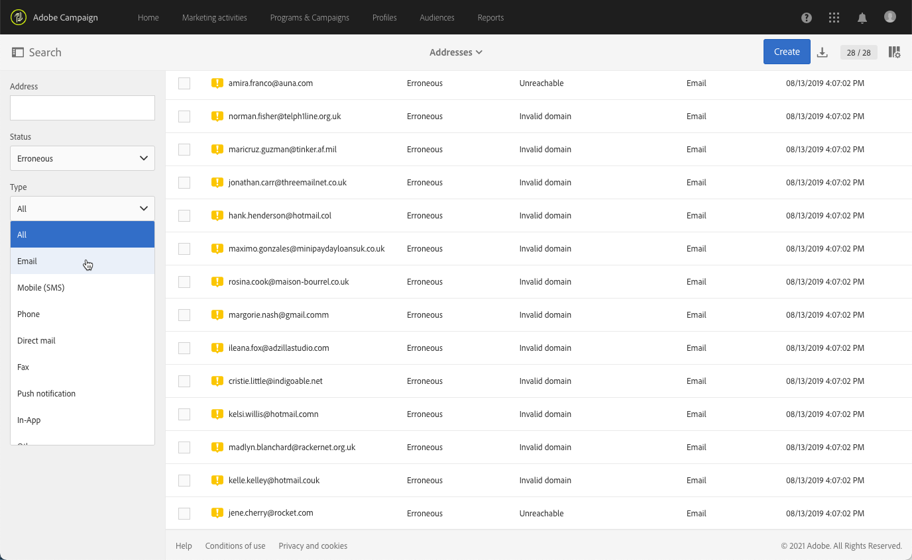
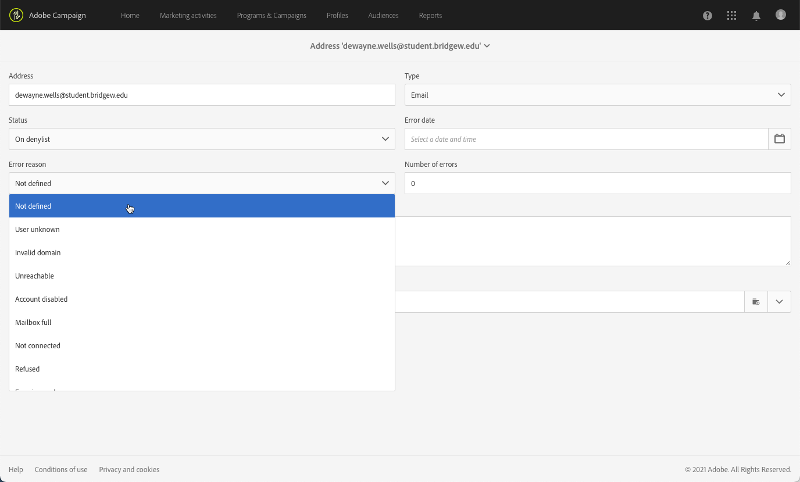
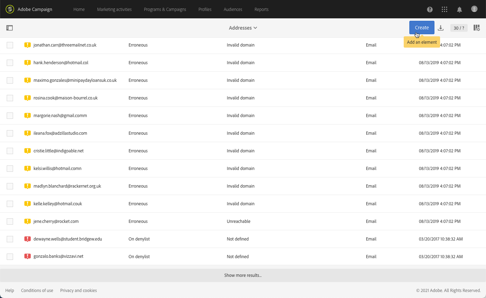
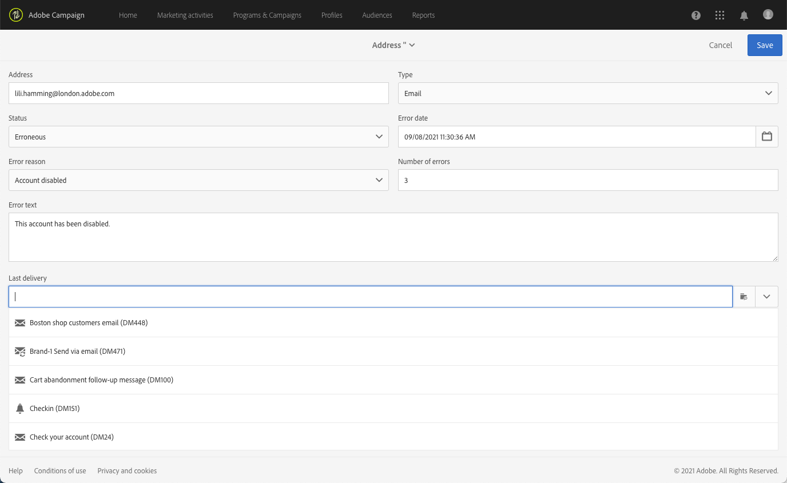
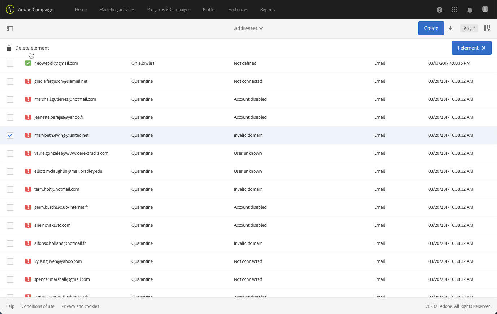
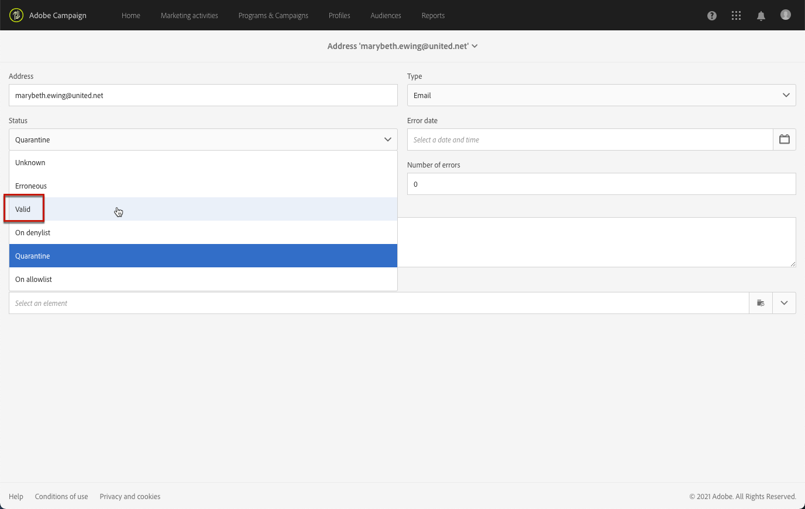
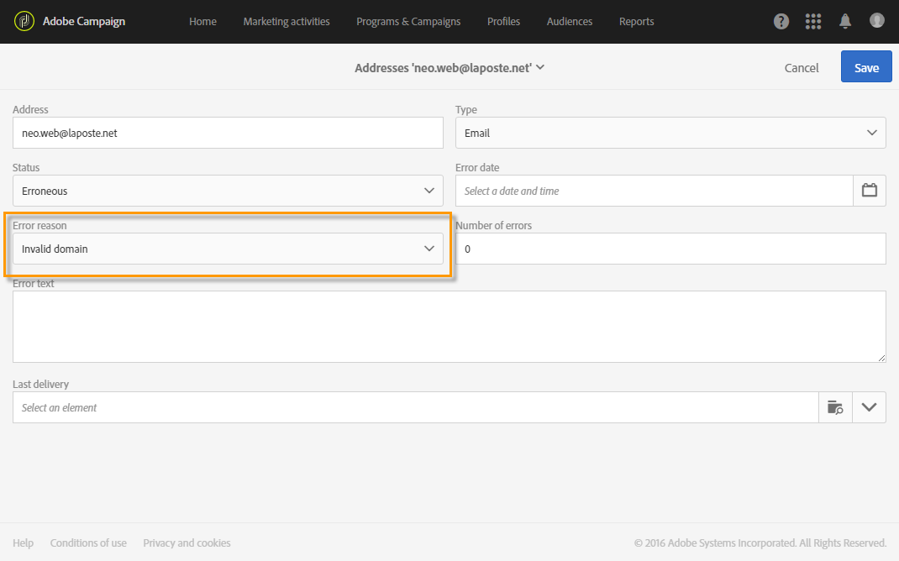

# quarantainebeheer{#understanding-quarantine-management}

## Informatie over quarantines {#about-quarantines}

Een e-mailadres of een telefoonaantal kunnen in quarantined worden, bijvoorbeeld, wanneer de brievenbus volledig is of als het adres niet bestaat.

In elk geval, voldoet de quarantaineprocedure aan specifieke regels die in dit [&#x200B; worden beschreven sectie &#x200B;](#conditions-for-sending-an-address-to-quarantine).

### De levering optimaliseren via quarantines {#optimizing-your-delivery-through-quarantines}

De profielen waarvan e-mailadressen of telefoonaantal in quarantaine zijn worden automatisch uitgesloten tijdens berichtvoorbereiding (zie [&#x200B; het identificeren van quarantined adressen voor een levering &#x200B;](#identifying-quarantined-addresses-for-a-delivery)). Dit zal leveranties versnellen, aangezien het foutenpercentage een significant effect op leveringssnelheid heeft.

Sommige internetproviders beschouwen e-mails automatisch als spam als de snelheid van ongeldige adressen te hoog is. Met quarantaine kunt u dus voorkomen dat deze providers aan de lijst van gewezen personen worden toegevoegd.

Bovendien helpen quarantines de verzendkosten van SMS te verminderen door onjuiste telefoonaantallen van leveringen uit te sluiten.

Voor meer op beste praktijken om uw leveringen te beveiligen en te optimaliseren, verwijs naar [&#x200B; deze pagina &#x200B;](../../sending/using/delivery-best-practices.md).

### Quarantine versus Lijst van gewezen personen {#quarantine-vs-denylist}

Quarantaine en lijst van gewezen personen zijn niet van toepassing op hetzelfde object:

* **quarantaine** is slechts op een **adres** (of telefoonaantal, enz.), niet op het profiel zelf van toepassing. Een profiel waarvan het e-mailadres in quarantaine is geplaatst, kan bijvoorbeeld zijn profiel bijwerken en een nieuw adres invoeren. Dit profiel kan dan opnieuw worden geactiveerd door leveringsacties. Eveneens, als twee profielen gebeuren om het zelfde telefoonaantal te hebben, zullen zij allebei worden beïnvloed als het aantal quarantined is.

  De quarantined adressen of telefoonaantallen worden getoond in [&#x200B; uitsluitingslogboeken &#x200B;](#identifying-quarantined-addresses-for-a-delivery) (voor een levering) of in de [&#x200B; quarantainelijst &#x200B;](#identifying-quarantined-addresses-for-the-entire-platform) (voor het volledige platform).

* Het zijn op de **lijst van gewezen personen**, anderzijds, zal in het **profiel** resulteren niet meer door de levering, zoals na een unsubscription (opt-out), voor een bepaald kanaal wordt gericht. Als een profiel op de lijst van gewezen personen voor het e-mailkanaal bijvoorbeeld twee e-mailadressen heeft, worden beide adressen van levering uitgesloten. Voor meer op het proces van de lijst van gewezen personen, verwijs naar [&#x200B; Ongeveer opt-in en opt-out in Campagne &#x200B;](../../audiences/using/about-opt-in-and-opt-out-in-campaign.md).

  In de sectie **[!UICONTROL No longer contact (on denylist)]** van het tabblad **[!UICONTROL General]** van het profiel kunt u controleren of er zich op de lijst van gewezen personen een of meer kanalen bevinden in de sectie  van het profiel. Zie [&#x200B; deze sectie &#x200B;](../../audiences/using/managing-opt-in-and-opt-out-in-campaign.md#managing-opt-in-and-opt-out-from-a-profile).

>[!NOTE]
>
>De quarantaine omvat een **op de status van de lijst van gewezen personen**, die van toepassing is wanneer de ontvangers uw bericht als spam melden of op een bericht van SMS met een sleutelwoord zoals &quot;STOP&quot;antwoorden. In dat geval wordt het betreffende adres of telefoonnummer van het profiel naar quarantaine verzonden met de status **[!UICONTROL On denylist]** . Voor meer bij het beheren van STOP SMS berichten, verwijs naar [&#x200B; deze sectie &#x200B;](../../channels/using/managing-incoming-sms.md#managing-stop-sms).

<!--When a user replies to an SMS message with a keyword such as STOP in order to opt-out from SMS deliveries, his profile is not added to the denylist like in the email opt-out process. Instead, the profile's phone number is sent to quarantine with the **[!UICONTROL On denylist]** status. This status refers to the phone number only, meaning that the profile will continue receiving email messages. Also, if the profile has another phone number, he can still receive SMS messages on the other number. For more on this, refer to [this section](../../channels/using/managing-incoming-sms.md#managing-stop-sms).-->

## In quarantaine geplaatste adressen identificeren {#identifying-quarantined-addresses}

De gekwalificeerde adressen kunnen voor een specifieke levering of voor het volledige platform worden getoond.

<!--
If you need to remove an address from quarantine, contact your technical administrator.
-->

### Het identificeren van quarantined adressen voor een levering {#identifying-quarantined-addresses-for-a-delivery}

De gekwantificeerde adressen voor een specifieke levering zijn vermeld tijdens de leveringsvoorbereidingsfase, in het **[!UICONTROL Exclusion logs]** lusje van het leveringsdashboard (zie [&#x200B; deze sectie &#x200B;](../../sending/using/monitoring-a-delivery.md#exclusion-logs)). Voor meer bij leveringsvoorbereiding, verwijs naar [&#x200B; deze sectie &#x200B;](../../sending/using/preparing-the-send.md).

### Het identificeren van quarantined adressen voor het volledige platform {#identifying-quarantined-addresses-for-the-entire-platform}

Beheerders hebben via het menu **[!UICONTROL Administration > Channels > Quarantines > Addresses]** toegang tot de gedetailleerde lijst met e-mailadressen in quarantaine voor het gehele platform.

<!--
This menu lists quarantined elements for **Email**, **SMS** and **Push notification** channels.
-->

>[!NOTE]
>
>De toename van het aantal quarantaine is een normaal effect dat verband houdt met de &quot;slijtage&quot; van de database. Bijvoorbeeld, als het leven van een e-mailadres wordt beschouwd als drie jaar en de ontvankelijke lijst stijgt met 50% elk jaar, kan de verhoging in quarantines als volgt worden berekend: Eind van Jaar 1: (1 &#42; 0.33)/(1+0.5)=22%. Eind van Jaar 2: (1.22 &#42; 0.33) + 0.33)/(1.5+0.75)=32.5%.

Er zijn filters beschikbaar waarmee u door de lijst kunt bladeren. U kunt filteren op adres, status en/of kanaal.

U kunt uitgeven of [&#x200B; schrappen &#x200B;](#removing-a-quarantined-address) elke ingang, evenals nieuwe degenen creëren.

Als u een item wilt bewerken, klikt u op de desbetreffende rij en wijzigt u de velden naar wens.

Als u handmatig een nieuwe vermelding wilt toevoegen, gebruikt u de knop **[!UICONTROL Create]** .

Bepaal het adres (of telefoonaantal, enz.) en kanaaltype. U kunt een status instellen om in de quarantainelijst te staan en een reden voor een fout. U kunt ook de datum aangeven waarop de fout is opgetreden, het aantal fouten en de fouttekst invoeren. Selecteer zo nodig de laatste levering die naar het adres is verzonden in de vervolgkeuzelijst.

## Een adres uit quarantaine verwijderen {#removing-a-quarantined-address}

### Automatische updates {#unquarantine-auto}

Adressen die specifieke voorwaarden aanpassen worden automatisch geschrapt uit de quarantainelijst door het opschoonwerkschema van het Gegevensbestand. Leer meer over technische werkschema&#39;s, zie [&#x200B; deze sectie &#x200B;](../../administration/using/technical-workflows.md#list-of-technical-workflows).

De adressen worden automatisch verwijderd uit de quarantainelijst in de volgende gevallen:

* Adressen in de status **[!UICONTROL Erroneous]** worden na een geslaagde levering uit de quarantainelijst verwijderd.
* Adressen in een status **[!UICONTROL Erroneous]** worden uit de quarantainelijst verwijderd als de laatste zachte stuit meer dan 10 dagen geleden plaatsvond. Voor meer op softfoutenbeheer, zie [&#x200B; deze sectie &#x200B;](#soft-error-management).
* Adressen in een **[!UICONTROL Erroneous]** -status die met de **[!UICONTROL Mailbox full]** -fout zijn gemarkeerd, worden na 30 dagen uit de quarantainelijst verwijderd.

De status verandert vervolgens in **[!UICONTROL Valid]** .

Het maximumaantal uit te voeren pogingen in het geval van **[!UICONTROL Erroneous]** status en de minimumvertraging tussen pogingen zijn nu gebaseerd op hoe goed IP zowel historisch als momenteel bij een bepaald domein uitvoert.

>[!IMPORTANT]
>
>Ontvangers met een adres in de status **[!UICONTROL Quarantine]** of **[!UICONTROL Denylisted]** worden nooit verwijderd, zelfs niet als ze een e-mail ontvangen.

### Handmatige updates {#unquarantine-manual}

U kunt een adres ook handmatig uit de quarantaine verwijderen.  Als u een adres handmatig uit de quarantainelijst wilt verwijderen, kunt u het uit de quarantainelijst verwijderen of de status ervan wijzigen in **[!UICONTROL Valid]** .

* Selecteer het adres in de lijst **[!UICONTROL Administration > Channels > Quarantines > Addresses]** en selecteer **[!UICONTROL Delete element]** .

  

* Selecteer een adres en wijzig **[!UICONTROL Status]** in **[!UICONTROL Valid]** .

  

### Bulkupdates {#unquarantine-bulk}

U zou bulkupdates op de quarantainelijst, bijvoorbeeld in het geval van een ISP stroomonderbreking kunnen moeten uitvoeren. In dat geval worden e-mails ten onrechte als bonnen gemarkeerd omdat ze niet met succes aan de ontvanger kunnen worden bezorgd. Deze adressen moeten uit de quarantainelijst worden verwijderd.

Om dit te doen, creeer een werkschema en voeg een **[!UICONTROL Query]** activiteit op uw quarantainetabel toe om alle beïnvloede ontvangers uit te filteren. Als deze eenmaal zijn geïdentificeerd, kunnen ze uit de quarantainelijst worden verwijderd en worden opgenomen in toekomstige e-mailleveringen voor campagnes.

Gebaseerd op het tijdkader van het incident, hieronder zijn de geadviseerde richtlijnen voor deze vraag.

* **de tekst van de Fout (quarantainetekst)** bevat &quot;550-5.1.1&quot;EN **Tekst van de Fout (quarantainetekst)** bevat &quot;support.ISP.com&quot;

  waar &quot;support.ISP.com&quot; kan zijn: bijvoorbeeld &quot;support.apple.com&quot; of &quot;support.google.com&quot;

* **status van de Update (@lastModified)** op of na `MM/DD/YYYY HH:MM:SS AM`
* **status van de Update (@lastModified)** op of vóór `MM/DD/YYYY HH:MM:SS PM`

Als u de lijst met betrokken ontvangers hebt, voegt u een **[!UICONTROL Update data]** -activiteit toe om de status van hun e-mailadres in te stellen op **[!UICONTROL Valid]** , zodat ze uit de quarantainelijst worden verwijderd via de **[!UICONTROL Database cleanup]** -workflow. U kunt ze ook gewoon uit de quarantainetabel verwijderen.

## Voorwaarden voor verzending van een adres naar quarantaine {#conditions-for-sending-an-address-to-quarantine}

Adobe Campaign beheert quarantaine volgens het type van de leveringsmislukking en de reden die tijdens de kwalificatie van foutenmeldingen (zie [&#x200B; de mislukkingstypen en de redenen van de Levering &#x200B;](../../sending/using/understanding-delivery-failures.md#delivery-failure-types-and-reasons) en [&#x200B; de postkwalificatie van de Stuiteren &#x200B;](../../sending/using/understanding-delivery-failures.md#bounce-mail-qualification)) wordt toegewezen.

* **Genegeerde fout**: de genegeerde fouten verzenden geen adres naar quarantaine.
* **Harde fout**: het overeenkomstige e-mailadres wordt onmiddellijk verzonden naar quarantaine.
* **Zachte fout**: de zachte fouten verzenden onmiddellijk geen adres naar quarantaine, maar zij verhogen een foutenteller. Voor meer op dit, zie [&#x200B; Zacht foutenbeheer &#x200B;](#soft-error-management).

  <!--
  When the error counter reaches the limit threshold, the address goes into quarantine. In the default configuration, the threshold is set at five errors, where two errors are significant if they occur at least 24 hours apart. The address is placed in quarantine at the fifth error. The error counter threshold can be modified. For more on this, refer to this [page](../../administration/using/configuring-email-channel.md#email-channel-parameters).
  When a delivery is successful after a retry, the error counter of the address which was prior to that quarantined is reinitialized. The address status changes to **[!UICONTROL Valid]** and it is deleted from the list of quarantines after two days by the **[!UICONTROL Database cleanup]** workflow.
  -->

Als een gebruiker een e-mail als spam ([&#x200B; kwalificeert koppelt lijn &#x200B;](https://experienceleague.adobe.com/docs/deliverability-learn/deliverability-best-practice-guide/transition-process/infrastructure.html#feedback-loops)), wordt het bericht automatisch opnieuw gericht naar een technische brievenbus die door Adobe wordt geleid. Het e-mailadres van de gebruiker wordt vervolgens automatisch naar quarantaine verzonden met de status **[!UICONTROL On denylist]** . Deze status verwijst alleen naar het adres, het profiel staat niet op de lijst van gewezen personen, zodat de gebruiker SMS-berichten en pushberichten blijft ontvangen.

>[!NOTE]
>
>Quarantine in Adobe Campaign is hoofdlettergevoelig. Importeer e-mailadressen in kleine letters, zodat ze later niet opnieuw worden toegewezen.

In de lijst van quarantined adressen (zie [&#x200B; het identificeren van quarantined adressen voor het volledige platform &#x200B;](#identifying-quarantined-addresses-for-the-entire-platform)), wijst het **[!UICONTROL Error reason]** gebied erop waarom het geselecteerde adres in quarantaine werd geplaatst.

### Beheer van zachte fouten {#soft-error-management}

In tegenstelling tot harde fouten, verzenden de zachte fouten onmiddellijk geen adres naar quarantaine, maar zij verhogen in plaats daarvan een foutenteller.

De pogingen zullen tijdens de [&#x200B; leveringsduur &#x200B;](../../administration/using/configuring-email-channel.md#validity-period-parameters) worden uitgevoerd. Wanneer de foutenteller de grensdrempel bereikt, gaat het adres in quarantaine. Voor meer op dit, verwijs naar [&#x200B; probeert na een tijdelijke mislukking van de levering &#x200B;](understanding-delivery-failures.md#retries-after-a-delivery-temporary-failure).

<!--
In the default configuration, the threshold is set at five errors, where two errors are significant if they occur at least 24 hours apart. The address is placed in quarantine at the fifth error.
The error counter threshold can be modified.
-->

De foutenteller wordt opnieuw geïnitialiseerd als de laatste significante fout meer dan 10 dagen geleden voorkwam. De adresstatus verandert dan in **Geldig** en het wordt geschrapt van de lijst van quarantines door het **schoonmaakbeurt van het Gegevensbestand** werkschema. (Voor meer op technische werkschema&#39;s, zie [&#x200B; deze sectie &#x200B;](../../administration/using/technical-workflows.md#list-of-technical-workflows).)
