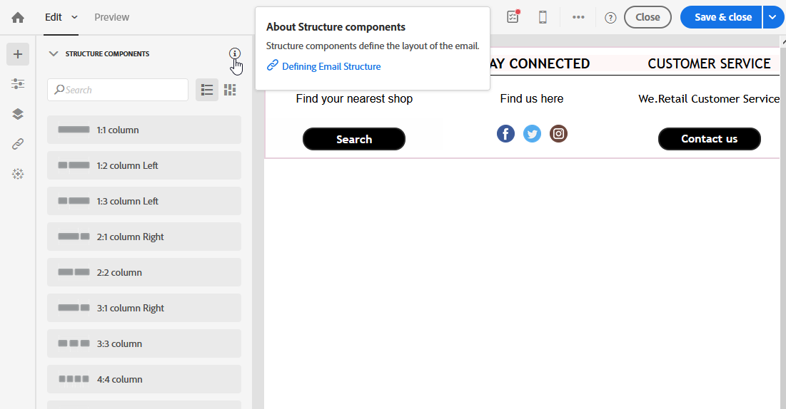

# Toegankelijkheid in Adobe Campaign Standard {#accessibility-acs}

Ontdek meer over toegankelijkheidsondersteuning in Adobe Campaign Standard Workspace.

Toegankelijkheid betekent het bruikbaar maken van producten voor mensen met een visuele, auditieve, cognitieve, motorische of andere handicap. Voorbeelden van toegankelijkheidsfuncties voor softwareproducten zijn semantisch gestructureerde content, ondersteuning van schermlezers, tekstequivalenten voor afbeeldingen, sneltoetsen enzovoort.

Adobe Campaign Standard biedt functies die de software toegankelijker maken, zoals contrast, labels, gestructureerde content, toetsenbordnavigatie en contextafhankelijke Help.

## Toegankelijkheidsfuncties {#accessibility-features}

### Contrast en kleur {#contrast}

De gebruikersinterface van Adobe Campaign Standard streeft ernaar in de applicatie voldoende contrast te bieden voor een toegankelijke kijkervaring voor gebruikers met een slecht gezichtsvermogen of verminderd kleurenzicht.

* Grote tekst en koppen zijn verbeterd en hebben nu een contrastverhouding van 3:1.

   

* Help-inhoud en platte tekst in de applicatie zijn bijgewerkt en hebben een contrastverhouding van 4,5:1.

* De pictogrammen voor het pauzeren en annuleren van workflows zijn bijgewerkt om het contrast tussen achtergrond- en voorgrondkleuren te verbeteren.

   

* Kleur, vorm en locatie zijn niet de enige methoden die worden gebruikt om informatie of hiërarchie in de applicatie over te brengen.

### Gebruikersinterface {#user-interface}

De gebruikersinterface van Adobe Campaign Standard maakt het werken met content voor alle gebruikers gemakkelijker door alternatieve teksten aan visuele elementen toe te voegen en door semantische structuur te gebruiken om informatie zowel visueel als softwarematig over te brengen.

* Wanneer de gebruiker een vereist id-veld leeg laat, wordt met een afbeelding en een foutmelding visueel aangegeven welk veld fout is en wordt dezelfde informatie softwarematig aan gebruikers doorgegeven met ondersteunende technologieën zoals schermlezers.

   

* Content die wordt weergegeven wanneer de muis ergens boven wordt gehouden of wanneer de focus wordt verplaatst, kan door de gebruiker worden genegeerd en verbergt andere content niet.

   

* Alternatieve teksten voor afbeeldingen en toegankelijke namen voor knoppen zijn toegevoegd en kunnen hardop worden voorgelezen met ondersteunende technologie in plaats van alleen te vertrouwen op visuele indicatoren voor het identificeren van elementen.

<!--
### Create responsive resize for multiple devices {#resize-devices}

When designing for multiple devices and platforms, it's important to create a seamless experience for screen sizes across mobile and desktop resolutions.

Adobe Campaign Standard allows you to design and test emails and push notifications on different devices such as: iPhone, Android devices, iPad, Android tablet and desktop.

-->

## Contextafhankelijke Help {#contextual-help}

Met de contextafhankelijke Help kunt u de verschillende gevraagde velden en functies beter begrijpen. De Help begeleidt u ook door productdocumentatie om meer informatie te vinden over de geselecteerde functie.

Bij het ontwerpen van een e-mail kunt u knopinfo openen, met beschrijvingen van functies en koppelingen naar de productdocumentatie.

## Ondersteuning van ondersteunende technologie {#screen-magnifiers}

We streven ernaar de Adobe Campaign Standard-applicatie zo bruikbaar mogelijk te maken met verschillende ondersteunende technologieën, zoals bijvoorbeeld aangepaste toetsenborden, schermvergrotingssoftware, schermlezers, spraakherkenningssoftware en andere hulpapparaten.

## Werken in uw voorkeurstaal {#languages}

Adobe Campaign Standard is beschikbaar in verschillende talen: Engels, Frans en Duits.

De taal wordt ingesteld bij de installatie en kan daarna niet worden meer gewijzigd.

## Sneltoetsen {#shortcuts}

### Startpagina {#homepage-shortcuts}

| Sneltoets | Actie |
|:-:|:-:|
| Tab | Navigeren door afzonderlijke elementen van de gebruikersinterface |
| Enter of spatiebalk | Het geselecteerde item activeren |

### Email Designer {#email-designer-shortcuts}

| Sneltoets | Actie |
|:-:|:-:|
| Ctrl + Z | Ongedaan maken |
| Ctrl + Y | Opnieuw |

### Dynamische rapporten {#report-shortcuts}

| Sneltoets | Actie |
|:-:|:-:|
| Ctrl + O | Project openen |
| Ctrl + S | Opslaan |
| Shift + Ctrl + S | Opslaan als |
| Alt + R | Project vernieuwen |
| Shift + Ctrl + V | CSV downloaden |
| Alt + P | Afdrukken |
| Ctrl + Z | Ongedaan maken |
| Ctrl + Shift + Z | Opnieuw |
| Alt + B | Nieuw leeg deelvenster |
| Alt + A | Nieuwe vrije vorm |
| Alt + 1 | Nieuwe vrije-vormlijst |
| Alt + 2 | Nieuwe regel |
| Alt + 3 | Nieuwe balk |
| Alt + S | Rapport nu verzenden |
| Shift + Alt + S | Rapport verzenden volgens planning |
| Shift = Alt + L | Geplande rapporten |

## Meer informatie {#further-reading}

Adobe Campaign Standard streeft naar een steeds grotere mate van toegankelijkheid, waardoor het product voor iedereen gebruiksvriendelijk wordt.

We raden u aan om het [feedbackformulier Adobe-toegankelijkheid](https://www.adobe.com/accessibility/feedback.html) te gebruiken om suggesties voor verbetering te sturen en om de toegankelijkheidsproblemen die u tegenkomt, te melden.

U kunt ook naar [Release-opmerkingen van Adobe Campaign Standard](https://experienceleague.adobe.com/docs/campaign-standard/using/release-notes/release-notes.html?lang=nl#release-notes) verwijzen om de meest recente verbeteringen en functies te volgen.