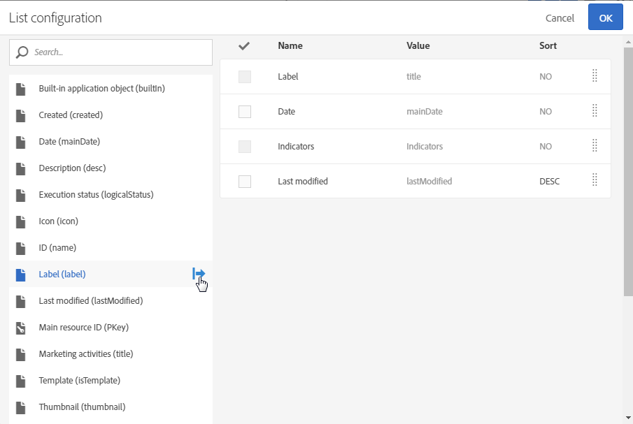

# Lijsten aanpassen{#customizing-lists}

**Lijst** de schermen staan u toe om elementen van één of verscheidene bepaalde middelen te tonen.

Adobe Campaign heeft twee typen lijsten:

* A **homogeen** lijst, die wanneer het één enkel type van middel bevat. De profiellijst bevat bijvoorbeeld alleen profielen.
* A **heterogeen** lijst, die wanneer het verscheidene types van middelen bevat. De lijst met marketingactiviteiten bevat bijvoorbeeld landingspagina&#39;s, werkstromen, e-mails, SMS, enzovoort.

De lijsten worden weergegeven in kolommen. Elke kolom kan één voor één in oplopende of aflopende volgorde worden gesorteerd.

De elementen in een lijst hebben een selectievakje waarmee u ze kunt selecteren. Door een of meerdere elementen te selecteren, kunt u verschillende handelingen uitvoeren, zoals bewerken, dupliceren en verwijderen van deze elementen.

Wanneer u de muis boven een element in de lijst plaatst, **snelle acties**. Met deze handelingen kan de gebruiker verschillende handelingen uitvoeren op het element dat wordt overschreven, zoals bewerken, selecteren, verwijderen of details tonen.

U kunt ook configureren of kolommen in een lijst al dan niet moeten worden weergegeven. Kolommen toevoegen of verwijderen:

1. Zorg ervoor dat het scherm in staat is **Lijst** in.

   

1. Ga naar het lijstconfiguratievenster door  in de actiebalk.

   

1. Voeg de kolommen toe die u in de lijst wilt opnemen. Hiervoor selecteert u een kolom aan de linkerkant van het venster en gebruikt u vervolgens de knop  van de actiebalk om een kolom toe te voegen.

   De selecteerbare kolommen beantwoorden aan het lijstmiddel.

   Geef voor elke toegevoegde kolom op of u standaard wilt sorteren:

   * **[!UICONTROL NO]**: Geen sortering op de kolom
   * **[!UICONTROL ASC]**: Hiermee wordt een oplopende (oplopende) sortering toegepast op de kolom
   * **[!UICONTROL DESC]**: Hiermee wordt een aflopende (aflopende) sortering toegepast op de kolom.

1. Verwijder de kolommen die u niet wilt weergeven door de selectievakjes in te schakelen die overeenkomen met de kolommen die u wilt verwijderen. Gebruik vervolgens de  om te bevestigen dat u deze verwijdert.
1. Zodra uw lijst de correcte kolommen bevat, kunt u de orde veranderen waarin zij in de lijst door de kolommen te controleren worden getoond die u wilt bewegen. Gebruik vervolgens de  en  pijlen.
1. Bevestig uw lijstconfiguratie door te selecteren **[!UICONTROL OK]**.

Uw lijst wordt nu getoond aangezien u het hebt gevormd.
