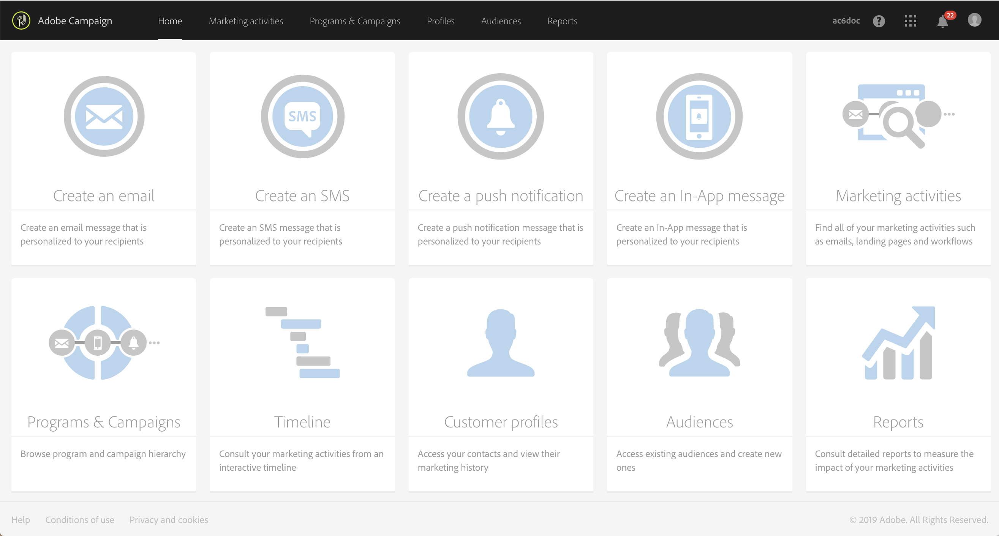

# Interfacebeschrijving{#interface-description}

Met Adobe Campaign kunt u door verschillende menu&#39;s en schermen navigeren om uw campagnes te beheren.

Alle Adobe Campagneschermen bestaan uit de volgende elementen:

* Een bovenste balk voor navigatie
* Een geavanceerd menu voor toegang tot specifieke functies en configuraties
* Een centrale zone om aan bepaalde elementen te werken
* Een zijpaneel, afhankelijk van de context, om binnen de getoonde elementen te filteren of te zoeken.

## Homepage {#home-page}

De startpagina bestaat uit een set kaarten waarmee u snel toegang hebt tot de belangrijkste functies van Adobe Campagne. De lijst van capaciteiten u in de homepage van de Campagne kunt zien hangt van uw toestemmingen en de opties af die voor uw organisatie worden gevormd.

* Met de **[!UICONTROL Create an email]** kaart gaat u naar de assistent voor het maken van e-mail. Met deze assistent kunt u een e-mailtype kiezen, de ontvangers van het bericht selecteren en uw inhoud definiëren. Raadpleeg de sectie [Een e-mailbericht](../../channels/using/creating-an-email.md) maken.
* De **[!UICONTROL Create an SMS]** kaart neemt u aan de medewerker van de creatie van SMS. Deze medewerker laat u een type van SMS kiezen, uw berichtontvangers selecteren en uw inhoud bepalen. Raadpleeg het gedeelte [SMS](../../channels/using/creating-an-sms-message.md) maken.
* Met de **[!UICONTROL Create a Direct mail]** kaart gaat u naar de assistent voor het maken van directe e-mail. Raadpleeg de sectie [Direct mail](../../channels/using/creating-the-direct-mail.md) maken.
* De **[!UICONTROL Create a push notification]** kaart neemt u aan de medewerker van de berichtverwezenlijking. Met deze assistent kunt u een type pushmelding kiezen, de ontvangers van het bericht selecteren en uw inhoud definiëren. Raadpleeg de sectie [Een pushmelding](../../channels/using/preparing-and-sending-a-push-notification.md) maken.
* Met de **[!UICONTROL Create an InApp message]** kaart gaat u naar de InApp-ontwikkelassistent. Met deze assistent kunt u het type InApp-bericht selecteren dat u wilt maken, de eigenschappen, het publiek en de inhoud ervan definiëren. Raadpleeg de sectie [Een InApp-bericht](../../channels/using/about-in-app-messaging.md) maken.
* De **[!UICONTROL Marketing activities]** kaart neemt u naar de volledige lijst van alle activiteiten, programma&#39;s, en campagnes, in het bijzonder e-mail, SMS, werkschema&#39;s, en landingspagina&#39;s. Vanaf hier kunt u de elementen filteren door te zoeken op naam, datum, status of type activiteit. Raadpleeg voor meer informatie de sectie Lijst met [marketingactiviteiten](../../start/using/marketing-activities.md#about-marketing-activities) .
* Met de **[!UICONTROL Programs & campaigns]** kaart gaat u naar de lijst met programma&#39;s waarin u campagnes kunt maken en beheren. Raadpleeg de [programmalijst](../../start/using/programs-and-campaigns.md#about-plans--programs-and-campaigns).
* De **[!UICONTROL Timeline]** kaart neemt u rechtstreeks naar een interactieve tijdlijn van uw marketingactiviteiten, waarin u de lopende programma&#39;s en hun inhoud kunt raadplegen. Zie [Tijdlijn](../../start/using/timeline.md).
* Met de **[!UICONTROL Customer profiles]** kaart gaat u rechtstreeks naar de lijst met profielen. Hier kunt u de gebeurtenissen raadplegen die betrekking hebben op elk van de profielen in de lijst. Zie Profielen beheren.
* Met de **[!UICONTROL Audiences]** kaart gaat u rechtstreeks naar de lijst met doelgroepen. Vanaf hier kunt u toegang krijgen tot bestaande doelgroepen en nieuwe doelgroepen maken. Zie [Soorten publiek](../../audiences/using/about-audiences.md)beheren.

## Bovenste balk {#top-bar}

De bovenste balk is zichtbaar op elk scherm en biedt u de mogelijkheid door de Adobe Campagnefuncties te navigeren en toegang te krijgen tot het Adobe-profiel dat is verbonden, meldingen, andere Adobe Experience Cloud-services en -oplossingen en de documentatie.

De navigatieprincipes zijn:

* Met het **[!UICONTROL Adobe Campaign]** logo in de linkerbovenhoek van de pagina hebt u toegang tot de geavanceerde mogelijkheden en configuraties. Menu&#39;s zijn afhankelijk van uw profiel en machtigingen.

   Het geavanceerde menu wordt weergegeven in de sectie [Geavanceerd menu](#advanced-menu) .

* Met de **[!UICONTROL Home]** koppeling kunt u de startpagina van de Adobe-campagne weergeven.
* Met de **[!UICONTROL Marketing activities]**, **[!UICONTROL Programs & Campaigns]**, **[!UICONTROL Profiles]**, **[!UICONTROL Audiences]** en **[!UICONTROL Reports]** koppelingen hebt u toegang tot de weergaven die aan deze functies zijn gekoppeld.
* Met de **[!UICONTROL Help]** knop hebt u toegang tot de productdocumentatie en de contextafhankelijke Help, opmerkingen bij de release, versienummers, juridische kennisgevingen en de koppelingen naar de Adobe Experience Cloud-community en de klantenservice.

   

* Met het pictogram Oplossing **** selecteren kunt u overschakelen naar een andere Adobe Experience Cloud-oplossing en naar de profielinstellingen.
* Het pictogram **Meldingen** geeft de meest recente waarschuwingen of informatie weer.
* Met het **gebruikerspictogram** kunt u informatie weergeven die is gekoppeld aan uw profiel. Het geeft toegang tot de **[!UICONTROL Sign out]** knoop.

## Het menu Geavanceerd {#advanced-menu}

Het geavanceerde menu wordt weergegeven door op het pictogram **Adobe Campagne** linksboven in elk scherm te klikken. Het geavanceerde menu kan afhankelijk van uw contract en gebruikerstoestemmingen variëren.

In dit menu kunt u naar specifieke functies en instellingen navigeren.

### Marketingplannen {#marketing-plans}

Het **[!UICONTROL Marketing plans]** pictogram geeft u toegang tot de volgende functies:

* **[!UICONTROL Marketing activities]** - Raadpleeg voor meer informatie de sectie [Lijst](../../start/using/marketing-activities.md#about-marketing-activities) met marketingactiviteiten.
* **[!UICONTROL Programs & Campaigns]** - Raadpleeg voor meer informatie het gedeelte [Programmalijst](../../start/using/programs-and-campaigns.md#about-plans--programs-and-campaigns) .
* **[!UICONTROL Timeline]** - Raadpleeg de sectie [Tijdlijn](../../start/using/timeline.md) voor meer informatie hierover.
* **[!UICONTROL Transactional messages]**, die de submenu&#39;s **[!UICONTROL Deliveries]** en **[!UICONTROL Event configuration]** - voor meer informatie hierover, verwijs naar de sectie [Transactieberichten](../../channels/using/about-transactional-messaging.md) .

### Profielen en publiek {#profiles-e-audiences}

Het **[!UICONTROL Profiles & audiences]** pictogram geeft u toegang tot de volgende functies:

* **[!UICONTROL Profiles]** - Raadpleeg voor meer informatie de sectie [Profielen](../../audiences/using/about-profiles.md) beheren.
* **[!UICONTROL Test profiles]** - Raadpleeg voor meer informatie de sectie Testprofielen  beheren.
* **[!UICONTROL Audiences]** - Raadpleeg voor meer informatie de sectie [Het publiek](../../audiences/using/about-audiences.md) beheren.
* **[!UICONTROL Services]** - Raadpleeg voor meer informatie de sectie [Een service](../../audiences/using/creating-a-service.md) maken.

### Bronnen {#resources}

Het **[!UICONTROL Resources]** pictogram geeft u toegang tot de volgende functies:

* **[!UICONTROL Templates]**, die de submenu&#39;s voor elk type van malplaatje - voor meer op dit bevat, verwijs naar de het [Leiden malplaatjesectie](../../start/using/marketing-activity-templates.md) .
* **[!UICONTROL Content blocks]** - Raadpleeg voor meer informatie de sectie [Een inhoudsblok](../../designing/using/personalization.md#adding-a-content-block) toevoegen.
* **[!UICONTROL Content templates & fragments]** - Raadpleeg voor meer informatie de sectie over de [inhoudssjabloon](../../designing/using/using-reusable-content.md#content-templates) .

### Beheer {#administration}

Het **[!UICONTROL Administration]** pictogram geeft u toegang tot de geavanceerde functies die alleen door de functionele beheerder kunnen worden uitgevoerd. Zie de sectie [Toediening](../../administration/using/get-started-campaign-administration.md) voor meer informatie.

## Centrale zone {#central-zone}

De centrale zone van de gebruikersinterface is een dynamische zone die bijvoorbeeld een lijst met elementen of een set kaarten bevat. Zo kunt u bestaande elementen bewerken en bronnen maken.

De inhoud en weergaveformaat van de centrale zone kunnen variëren:

* Een **lijst** met verschillende elementen, zoals programma&#39;s, campagnes, profielen, enz. Deze elementen kunnen in **[!UICONTROL Card]** of **[!UICONTROL List]** modus worden weergegeven. Gebruik de knop Wijzigen om van de ene naar de andere modus te schakelen. Op elk element worden indicatoren weergegeven.

   

   Met een teller kunt u zich bewust zijn van het aantal elementen. Als dit aantal 30 overschrijdt, moet u deze teller klikken om het totale aantal te krijgen.

* Een **dashboard** met een overzicht van alle parameters die aan een activiteit zijn gekoppeld. Dit scherm omvat interactieve streken die u toestaan om de verschillende concepten onafhankelijk van elkaar te scheiden en te vormen.

   

* Als er meerdere aanbiedingen mogelijk zijn bij het maken van een element, kunt u in een **selectiescherm** het type element selecteren dat u wilt toevoegen (campagnes, leveringen). Dit selectiescherm wordt ook aangeboden voor toegang tot de rapporten.

   

* Voor de werkstromen en de vraagredacteur, wordt een **werkruimte** met een palet beschikbaar gemaakt voor u om het voorwerp te ontwerpen.

   U kunt elementen van het palet naar de werkruimte slepen om het element in kwestie te configureren.

   

## Actiebalk {#action-bar}

Volgens het weergegeven schermtype wordt bovenaan een balk weergegeven met acties die zijn gekoppeld aan het scherm.

Deze balk bevat niet alleen algemene handelingen, zoals zoeken en filteren, maar ook handelingen met betrekking tot het weergegeven scherm:

* Raadpleeg de sectie **Actiebalk** voor de workflows voor handelingen die betrekking hebben op schermen in [werkruimten](../../automating/using/workflow-interface.md#action-bar) .
* Voor acties met betrekking tot **dashboardschermen** raadpleegt u de sectie [Berichtdashboard](../../channels/using/message-dashboard.md) voor meer informatie.
* Raadpleeg de onderstaande sectie **Lijsten** aanpassen voor handelingen die betrekking hebben op [lijsttypeschermen](../../start/using/customizing-lists.md) .
