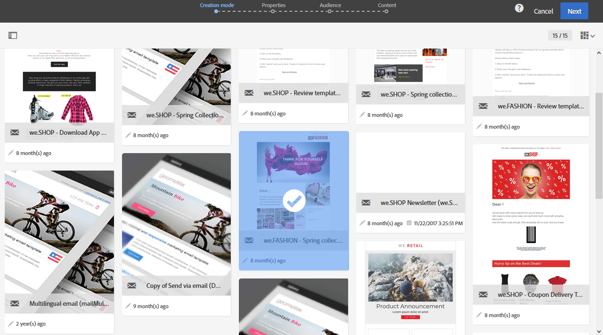

# Sjablonen voor marketingactiviteiten {#marketing-activity-templates}

## Over sjablonen {#about-templates}

Wanneer u een nieuwe marketing activiteit creeert, vraagt het eerste scherm in de tovenaar u om een type, of een malplaatje te selecteren. Met sjablonen kunt u bepaalde parameters vooraf configureren op basis van uw behoeften. Het model kan een volledige of gedeeltelijke configuratie van de marketingactiviteit bevatten. Het sjabloonbeheer wordt uitgevoerd door de functionele beheerder.

De eindgebruiker heeft een vereenvoudigde interface. Wanneer u een nieuwe marketingactiviteit maakt, hoeft u alleen de sjabloon te selecteren die u wilt gebruiken. U hoeft zich geen zorgen te maken over technische configuraties. Dit is reeds pre-gevormd door de functionele beheerder in het malplaatje.

Bijvoorbeeld, in het geval van een e-mailmalplaatje, kunt u de inhoud van HTML, het publiek, en een andere parameter van uw levering vooraf vullen: schema, testprofielen, algemene eigenschappen van uw levering, de geavanceerde parameters, enz. Hierdoor kunt u tijd besparen wanneer u een nieuwe activiteit maakt.

Voor elk type van marketing activiteit, zijn één of verscheidene out-of-the-box malplaatjes beschikbaar met minimale configuratie. Deze out-of-the-box sjablonen kunnen niet worden gewijzigd of verwijderd.

Er zijn sjablonen beschikbaar voor de volgende marketingactiviteiten:

* Programma&#39;s
* Campagnes
* E-mailleveringen
* Leveringen via SMS
* Pushmeldingen
* Openingspagina&#39;s
* Workflows
* Services
* Importeren
* Transactieberichten

## Creating a new template {#creating-a-new-template}

De malplaatjes van het bericht kunnen door de functionele beheerder van het platform, onder het **[!UICONTROL Resources > Templates]** menu worden beheerd. Sjablonen buiten de box kunnen niet worden gewijzigd of verwijderd. Als u een nieuwe sjabloon wilt maken, moet u een bestaande sjabloon dupliceren.

1. Selecteer een bestaande sjabloon. In ons voorbeeld hebben we een keuze gemaakt **[!UICONTROL Delivery template]**.

   

1. Houd de muisaanwijzer boven de cursor en selecteer de **[!UICONTROL Duplicate element]** optie.

   

1. Configureer de gewenste instellingen, net zoals u doet bij het [maken van een nieuwe marketingactiviteit](../../start/using/marketing-activities.md#creating-a-marketing-activity) .

   

Gemaakte sjablonen kunnen vervolgens door de standaardgebruiker worden geselecteerd in het eerste scherm van de wizard tijdens het maken van een marketingactiviteit.

## Een sjabloon gebruiken {#using-a-template}

We gaan nu bekijken hoe u een sjabloon kunt gebruiken die in de vorige sectie is gemaakt.

>[!NOTE]
>
>Een marketingactiviteit op basis van een sjabloon wordt meestal uitgevoerd door een standaardgebruikersprofiel.

1. Maak een nieuwe marketingactiviteit.

   

1. Selecteer in het eerste scherm van de wizard de sjabloon die u wilt gebruiken.

   

   De marketing activiteit wordt pre-gevormd met de parameters die in het malplaatje worden bepaald.

   
