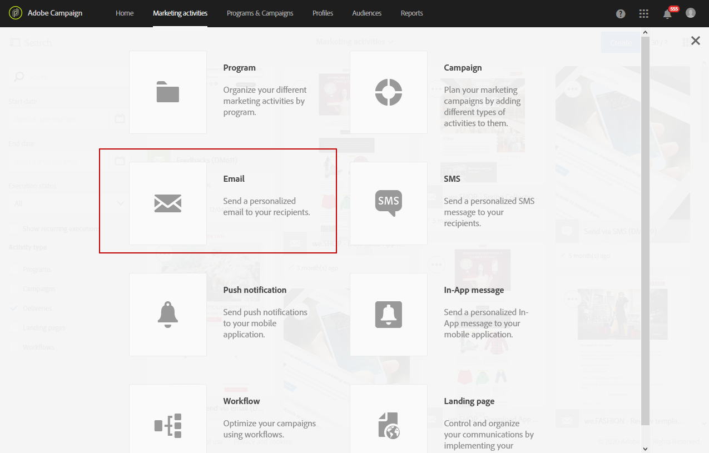

# Sjablonen voor marketingactiviteiten {#marketing-activity-templates}

## Sjablonen {#about-templates}

Wanneer u een nieuwe marketingactiviteit maakt, wordt u in het eerste venster van de Wizard gevraagd om een bepaald type of bepaalde sjabloon te selecteren. Met sjablonen kunt u sommige parameters vooraf configureren op basis van uw behoeften. De sjabloon bevat een volledige of gedeeltelijke configuratie van de marketingactiviteit. Sjabloonbeheer is de verantwoordelijkheid van de functionele beheerder.

De eindgebruiker heeft een vereenvoudigde interface. Wanneer u een nieuwe marketingactiviteit maakt, hoeft u dus alleen maar de sjabloon te selecteren die u wilt gebruiken. U hoeft zich geen zorgen te maken over allerlei technische configuraties. De sjabloon is namelijk al voorbewerkt door de functionele beheerder.

Bij een e-mailsjabloon bijvoorbeeld kunt u de HTML-content, de doelgroep en andere leveringsparameters al vooraf invullen. Denk hierbij aan het schema, de testprofielen, de algemene eigenschappen van uw levering, geavanceerde parameters, enz. Zo bespaart u tijd wanneer u een nieuwe activiteit maakt.

Voor elk type marketingactiviteit zijn er een of meer kant-en-klare sjablonen beschikbaar met minimale configuratie. De kant-en-klare sjablonen kunnen niet worden gewijzigd of verwijderd.

Er zijn sjablonen voor de volgende marketingactiviteiten:

* Programma&#39;s
* Campagnes
* E-mailleveringen
* Leveringen via sms
* Pushmeldingen
* Landingspagina&#39;s
* Workflows
* Services
* Importeren
* Transactieberichten

## Een nieuwe sjabloon maken {#creating-a-new-template}

Berichtsjablonen kunnen ook door de functionele beheerder van het platform worden beheerd via het menu **[!UICONTROL Resources > Templates]**. Kant-en-klare sjablonen kunnen niet worden gewijzigd of verwijderd. Als u een nieuwe sjabloon wilt maken, moet u eerst een bestaande sjabloon dupliceren.

1. Selecteer een bestaande sjabloon. In ons voorbeeld kiezen we **[!UICONTROL Delivery template]**.

   

1. Houd de muisaanwijzer boven de cursor en selecteer de optie **[!UICONTROL Duplicate element]**.

   

1. Configureer de gewenste instellingen, net als bij het [maken van een nieuwe marketingactiviteit](../../start/using/marketing-activities.md#creating-a-marketing-activity).

   

De standaardgebruiker kan de gemaakte sjablonen vervolgens selecteren in het eerste Wizard-scherm wanneer hij of zij een marketingactiviteit maakt.

## Een sjabloon gebruiken {#using-a-template}

We gaan nu kijken hoe u een sjabloon kunt gebruiken die in de vorige sectie is gemaakt.

>[!NOTE]
>
>Meestal zijn het standaardgebruikers die een marketingactiviteit maken op basis van een sjabloon.

1. Maak een nieuwe marketingactiviteit.

   

1. In het eerste scherm van de wizard selecteert u de sjabloon die u wilt gebruiken.

   

   De marketingactiviteit wordt vooraf geconfigureerd met de parameters die in de sjabloon zijn gedefinieerd.

   
