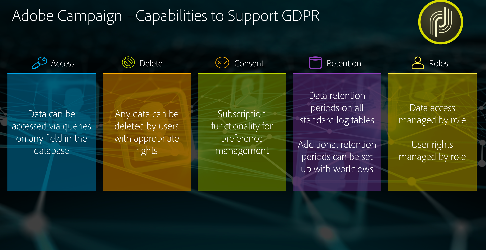

# Privacybeheer {#privacy-management}

Adobe Campaign biedt een reeks hulpmiddelen aan om u te helpen aan [Privacyverordeningen ](#privacy-management-regulations) (met inbegrip van GDPR, CCPA, PDPA, LGPD) voldoen.

Hier volgen de vijf belangrijkste mogelijkheden die Adobe Campaign biedt om ervoor te zorgen dat de GDPR en andere privacyregels klaar zijn:

* **Recht op toegang**

* **Rechts om te verwijderen**

Voor meer op dit, zie [Recht op Toegang en Recht om worden vergeten](#right-access-forgotten).

* **Toestemmingsbeheer**

* **Dataretentie**

* **Rights Management**

Zie [Goedkeuring, Behoud en Rollen](#consent-retention-roles) voor meer informatie.

<!--This section presents general information on what Privacy management is and the features provided by Adobe Campaign to manage the [Right to Access and Right to be Forgotten](#right-access-forgotten).

It also contains information on important features to manage Privacy ([consent, data retention and user roles](#consent-retention-roles)), as well as best practices to help you with your Privacy compliance when using Adobe Campaign.-->

## Regels inzake privacybeheer {#privacy-management-regulations}

Met de opties van Adobe Campaign kunt u voldoen aan de volgende regels:

* **De AVG** ([Algemene Verordening Gegevensbescherming](https://ec.europa.eu/info/law/law-topic/data-protection/reform/what-does-general-data-protection-regulation-gdpr-govern_en)) is de privacyverordening van de Europese Unie (EU) die de vereisten inzake gegevensbescherming voor Europese landen harmoniseert en moderniseert. Volg de onderstaande koppelingen voor algemene informatie over GDPR:

   * https://www.adobe.com/privacy/general-data-protection-regulation.html
   * https://www.adobe.com/marketing-cloud/campaign/general-data-protection-regulation.html

* **De CCPA** ([California Consumer Privacy Act](https://leginfo.legislature.ca.gov/faces/codes_displayText.xhtml?lawCode=CIV&amp;division=3.&amp;title=1.81.5.&amp;part=4.&amp;chapter=&amp;article=)) biedt inwoners van Californië nieuwe rechten met betrekking tot hun persoonsgegevens en legt verantwoordelijkheden op het gebied van gegevensbescherming op aan bepaalde entiteiten die zaken doen in Californië.
* **De PDPA** ([Thaise wet inzake de bescherming van persoonsgegevens](https://secureprivacy.ai/thailand-pdpa-summary-what-businesses-need-to-know/)) is de nieuwe privacywet die de vereisten inzake gegevensbescherming voor Thailand harmoniseert en moderniseert.
* **De LGPD** ([Lei Geral de Proteção de Dados](https://iapp.org/media/pdf/resource_center/Brazilian_General_Data_Protection_Law.pdf)) wordt begin 2021 van kracht voor alle bedrijven die in Brazilië persoonsgegevens verzamelen of verwerken.

Al deze voorschriften zijn van toepassing op Adobe Campaign-klanten die beschikken over gegevens van betrokkenen die in de bovengenoemde regio’s of landen wonen (EU, Californië, Thailand en Brazilië).

>[!NOTE]
>
>Voor meer informatie over persoonsgegevens en over de verschillende entiteiten die gegevens beheren (gegevenscontroller, gegevensprocessor en betrokkene) raadpleegt u [Persoonsgegevens en persona&#39;s](../../start/using/privacy.md#personal-data).

## Toegangsrecht en recht om te worden vergeten {#right-access-forgotten}

U kunt in Adobe Campaign verzoeken voor **Toegang** en **Verwijderen** afhandelen, zodat u zich gemakkelijker kunt voorbereiden op de privacyregels.

* Het **toegangsrecht** is het recht van de betrokkene om van de gegevenscontroller bevestiging te krijgen of er persoonsgegevens van de betrokkene worden verwerkt, waar en voor welk doel. De gegevenscontroller verstrekt kosteloos een kopie van de persoonsgegevens in elektronische vorm.

* Het **recht om te worden vergeten** (verwijderingsverzoek) geeft de betrokkene het recht om de gegevenscontroller zijn/haar persoonsgegevens te laten wissen, verdere verspreiding van de gegevens stop te zetten en eventueel de verwerking van de gegevens door derden te laten stopzetten.

Als u wilt weten hoe u verzoeken om **toegang** en **verwijdering** kunt maken en hoe Adobe Campaign deze verwerkt, raadpleegt u de [implementatiestappen](../../start/using/privacy-requests.md#about-privacy-requests).

Tutorials over privacybeheer in Campaign Standard zijn ook [hier](https://experienceleague.adobe.com/docs/campaign-standard-learn/tutorials/privacy/privacy-overview.html?lang=nl#privacy) te vinden.

>[!NOTE]
>
>Voor meer informatie over persoonsgegevens en over de verschillende entiteiten die gegevens beheren (gegevenscontroller, gegevensprocessor en betrokkene) raadpleegt u [Persoonsgegevens en persona&#39;s](../../start/using/privacy.md#personal-data).

## Toestemming, retentie en rollen {#consent-retention-roles}

Naast de meest recente mogelijkheden voor **toegangsrecht** en **recht om te worden vergeten** biedt Adobe Campaign andere belangrijke functies die essentieel zijn voor privacy:

* [Toestemmingsbeheer](#consent-management): abonnementsfuncties voor voorkeurenbeheer
* [Dataretentie](#data-retention): dataretentieperioden in alle standaard logtabellen, er kunnen extra retentieperioden worden ingesteld met workflows
* [Rights Management](#rights-management): gegevenstoegang beheerd volgens opgegeven recht

### Toestemmingsbeheer {#consent-management}

Toestemming betekent instemming van een betrokkene om de persoonsgegevens betreffende de betrokkene te verwerken. De gegevenscontroller is verantwoordelijk voor het verkrijgen van de vereiste toestemming voor deze verwerking. Hoewel Adobe Campaign bepaalde functies kan bieden om een klant te helpen bij het beheren van de toestemming voor de service, is Adobe niet verantwoordelijk voor de toestemming. Klanten dienen samen met hun eigen juridische afdelingen hun eigen processen en praktijken vast te stellen voor de benodigde toestemming.

Vanaf het begin hebben in Adobe Campaign functies voor het helpen beheren van bepaalde aspecten van toestemming centraal gestaan. Via het abonnementsbeheerproces kunnen klanten bijhouden welke ontvangers hebben gekozen voor welk type abonnement, zoals nieuwsbrieven, dagelijkse of wekelijkse aanbiedingen of een ander type marketingprogramma.

Zie [Abonnementen](../../audiences/using/about-subscriptions.md) en [Aan de slag met landingspagina’s ](../../channels/using/getting-started-with-landing-pages.md) voor meer informatie over toestemmingsbeheer.

Naast de tools voor toestemmingsbeheer van Adobe Campaign kunt u ook nagaan of een consument ervoor heeft gekozen om zich af te melden voor de verkoop van persoonsgegevens. Zie [deze sectie](../../start/using/privacy-requests.md#sale-of-personal-information-ccpa).

### Dataretentie {#data-retention}

Voor retentie bevatten de ingebouwde logtabellen in Campaign vooraf ingestelde retentieperioden, waarbij de gegevensopslag over het algemeen is beperkt tot zes maanden of korter.

Hieronder volgen de standaardwaarden voor retentie in de ingebouwde tabellen. Houd er rekening mee dat de retentieconfiguratie tijdens de implementatie door technische beheerders van Adobe wordt ingesteld, en dat de waarden per implementatie kunnen verschillen op basis van de vereisten van de klant.

* **Samengevoegde tracking**: 6 maanden
* **Verzendingslogs**: 6 maanden
* **Trackinglogs**: 6 maanden
* **Gebeurtenissen**: 1 maand
* **Statistieken van gebeurtenisverwerking**: 6 maanden
* **Gearchiveerde gebeurtenissen**: 6 maanden
* **Tijdelijke entiteiten**: 7 dagen
* **Genegeerde pipelinegebeurtenissen**: 1 maand
* **Leveringsmeldingen**: 1 maand
* **Exportaudit**: 6 maanden

Net als bij verwijderen is het met de functionaliteit van de standaardworkflow mogelijk om retentieperioden in te stellen voor elke aangepaste tabel.

Neem contact op met de consultants of technische beheerders van Adobe voor meer informatie over retentie, of als u retentie wilt instellen voor aangepaste tabellen.

### Rights Management {#rights-management}

Adobe Campaign biedt u de mogelijkheid om via verschillende standaard of aangepaste rollen de rechten te beheren die aan de verschillende Campaign-operators zijn toegewezen.

Eén voordeel is dat u zo kunt bepalen wie binnen uw bedrijf toegang heeft tot verschillende typen gegevens. Als u bijvoorbeeld verschillende marketeers voor verschillende regio’s hebt, kunt u ervoor zorgen dat elke marketeer alleen toegang heeft tot de gegevens van zijn of haar regio.

Zo kunt u met deze functionaliteit ook verschillende mogelijkheden voor elke gebruiker configureren, zoals beperken wie leveringen kan verzenden, of relevanter voor privacy: wie gegevens kan wijzigen of exporteren.

Zie [deze sectie](../../administration/using/about-access-management.md) voor meer informatie over toegangscontrole.