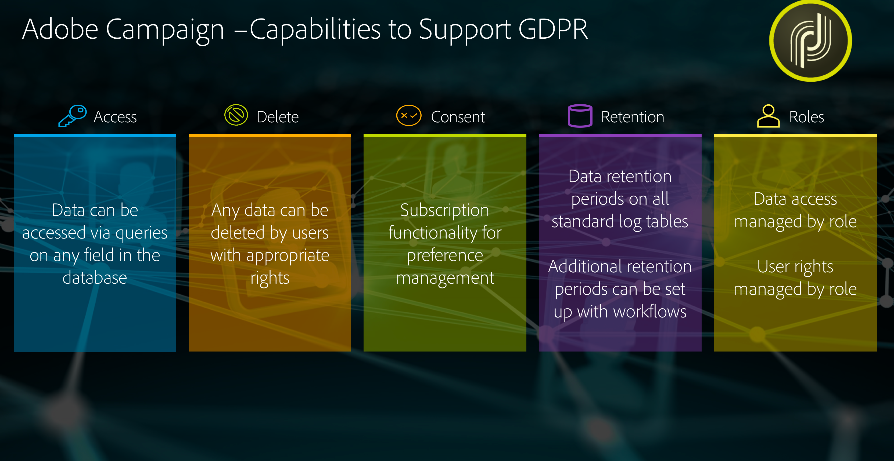
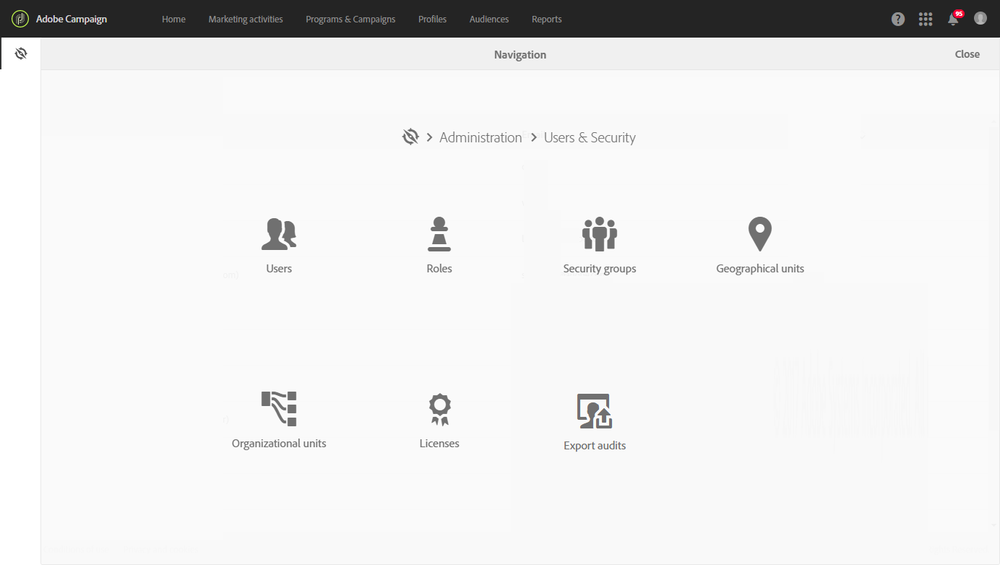

# Privacybeheer {#privacy-management}

Adobe Campaign biedt een reeks hulpmiddelen aan om u te helpen aan [ verordeningen van de Privacy voldoen ](#privacy-management-regulations) (met inbegrip van GDPR, CCPA, PDPA, LGPD).

Hier volgen de vijf belangrijkste mogelijkheden die Adobe Campaign biedt om ervoor te zorgen dat de GDPR en andere privacyregels klaar zijn:

* **Recht op Toegang**

* **Recht om** te schrappen

Voor meer op dit, zie [ Recht op Toegang en Recht worden vergeten ](#right-access-forgotten).

* **Toegelaten beheer**

* **Bewaren van Gegevens**

* **het beheer van Rechten**

Voor meer op dit, zie [ Toestemming, Behoud en Rollen ](#consent-retention-roles).

<!--
This section presents general information on what Privacy management is and the features provided by Adobe Campaign to manage the [Right to Access and Right to be Forgotten](#right-access-forgotten).

It also contains information on important features to manage Privacy ([consent, data retention and user roles](#consent-retention-roles)), as well as best practices to help you with your Privacy compliance when using Adobe Campaign.
-->

## Regels inzake privacybeheer {#privacy-management-regulations}

Met Adobe Campaign-mogelijkheden kunt u voldoen aan de volgende regels:

* **GDPR** ([ Algemene Verordening van de Bescherming van Gegevens ](https://ec.europa.eu/info/law/law-topic/data-protection/reform/what-does-general-data-protection-regulation-gdpr-govern_en)) is de de privacywet van de Europese Unie (EU) die de vereisten van de gegevensbescherming voor de landen van de EU harmoniseert en moderniseert. Volg de onderstaande koppelingen voor algemene informatie over GDPR:

   * https://www.adobe.com/privacy/general-data-protection-regulation.html
   * https://www.adobe.com/marketing-cloud/campaign/general-data-protection-regulation.html

* **CCPA** ([ de Wet van de Privacy van de consument van Californië ](https://leginfo.legislature.ca.gov/faces/codes_displayText.xhtml?lawCode=CIV&division=3.&titel=1.81.5.&part=4.&hoofdstuk=&artikel=)) verstrekt de ingezetenen van Californië nieuwe rechten met betrekking tot hun persoonlijke informatie en legt verantwoordelijkheden van de gegevensbescherming aan bepaalde entiteiten op die zaken in Californië leiden.
* **PDPA** ([ Wet van de Bescherming van Persoonlijke Gegevens ](https://secureprivacy.ai/thailand-pdpa-summary-what-businesses-need-to-know/)) is de nieuwe privacywet die de vereisten van de gegevensbescherming voor Thailand harmoniseert en moderniseert.
* **LGPD** ([ Lei Geral de Proteção de Dados ](https://iapp.org/media/pdf/resource_center/Brazilian_General_Data_Protection_Law.pdf)) zal begin 2021 voor alle bedrijven die persoonlijke gegevens in Brazilië verzamelen of verwerken van kracht zijn.

Al deze voorschriften zijn van toepassing op Adobe Campaign-klanten die beschikken over gegevens voor gegevenssubjecten die in de bovengenoemde regio&#39;s of landen (EU, Californië, Thailand, Brazilië) verblijven.

>[!NOTE]
>
>Voor meer op persoonlijke gegevens en op de verschillende entiteiten die gegevens (het Controlemechanisme van Gegevens, de Bewerker van Gegevens en Onderwerp van Gegevens) beheren, zie [ Persoonlijke gegevens en Persona&#39;s ](../../start/using/privacy.md#personal-data).

## Recht op toegang en recht om te worden vergeten {#right-access-forgotten}

Om u te helpen uw bereidheid van de Privacy vergemakkelijken, staat Adobe Campaign u toe om **Toegang** te behandelen en **te schrappen** verzoeken.

* Het **recht op toegang** is het recht voor de Onderwerp van Gegevens om van het Controlemechanisme van Gegevens bevestiging te verkrijgen over al dan niet de persoonlijke gegevens betreffende hen worden verwerkt, waar en voor welk doel. De gegevensverwerkingsverantwoordelijke verstrekt kosteloos een kopie van de persoonsgegevens in elektronische vorm.

* Ook gekend als het Wissen van Gegevens, het **Recht om worden vergeten** (schrappingsverzoek) machtigt het Onderwerp van Gegevens om het Controlemechanisme van Gegevens te hebben hun persoonlijke gegevens wissen, de verdere verspreiding van de gegevens ophouden, en potentieel derde partijen te hebben verwerking van de gegevens tegenhouden.

Leren hoe u **Toegang** kunt tot stand brengen en **schrapt** verzoeken en hoe Adobe Campaign hen verwerkt, verwijs naar de [ implementatiestappen ](../../start/using/privacy-requests.md#about-privacy-requests).

De leerprogramma&#39;s op het beheer van de Privacy in Campaign Standard zijn ook beschikbaar [ hier ](https://experienceleague.adobe.com/docs/campaign-standard-learn/tutorials/privacy/privacy-overview.html#privacy).

>[!NOTE]
>
>Voor meer op persoonlijke gegevens en op de verschillende entiteiten die gegevens (het Controlemechanisme van Gegevens, de Bewerker van Gegevens en Onderwerp van Gegevens) beheren, zie [ Persoonlijke gegevens en Persona&#39;s ](../../start/using/privacy.md#personal-data).

## Toestemming, bewaring en rollen {#consent-retention-roles}

Naast het meest recente **Recht op Toegang** en **Recht om** mogelijkheden worden vergeten, biedt Adobe Campaign andere belangrijke eigenschappen aan die aan Privacy essentieel zijn:

* [ Toegelaten beheer ](#consent-management): de functionaliteit van het abonnement voor voorkeurbeheer
* [ Bewaren van Gegevens ](../../administration/using/data-retention.md): de periodes van het gegevensbehoud op alle standaardlogboeklijsten, extra bewaartermijnen kunnen opstelling met werkschema&#39;s zijn
* [ het beheer van Rechten ](#rights-management): gegevenstoegang die door genoemd recht wordt beheerd

### Toegangsbeheer {#consent-management}

Toestemming betekent instemming van de betrokkene met de verwerking van persoonsgegevens betreffende een betrokkene. De gegevensverwerkingsverantwoordelijke is verantwoordelijk voor het verkrijgen van de nodige toestemming voor die verwerking. Hoewel Adobe Campaign bepaalde functies kan bieden om een klant te helpen bij het beheren van de toestemming voor de service, is Adobe niet verantwoordelijk voor de toestemming. Klanten dienen met hun eigen juridische afdelingen samen te werken om hun eigen processen en praktijken vast te stellen voor de benodigde toestemming.

Adobe Campaign kent sinds het begin van zijn goedkeuring de kenmerken die het mogelijk maken bepaalde aspecten ervan te beheren. Via het abonnementsbeheerproces kunnen klanten bijhouden welke ontvangers hebben gekozen voor welk type abonnement ze kiezen, of het nu nieuwsbrieven, dagelijkse of wekelijkse promoties of andere typen marketingprogramma&#39;s zijn.

Voor meer op het beheer van de Toestemming, zie [ Ongeveer abonnementen ](../../audiences/using/about-subscriptions.md) en [ begonnen worden met het landen van pagina&#39;s ](../../channels/using/getting-started-with-landing-pages.md).

Naast de hulpprogramma&#39;s voor het beheer van toestemmingen die Adobe Campaign biedt, kunt u nagaan of een consument heeft gekozen voor de verkoop van persoonlijke gegevens. Zie [ deze sectie ](../../start/using/privacy-requests.md#sale-of-personal-information-ccpa).

### Rechtenbeheer {#rights-management}

Adobe Campaign biedt u de mogelijkheid om de rechten te beheren die aan de verschillende campagneoperatoren zijn toegewezen via verschillende vooraf gebouwde of aangepaste rollen.

Eén voordeel is dat u zo kunt bepalen wie binnen uw bedrijf toegang heeft tot verschillende typen gegevens. U hebt bijvoorbeeld verschillende marketers voor verschillende geo&#39;s en elke markator heeft alleen toegang tot gegevens van zijn geo.

Op dezelfde manier staat deze functionaliteit u ook toe om verschillende mogelijkheden voor elke gebruiker te vormen, zoals het beperken van wie leveringen kan verzenden, of meer relevant voor het beheer van de Privacy, die gegevens kan wijzigen of uitvoeren.

Voor meer op toegangsbeheer, zie [ deze sectie ](../../administration/using/about-access-management.md).
