# Privacyverzoeken beheren {#privacy-requests}

Voor een algemene presentatie over het Beheer van de Privacy, verwijs naar [&#x200B; deze sectie &#x200B;](../../start/using/privacy-management.md).

Deze informatie is van toepassing op GDPR, CCPA, PDPA en LGPD. Voor meer op deze verordeningen, zie [&#x200B; deze sectie &#x200B;](../../start/using/privacy-management.md#privacy-management-regulations).

De opt-out voor de Verkoop van Persoonlijke Informatie, die voor CCPA specifiek is, wordt verklaard in [&#x200B; deze sectie &#x200B;](#sale-of-personal-information-ccpa).

<!--Starting 19.4, the use of the Campaign API and interface for Access and Delete requests is deprecated. For any GDPR, CCPA, PDPA, or LGPD Access and Delete requests, you need to use the [Privacy Core Service](#create-privacy-request) integration method.-->

## Over privacyverzoeken {#about-privacy-requests}

Om u te helpen uw privacy-gereedheid te vergemakkelijken, kunt u met Adobe Campaign aanvragen voor toegang en verwijdering afhandelen. Het **recht op Toegang** en het **Recht om worden vergeten** (schrappingsverzoek) worden beschreven in [&#x200B; deze sectie &#x200B;](../../start/using/privacy-management.md#right-access-forgotten).

Om die verzoeken uit te voeren, moet u de **integratie van de Dienst van de Kern van de Privacy gebruiken 0&rbrace;.** De verzoeken van de privacy die van de Dienst van de Kern van de Privacy aan alle oplossingen van Experience Cloud worden geduwd worden automatisch behandeld door Campagne via een specifieke werkschema.

### Vereisten {#prerequesites}

Adobe Campaign beschikt over gegevensbesturingselementen waarmee u privacyverzoeken voor in Adobe Campaign opgeslagen gegevens kunt maken en verwerken. Het is echter de verantwoordelijkheid van de gegevenscontroller om de relatie met het gegevensonderwerp (e-mail, klantenservice of een webportal) af te handelen.

Daarom is het uw verantwoordelijkheid als Data Controller om de identiteit te bevestigen van de betrokkene die het verzoek indient en om te bevestigen dat de gegevens die aan de aanvrager worden teruggegeven over het onderwerp van Gegevens gaan.

>[!NOTE]
>
>Voor meer op persoonlijke gegevens en op de verschillende entiteiten die gegevens (het Controlemechanisme van Gegevens, de Bewerker van Gegevens en Onderwerp van Gegevens) beheren, zie [&#x200B; Persoonlijke gegevens en Persona&#39;s &#x200B;](../../start/using/privacy.md#personal-data).

### Naamruimten {#namesspaces}

Definieer de naamruimte die u wilt gebruiken voordat u de privacyverzoeken maakt. De naamruimte is de sleutel die wordt gebruikt om het gegevensonderwerp in de Adobe Campaign-database te identificeren. Er zijn twee naamruimten beschikbaar: e-mail en mobiele telefoon. Voer de volgende stappen uit als u een andere naamruimte nodig hebt (bijvoorbeeld een aangepast profielveld).

Ook verwijs naar dit [&#x200B; leerprogramma &#x200B;](https://experienceleague.adobe.com/docs/campaign-standard-learn/tutorials/privacy/namespaces-for-privacy-requests.html#privacy) op hoe te om tot een namespace te leiden.

>[!NOTE]
>
>Als u meerdere naamruimten gebruikt, maakt u één privacyverzoek per naamruimte.

1. Klik in de linkerbovenhoek op het Adobe Campaign-logo en selecteer vervolgens **[!UICONTROL Administration]** > **[!UICONTROL Namespaces]** .

   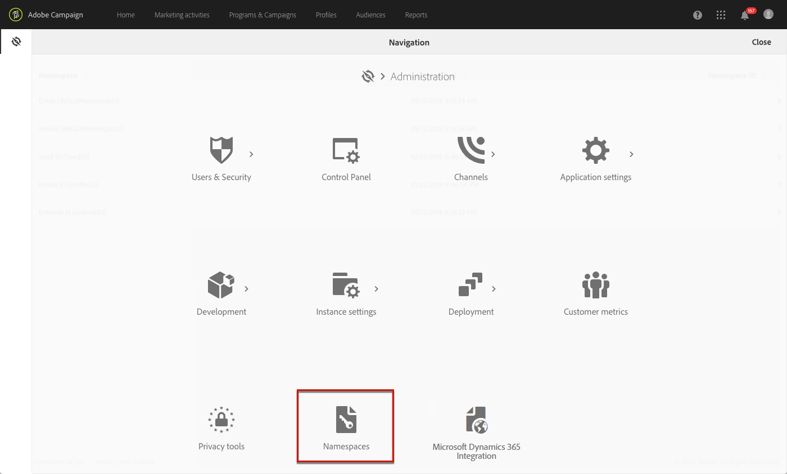

1. Klik in de lijst met naamruimten op **[!UICONTROL Create]** .

   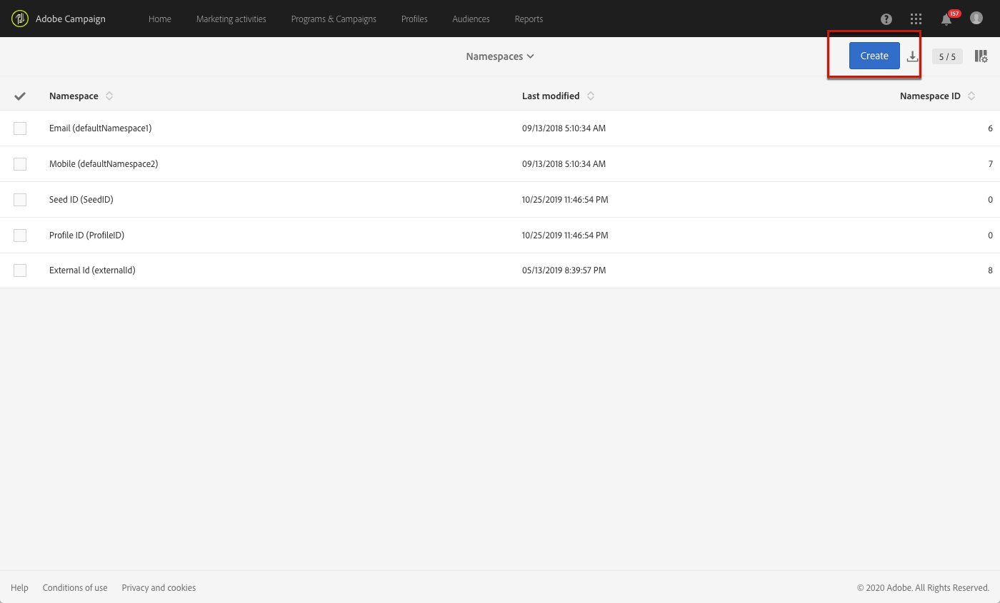

1. Voer een **[!UICONTROL Label]** in.

   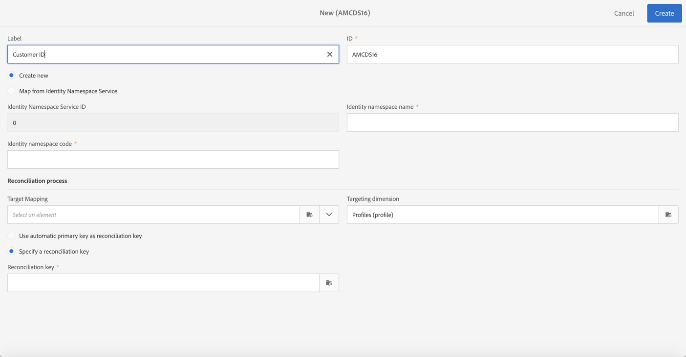

1. Als u een bestaande naamruimte voor de identiteitsservice wilt gebruiken, kiest u **[!UICONTROL Map from Identity Namespace Service]** en selecteert u een naamruimte in de lijst **[!UICONTROL Identity Service Namespaces]** .

   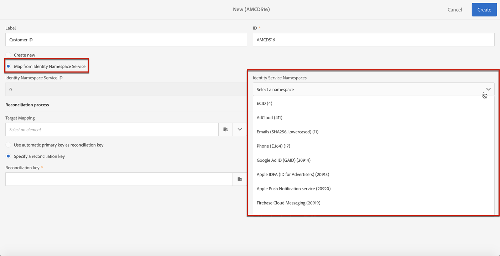

   Als u een nieuwe naamruimte wilt maken in **[!UICONTROL Identity Service]** en deze wilt toewijzen in Campagne, selecteert u **[!UICONTROL Create new]** en voert u een naam in het veld **[!UICONTROL Identity namespace name]** in.

   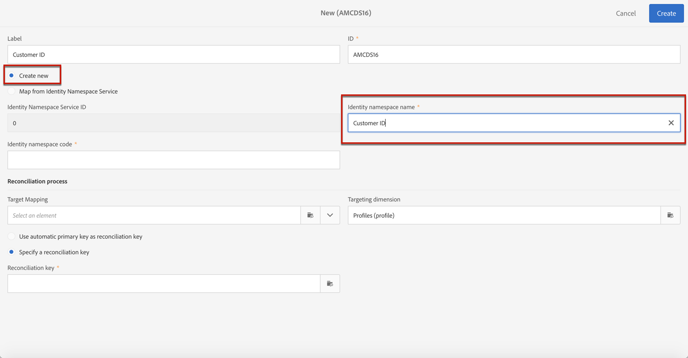

   Meer over identiteit namespaces leren, zie de [&#x200B; documentatie van Experience Platform &#x200B;](https://experienceleague.adobe.com/docs/experience-platform/identity/namespaces.html).

1. Één Namespace van de Dienst van de Identiteit wordt in kaart gebracht aan één namespace in Campagne. U moet opgeven hoe de naamruimte in Campagne moet worden afgestemd.

   Selecteer een doeltoewijzing (**[!UICONTROL Recipients]**, **[!UICONTROL Real-time event]** of **[!UICONTROL Subscriptions to an application]**). Als u verschillende doeltoewijzingen wilt gebruiken, maakt u één naamruimte per doeltoewijzing.

   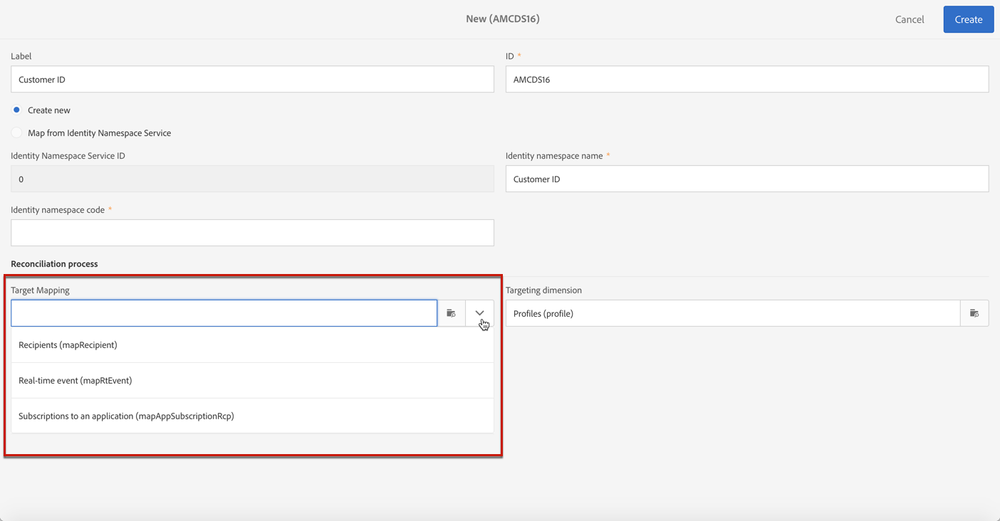

1. Kies de **[!UICONTROL Reconciliation key]** . Dit is het gebied dat zal worden gebruikt om het Onderwerp van Gegevens in het gegevensbestand van Adobe Campaign te identificeren.

   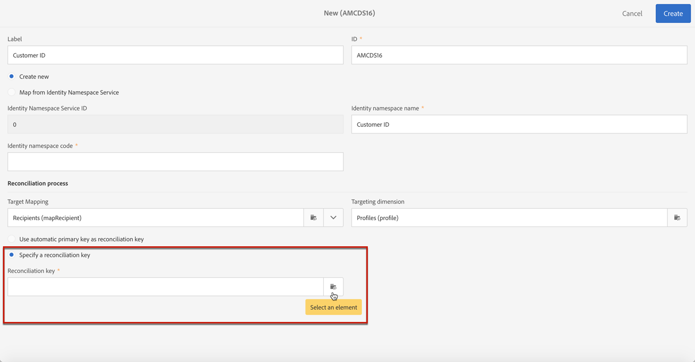

1. Klik op **[!UICONTROL Create]** . U kunt nu privacyverzoeken maken op basis van uw nieuwe naamruimte. Als u meerdere naamruimten gebruikt, maakt u één privacyverzoek per naamruimte.

### Een privacyverzoek maken {#create-privacy-request}

<!--Starting 19.4, the use of the Campaign API and interface for Access and Delete requests is deprecated. Use the **Privacy Core Service** for any GDPR, CCPA, PDPA, or LGPD Access and Delete requests.-->

De integratie van de Dienst van de Kern van de Privacy staat u toe om uw verzoeken van de Privacy in een multi-oplossingscontext door één enkele vraag te automatiseren JSON API. De verzoeken van de privacy die van de Dienst van de Kern van de Privacy aan alle oplossingen van Experience Cloud worden geduwd worden automatisch behandeld door Campagne via een specifieke werkschema.

Verwijs naar de [&#x200B; Experience Platform Privacy Service &#x200B;](https://experienceleague.adobe.com/docs/experience-platform/privacy/home.html) documentatie om te leren hoe te om de verzoeken van de Privacy van de Dienst van de Kern van de Privacy tot stand te brengen.

>[!IMPORTANT]
>
>Om een verzoek voor te leggen gebruikend het type van douanenamespace, hefboomwerking de [&#x200B; methode JSON &#x200B;](https://experienceleague.adobe.com/docs/experience-platform/privacy/ui/user-guide.html#json){target="_blank"} en namespaceId toe te voegen aan het verzoek, of de [&#x200B; API vraag &#x200B;](https://experienceleague.adobe.com/docs/experience-platform/privacy/api/privacy-jobs.html#access-delete){target="_blank"} te gebruiken om het verzoek te doen.
>
>Gebruik slechts het [&#x200B; gebruikersinterface van de Privacy &#x200B;](https://experienceleague.adobe.com/docs/experience-platform/privacy/ui/user-guide.html#request-builder){target="_blank"} om verzoeken voor te leggen gebruikend het standaardnamespacetype.

Elke de kernde dienstbaan van de Privacy wordt verdeeld in veelvoudige verzoeken van de Privacy in Campagne die op hoeveel namespaces wordt gebaseerd, één verzoek beantwoordt aan één namespace. Bovendien kan één taak op meerdere instanties worden uitgevoerd. Daarom worden er meerdere bestanden gemaakt voor één taak. Als een aanvraag bijvoorbeeld twee naamruimten heeft en op drie instanties wordt uitgevoerd, worden in totaal zes bestanden verzonden. Eén bestand per naamruimte en instantie.

Het patroon voor een bestandsnaam is: `<InstanceName>-<NamespaceId>-<ReconciliationKey>.xml`

* **InstanceName**: De instantienaam van de campagne
* **NamespaceId**: Identiteitskaart van Namespace van de Dienst Namespace van gebruikte namespace
* **Verzoeningssleutel**: Gecodeerde verzoeningssleutel

### Lijst met bronnen {#list-of-resources}

Wanneer het uitvoeren van een verzoek van de Privacy van de Schrapping of van de Toegang, zoekt Adobe Campaign alle gegevens van het Onderwerp van Gegevens die op de **&#x200B;**&#x200B;waarde van de Verzoening in alle middelen worden gebaseerd die een verbinding aan het profielmiddel (eigen type) hebben.

Hier is de lijst van uit-van-de-doos middelen die in aanmerking worden genomen wanneer het uitvoeren van de verzoeken van de Privacy:

* Profielen (ontvanger)
* Logbestanden voor profiellevering (wideLogRcp)
* Logbestanden voor het bijhouden van profielen (trackingLogRcp)
* Leveringslogboeken (abonnementen op een toepassing) (wideLogAppSubRcp)
* Logbestanden bijhouden (abonnementen op een toepassing) (trackingLogAppSubRcp)
* Abonnementen op een toepassing (appSubscriptionRcp)
* Abonnementsgeschiedenis van profielen (subHistoRcp)
* Profielabonnementen (subscriptionRcp)
* Bezoekers (bezoeker)

Als u douanemiddelen creeerde die een verbinding aan het profielmiddel (eigen type) hebben, zullen zij ook in aanmerking worden genomen. Bijvoorbeeld, als u een transactiemiddel verbonden aan het profielmiddel en een middel van de transactiedetails verbonden aan het transactiemiddel hebt, zullen zij allebei in aanmerking worden genomen.

Ook verwijs naar [&#x200B; dit leerprogramma &#x200B;](https://experienceleague.adobe.com/docs/campaign-standard-learn/tutorials/privacy/custom-resources-for-privacy-requests.html#privacy) op hoe te om douanemiddelen te wijzigen.

Dit werkt alleen als u de optie **[!UICONTROL Deleting the target record implies deleting records referenced by the link]** selecteert in de aangepaste bron:

1. Klik in de linkerbovenhoek op het Adobe Campaign-logo en selecteer **[!UICONTROL Administration]** > **[!UICONTROL Development]** > **[!UICONTROL Custom resources]** .

1. Selecteer een douanemiddel dat een verbinding aan het profielmiddel (eigen type) heeft.

1. Klik op de sectie **[!UICONTROL Links]** .

1. Klik voor elke koppeling op het potloodpictogram (**[!UICONTROL Edit properties]**).

1. Selecteer de optie **[!UICONTROL Behavior if deleted/duplicated]** in de sectie **[!UICONTROL Deleting the target record implies deleting records referenced by the link]** .

   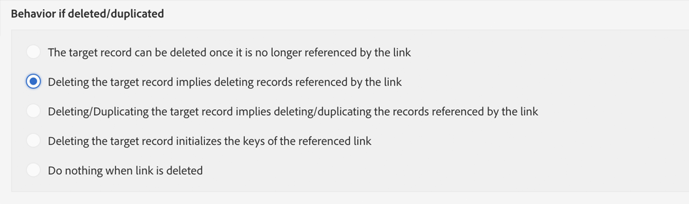

### Status van privacyverzoek {#privacy-request-statuses}

Hier volgen de verschillende statussen voor privacyverzoeken:

* **[!UICONTROL New]** / **[!UICONTROL Retry pending]** : de workflow heeft de aanvraag nog niet verwerkt.
* **[!UICONTROL Processing]** / **[!UICONTROL Retry in progress]** : de workflow verwerkt de aanvraag.
* **[!UICONTROL Delete pending]**: in de workflow zijn alle te verwijderen gegevens voor ontvangers geïdentificeerd.
* **[!UICONTROL Delete in progress]**: de workflow verwerkt de verwijdering.
  <!--**[!UICONTROL Delete Confirmation Pending]** (Delete request in 2-steps process mode): the workflow has processed the Access request. Manual confirmation is requested to perform the deletion. The button is available for 15 days.-->
* **[!UICONTROL Complete]** : de verwerking van de aanvraag is zonder fout voltooid.
* **[!UICONTROL Error]** : er is een fout opgetreden in de workflow. De reden wordt weergegeven in de lijst met privacyverzoeken in de kolom **[!UICONTROL Request status]** . **[!UICONTROL Error data not found]** betekent bijvoorbeeld dat er geen gegevens van ontvangers zijn gevonden die overeenkomen met de gegevens van de betrokkene **[!UICONTROL Reconciliation value]** in de database.

<!--
### Disabling the 2-step process {#disabling-two-step-process}

The Core Privacy Service does not support the 2-step process.

>[!IMPORTANT]
>
>Before using the Core Privacy Service integration to manage your Privacy requests, you must disable the 2-step process for Delete requests from the Campaign Standard interface.

If this option is not disabled, all Delete requests managed with the Privacy Core Service will remain in pending state and will not complete.

By default, the 2-step process is activated.

To change this mode, click **[!UICONTROL Edit properties]**, in the top right corner of the **[!UICONTROL Privacy Requests]** screen, then uncheck the **[!UICONTROL Activate the 2-step process]** option.

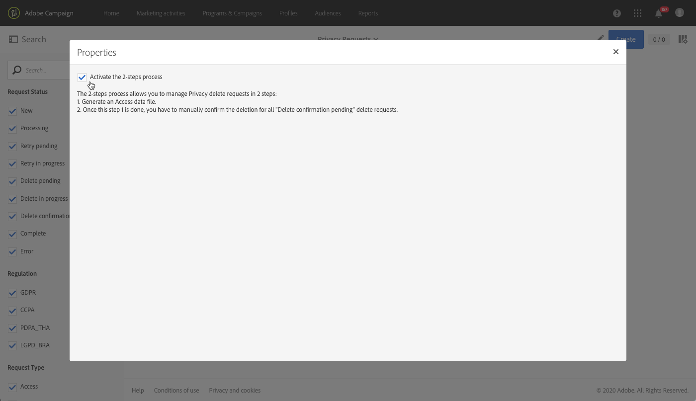
-->

## Opt-out voor de verkoop van persoonsgegevens (CCPA) {#sale-of-personal-information-ccpa}

De **Wet van de Privacy van de Consumentenbescherming van Californië** (CCPA) verstrekt de ingezetenen van Californië nieuwe rechten met betrekking tot hun persoonlijke informatie en legt verantwoordelijkheden van de gegevensbescherming aan bepaalde entiteiten op die zaken in Californië leiden.

De configuratie en het gebruik van verzoeken van de Toegang en van de Schrapping zijn gemeenschappelijk voor zowel GDPR als CCPA. In dit deel wordt de opt-out voor de verkoop van persoonsgegevens beschreven, die specifiek is voor de CCPA.

Naast de [&#x200B; het beheer van de Toestemming &#x200B;](../../start/using/privacy-management.md#consent-management) hulpmiddelen die door Adobe Campaign worden verstrekt, hebt u de mogelijkheid om te volgen of een consument uit voor de Verkoop van Persoonlijke Informatie heeft gekozen.

Wanneer gebruikers via uw systeem besluiten dat zij niet toestaan dat hun persoonlijke gegevens aan derden worden verkocht, kunt u deze gegevens opslaan en bijhouden.

>[!NOTE]
>
>U kunt de opt-out gebruiken voor de verkoop van persoonlijke gegevens via de Campagne-interface en via de API. U kunt dit niet gebruiken via de Privacy Core Service.

>[!IMPORTANT]
>
>Het is uw verantwoordelijkheid als de verantwoordelijke voor de gegevens om het verzoek van de betrokkene te ontvangen en de aanvraagdata voor de CCPA bij te houden. Als technologieleverancier bieden we alleen een manier om te weigeren. Voor meer op uw rol als Controlemechanisme van Gegevens, zie [&#x200B; Persoonlijke gegevens en Persona&#39;s &#x200B;](../../start/using/privacy.md#personal-data).

### Vereiste voor aangepaste tabellen {#ccpa-prerequisite}

Het veld **[!UICONTROL CCPA Opt-Out]** is offline beschikbaar in de Campagne-interface en de API. Het veld is standaard beschikbaar voor de standaardbron van **[!UICONTROL Profile]** .

Als u een middel van het douaneprofiel gebruikt, moet u het middel uitbreiden en het gebied toevoegen. We raden u aan een andere naam te gebruiken dan het veld voor de uit-van-de-doos, bijvoorbeeld: **[!UICONTROL Opt-Out for CCPA]** (optoutcpa). Wanneer een nieuw veld wordt gemaakt, wordt dit automatisch ondersteund door de campagne-API.

Voor meer gedetailleerde informatie over hoe te om het profielmiddel uit te breiden, zie [&#x200B; deze sectie &#x200B;](../../developing/using/extending-the-profile-resource-with-a-new-field.md).

>[!NOTE]
>
>Het wijzigen van middelen is een gevoelige verrichting die door deskundige slechts gebruikers moet worden uitgevoerd.

1. Ga naar **[!UICONTROL Administration]** > **[!UICONTROL Development]** > **[!UICONTROL Custom Resources]** . Klik op de aangepaste profielbron. Voor meer bij het uitbreiden van een middel, zie [&#x200B; deze sectie &#x200B;](../../developing/using/creating-or-extending-the-resource.md).

   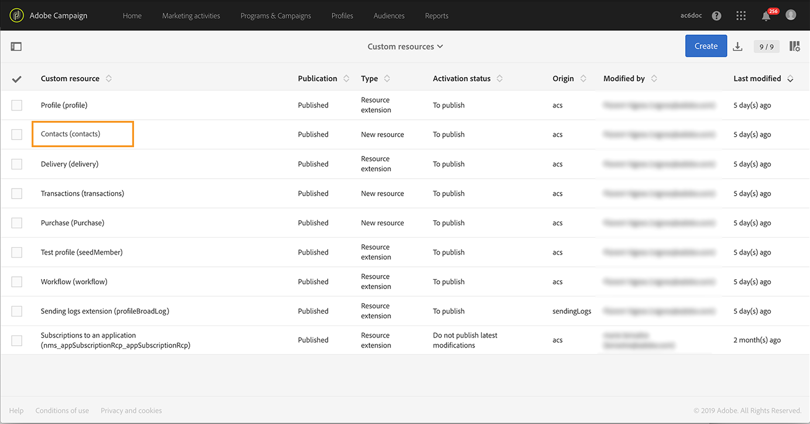

1. Klik op **[!UICONTROL Add field]** of **[!UICONTROL Create Element]** , voeg het label, de id toe en kies het type **[!UICONTROL Boolean]** . Voor de naam, gebruik **uit voor CCPA**. Voor identiteitskaart, gebruik: **optOutCpa**.

   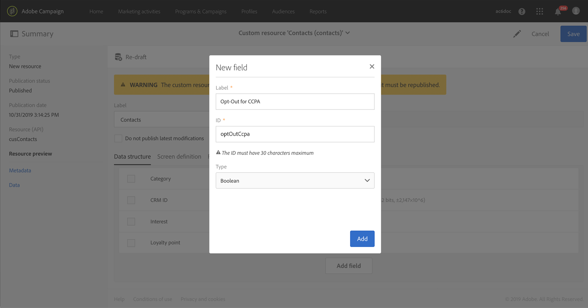

1. Voeg op het tabblad **[!UICONTROL Screen definition]** onder **[!UICONTROL Detail screen configuration]** het veld toe en selecteer **[!UICONTROL Input field]** . Hiermee wordt het veld beschikbaar gesteld in de lijst met profielen en de details.  Voor meer bij het vormen van de het schermdefinitie, zie [&#x200B; deze sectie &#x200B;](../../developing/using/configuring-the-screen-definition.md).

   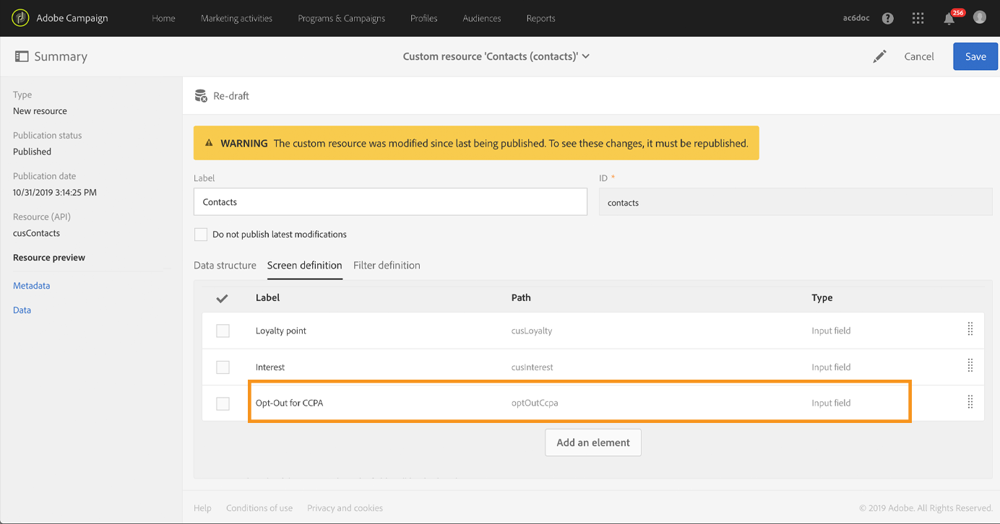

1. Ga naar **[!UICONTROL Administration]** > **[!UICONTROL Development]** > **[!UICONTROL Publishing]** , bereidt de publicatie voor en publiceer de wijzigingen. Voor meer bij het publiceren van een middel, zie [&#x200B; deze sectie &#x200B;](../../developing/using/updating-the-database-structure.md).

   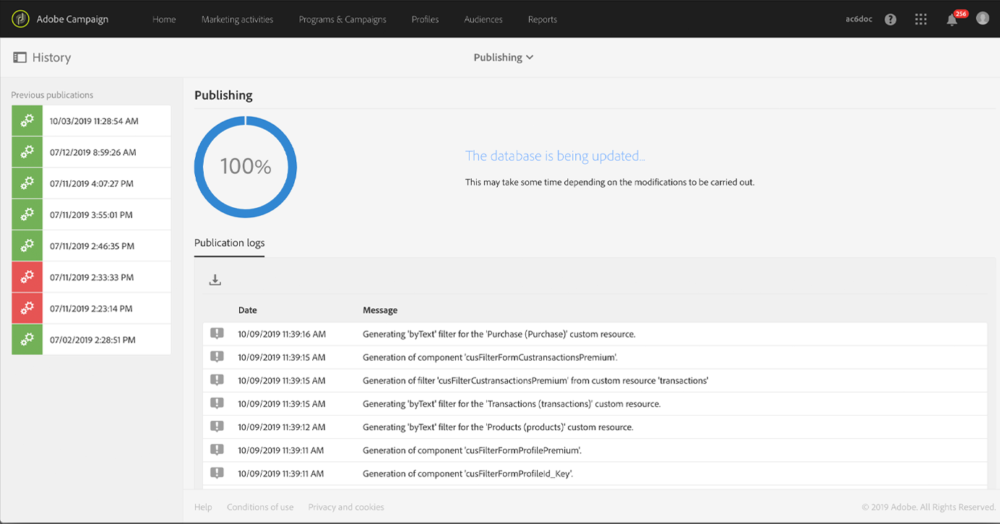

1. Controleer of het veld beschikbaar is op de details van een profiel. Voor meer op dit, zie [&#x200B; deze sectie &#x200B;](#usage).

### Gebruik {#usage}

Het is de verantwoordelijkheid van de gegevensverwerker om de waarde van het veld te vullen en de CCPA-richtsnoeren en -regels inzake gegevensverkoop te volgen.

U kunt verschillende methoden gebruiken om de waarden te vullen:

* De interface van de campagne gebruiken door de details van de ontvanger te bewerken (zie hieronder)
* Gebruikend de Privacy API van de Campagne (zie de [&#x200B; API documentatie &#x200B;](../../api/using/managing-ccpa-opt-out.md))
* Via een workflow voor het importeren van gegevens

Vervolgens moet u ervoor zorgen dat u nooit de persoonlijke gegevens van profielen die u hebt afgewezen aan derden verkoopt.

1. Bewerk in de interface van de campagne een profiel om de status van de optie Weigeren te wijzigen.

   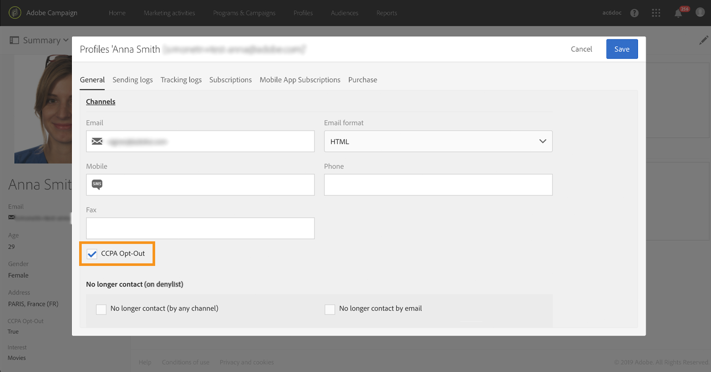

1. Wanneer de waarde van het veld **[!UICONTROL True]** is, wordt de informatie weergegeven op de details van het profiel.

   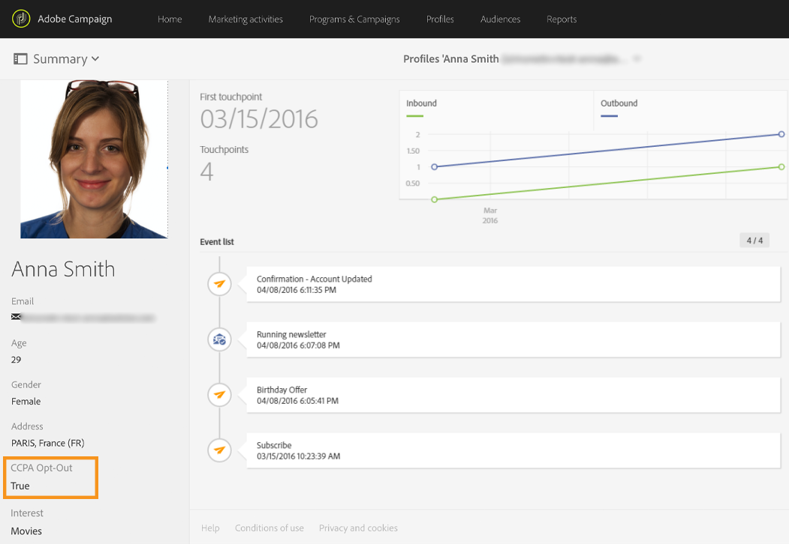

1. U kunt de profielenlijst vormen om de op-uit kolom te tonen. Leren hoe te om lijsten te vormen, zie [&#x200B; deze sectie &#x200B;](../../start/using/customizing-lists.md).

   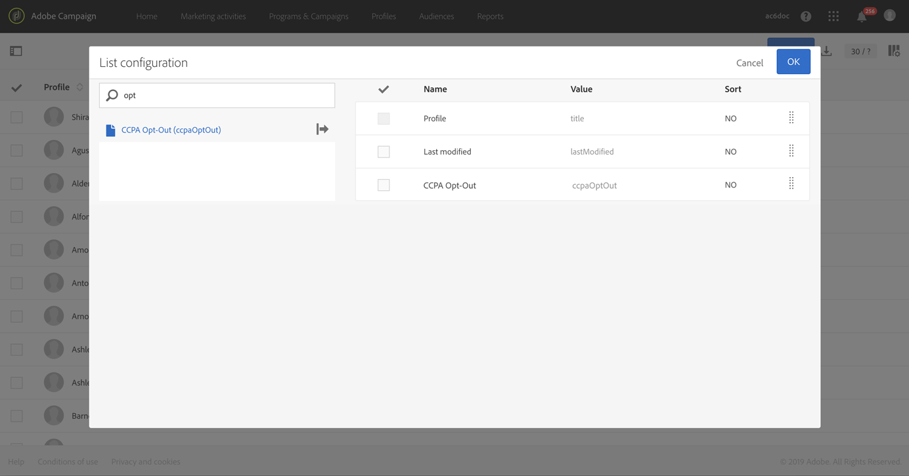

1. U kunt op de kolom klikken om ontvangers te sorteren op basis van de gegevens voor niet-deelname.

   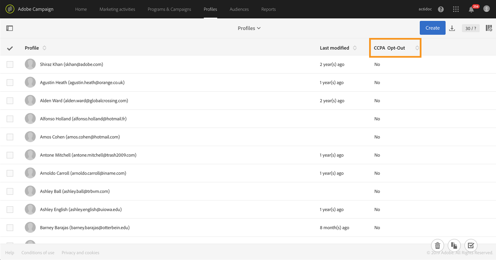
