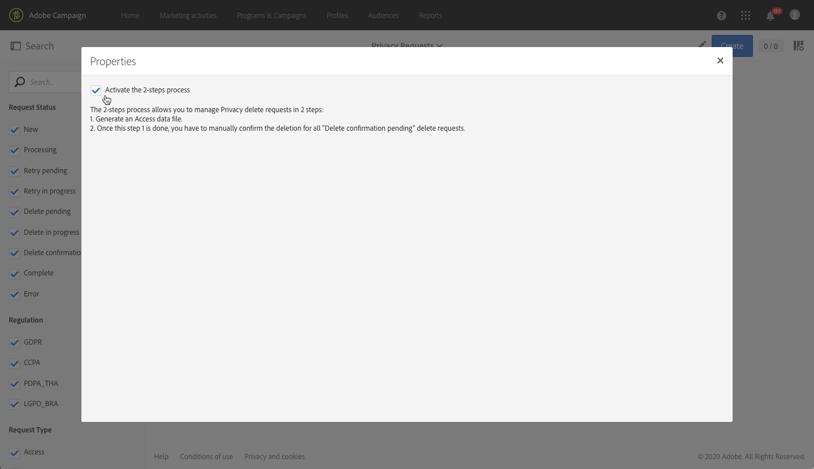
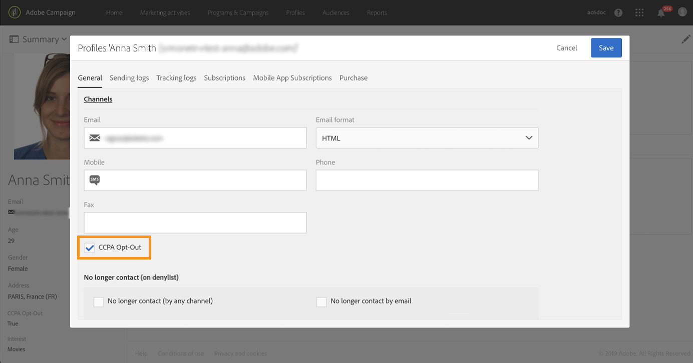

# Beheer van verzoeken om toegang tot persoonsgegevens {#privacy-requests}

Raadpleeg [deze sectie](../../start/using/privacy-management.md) voor een algemene uitleg van privacybeheer.

Deze informatie geldt voor AVG, CCPA, PDPA en LGPD. Zie [deze sectie](../../start/using/privacy-management.md#privacy-management-regulations) voor meer informatie over deze regelgeving.

De opt-out voor de verkoop van persoonsgegevens, die specifiek is voor de CCPA, wordt in [deze sectie](#sale-of-personal-information-ccpa) toegelicht.

>[!IMPORTANT]
>
>Sinds 19.4 is het gebruik van de Campaign-API en -interface voor toegangs- en verwijderingsverzoeken afgeschaft. Voor alle AVG-, CCPA-, PDPA- of LGPD-verzoeken om toegang en verwijdering moet u de [Privacy-kernservice](#create-privacy-request)-integratiemethode gebruiken.

## Verzoeken om toegang tot persoonsgegevens {#about-privacy-requests}

Doordat u in Adobe Campaign verzoeken voor toegang en verwijdering kunt afhandelen, kunt u zich gemakkelijker houden aan de privacyregels. Het **toegangsrecht** en het **recht om te worden vergeten** (verwijderingsverzoek) worden in [deze sectie](../../start/using/privacy-management.md#right-access-forgotten) beschreven.

Voor het uitvoeren van deze verzoeken moet u de **Privacy-kernservice**-integratie gebruiken. Verzoeken om toegang tot persoonsgegevens die van de Privacy-kernservice naar alle Experience Cloud-oplossingen worden gepusht, worden door Campaign automatisch behandeld via een speciale workflow.

### Vereisten {#prerequesites}

Adobe Campaign biedt tools voor gegevenscontrollers waarmee u verzoeken om toegang tot opgeslagen persoonsgegevens in Adobe Campaign kunt maken en verwerken. Het is echter de verantwoordelijkheid van de gegevenscontroller om de relatie met de betrokkene (e-mail, klantenservice of een webportal) af te handelen.

Daarom is het uw verantwoordelijkheid als gegevenscontroller om de identiteit te bevestigen van de betrokkene die het verzoek indient, en om te bevestigen dat de gegevens die naar de aanvrager worden teruggestuurd, over de betrokkene gaan.

>[!NOTE]
>
>Voor meer informatie over persoonsgegevens en over de verschillende entiteiten die gegevens beheren (gegevenscontroller, gegevensprocessor en betrokkene) raadpleegt u [Persoonsgegevens en persona&#39;s](../../start/using/privacy.md#personal-data).

### Naamruimten {#namesspaces}

Voordat u verzoeken om toegang tot persoonsgegevens maakt, moet u de naamruimte definiëren die u wilt gebruiken. De naamruimte is de sleutel die wordt gebruikt om de betrokkene in de Adobe Campaign-database te identificeren. Er zijn twee ingebouwde naamruimten beschikbaar: e-mail en mobiele telefoon. Voer de volgende stappen uit als u een andere naamruimte nodig hebt (bijvoorbeeld een aangepast profielveld).

Raadpleeg ook deze [tutorial](https://experienceleague.adobe.com/docs/campaign-standard-learn/tutorials/privacy/namespaces-for-privacy-requests.html?lang=nl#privacy) over het maken van een naamruimte.

>[!NOTE]
>
>Als u meerdere naamruimten gebruikt, moet u één verzoek om toegang tot persoonsgegevens per naamruimte maken.

1. Klik op het Adobe Campaign-logo in de linkerbovenhoek en selecteer **[!UICONTROL Administration]** > **[!UICONTROL Namespaces]**.

   

1. Klik in de lijst met naamruimten op **[!UICONTROL Create]**.

   

1. Voer een **[!UICONTROL Label]** in.

   

1. Als u een bestaande naamruimte voor een identiteitsservice wilt gebruiken, kiest u **[!UICONTROL Map from Identity Namespace Service]** en selecteert u een naamruimte in de lijst **[!UICONTROL Identity Service Namespaces]**.

   

   Als u een nieuwe naamruimte wilt maken in **[!UICONTROL Identity Service]** en deze wilt toewijzen in Campaign, selecteert u **[!UICONTROL Create new]** en voert u een naam in het veld **[!UICONTROL Identity namespace name]** in.

   

   Raadpleeg de documentatie bij [Experience Platform](https://experienceleague.adobe.com/docs/experience-platform/identity/namespaces.html?lang=nl) voor meer informatie over naamruimten.

1. In Campaign wordt één INS (Identity Service Namespace) toegewezen aan één naamruimte. U moet opgeven hoe de naamruimte in Campaign wordt afgestemd.

   Selecteer een doeltoewijzing (**[!UICONTROL Recipients]**, **[!UICONTROL Real-time event]** of **[!UICONTROL Subscriptions to an application]**). Als u verschillende doeltoewijzingen wilt gebruiken, moet u één naamruimte per doeltoewijzing maken.

   

1. Kies de **[!UICONTROL Reconciliation key]**. Dit is het veld dat wordt gebruikt om de betrokkene in de Adobe Campaign-database te identificeren.

   

1. Klik op **[!UICONTROL Create]**. U kunt nu verzoeken om toegang tot persoonsgegevens maken op basis van uw nieuwe naamruimte. Als u meerdere naamruimten gebruikt, moet u één verzoek om toegang tot persoonsgegevens per naamruimte maken.

### Een privacyverzoek maken {#create-privacy-request}

>[!IMPORTANT]
>
>De integratie van de **Privacy-kernservice** is de methode die u moet gebruiken voor alle verzoeken om toegang en verwijdering.
>
>Sinds 19.4 is het gebruik van de Campaign-API en -interface voor toegangs- en verwijderingsverzoeken afgeschaft. Gebruik de Privacy-kernservice voor elk AVG-, CCPA-, PDPA- of LGPD-verzoek om toegang of verwijdering.

Dankzij de integratie van de Privacy-kernservice kunt u uw verzoeken om toegang tot persoonsgegevens automatiseren in een context met meerdere oplossingen via één JSON API-aanroep. Verzoeken om toegang tot persoonsgegevens die van de Privacy-kernservice naar alle Experience Cloud-oplossingen worden gepusht, worden door Campaign automatisch behandeld via een speciale workflow.

Raadpleeg de documentatie bij de [Experience Platform Privacy Service](https://experienceleague.adobe.com/docs/experience-platform/privacy/home.html?lang=nl) om te ontdekken hoe u verzoeken om toegang tot persoonsgegevens kunt maken vanuit de Privacy-kernservice.

Elke Privacy-kernservicetaak in Campaign is gesplitst in meerdere verzoeken om toegang tot persoonsgegevens op basis van het aantal gebruikte naamruimten, waarbij één verzoek correspondeert met één naamruimte. Bovendien kan één taak op meerdere instanties worden uitgevoerd. Daarom worden er meerdere bestanden gemaakt voor één taak. Als een verzoek bijvoorbeeld twee naamruimten bevat en op drie instanties wordt uitgevoerd, worden in totaal zes bestanden verzonden. Eén bestand per naamruimte en instantie.

Het patroon voor een bestandsnaam is: `<InstanceName>-<NamespaceId>-<ReconciliationKey>.xml`

* **InstanceName**: Campaign-instantienaam
* **NamespaceId**: naamruimte-ID identiteitsservice van de gebruikte naamruimte
* **Afstemmingssleutel**: gecodeerde afstemmingssleutel

### Lijst met bronnen {#list-of-resources}

Bij het uitvoeren van een verzoek om verwijdering of toegang tot persoonsgegevens zoekt Adobe Campaign alle gegevens van de betrokkene op basis van de waarde voor **Afstemming** in alle bronnen die een koppeling bevatten naar de profielbron (eigen type).

Hier volgt de lijst van ingebouwde bronnen waarmee rekening wordt gehouden bij het uitvoeren van verzoeken om toegang tot persoonsgegevens:

* Profielen (ontvanger)
* Profielverzendingslogs (broadLogRcp)
* Profieltrackinglogs (trackingLogRcp)
* Verzendingslogs (abonnementen op een applicatie) (broadLogAppSubRcp)
* Trackinglogs (abonnementen op een applicatie) (trackingLogAppSubRcp)
* Abonnementen op een applicatie (appSubscriptionRcp)
* Abonnementsgeschiedenis van profielen (subHistoRcp)
* Profielabonnementen (subscriptionRcp)
* Bezoekers (visitor)

Als u aangepaste bronnen hebt gemaakt met een koppeling naar de profielbron (eigen type), wordt hiermee ook rekening gehouden. Als u bijvoorbeeld een transactiebron hebt met een koppeling naar de profielbron en een transactiedetailbron met een koppeling naar de transactiebron, wordt met beide rekening gehouden.

Raadpleeg ook [deze tutorial](https://experienceleague.adobe.com/docs/campaign-standard-learn/tutorials/privacy/custom-resources-for-privacy-requests.html?lang=nl#privacy) over het wijzigen van aangepaste bronnen.

Dit werkt alleen als u in de aangepaste bron de optie **[!UICONTROL Deleting the target record implies deleting records referenced by the link]** selecteert:

1. Klik op het Adobe Campaign-logo in de linkerbovenhoek en selecteer **[!UICONTROL Administration]** > **[!UICONTROL Development]** > **[!UICONTROL Custom resources]**.

1. Selecteer een aangepaste bron met een koppeling naar de profielbron (eigen type).

1. Klik op de sectie **[!UICONTROL Links]**.

1. Klik voor elke koppeling op het potloodpictogram (**[!UICONTROL Edit properties]**).

1. Selecteer in de sectie **[!UICONTROL Behavior if deleted/duplicated]** de optie **[!UICONTROL Deleting the target record implies deleting records referenced by the link]**.

   

### Status van verzoeken om toegang tot persoonsgegevens {#privacy-request-statuses}

Dit zijn de verschillende statussen voor verzoeken om toegang tot persoonsgegevens:

* **[!UICONTROL New]**/**[!UICONTROL Retry pending]**: in uitvoering, de workflow heeft het verzoek nog niet verwerkt.
* **[!UICONTROL Processing]**/**[!UICONTROL Retry in progress]**: de workflow verwerkt het verzoek.
* **[!UICONTROL Delete pending]**: in de workflow zijn alle te verwijderen gegevens van ontvangers geïdentificeerd.
* **[!UICONTROL Delete in progress]**: de workflow verwerkt de verwijdering.
   <!--**[!UICONTROL Delete Confirmation Pending]** (Delete request in 2-steps process mode): the workflow has processed the Access request. Manual confirmation is requested to perform the deletion. The button is available for 15 days.-->
* **[!UICONTROL Complete]**: de verwerking van het verzoek is zonder fout voltooid.
* **[!UICONTROL Error]**: er is een fout opgetreden in de workflow. De reden wordt weergegeven in de kolom **[!UICONTROL Request status]** in de lijst met verzoeken om toegang tot persoonsgegevens. **[!UICONTROL Error data not found]** betekent bijvoorbeeld dat er in de database geen ontvangersgegevens zijn gevonden die overeenkomen met de **[!UICONTROL Reconciliation value]** van de betrokkene.

### Het tweestapsproces uitschakelen {#disabling-two-step-process}

De Privacy-kernservice ondersteunt het tweestapsproces niet.

>[!IMPORTANT]
>
>Voordat u de Privacy-kernservice-integratie gebruikt om uw verzoeken om toegang tot persoonsgegevens te beheren, moet u het tweestapsproces voor verzoeken om verwijdering van persoonsgegevens in de Campaign Standard-interface uitschakelen.

Als deze optie niet wordt uitgeschakeld, blijven alle verwijderingsverzoeken die met de Privacy-kernservice worden beheerd, in de status van behandeling en worden niet voltooid.

Het tweestapsproces is standaard geactiveerd.

Als u deze modus wilt wijzigen, klikt u op **[!UICONTROL Edit properties]** in de rechterbovenhoek van het scherm **[!UICONTROL Privacy Requests]** en schakelt u de optie **[!UICONTROL Activate the 2-step process]** uit.

## Opt-out voor de verkoop van persoonsgegevens (CCPA) {#sale-of-personal-information-ccpa}

De **California Consumer Privacy Act** (CCPA) biedt inwoners van Californië nieuwe rechten met betrekking tot hun persoonsgegevens en legt verantwoordelijkheden op het gebied van gegevensbescherming op aan bepaalde entiteiten die zaken doen in Californië.

De configuratie en het gebruik van verzoeken om toegang en verwijdering zijn hetzelfde voor de AVG en CCPA. In deze sectie wordt de opt-out voor de verkoop van persoonsgegevens beschreven, dit geldt specifiek voor de CCPA.

Naast de tools voor [toestemmingsbeheer](../../start/using/privacy-management.md#consent-management) die Adobe Campaign biedt, kunt u ook nagaan of een consument ervoor heeft gekozen om zich af te melden voor de verkoop van persoonsgegevens.

Een consument besluit via uw systeem om niet toe te staan dat zijn/haar persoonsgegevens aan derden worden verkocht. In Adobe Campaign kunt u deze gegevens opslaan en volgen.

>[!NOTE]
>
>U kunt de opt-out gebruiken voor de verkoop van persoonsgegevens via de Campaign-interface en via de API. U kunt de optie niet gebruiken via de Privacy-kernservice.

>[!IMPORTANT]
>
>Het is uw verantwoordelijkheid als gegevenscontroller om het verzoek van de betrokkene te ontvangen en de verzoekdatums voor de CCPA bij te houden. Als technologieleverancier bieden wij alleen een methode voor opt-out. Raadpleeg [Persoonsgegevens en persona&#39;s](../../start/using/privacy.md#personal-data) voor meer informatie over uw rol als gegevenscontroller.

### Vereiste voor aangepaste tabellen {#ccpa-prerequisite}

Vanaf versie 19.4 is het veld **[!UICONTROL CCPA Opt-Out]** ingebouwd in de Campaign-interface en -API. Het veld is standaard beschikbaar voor de standaard **[!UICONTROL Profile]**-bron.

Als u een aangepaste profielbron gebruikt, moet u de bron uitbreiden en het veld toevoegen. We adviseren u om een andere naam te gebruiken dan het ingebouwde veld, zoals: **[!UICONTROL Opt-Out for CCPA]** (optoutccpa). Wanneer een nieuw veld wordt gemaakt, wordt dit automatisch ondersteund door de Campaign-API.

Zie [deze sectie](../../developing/using/extending-the-profile-resource-with-a-new-field.md) voor meer informatie over het uitbreiden van de profielbron.

>[!NOTE]
>
>Het aanpassen van bronnen is een gevoelige bewerking die uitsluitend door deskundige gebruikers mag worden uitgevoerd.

1. Ga naar **[!UICONTROL Administration]** > **[!UICONTROL Development]** > **[!UICONTROL Custom Resources]**. Klik op de aangepaste profielbron. Zie [deze sectie](../../developing/using/creating-or-extending-the-resource.md) voor meer informatie over het uitbreiden van een bron.

   

1. Klik op **[!UICONTROL Add field]** of **[!UICONTROL Create Element]**, voeg de label en de ID toe en kies het type **[!UICONTROL Boolean]**. Gebruik voor de naam de optie **Opt-out voor CCPA**. Gebruik voor de ID: **optOutCcpa**.

   

1. Voeg op het tabblad **[!UICONTROL Screen definition]** onder **[!UICONTROL Detail screen configuration]** het veld toe en selecteer **[!UICONTROL Input field]**. Hiermee wordt het veld beschikbaar in de lijst met profielen en details.  Zie [deze sectie](../../developing/using/configuring-the-screen-definition.md) voor meer informatie over het configureren van de schermdefinitie.

   

1. Ga naar **[!UICONTROL Administration]** > **[!UICONTROL Development]** > **[!UICONTROL Publishing]**, bereid de publicatie voor en publiceer de wijzigingen. Zie [deze sectie](../../developing/using/updating-the-database-structure.md) voor meer informatie over het publiceren van een bron.

   

1. Controleer of het veld beschikbaar is in de details van een profiel. Zie [deze sectie](#usage)voor meer informatie.

### Gebruik {#usage}

Het is de verantwoordelijkheid van de gegevenscontroller om de waarde in het veld in te vullen en de CCPA-richtlijnen en -regels voor gegevensverkoop te volgen.

U kunt verschillende methoden gebruiken om de waarden in te vullen:

* De Campaign-interface gebruiken door de details van de ontvanger te bewerken (zie verderop)
* De Campaign-privacy-API gebruiken (zie de [API-documentatie](../../api/using/managing-ccpa-opt-out.md))
* Via een workflow voor het importeren van gegevens

Vervolgens moet u ervoor zorgen dat u de persoonsgegevens van profielen die zich hebben afgemeld nooit aan derden verkoopt.

1. Bewerk een profiel in de Campaign-interface om de status voor opt-out te wijzigen.

   

1. Wanneer de waarde van het veld **[!UICONTROL True]** is, wordt de informatie weergegeven in de details van het profiel.

   

1. U kunt de profielenlijst configureren om de opt-outkolom weer te geven. Als u wilt weten hoe u lijsten kunt configureren, raadpleegt u [deze sectie](../../start/using/customizing-lists.md).

   

1. U kunt op de kolom klikken om ontvangers te sorteren op basis van de opt-outgegevens.

   
