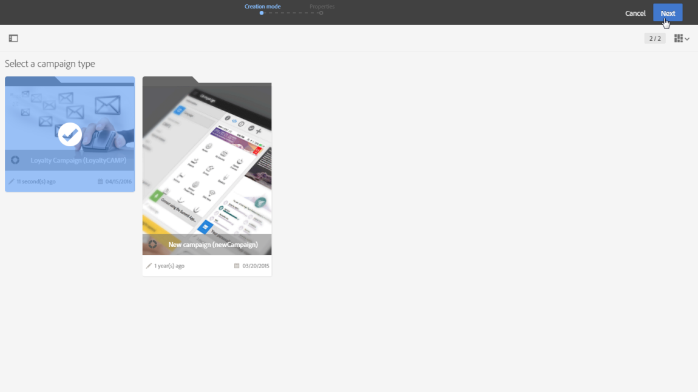
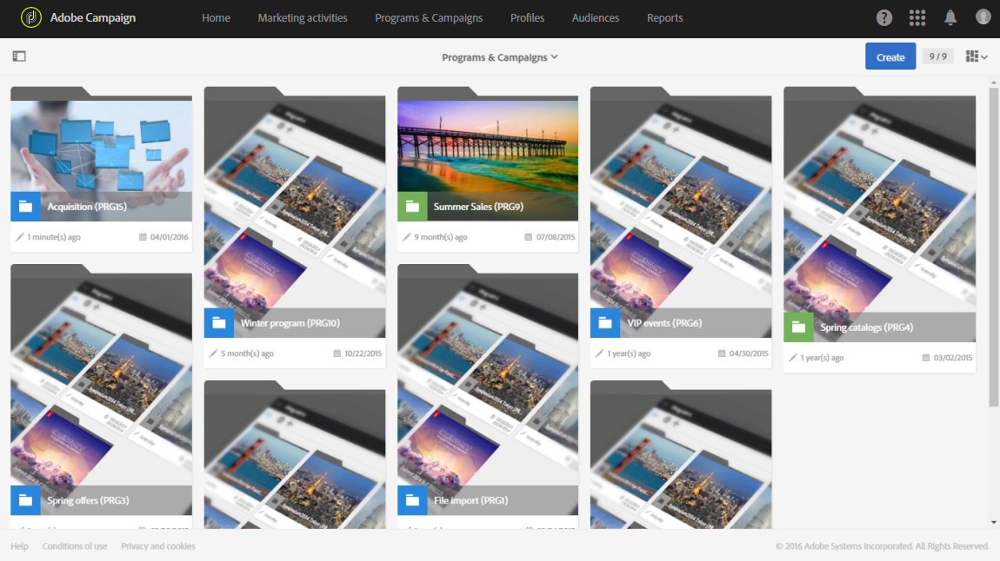

# Programma&#39;s en campagnes{#programs-and-campaigns}

## Over plannen, programma&#39;s en campagnes {#about-plans--programs-and-campaigns}

Met Adobe Campaign kunt u marketingcampagnes plannen waarin u verschillende soorten activiteiten kunt maken en beheren: e-mails, SMS-berichten, pushberichten, workflows, bestemmingspagina&#39;s. Deze campagnes en hun inhoud kunnen in programma&#39;s worden verzameld.

Met de programma&#39;s en campagnes kunt u de verschillende marketingactiviteiten die ermee samenhangen, hergroeperen en bekijken.

* Een **programma** kan andere programma&#39;s bevatten evenals campagnes, workflows, en landingspagina&#39;s. Het wordt weergegeven in de tijdlijn en helpt u bij het organiseren van uw marketingactiviteiten: u kunt ze scheiden per land , per merk , per eenheid , enz .
* Met een **campagne** kunt u alle marketingactiviteiten van uw keuze onder één entiteit verzamelen. Een campagne kan e-mails, SMS, pushberichten, directe mails, workflows en bestemmingspagina&#39;s bevatten.

Adobe raadt de volgende hiërarchie aan om uw marketingplannen beter te organiseren: Programma > Subprogramma&#39;s > Campagnes > Workflows > Leveringen.

Dankzij rapporten over programma&#39;s en campagnes kunt u de impact ervan analyseren. U kunt bijvoorbeeld rapporten op campagnereniveau samenstellen om gegevens over alle leveringen in die campagne samen te voegen.

**Verwante onderwerpen:**

* [Tijdlijn](../../start/using/timeline.md)
* [Dynamische rapporten](../../reporting/using/about-dynamic-reports.md)

## Een programma maken {#creating-a-program}

Het programma is het eerste niveau van organisatie. Het kan subprogramma&#39;s, campagnes, workflows of landingspagina&#39;s bevatten.

1. Selecteer de **[!UICONTROL Programs & Campaigns]** kaart op de startpagina van Adobe Campaign.
1. Klik op de **[!UICONTROL Create]** knop.
1. Selecteer een programmatype in het **[!UICONTROL Creation mode]** scherm.

   

   De beschikbare programmatypen zijn gebaseerd op sjablonen die zijn gedefinieerd in de sectie **[!UICONTROL Resources]** > **[!UICONTROL Templates]** > **[!UICONTROL Program templates]** . Raadpleeg voor meer informatie de sectie [Sjablonen](../../start/using/marketing-activity-templates.md) beheren.

1. Voer in het **[!UICONTROL Properties]** scherm de naam en id van het programma in.

   

1. Selecteer een begin- en einddatum voor uw programma. Deze data gelden alleen voor het programma zelf.

   U kunt uw programma maken in een bovenliggend programma. Selecteer hiertoe het bovenliggende programma in de bestaande programma&#39;s.

1. Klik op **[!UICONTROL Create]** om de aanmaak van het programma te bevestigen.

Het programma wordt gemaakt en weergegeven. Gebruik de **[!UICONTROL Create]** knop om subprogramma&#39;s, campagnes, workflows of bestemmingspagina&#39;s toe te voegen.

>[!NOTE]
>
>U kunt ook een programma maken op basis van de lijst met marketingactiviteiten.

## Een campagne maken {#creating-a-campaign}

In programma&#39;s en subprogramma&#39;s kunt u campagnes toevoegen. Campagnes kunnen marketingactiviteiten bevatten, zoals e-mails, SMS, pushberichten, workflows en bestemmingspagina&#39;s.

1. Selecteer de **[!UICONTROL Programs & Campaigns]** kaart op de startpagina van Adobe Campagne en open een programma of subprogramma.
1. Klik op de **[!UICONTROL Create]** knop en selecteer **[!UICONTROL Campaign]**.
1. Selecteer een type campagne in het **[!UICONTROL Creation mode]** scherm.

   

   De beschikbare campagneretypen zijn gebaseerd op sjablonen die zijn gedefinieerd in **[!UICONTROL Resources]** > **[!UICONTROL Templates]** > **[!UICONTROL Campaign templates]**. Raadpleeg voor meer informatie de sectie [Sjablonen](../../start/using/marketing-activity-templates.md) beheren.

1. Voer in het **[!UICONTROL Properties]** scherm de naam en id van de campagne in.
1. Selecteer een begin- en einddatum voor uw campagne. Deze data gelden alleen voor de campagne zelf.

   

1. Klik op **[!UICONTROL Create]** om de aanmaak van de campagne te bevestigen.

De campagne wordt gemaakt en weergegeven. Gebruik de **[!UICONTROL Create]** knop om marketingactiviteiten aan uw campagne toe te voegen.

>[!NOTE]
>
>Afhankelijk van uw licentieovereenkomst hebt u slechts toegang tot enkele van deze activiteiten.

U kunt ook een campagne maken op basis van de lijst met marketingactiviteiten. U kunt de marketingactiviteit via het eigenschappenvenster van de campagne koppelen aan een bovenliggend programma of subprogramma.

## Pictogrammen en statussen van programma&#39;s en campagnes {#programs-and-campaigns-icons-and-statuses}

Elk programma en elke campagne in de lijst hebben een visueel symbool en een pictogram waarvan de kleur de uitvoeringsstatus aangeeft. Deze status hangt af van de geldigheidsperiode van het programma of de campagne.

* Grijs: het programma/de campagne is nog niet begonnen - status **[!UICONTROL Editing]** .
* Blauw: het programma/de campagne is in uitvoering - **[!UICONTROL In progress]** status.
* Groen: het programma/de campagne is voltooid - **[!UICONTROL Finished]** status. Standaard wordt de huidige datum automatisch weergegeven als de geldigheidsbegindatum en de einddatum wordt berekend op basis van de begindatum (**D+186 dagen**). U kunt deze datums wijzigen in de programma- of campagne-eigenschappen.

